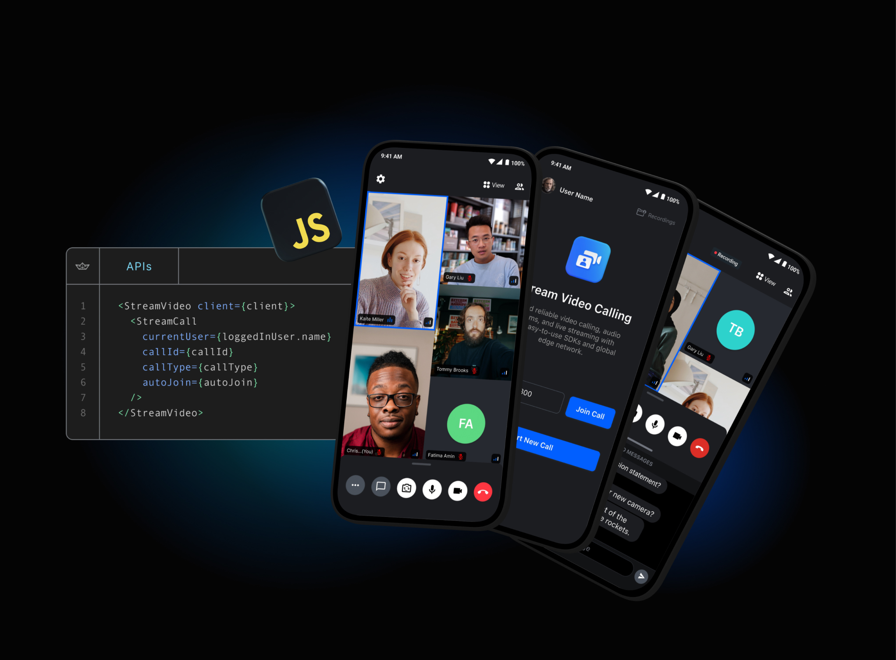

# Stream Video for JavaScript

## **Quick Links**

- [Register](https://getstream.io/chat/trial/) to get an API key for Stream Video
- [React SDK](./packages/react-sdk#official-react-sdk-for-stream-video)
- [React Native SDK](./packages/react-native-sdk#official-react-native-sdk-for-stream-video)

## What is Stream?

Stream allows developers to rapidly deploy scalable feeds, chat messaging and video with an industry leading 99.999% uptime SLA guarantee.

With Stream's video components, you can use their SDK to build in-app video calling, audio rooms, audio calls, or live streaming. The best place to get started is with their tutorials:

- Video & Audio Calling Tutorial - [React](https://getstream.io/video/docs/react/tutorials/video-calling/), [React Native](https://getstream.io/video/docs/reactnative/tutorials/video-calling/), [JavaScript](https://getstream.io/video/docs/javascript/tutorials/video-calling/)
- Audio Rooms Tutorial - [React](https://getstream.io/video/docs/react/tutorials/audio-room/), [React Native](https://getstream.io/video/docs/reactnative/tutorials/audio-room/)
- Livestreaming Tutorial - [React](https://getstream.io/video/docs/react/tutorials/livestream/), [React Native](https://getstream.io/video/docs/reactnative/tutorials/livestream/), [JavaScript](https://getstream.io/video/docs/javascript/tutorials/livestream/)

Stream provides UI components and state handling that make it easy to build video calling for your app. All calls run on Stream's network of edge servers around the world, ensuring optimal latency and reliability.

## 👩‍💻 Free for Makers 👨‍💻

Stream is free for most side and hobby projects. To qualify, your project/company needs to have < 5 team members and < $10k in monthly revenue. Makers get $100 in monthly credit for video for free.

## 💡Supported Features💡

Here are some of the features we support:

- Developer experience: Great SDKs, docs, tutorials and support so you can build quickly
- Edge network: Servers around the world ensure optimal latency and reliability
- Chat: Stored chat, reactions, threads, typing indicators, URL previews etc
- Security & Privacy: Based in USA and EU, Soc2 certified, GDPR compliant
- Dynascale: Automatically switch resolutions, fps, bitrate, codecs and paginate video on large calls
- Screen sharing
- Picture in picture support
- Active speaker
- Custom events
- Geofencing
- Notifications and ringing calls
- Opus DTX & Red for reliable audio
- Webhooks & SQS
- Backstage mode
- Flexible permissions system
- Joining calls by ID, link or invite
- Enabling and disabling audio and video when in calls
- Flipping, Enabling and disabling camera in calls
- Enabling and disabling speakerphone in calls
- Push notification providers support
- Call recording
- Broadcasting to HLS

## Repo Overview 😎

This repo contains projects and samples developed by the team and Stream community. Projects are broken up into directories containing the source code for each project.

## **Projects/Packages 🚀**

- `packages`: contains all packages our customers can install and use in their apps.
- `packages/client`: our low-level client. It manages the lifecycle of a call, connects to our platform, and maintains the call state. The core part of our SDKs. Runs in browser and Node.js environments.
- `packages/react-bindings`: a set of React utilities and hooks that make it easy to work with the call state exposed by the `client` in React and React Native Apps.
- `packages/react-sdk`: the place where our React SDK lives.
- `packages/react-native-sdk`: the place where our React Native SDK lives.
- `packages/styling`: our theme stylesheets live here for web SDKs.
- `packages/i18n`: a utility package that takes care of internationalization support for our SDKs.
- `sample-apps/client/*`: contains sample apps built on top of our Low Level Client, with pure browser APIs
- `sample-apps/react/*`: contains a few sample apps that we have built to showcase our SDK and platform capabilities
- `sample-apps/react-native/*`: a collection of React Native sample apps for showcasing our SDK and platform

## Contributing

- How can I submit a sample app?
  - Apps submissions are always welcomed! 🥳 Open a pr with a proper description and we'll review it as soon as possible
- Spot a bug 🕷 ?
  - We welcome code changes that improve the apps or fix a problem. Please make sure to follow all best practices and add tests if applicable before submitting a Pull Request on Github.
