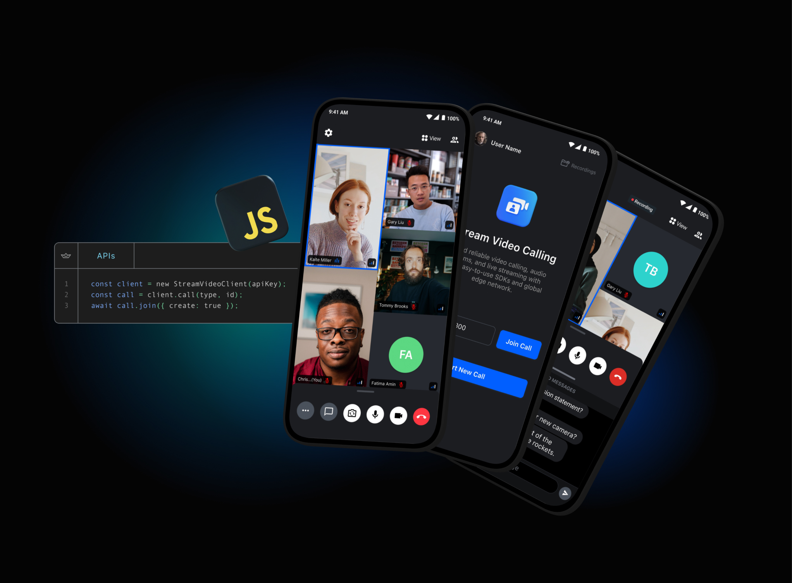

# Official JavaScript SDK and Low-Level Client for [Stream Video](https://getstream.io/video/sdk/javascript/)

Low-level Video SDK client for browser and Node.js integrations.

## **Quick Links**

- [Register](https://getstream.io/chat/trial/) to get an API key for Stream Video

## Migrating API arguments to v2

In v2, the API operations below accept a request object. This is a breaking
change: replace positional arguments with the named fields shown here. The same
methods are available through the React and React Native SDKs.

| Before                                                         | v2                                                                                             |
| -------------------------------------------------------------- | ---------------------------------------------------------------------------------------------- |
| `call.reject('busy')`                                          | `call.reject({ reason: 'busy' })`                                                              |
| `call.getRingState(sessionId)`                                 | `call.getRingState({ call_session_id: sessionId })`                                            |
| `call.blockUser(userId)`                                       | `call.blockUser({ user_id: userId })`                                                          |
| `call.unblockUser(userId)`                                     | `call.unblockUser({ user_id: userId })`                                                        |
| `call.startRecording('raw', settings)`                         | `call.startRecording({ ...settings, recording_type: 'raw' })`                                  |
| `call.stopRecording('raw')`                                    | `call.stopRecording({ recording_type: 'raw' })`                                                |
| `call.queryParticipants({ filter_conditions }, { limit: 10 })` | `call.queryParticipants({ filter_conditions, limit: 10 })`                                     |
| `call.getCallStatsMap(params, sessionId)`                      | `call.getCallStatsMap({ ...params, session: sessionId })`                                      |
| `call.deleteRecording(sessionId, filename)`                    | `call.deleteRecording({ session: sessionId, filename })`                                       |
| `call.deleteTranscription(sessionId, filename)`                | `call.deleteTranscription({ session: sessionId, filename })`                                   |
| `call.getCallReport(sessionId)`                                | `call.getCallReport({ session_id: sessionId })`                                                |
| `call.stopRTMPBroadcast(name)`                                 | `call.stopRTMPBroadcast({ name })`                                                             |
| `client.addDevice(token, 'firebase', providerName)`            | `client.addDevice({ id: token, push_provider: 'firebase', push_provider_name: providerName })` |
| `client.addVoipDevice(token, 'apn', providerName)`             | `client.addVoipDevice({ id: token, push_provider: 'apn', push_provider_name: providerName })`  |
| `client.removeDevice(token)`                                   | `client.removeDevice({ id: token })`                                                           |
| `call.submitFeedback(rating, { reason })`                      | `call.submitFeedback({ rating, reason })`                                                      |

`queryParticipants` requires `filter_conditions`; use `{ filter_conditions: {} }`
to supply an empty filter. Session fields follow the corresponding API operation: `call_session_id` for ring
state, `session_id` for call reports, and `session` for stats maps and file deletion.

Optional request objects preserve the existing defaults: `reject()` declines,
`startRecording()` and `stopRecording()` use composite recording,
`getRingState()` and `getCallStatsMap()` use the current call session, and
`getCallReport()` includes all sessions.

Device registration applies to the connected user; remove the old `userID`
argument. Pass `voip_token` as a property of `addDevice` when needed, or use
`addVoipDevice`, which always sets it to `true`. Both registration methods accept
the optional `hardware_id` field.

Convenience methods such as `client.call(type, id)`, `call.muteUser(userId, 'audio')`,
`call.muteSelf('audio')`, `call.muteOthers('audio')`, `call.muteAllUsers('audio')`,
`call.grantPermissions(userId, permissions)`, `call.revokePermissions(userId, permissions)`,
and `call.camera.select(deviceId)`
keep their positional arguments. `queryCalls` continues to take a request object
followed by a separate object for local SDK options, such as `withDisabledDevices`.

## What is Stream?

Stream allows developers to rapidly deploy scalable feeds, chat messaging and video with an industry leading 99.999% uptime SLA guarantee.

With Stream's video components, you can use their SDK to build in-app video calling, audio rooms, audio calls, or live streaming. The best place to get started is with their tutorials:

- [Video and Audio Calling Tutorial](https://getstream.io/video/sdk/javascript/tutorial/video-calling/)
- [Audio Rooms Tutorial](https://getstream.io/video/sdk/javascript/tutorial/audio-room/)
- [Livestream Tutorial](https://getstream.io/video/sdk/javascript/tutorial/livestreaming/)

Stream provides UI components and state handling that make it easy to build video calling for your app. All calls run on Stream's network of edge servers around the world, ensuring optimal latency and reliability.

## 👩‍💻 Free for Makers 👨‍💻

Stream is free for most side and hobby projects. To qualify, your project/company needs to have < 5 team members and < $10k in monthly revenue. Makers get $100 in monthly credit for video for free.

## 💡Supported Features💡

Here are some of the features we support:

- Developer experience: Great SDKs, docs, tutorials and support so you can build quickly
- Edge network: Servers around the world ensure optimal latency and reliability
- Chat: Stored chat, reactions, threads, typing indicators, URL previews etc
- Security & Privacy: Based in USA and EU, Soc2 certified, GDPR compliant
- Dynascale: Automatically switch resolutions, fps, bitrate, codecs and paginate video on large calls
- Video Filters and Noise Cancellation
- Screen sharing
- Picture in picture support
- Active speaker
- Custom events
- Geofencing
- Notifications and ringing calls
- Opus DTX & Red for reliable audio
- Webhooks & SQS
- Backstage mode
- Flexible permissions system
- Joining calls by ID, link or invite
- Enabling and disabling audio and video when in calls
- Flipping, Enabling and disabling camera in calls
- Enabling and disabling speakerphone in calls
- Push notification providers support
- Call recording
- Broadcasting to HLS

## Contributing

- How can I submit a sample app?
  - Apps submissions are always welcome. 🥳 Open a PR with a proper description and we'll review it as soon as possible.
- Spot a bug 🕷 ?
  - We welcome code changes that improve the apps or fix a problem. Please make sure to follow all best practices and add tests if applicable before submitting a Pull Request on Github.
