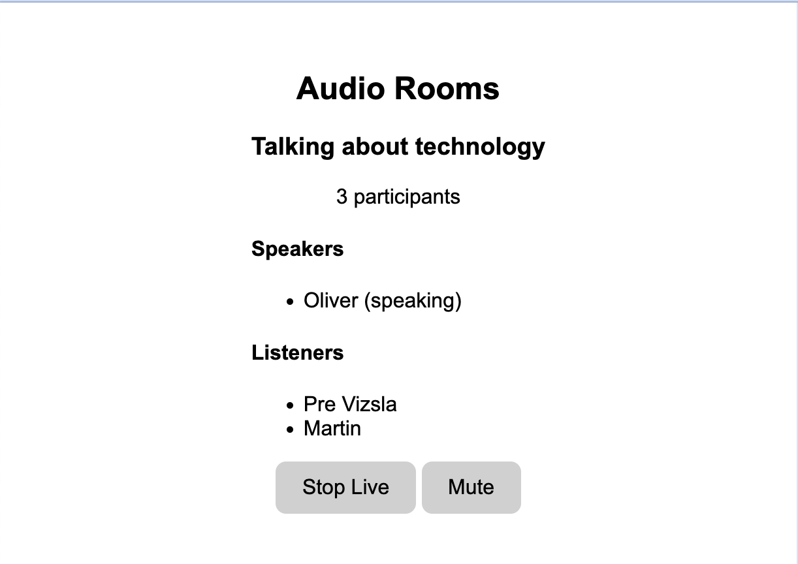

import { TokenSnippet } from '../../../shared/_tokenSnippet.jsx';

This tutorial will teach you how to build an audio room experience like Twitter Spaces or Clubhouse.
The end result will look like the image below and will support the following features:

- Backstage mode. You can start the call with your co-hosts and chat a bit before going live
- Calls run on Stream's global edge network for optimal latency and scalability
- There is no cap to how many listeners you can have in a room
- Listeners can raise their hand, and be invited to speak by the host
- Audio tracks are sent multiple times for optimal reliability



Time to get started building an audio-room for your app.

### Step 0 - Prepare your environment

For this tutorial, you'll need a few tools to be installed on your device.
You can skip this step in case you already have them installed.

- [Node.js](https://nodejs.org/en/download/) (version 18 or higher)
- [Yarn](https://classic.yarnpkg.com/lang/en/docs/install/) (version 1.22 or higher)

### Step 1 - Create a new web app and install the Stream Video SDK

In this step, we will create a new web application using the Vite CLI, and install Stream's Video SDK.
We recommend using [Vite](https://vitejs.dev/) because its fast and easy to use.

```bash title="Terminal"
yarn create vite audio-rooms --template vanilla-ts
cd audio-rooms
yarn add @stream-io/video-client
```

### Step 2 - Create & Join a call

Open up `src/main.ts` and replace it with this code:

```tsx title="src/main.ts"
import { StreamVideoClient, User } from '@stream-io/video-client';

const apiKey = 'REPLACE_WITH_API_KEY'; // the API key can be found in the "Credentials" section
const token = 'REPLACE_WITH_TOKEN'; // the token can be found in the "Credentials" section
const userId = 'REPLACE_WITH_USER_ID'; // the user id can be found in the "Credentials" section
const callId = 'REPLACE_WITH_CALL_ID'; // the call id can be found in the "Credentials" section

// set up the user object
const user: User = {
  id: userId,
  name: 'Oliver',
  image: 'https://getstream.io/random_svg/?id=oliver&name=Oliver',
};

const client = new StreamVideoClient({ apiKey, token, user });
const call = client.call('audio_room', callId);
call.microphone.enable();
call.join({
  create: true,
  data: {
    members: [{ user_id: 'john_smith' }, { user_id: 'jane_doe' }],
    custom: {
      title: 'Audio Rooms',
      description: 'Talking about technology',
    },
  },
});
```

Let's review the example above and go over the details.

#### User setup

First, we create a user object. You typically sync your users via a server side integration from your own backend.
Alternatively, you can also use guest or anonymous users.

```ts
import type { User } from '@stream-io/video-client';

const user: User = {
  id: userId,
  name: 'Oliver',
  image: 'https://getstream.io/random_svg/?id=oliver&name=Oliver',
};
```

#### Client setup

Next, we initialize the client by passing the API Key, user and user token.

```ts
import { StreamVideoClient } from '@stream-io/video-client';

const client = new StreamVideoClient({ apiKey, user, token });
```

#### Create and join call

After the user and client are created, we create a call like this:

```tsx
const call = client.call('audio_room', callId);
call.microphone.enable();
await call.join({
  create: true,
  data: {
    members: [{ user_id: 'john_smith' }, { user_id: 'jane_doe' }],
    custom: {
      title: 'Audio Rooms',
      description: 'Talking about technology',
    },
  },
});
```

- This enables the microphone before joining the call
- Then joins and creates a call with the type: `audio_room` and the specified `callId`
- The users with id `john_smith` and `jane_doe` are added as members to the call
- And we set the `title` and `description` custom field on the call object

:::note
Read more in our [Joining and Creating Calls](../../guides/joining-and-creating-calls/) guide.
:::

To actually run this sample we need a valid user token. The user token is typically generated by your server side API.
When a user logs in to your app you return the user token that gives them access to the call.
To make this tutorial easier to follow, we'll generate a user token for you:

Please update **REPLACE_WITH_USER_ID**, **REPLACE_WITH_TOKEN** and **REPLACE_WITH_CALL_ID** with the actual values shown below:

<TokenSnippet sampleApp="audio-rooms" displayStyle="credentials" />

With valid credentials in place, we can join the call.

### Step 3 - Adding audio room UI elements

In this next step, we'll add:

- Room title and description
- Controls to toggle live mode on/off
- A list of participants with their speaking status

#### Room Title & Description

Copy the following code to the `index.html` file:

```html title=index.html
<!DOCTYPE html>
<html lang="en">
  <head>
    <meta charset="UTF-8" />
    <title>Audio Rooms Tutorial</title>
  </head>
  <body>
    <div id="app">
      <div class="description-panel">
        <h2 class="title"></h2>
        <h3 class="description"></h3>
        <p class="participant-count"></p>
      </div>
      <div class="participants-panel">
        <h4>Speakers</h4>
        <ul class="speakers-list">
          <!-- we'll add the participants here -->
        </ul>
      </div>
      <div class="controls-panel">
        <button type="button" class="toggle-live-button">Go Live</button>
        <button type="button" class="toggle-mute-button">Mute</button>
      </div>
    </div>
    <script type="module" src="/src/main.ts"></script>
  </body>
</html>
```

For filling in the data, we take the state of the call by observing `call.state` observables.
Read more about it: [Call & Participant State](../../guides/call-and-participant-state/).

Now, let's add the following code to the bottom of `src/main.ts`:

```tsx title=src/main.ts
// ... previous code

// utility function to get DOM elements
const $$ = (selector: string) => document.querySelector<HTMLElement>(selector);

// references to the DOM elements
const titleElement = $$('.description-panel .title');
const descriptionElement = $$('.description-panel .description');
const participantCountElement = $$('.description-panel .participant-count');

// subscribe for call custom data changes
call.state.custom$.subscribe((custom) => {
  titleElement!.textContent = custom.title;
  descriptionElement!.textContent = custom.description;
});

// subscribe for call participant count changes
call.state.participantCount$.subscribe((count) => {
  participantCountElement!.textContent = `${count} participants`;
});
```

To make this a little more interactive, let's join the audio room from the browser.

<TokenSnippet sampleApp="audio-rooms" displayStyle="join" />

#### Backstage & Live mode control

As you probably noticed by opening the same room from the browser, audio rooms by default are not live.
Regular users can only join an audio room when it is in live mode.
Let's expand the _Controls Panel_ and add a button that controls the backstage of the room.

```tsx title=src/main.ts
// ... previous code

// go live button
const toggleLiveButton = $$('.controls-panel .toggle-live-button');
toggleLiveButton!.addEventListener('click', async () => {
  const isLive = !call.state.backstage;
  if (isLive) {
    await call.stopLive();
  } else {
    await call.goLive();
  }
});

// subscribe for call backstage changes: backstage is false when the call is live
call.state.backstage$.subscribe((backstage) => {
  const isLive = !backstage;
  toggleLiveButton!.textContent = isLive ? 'Stop Live' : 'Go Live';
});
```

While we're at it, let's also add a button that allows to mute/unmute the local audio track:

```tsx title=src/main.ts
// ... previous code

// mute button
const toggleMuteButton = $$('.controls-panel .toggle-mute-button');
toggleMuteButton!.addEventListener('click', async () => {
  await call.microphone.toggle();
});

// subscribe for call microphone changes
call.microphone.state.status$.subscribe((state) => {
  const isMuted = state !== 'enabled';
  toggleMuteButton!.textContent = isMuted ? 'Unmute' : 'Mute';
});
```

Now the app exposes a mic control button and a button that allows to toggle live mode on/off.
If you try the web demo of the audio room, you should be able to join as a regular user.

#### List Participants

As a next step, let's render the actual list of participants and show an indicator when they are speaking.

```tsx title=src/main.ts
// ... previous code

// participant list
const participantListElement = $$('.participants-panel .speakers-list');
call.state.participants$.subscribe((participants) => {
  // clear the list
  participantListElement!.innerHTML = '';

  // loop over the participants and add them to the list
  participants.forEach((participant) => {
    const name = participant.name || participant.userId;
    const isSpeaking = participant.isSpeaking ? ' (speaking)' : '';

    const participantElement = document.createElement('li');
    participantElement.textContent = `${name}${isSpeaking}`;
    participantListElement!.appendChild(participantElement);
  });
});
```

With these changes things get more interesting, the app is now showing a list of all participants connected to the call
and displays a _(speaking)_ suffix to the ones that are speaking.

### Step 4 - Go live and join from the browser

If you now join the call from the browser you will see that the participant list updates as you open/close the browser tab.

:::note
Note how the web interface won't allow you to share your audio/video.
The reason for this is that by default the `audio_room` call type only allows moderators or admins to speak.
Regular participants can request permission.
And if different defaults make sense for your app you can edit the call type in the dashboard or create your own.
:::

### Step 5 - Requesting permission to speak

Requesting permission to speak is quite straight forward. Let's first have a quick look at how the SDK call object exposes this:

#### Requesting permission to speak

```tsx
import { OwnCapability } from '@stream-io/video-client';

await call.requestPermissions({
  permissions: [OwnCapability.SEND_AUDIO],
});
```

#### Handling permission requests

Permission requests are delivered to the call object in the form of an event one can subscribe to:

```ts
import type { PermissionRequestEvent } from '@stream-io/video-client';

const unsubscribe = call.on(
  'call.permission_requested',
  async (request: PermissionRequestEvent) => {
    // get the permission request data
    const { user, permissions } = request;

    // reject it
    await call.revokePermissions(user.id, permissions);

    // or grant it
    await call.grantPermissions(user.id, permissions);
  },
);

// remember to unsubscribe when you're done
unsubscribe();
```

Let's add another view that shows the last incoming request as well as the buttons to grant / reject it.

We start by updating the `index.html` file:

```html title=index.html
<!DOCTYPE html>
<html lang="en">
  <head>
    <meta charset="UTF-8" />
    <title>Audio Rooms Tutorial</title>
  </head>
  <body>
    <div id="app">
      // highlight-start
      <div class="permission-requests" style="display: none">
        <h4>Permission requests</h4>
        <ul class="permission-requests-list">
          <!-- we'll add the permission requests here -->
        </ul>
      </div>
      // highlight-end
      <div class="description-panel">
        <h2 class="title"></h2>
        <h3 class="description"></h3>
        <p class="participant-count"></p>
      </div>
      <div class="participants-panel">
        <h4>Speakers</h4>
        <ul class="speakers-list">
          <!-- we'll add the participants here -->
        </ul>
      </div>
      <div class="controls-panel">
        <button type="button" class="toggle-live-button">Go Live</button>
        <button type="button" class="toggle-mute-button">Mute</button>
      </div>
    </div>
    <script type="module" src="/src/main.ts"></script>
  </body>
</html>
```

Next, let's add the code to render and update the permission requests:

```tsx title=src/main.ts
import { PermissionRequestEvent } from '@stream-io/video-client';

// ... previous code

// permission requests
const permissionRequestsElement = $$('.permission-requests');
const permissionRequestListElement = $$(
  '.permission-requests .permission-requests-list',
);

// subscribe for permission requests
call.on('call.permission_request', (permissionRequest) => {
  const {
    user: { id: userId, name },
    permissions,
  } = permissionRequest as PermissionRequestEvent;

  // create the list item
  const requestElement = document.createElement('li');

  // create the request elements
  const requestTextElement = document.createElement('span');
  const allowButton = document.createElement('button');
  const denyButton = document.createElement('button');

  requestTextElement.textContent = `${name} wants to ${permissions.join(', ')}`;
  allowButton.textContent = 'Allow';
  denyButton.textContent = 'Deny';

  // allow button click handler
  allowButton.addEventListener('click', async () => {
    await call.grantPermissions(userId, permissions);
    permissionRequestListElement!.removeChild(requestElement);
    permissionRequestsElement!.style.display = permissionRequestListElement!
      .childElementCount
      ? 'block'
      : 'none';
  });

  // deny button click handler
  denyButton.addEventListener('click', async () => {
    await call.revokePermissions(userId, permissions);
    permissionRequestListElement!.removeChild(requestElement);
    permissionRequestsElement!.style.display = permissionRequestListElement!
      .childElementCount
      ? 'block'
      : 'none';
  });

  // bridge everything together
  requestElement.appendChild(requestTextElement);
  requestElement.appendChild(allowButton);
  requestElement.appendChild(denyButton);
  permissionRequestListElement!.appendChild(requestElement);
  permissionRequestsElement!.style.display = 'block';
});
```

### Step 6 - Group participants

It is common for audio rooms and similar interactive audio/video experiences to show users in separate groups.
Let's see how we can update this application to render participants in two separate sections: speakers and listeners.

Building custom layout is straight forward. All we need to do is to apply some filtering to the result of `call.state.participants$` observable.

Lets update our _Participant Panel_ section:

```html title=index.html
<!DOCTYPE html>
<html lang="en">
  <head>
    <meta charset="UTF-8" />
    <title>Audio Rooms Tutorial</title>
  </head>
  <body>
    <div id="app">
      <div class="permission-requests" style="display: none">
        <h4>Permission requests</h4>
        <ul class="permission-requests-list">
          <!-- we'll add the permission requests here -->
        </ul>
      </div>
      <div class="description-panel">
        <h2 class="title"></h2>
        <h3 class="description"></h3>
        <p class="participant-count"></p>
      </div>
      // highlight-start
      <div class="participants-panel">
        <h4>Speakers</h4>
        <ul class="speakers-list">
          <!-- we'll add the participants here -->
        </ul>
        <h4>Listeners</h4>
        <ul class="listeners-list">
          <!-- we'll add the participants here -->
        </ul>
      </div>
      // highlight-end
      <div class="controls-panel">
        <button type="button" class="toggle-live-button">Go Live</button>
        <button type="button" class="toggle-mute-button">Mute</button>
      </div>
    </div>
    <script type="module" src="/src/main.ts"></script>
  </body>
</html>
```

Now, let's update the code accordingly:

```tsx title=src/main.ts
import { SfuModels, StreamVideoParticipant } from '@stream-io/video-client';
// ... previous code

// participant lists
const participantListElement = $$('.participants-panel .speakers-list');
const listenersListElement = $$('.participants-panel .listeners-list');
call.state.participants$.subscribe((participants) => {
  // clear the lists
  participantListElement!.innerHTML = '';
  listenersListElement!.innerHTML = '';

  // a helper function to check if a participant has audio
  const hasAudio = (p: StreamVideoParticipant) =>
    p.publishedTracks.includes(SfuModels.TrackType.AUDIO);

  // loop over the participants and add them to the list
  participants.forEach((participant) => {
    const name = participant.name || participant.userId;
    const isSpeaking = participant.isSpeaking ? ' (speaking)' : '';

    const participantElement = document.createElement('li');
    participantElement.textContent = `${name}${isSpeaking}`;
    if (hasAudio(participant)) {
      participantListElement!.appendChild(participantElement);
    } else {
      listenersListElement!.appendChild(participantElement);
    }
  });
});

// ... follow-up code
```

:::note
Because of simplicity, in this tutorial, we are skipping some of the best practices for building a production ready app.
Take a look at our sample app linked at the end of this tutorial for a more complete example.
:::

## Other built-in features

There are a few more exciting features that you can use to build audio rooms

- [**Query Calls:**](../../guides/querying-calls/) You can query calls to easily show upcoming calls, calls that recently finished as well as call previews.
- [**Reactions & Custom events:**](../../guides/reactions-and-custom-events/) Reactions and custom events are supported.
- [**Recording**](../../advanced/recording/) & [**Broadcasting**](../../advanced/broadcasting): You can record and broadcast your calls.
- [**Chat**](../../advanced/chat-with-video/): Stream's Chat SDKs are fully featured and you can integrate them in the call
- **Moderation:** Moderation capabilities are built-in to the product
- **Transcriptions:** Transcriptions aren't available yet, but they are due to launch soon

## Recap

It was fun to see just how quickly you can build an audio-room for your app.
Please do let us know if you ran into any issues.
Our team is also happy to review your UI designs and offer recommendations on how to achieve it with Stream.

To recap what we've learned:

- You set up a call with `const call = client.call('audio_room', '123')`
- The call type `audio_room` controls which features are enabled and how permissions are set up
- The `audio_room` by default enables `backstage` mode, and only allows admins and the creator of the call to join before the call goes live
- When you join a call, realtime communication is set up for audio: `await call.join()`
- Call state `call.state` the exposed observables make it easy to build your own UI
- For audio rooms, we use Opus RED and Opus DTX for optimal audio quality.

We've used [Stream's Audio Rooms API](https://getstream.io/video/audio-rooms/),
which means calls run on a global edge network of video servers.
By being closer to your users the latency and reliability of calls are better.
The JavaScript Video SDK enables you to build in-app [video calling, audio rooms and livestreaming](https://getstream.io/video/) in days.

We hope you've enjoyed this tutorial and please do feel free to reach out if you have any suggestions or questions.
You can find the code and the stylesheet for this tutorial in [this CodeSandbox](https://codesandbox.io/s/javascript-audio-rooms-lrvn9m).

The source code for the companion audio room app, together with all of its features, is available on [GitHub.](https://github.com/GetStream/stream-video-js/tree/main/sample-apps/react/audio-rooms)
