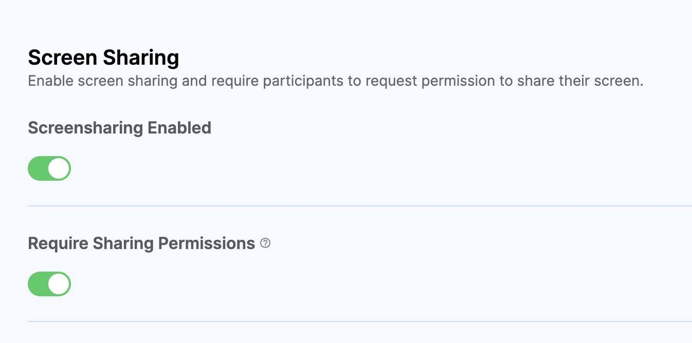

If you want to see the device management API in action, you can check out [the sample app](https://github.com/GetStream/stream-video-js/tree/main/sample-apps/client/ts-quickstart).

## Screen Sharing

Our Video SDK provides an easy ways to enable screensharing in your application.
In the following examples, we would learn to control and configure screen sharing.

:::note
Screen Sharing is supported only on Desktop browsers. For more details,
please refer to the [Browser Compatibility](https://developer.mozilla.org/en-US/docs/Web/API/Screen_Capture_API/Using_Screen_Capture#browser_compatibility) section.
:::

For a user to be able to share their screen, they must have the `screenshare` capability
(provided through the `Screenshare` permission) configured for the call they are in.

Screen sharing can be enabled or disabled on the dashboard for your call type:



### Start/Stop Screen Sharing

```typescript
call.screenShare.toggle();

// or
call.screenShare.enable();
call.screenShare.disable();
```

### Screen Sharing Status

Here is how you can access the status of screen sharing:

```typescript
call.screenShare.state.status; // enabled, disabled or undefined

// or, if you want to subscribe to changes
call.screenShare.state.status$.subscribe((status) => {
  // enabled, disabled or undefined
});
```

### Screen Sharing Settings

The behavior of the screen share video track can be customized, and a few parameters can be set:

```typescript
call.screenShare.setSettings({
  maxFramerate: 15, // will be clamped between 1 and 15 fps
  maxBitrate: 1500000, // will use at most 1.5Mbps
});

call.screenShare.enable();
```

### Render Screen Share

Please follow our [Playing Video and Audio guide](../../guides/playing-video-and-audio/).

## Screen Share Audio

### Start/Stop Screen Share Audio

```typescript
// enable it
call.screenShare.enableScreenShareAudio();

// publish video and audio (if available, and supported by the browser)
call.screenShare.enable();

// disable it
call.screenShare.disableScreenShareAudio();
```

### Play Screen Share Audio

Please follow our [Rendering Video and Audio guide](../../guides/playing-video-and-audio/).

### Caveats

Screen Share Audio has limited support across browsers and platforms.
For most up-to-date information, please take a look at [Browser Compatibility](https://developer.mozilla.org/en-US/docs/Web/API/Screen_Capture_API/Using_Screen_Capture#browser_compatibility).

In addition to that, there are a [few caveats](https://caniuse.com/?search=getDisplayMedia) that you should be aware of:

- On Windows, the entire system audio can be captured, but on MacOS and Linux, only the audio of a tab can be captured.
