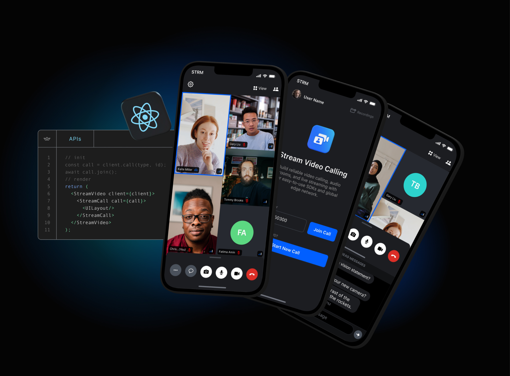

# Official React Native SDK for [Stream Video](https://getstream.io/video/docs/)
## 🚧 WARNING This package is not yet stable, it is for internal use only. For more information check out our video product page. 🚧

## **Quick Links**
- [Register](https://getstream.io/chat/trial/) to get an API key for Stream Video
- [React Native Video Tutorial]() //TODO- add link
- [Sample application](https://github.com/GetStream/stream-video-js/tree/main/sample-apps/react-native/dogfood)

## **What is Stream?**

Stream allows developers to rapidly deploy scalable feeds, chat messaging and video with an industry leading 99.999% uptime SLA guarantee.

With Stream's video components, you can use their SDK to build in-app video calling, audio rooms, audio calls, or live streaming. The best place to get started is with their tutorials:

- Video & Audio Calling Tutorial
- Audio Rooms Tutorial
- Livestreaming Tutorial

Stream provides UI components and state handling that make it easy to build video calling for your app. All calls run on Stream's network of edge servers around the world, ensuring optimal latency and reliability.

## 👩‍💻 Free for Makers 👨‍💻

Stream is free for most side and hobby projects. To qualify, your project/company needs to have < 5 team members and < $10k in monthly revenue. Makers get $100 in monthly credit for video for free.

## 💡Supported Features💡

Here are some of the features we support:
- Developer experience: Great SDKs, docs, tutorials and support so you can build quickly
- Edge network: Servers around the world ensure optimal latency and reliability
- Chat: Stored chat, reactions, threads, typing indicators, URL previews etc
- Security & Privacy: Based in USA and EU, Soc2 certified, GDPR compliant
- Dynascale: Automatically switch resolutions, fps, bitrate, codecs and paginate video on large calls
- Screen sharing (To be implemented)
- Picture-in-picture support (To be implemented)
- Active speaker
- Custom events
- Geofencing
- Notifications and ringing calls
- Opus DTX & Red for reliable audio
- Webhooks & SQS
- Backstage mode
- Flexible permissions system
- Joining calls by ID, link or invite
- Enabling and disabling audio and video when in calls
- Flipping, Enabling and disabling camera in calls
- Enabling and disabling speakerphone in calls
- Push notification providers support
- Call recording (To be implemented)
- Broadcasting to HLS

## **Repo Overview** 😎
This repo contains projects and samples developed by the team and Stream community. 
Projects are broken up into directories containing the source code for each project.

## **Projects/Packages 🚀**
The React Native SDK is a part of the Stream Video JS monorepo. 
The monorepo consists of multiple folders, the most important of which are `packages` and `sample-apps`.
- The `packages` folder contains the packages each of which is a separate npm package. The React Native SDK is one of the packages alongside:
  - Our shared JS Call Engine (`client`).
  - [React Bindings](../react-bindings) (`react-bindings`).
  - [React SDK](../react-sdk#official-react-sdk-for-stream-video) (`react-sdk`).
  
- The `sample-apps` folder contains the sample apps that are built using the packages from the `packages` folder. 
React Native's most relevant sample app is the `dogfooding` app which is a complete app that implements most of the features of the SDK.

- The `react-native-sdk/docusaurus` folder contains the documentation and guides.

## **Requirements** 🛠
Before running this project please ensure you have set up your development environment for React Native. 
The Stream Video React Native SDK supports apps created with the React Native CLI.
Apps created with Expo are currently not officially supported.

## **Contributing** 🤝
- How can I submit a sample app?
    - Apps submissions are always welcomed 🥳 Open a pr with a proper description and we'll review it as soon as possible
- Spot a bug 🕷 ?
    - We welcome code changes that improve the apps or fix a problem. Please make sure to follow all best practices and add tests if applicable before submitting a Pull Request on Github.

---
## Roadmap
Stream's video roadmap and changelog are available [here](https://github.com/GetStream/protocol/discussions/127). 

### Remaining 0.1 items
- [x] Push notification- Android
- [x] Chat integration guide
- [x] Simulcasting- Android
- [x] Push notification- VoIP iOS
- [x] Reconnection (awaiting BE)
- [x] Simulcasting- iOS
- [x] Pinning and spotlighting participants
- [x] Components parity, alignment and refactor
- [ ] Write docs:
  - [ ] UI Components
  - [ ] Tutorials
    - [ ] Video Rooms Tutorial
    - [ ] Audio Rooms Tutorial
  - [ ] Core
    - [ ] Camera & Microphone
  - [ ] Advanced
    - [ ] Chat Integration
    - [ ] Internationalization
    - [ ] Push Notification (validate)
  - [ ] UI Cookbook
    - [ ] Call Controls
    - [x] Permission requests (native)
    - [ ] Runtime layout switching
    - [ ] Video Layout (refactor)
    - [ ] ParticipantView customizations

### 0.2 milestone
- [ ] Livestream tutorial
- [ ] Regular Push Notification
- [ ] Deeplink support for video call demo (Dogfooding already implemented)
- [ ] Speaking while muted
- [ ] Landscape support
- [ ] Call Analytics

### 0.3 milestone
- [ ] Stability
- [ ] Test with a large call with many participants
- [ ] Test coverage
- [ ] CPU usage improvements
- [ ] Picture-in-Picture
- [ ] Dynascale 2.0 (codecs, f resolution switches, resolution webrtc handling)

### 0.4 milestone
- [ ] Audio & Video filters
- [ ] Screen sharing from mobile
- [ ] Tap to focus
- [ ] Analytics integration
- [ ] Picture of the video stream at highest resolution
