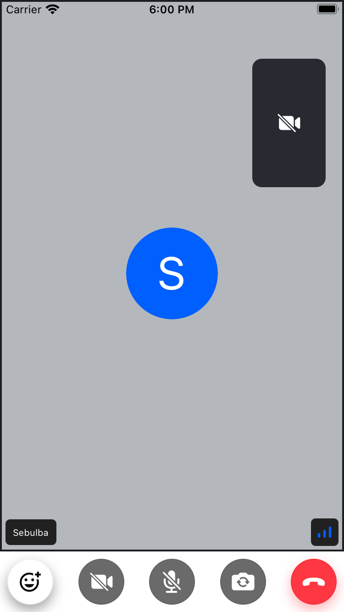

import { TokenSnippet } from '../../../shared/_tokenSnippet.jsx';

In this guide, we will cover the basics of making your first call using Stream Video.
If you haven't already, we recommend starting with the __[introduction](../../)__ and __[installation](../installation)__ steps first, as this guide will build on the material covered in those sections.

## Client setup & Calls

Create an instance of `StreamVideoClient` that will establish a WebSocket connection by connecting a user. Next, you create a call object and join the call. We'll specify `create: true` to create the call if it doesn't exist.

```tsx
import {
  StreamCall,
  StreamVideo,
  StreamVideoClient,
  User,
} from '@stream-io/video-react-native-sdk';
import { useEffect, useState } from 'react';

const apiKey = 'your-api-key';
const userId = 'user-id';
const token = 'authentication-token';
const callId = 'my-call-id';
const user: User = { id: userId };

export default function App() {
  const [client] = useState(
    () => new StreamVideoClient({ apiKey, user, token }),
  );
  const [call] = useState(() => client.call('default',callId));

  useEffect(() => {
    call.join({ create: true });
  }, [call]);

  return (
    <StreamVideo client={client}>
      <StreamCall call={call}>{/* We will add the video UI in the next step */}</StreamCall>
    </StreamVideo>
  );
}
```

When creating a call on the client, the string `default` is a call type. There are 4 built-in [call types](../../core/configuring-call-types/). and you can also create your own.
The call type controls the permissions and which features are enabled.

The second argument is the call id. Call ids can be reused, meaning it's possible to join a call with the same id multiple times (for example, for recurring meetings).

:::info
Don't forget to fill in the constants mentioned earlier (`apiKey`, `userId`, `token`, `callId`) with the values below.
:::
<TokenSnippet sampleApp="meeting" />

## Rendering video

The call's state can be accessed using hooks, you'll often work with `useParticipants`. Have a look below for a basic example of how to render the videos of all participants:

```tsx
import {CallParticipantsListView, useParticipants} from '@stream-io/video-react-native-sdk';

function VideoUI() {
  const participants = useParticipants();

  return (
    <>
      <CallParticipantsListView participants={participants} />
    </>
  );
}
```

The participant object contains all essential information to render videos, such as audio/video tracks, user information, audio/video enabled, etc.

More information about state management can be found in the [Call & Participant State guide](../../core/call-and-participant-state).

## Camera & Microphone

Most video apps will show buttons to mute/unmute the audio or video. The example below shows how to use the camera:

```tsx
import {useCallControls } from '@stream-io/video-react-native-sdk';
import {Pressable, Text} from 'react-native';

function VideoButton() {
  const { isVideoPublished, toggleVideoMuted } = useCallControls();

  return (
    <Pressable
        style={{ padding: 8, backgroundColor: '###010101' }}
        onPress={toggleVideoMuted}
    >
      <Text>{isVideoPublished ? 'Turn on camera' : 'Turn off camera'}</Text>
    </Pressable>
  );
}
```
With the help of the `useCallControls` hook, you can access the call controls state and its functions.
- `isVideoPublished` is a boolean that indicates whether the local video is published/muted or not.
- `toggleVideoMuted` is a function that toggles the local video mute state and publishes/unpublishes the video track.

More information about this topic can be found in the [Camera & Microphone guide](../../guides/camera-and-microphone).

## UI Components

The goal of this library is to make it easy to build any type of video/calling experience. You have a few options for the UI:

- Build your own UI components using the state as shown above.
- Use our library of built-in components.
- Mix & Match between your own and built-in components.

The built-in components you can customize using [theming](../../ui-components/video-theme) and props.
If you decide to build your own components we have a dedicated [UI Cookbook section](../../ui-cookbook/overview) to help you get started.

Let's see an example where we set up the UI using Stream's built-in components:

- Use the [`<CallContentView/>`](../../ui-components/call/call-content-view/) in order to render the call UI (video/audio and screen share of all its participants).
- Additionally, hook in the default [`<CallControlsView />`](../../ui-components/call/call-controls-view/) component to enable call control functionalities (such as mute, hang up, etc.).

```tsx
import {
  CallContentView,
  CallControlsView
} from '@stream-io/video-react-native-sdk';

const MyApp = () => {
  // ...
  // Assuming you have the 'client' and 'call' created from previous steps
  return (
    <StreamVideo client={client}>
      <StreamCall call={call}>
        <CallContentView />
        <CallControlsView />
      </StreamCall>
    </StreamVideo>
  );
};
```

import QuickStartFinishedState from '../assets/01-setup/quickstart-finished-state.png';




## Next steps
- Start using you camera and microphone by learning how to manage your native permissions. See the [Manage Native Permissions](../../advanced/native-permissions) guide.
- Tweak an [Customize the UI](../../ui-cookbook/overview).
- Discover and [Configure Call Types](../../core/configuring-call-types).

