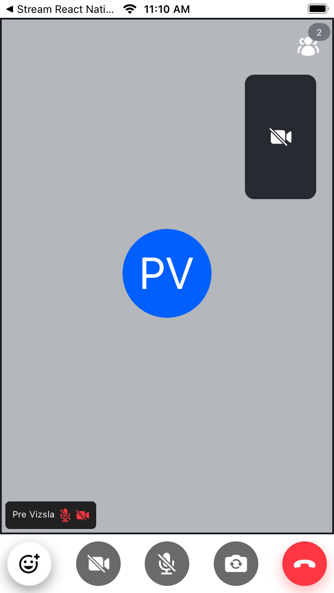

import { TokenSnippet } from '../../../shared/_tokenSnippet.jsx';
import VideoCallVideoView from '../assets/02-tutorials/video-call-video-view.png';
import VideoCallFinishedView from '../assets/02-tutorials/video-call-finished-view.png';

This tutorial teaches you how to build Zoom/Google Meet style video calling for your app.

- Calls run on Stream's global edge network for optimal latency & reliability.
- Permissions give you fine-grained control over who can do what.
- Video quality and codecs are automatically optimized.

### Step 1 - Create a new project

You can set up a React Native app using the React Native CLI or Expo. The simplest way is to follow the official [React Native](https://reactnative.dev/docs/environment-setup) docs and create an app using the same.

### Step 2 - Install the SDK

As a part of Stream's React Native SDK, you would ideally have to install `@stream-io/video-react-native-sdk`.

```bash
yarn add @stream-io/video-react-native-sdk
```

Follow the [installation guide](../../setup/installation) to install Stream Video React Native SDK and other dependencies required for the video call.

### Step 3 - Getting and Setting the credentials

In order to be able to communicate with Stream's back-end video service, you will need to gather the following values and you can store them either in the environment variables of your project or soemwhere else. Make sure it is easily accessible to be used later in the application:

```bash
STREAM_API_KEY=<api_key>
STREAM_API_SECRET=<api_secret>
```

For testing, you can copy the credentials from the box below:

<TokenSnippet sampleApp="meeting" />

### Step 4 - Create & Join a call

Firstly, we take care of the following:

1. Create a `StreamVideoClient` instance and establish a WS connection
2. Provide the `StreamVideoClient` instance to children through `StreamVideo` provider
3. Create a call instance using the call id and call type and provide it to children (by `StreamCall`). The call type (`default` in the below case) controls which features are enabled and how permissions are setup.
4. Join the call

```tsx title="App.tsx"
import React, { useEffect, useState } from 'react';
import {
  Call,
  StreamCall,
  StreamVideo,
  StreamVideoClient,
} from '@stream-io/video-react-native-sdk';
import { VideoCallUI } from './components/VideoCallUI';

export default function App() {
  const [client] = useState<StreamVideoClient>(() => {
    const user = {
      id: 'your-user-id',
    };
    const token = 'your-user-token';

    return new StreamVideoClient({
      apiKey: STREAM_API_KEY,
      user,
      token,
      options: {
        logLevel: 'warn',
      },
    });
  });

  const callId = 'your-call-id';
  const [call] = useState<Call>(() => client.call('default', callId));

  useEffect(() => {
    const joinCall = async () => {
      await call.join({ create: true });
    };

    joinCall();
  }, [call]);

  return (
    <StreamVideo client={client}>
      <StreamCall call={call}>
        <VideoCallUI />
      </StreamCall>
    </StreamVideo>
  );
}
```

### Step 5 - Joining from the Web

To make this a little more interactive, let's join the call from your browser.

<TokenSnippet sampleApp="meeting" displayStyle="join" />

On your app, you'll see the new participant from the web, once we add the Video call UI. Let's keep the browser tab open as you go through the tutorial.

### Step 6 - Rendering Video

In this step, we are going to add the participant's view which displays us the participants video/audio stream and other related info,
and the call controls view which allows you to control your streaming of audio/video.

To do this we use `CallContentView` and `CallControlsView`.

The `CallContentView` add the following to the UI automatically:

- Indicators of when someone is speaking.
- Quality of their network.
- Layout support for >=2 participants.
- Labels for the participant names, media stream on/off status.

The `CallControlsView` adds the toggle audio/video button, switch camera button and the hang up call button automatically.

An example of the same is shown here:

```tsx title="components/VideoCallUI.tsx"
import React from 'react';
import {
  CallContentView,
  CallControlsView,
} from '@stream-io/video-react-native-sdk';
import { SafeAreaView, StyleSheet } from 'react-native';

export const VideoCallUI = () => {
  return (
    <SafeAreaView style={styles.container}>
      <CallContentView />
      <CallControlsView />
    </SafeAreaView>
  );
};

const styles = StyleSheet.create({
  container: {
    flex: 1,
    backgroundColor: '#272A30',
  },
});
```


### Step 7 - Full Video Calling UI

Next, we will add the `ParticipantsInfoBadge`, to make our UI complete. It is responsible to handle the following:

- Show the number of participants in a form of badge.
- Show the info about the participants in a list view with name, staus of media streaming.
- Show available options within the call like Pin participant, enable/disable audio/video, etc.

This is how you can add the same on the existing component.

```tsx title="components/VideoCallUI.tsx"
import React from 'react';
import {
  CallContentView,
  CallControlsView,
  ParticipantsInfoBadge,
} from '@stream-io/video-react-native-sdk';
import { SafeAreaView, StyleSheet, View } from 'react-native';

export const VideoCallUI = () => {
  return (
    <SafeAreaView style={styles.container}>
      <View style={styles.icons}>
        <ParticipantsInfoBadge />
      </View>
      <CallContentView />
      <CallControlsView />
    </SafeAreaView>
  );
};

const styles = StyleSheet.create({
  container: {
    flex: 1,
    backgroundColor: '#272A30',
  },
  icons: {
    position: 'absolute',
    right: 16,
    marginTop: 16,
    flexDirection: 'row',
    alignItems: 'center',
    zIndex: 2,
  },
});
```



### Step 8 - Customizing the UI

Stream ships with several UI components to make this easy. You can customize the components with theming, props and swapping parts of them. This is convenient if you want to quickly build a production-ready calling experience for your app. (and if you need more flexibility, many customers use the above low-level approach to build a UI from scratch).

### Recap

Please do let us know if you ran into any issues while building an video calling app with React Native. Our team is also happy to review your UI designs and offer recommendations on how to achieve it with Stream.

To recap what we've learned about Stream video calling:

- You set up a call: (`const call = client.call("default", "your-call-id")`)
- The call type ("default" in the above case) controls which features are enabled and how permissions are setup
- When you join a call, real-time communication is set up for audio & video calling: (`call.join()`)
- State-related hooks such as `useLocalParticipant` make it easy to build your own UI
- `ParticipantView` is the low-level component that renders audio and video

We've used [Stream's Video Calling API](https://getstream.io/video/), which means calls run on a global edge network of video servers. By being closer to your users the latency and reliability of calls are better. The React Native SDK enables you to build in-app video calling, audio rooms and livestreaming in days.

We hope you've enjoyed this tutorial and please do feel free to reach out if you have any suggestions or questions.
