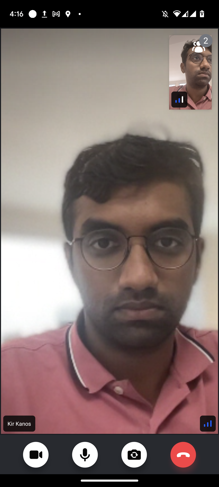
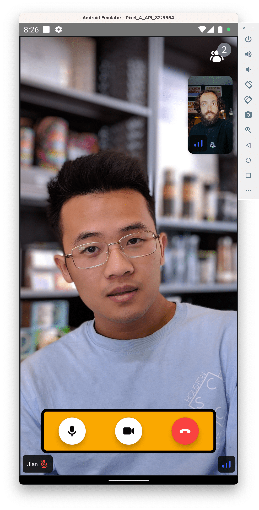
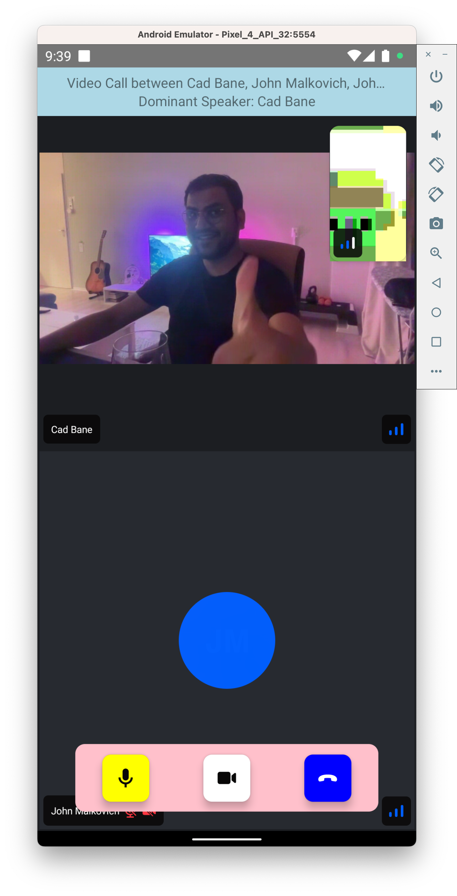

import Tabs from '@theme/Tabs';
import TabItem from '@theme/TabItem';

import { TokenSnippet } from '../../../shared/_tokenSnippet.jsx';
import homeScreenImg from '../assets/02-tutorials/01-video-calling/home-screen.png';
import videoScreenEmpty from '../assets/02-tutorials/01-video-calling/video-empty.png';

This tutorial teaches you how to build Zoom/Whatsapp style video calling for your app.

- Calls run on Stream's global edge network for optimal latency & reliability.
- Permissions give you fine-grained control over who can do what.
- Video quality and codecs are automatically optimized.
- Powered by Stream's [Video Calling API](https://getstream.io/video/).



## Step 1 - Setup a new React Native app

Create a new React Native app using the official template,

```bash title=Terminal
npx react-native@latest init VideoCallExample
cd VideoCallExample
```

## Step 2 - Install the SDK and declare permissions

In order to install the Stream Video React Native SDK, run the following command in your terminal of choice:

```bash title=Terminal
yarn add @stream-io/video-react-native-sdk @stream-io/react-native-webrtc
```

The SDK requires installing some peer dependencies. You can run the following command to install them:

```bash title=Terminal
yarn add react-native-incall-manager@4.1.0
yarn add react-native-svg
yarn add @react-native-community/netinfo@9.3.9
yarn add @notifee/react-native@7.7.1

# Install pods for iOS
npx pod-install
```

#### Add Stream Video SDK's setup method

In this step we will handle the setup of video encoder masked by `setup` method.

<Tabs>
<TabItem value="android" label="Android" default>

Add the following in your `MainApplication.java` file:

<!-- vale off -->

```java
// highlight-next-line
import com.streamvideo.reactnative.StreamVideoReactNative;

public class MainApplication extends Application implements ReactApplication {

  @Override
  public void onCreate() {
    super.onCreate();
    // highlight-next-line
    StreamVideoReactNative.setup();
    // the rest..
  }
}
```

</TabItem>
<TabItem value="ios" label="iOS">

Add the following in your `AppDelegate.m` or `AppDelegate.mm` file:

```c
// highlight-next-line
#import "StreamVideoReactNative.h"

@implementation AppDelegate

- (BOOL)application:(UIApplication *)application didFinishLaunchingWithOptions:(NSDictionary *)launchOptions
{
  // highlight-next-line
  [StreamVideoReactNative setup];

  // the rest..
}
```

</TabItem>
</Tabs>

<!-- vale on -->
#### Declare permissions

Application needs permissions to access camera, microphone and network state.

<Tabs>
<TabItem value="android" label="Android" default>

In `AndroidManifest.xml` add the following permissions before the `application` section.

```xml
<manifest xmlns:android="http://schemas.android.com/apk/res/android">
  // highlight-start
  <uses-feature android:name="android.hardware.camera" />
  <uses-feature android:name="android.hardware.camera.autofocus" />
  <uses-feature android:name="android.hardware.audio.output" />
  <uses-feature android:name="android.hardware.microphone" />

  <uses-permission android:name="android.permission.CAMERA" />
  <uses-permission android:name="android.permission.RECORD_AUDIO" />
  <uses-permission android:name="android.permission.ACCESS_NETWORK_STATE" />
  <uses-permission android:name="android.permission.CHANGE_NETWORK_STATE" />
  <uses-permission android:name="android.permission.MODIFY_AUDIO_SETTINGS" />
  // highlight-end
  <uses-permission android:name="android.permission.INTERNET" />
  ...
  <application
    ...
  />
  </application>
</manifest>
```

If you plan to also support Bluetooth devices then also add the following.

```xml
<uses-permission android:name="android.permission.BLUETOOTH" android:maxSdkVersion="30" />
<uses-permission android:name="android.permission.BLUETOOTH_ADMIN" android:maxSdkVersion="30" />
<uses-permission android:name="android.permission.BLUETOOTH_CONNECT" />
```

</TabItem>
<TabItem value="ios" label="iOS">

Add the following keys and values to `Info.plist` file, under `dict` tag.

```plist title="Info.plist"
<plist version="1.0">
<dict>
  ...
  <key>CFBundleName</key>
  <string>$(PRODUCT_NAME)</string>
  // highlight-start
  <key>NSCameraUsageDescription</key>
  <string>$(PRODUCT_NAME) would like to use your camera</string>
  <key>NSMicrophoneUsageDescription</key>
  <string>$(PRODUCT_NAME) would like to use your microphone</string>
  // highlight-end
  ...
</dict>
</plist>

```

</TabItem>
</Tabs>

#### Android Specific installation

In `android/app/build.gradle` add the following inside the `android` section:

```java
android {
  ...
  // highlight-start
  compileOptions {
    sourceCompatibility JavaVersion.VERSION_1_8
    targetCompatibility JavaVersion.VERSION_11
  }
  // highlight-end
}
```

In `android/gradle.properties` add the following:

```groovy
android.enableDexingArtifactTransform.desugaring=false
```

#### Run the app

To ensure the best possible experience, we highly recommend running the app on a physical device.
This is due to the limitations in audio and video device support on emulators.
You can refer to the React Native documentation for guidance on [running the app on a physical device](https://reactnative.dev/docs/running-on-device).

However, if you still prefer to use an emulator, execute the following command:

```bash
# run iOS app
yarn ios

# run Android app
yarn android
```

## Step 3 - Understand the basics

Before we dive deep into writing code, there are two concepts you should be familiar with - `StreamVideoClient` and `Call`.

`StreamVideoClient` is the low level JavaScript client used by the SDK to communicate with the Stream Video service.
It provides all the necessary methods to connect user Stream service, query calls, create call etc.
And a `call` refers to an instance of the [`Call` class](https://github.com/GetStream/stream-video-js/blob/main/packages/client/src/Call.ts#L125) and is utilized for performing call-specific actions, such as joining a call, muting participants, leaving a call, and more.

```tsx
// create client instance
const client = new StreamVideoClient({ apiKey, user, token });

// Alternatively you can also choose to separate client creation and user connection:
// const client = new StreamVideoClient({ apiKey });
// await client.connectUser(user, token);

// create a call instance
const call = client.call('default', callId);
call.join({
  create: true, // create the call if it doesn't exist
  data: {
    members: [{ user_id: 'john_smith' }, { user_id: 'jane_doe' }],
    custom: {  // custom data set on call
      title: 'React Native test',
      description: 'Conducting a test of React Native video calls',
    },
  },
});
```
In this example

- `apiKey` is the API key of your Stream Video application available on [dashboard](https://dashboard.getstream.io/organization/5380/apps)
- `user` is the user object `{ id: "john_smith", "name": "John Smith" }`
- and `token` is the user token generated by your server-side API. For development purpose, you can use the token generated by the [Token Generator](https://getstream.io/chat/docs/react/token_generator/).
  You can read more information about client authentication on the [Client & Authentication](../../core/client-auth) guide.

Client instance and call instance are made accessible to all the video components from SDK via `StreamVideo` component and `StreamCall` component respectively.
In your app you need to wrap your component tree with `StreamVideo` component and provide the `client` instance to it as a prop.
client creation would normally take place during sign-in stage of the application.
And similarly you need to wrap your call specific UI components with `StreamCall` component and provide the `call` instance to it as a prop.

`StreamVideo` and `StreamCall` components are basically context providers, and they enable you to consume hooks provided by the SDK.
These hooks do all the heavy lifting around call management and provide you with the necessary state and methods to build your UI.

```tsx
<StreamVideo client={client}>
  ...
  <StreamCall call={call}>
    <View>
      <Text>Video Call UI</Text>
    </View>
  </StreamCall>
  ...
</StreamVideo>
```

## Step 4 - Setup Starter UI

Lets begin by creating a basic UI for our audio room. Normally you would use a navigation library like [React Navigation](https://reactnavigation.org/) to navigate between screens.
But for this tutorial we'll keep it simple and mock the navigation using a state variable - `activeScreen`.

Within your tutorial app, create a folder named `src` and create the following files within it:

- `src/HomeScreen.tsx`
- `src/CallScreen.tsx` (takes `callId` as a prop)

Now copy the following content into the respective files (as mentioned in header):

<Tabs>
<TabItem value="app-root" label="App.tsx">

```tsx title="App.tsx"
import React, {useState} from 'react';
import {SafeAreaView, StyleSheet} from 'react-native';
import {HomeScreen} from './src/HomeScreen';
import {CallScreen} from './src/CallScreen';

const apiKey = 'REPLACE_WITH_API_KEY'; // the API key can be found in the "Credentials" section
const token = 'REPLACE_WITH_TOKEN'; // the token can be found in the "Credentials" section
const userId = 'REPLACE_WITH_USER_ID'; // the user id can be found in the "Credentials" section
const callId = 'REPLACE_WITH_CALL_ID'; // the call id can be found in the "Credentials" section

export default function App() {
  const [activeScreen, setActiveScreen] = useState('home');
  const goToCallScreen = () => setActiveScreen('call-screen');
  const goToHomeScreen = () => setActiveScreen('home');

  return (
    <SafeAreaView style={styles.container}>
      {activeScreen === 'call-screen' ? (
        <CallScreen goToHomeScreen={goToHomeScreen} callId={callId} />
      ) : (
        <HomeScreen goToCallScreen={goToCallScreen} />
      )}
    </SafeAreaView>
  );
}

const styles = StyleSheet.create({
  container: {
    flex: 1,
    justifyContent: 'center',
    textAlign: 'center',
  },
});
```

</TabItem>
<TabItem value="call-screen" label="src/CallScreen.tsx">

```tsx title="src/CallScreen.tsx"
import React from 'react';
import {Button, StyleSheet, Text, View} from 'react-native';

type Props = {goToHomeScreen: () => void; callId: string};

export const CallScreen = ({goToHomeScreen, callId}: Props) => {
  return (
    <View style={styles.container}>
      <Text style={styles.text}>Here we will add Video Calling UI</Text>
      <Button title="Go back" onPress={goToHomeScreen} />
    </View>
  );
};

const styles = StyleSheet.create({
  container: {
    flex: 1,
    justifyContent: 'center',
  },
  text: {
    fontSize: 20,
    fontWeight: 'bold',
    marginBottom: 20,
    textAlign: 'center',
  },
});
```

</TabItem>
<TabItem value="home-screen" label="src/HomeScreen.tsx">

```tsx title="src/HomeScreen.tsx"
import React from 'react';
import { View, Text, Button, StyleSheet } from 'react-native';

type Props = {
  goToCallScreen: () => void;
};

export const HomeScreen = ({ goToCallScreen }: Props) => {
  return (
    <View>
      <Text style={styles.text}>Welcome to Video Calling Tutorial</Text>
      <Button title="Join Video Call 🎧" onPress={goToCallScreen} />
    </View>
  );
};

const styles = StyleSheet.create({
  text: {
    fontSize: 20,
    fontWeight: 'bold',
    marginBottom: 20,
    textAlign: 'center',
  },
});
```

</TabItem>
</Tabs>

In `App.tsx` we have hardcoded the placeholders of `apiKey`, `userId`, `token` and `callId` for simplicity of tutorial.
To actually run this sample we need a valid user token.
The user token is typically generated by your server side API.
When a user logs in to your app you return the user token that gives them access to the call.
To make this tutorial easier to follow we'll generate a user token for you:

Please update **REPLACE_WITH_API_KEY**, **REPLACE_WITH_USER_ID**, **REPLACE_WITH_TOKEN** and **REPLACE_WITH_CALL_ID** with the actual values shown below:

:::note
In actual application you will want to store apiKey in a secure storage or in environment file.
:::

<TokenSnippet sampleApp="meeting" displayStyle="credentials" />

Hit save and you should see on your emulator or device the following UI.

<div
  style={{ display: 'flex', flexDirection: 'row', justifyContent: 'center' }}
>
  
  
</div>


## Step 5 - Setup Video Client

Within this configuration, we will establish a `StreamVideoClient` instance and facilitate the user's connection to the Stream Video service.
In real application, client creation should be encapsulated within a `useEffect` hook and during unmount you should call `client.disconnectUser()`
to avoid creating multiple websockets.

Client instance needs to be provided to `StreamVideo` component and it will provide the client instance to all the child components using React Context.
It needs to go at the top of the component tree.

```tsx title="App.tsx"
...
import {
  StreamVideo,
  StreamVideoClient,
} from '@stream-io/video-react-native-sdk';
...
// highlight-start
const user = {
  id: userId,
  name: 'John Malkovich',
  image: `https://getstream.io/random_png/?id=${userId}&name=John+Malkovich`,
};
const client = new StreamVideoClient({ apiKey, user, token });
// highlight-end

export default function App() {
  ...
  return (
    // highlight-next-line
    <StreamVideo client={client}>
      <SafeAreaView style={styles.container}>
        ...
      </SafeAreaView>
    // highlight-next-line
    </StreamVideo>
  );
}
```

You wouldn't see any change in the UI at this point, since we haven't joined the call yet.

## Step 6 - Create & Join a call

In this step we will create and join a call. Call will be stored in a state variable `call` and it needs to be
provided to `StreamCall` component. As explained earlier, `StreamCall` component is provided by the SDK and it provides all the necessary hooks for configuring UI around audio room.
We will explore these hooks later in the tutorial.

Open up `src/CallScreen.tsx` and replace it with this code:

```tsx title="src/CallScreen.tsx"
...
// highlight-start
import {Call, StreamCall} from '@stream-io/video-react-native-sdk';
// highlight-end
...
export const CallScreen = ({goToHomeScreen, callId}: Props) => {
  // highlight-start
  const [call, setCall] = React.useState<Call | null>(null);

  if (!call) {
    return <Text>Joining call...</Text>;
  }
  // highlight-end

  return (
    // highlight-next-line
    <StreamCall call={call}>
      <View style={styles.container}>
        <Text style={styles.text}>Here we will add Video Calling UI</Text>
        <Button title="Go back" onPress={goToHomeScreen} />
      </View>
    // highlight-next-line
    </StreamCall>
  );
};
```

Also as explained earlier in [Understand the Basics](#step-3---understand-the-basics) section, call can be created or accessed using `client.call(...)` method.
Thus we need access to `client` inside `CallScreen` component. We will use the `useStreamVideoContext` hook to get access to the client instance.

We will put the joining logic inside useEffect hook, so we automatically join the call when user goes to `CallScreen`.

```tsx title="src/CallScreen.tsx"
// highlight-next-line
import React, {useEffect} from 'react';
import {
  ...
  // highlight-next-line
  useStreamVideoClient,
} from '@stream-io/video-react-native-sdk';

export const CallScreen = ({goToHomeScreen, callId}: Props) => {
  const [call, setCall] = React.useState<Call | null>(null);
  // highlight-next-line
  const client = useStreamVideoClient();

  // highlight-start
  useEffect(() => {
    const call = client.call('default', callId);
    call.join({ create: true })
      .then(() => setCall(call));
  }, [client]);
  // highlight-end
  ...
};

```

To enhance the interactivity of this tutorial moving forward, kindly follow these steps:

- Give the app a refresh, then tap the "Join Audio Room" button within your mobile tutorial app.
- Access the web version of the audio room on your browser by clicking the "Join Call" link provided below, and subsequently, hit the "Join" button.

Currently, you won't have the ability to speak, as we haven't set up the user interface for the video call.
However, you will be able to view the current user listed among the participants on the web application.

<TokenSnippet sampleApp="meeting" displayStyle="join" />

## Step 7 - Rendering Video UI

In this step, we are going to add the participant's view which displays the participants' video and audio stream and other related info.
It will also add buttons that allow the user to control their streaming settings of audio and video.

The `CallContent` adds the following things to the UI automatically:

- Indicators of when someone is speaking.
- Quality of their network.
- Layout support for multiple participants.
- Labels for the participant names, media stream on/off status.
- A floating local video view.
- Buttons to toggle audio/video and to flip the camera.
- Button to hang up the call.

Update the `CallScreen` component as below:

```tsx title="src/CallScreen.tsx"
...
import {
  ...
  // highlight-next-line
  CallContent,
} from '@stream-io/video-react-native-sdk';

...
export const CallScreen = ({goToHomeScreen, callId}: Props) => {
  ...
  return (
    <StreamCall call={call}>
      <View style={styles.container}>
        // removed-block-start
        <Text style={styles.text}>Here we will add Video Calling UI</Text>
        <Button title="Go back" onPress={goToHomeScreen} />
        // removed-block-end
        // added-block-start
        <CallContent
          onHangupCallHandler={goToHomeScreen}
        />
        // added-block-end
      </View>
    </StreamCall>
  );
};
...
```

Now when you run the app, you'll see your local video in a floating video element and the video from your other browser tab. You should also see the buttons to control the streaming settings. The end result should look like this:


## Step 8 - Customizing the UI

You can customize the UI by:

- Building your own UI components (the most flexibility, build anything).
- Mixing and matching with Stream's UI Components (speeds up how quickly you can build common video UIs).
- Theming (basic customization of colors, fonts etc).

You can provide custom component as prop to `CallContent` to customize the UI.
Example below shows how you can

```tsx title="src/CallScreen.tsx"
...
import {
  ...
  StreamCall,
  // highlight-start
  CallControlProps,
  HangUpCallButton,
  ToggleAudioPublishingButton as ToggleMic,
  ToggleVideoPublishingButton as ToggleCamera,
  useCall,
  // highlight-end
  useStreamVideoClient,
} from '@stream-io/video-react-native-sdk';
import {callId} from '../config';

// highlight-start
const CustomCallControls = (props: CallControlProps) => {
  const call = useCall();
  return (
    <View style={styles.customCallControlsContainer}>
      <ToggleMic onPressHandler={call?.microphone.toggle} />
      <ToggleCamera onPressHandler={call?.camera.toggle} />
      <HangUpCallButton onHangupCallHandler={props.onHangupCallHandler} />
    </View>
  );
};
// highlight-end
...
export const CallScreen = ({goToHomeScreen, callId}: Props) => {
  ...
  return (
    <StreamCall call={call}>
      <View style={styles.container}>
        <CallContent
          onHangupCallHandler={goToHomeScreen}
          // highlight-next-line
          CallControls={CustomCallControls}
        />
      </View>
    </StreamCall>
  );
};

const styles = StyleSheet.create({
  ...
  // highlight-start
  customCallControlsContainer: {
    position: 'absolute',
    bottom: 40,
    paddingVertical: 10,
    width: '80%',
    marginHorizontal: 20,
    flexDirection: 'row',
    alignSelf: 'center',
    justifyContent: 'space-around',
    backgroundColor: 'orange',
    borderRadius: 10,
    borderColor: 'black',
    borderWidth: 5,
    zIndex: 5,
  },
  // highlight-end
});

```



All essential call information can be accessed through the SDK's provided hooks, facilitated by the `StreamCall` component.
You can conveniently access a range of hooks related to the call's state by utilizing the `useCallStateHooks` hook as demonstrated below.
By utilizing these hooks, you can confidently depend on the most up-to-date state information.

In the following example we will customize the top bar of the CallContent to display

- current participants in the call
- name of the dominant speaker

```tsx title="src/CallScreen.tsx"
import {
  ...
  useStreamVideoClient,
  // highlight-next-line
  useCallStateHooks,
} from '@stream-io/video-react-native-sdk';

...

// highlight-start
const CustomTopView = () => {
  const {useParticipants, useDominantSpeaker} = useCallStateHooks();
  const participants = useParticipants();
  const dominantSpeaker = useDominantSpeaker();
  return (
    <View style={styles.topContainer}>
      <Text
        ellipsizeMode="tail"
        numberOfLines={1}
        style={styles.topText}>
        Video Call between {participants.map(p => p.name).join(', ')}
      </Text>
      {dominantSpeaker?.name && (
        <Text style={styles.topText}>
          Dominant Speaker: {dominantSpeaker?.name}
        </Text>
      )}
    </View>
  );
};
// highlight-end

export const CallScreen = ({goToHomeScreen, callId}: Props) => {
  ...
  return (
    <StreamCall call={call}>
      <View style={styles.container}>
        <CallContent
          onHangupCallHandler={goToHomeScreen}
          CallControls={CustomCallControls}
          // highlight-next-line
          CallTopView={CustomTopView}
        />
      </View>
    </StreamCall>
  );
};

const styles = StyleSheet.create({
  ...
  // highlight-start
  topContainer: {
    width: '100%',
    height: 50,
    backgroundColor: 'black',
    justifyContent: 'center',
    alignItems: 'center',
  },
  topText: {
    color: 'white',
  },
  // highlight-end
});

```


You can also adjust the style of the underlying UI using the style prop on `StreamVideo` component.
The complete array of properties that can be themed is available within the [theme](https://github.com/GetStream/stream-video-js/blob/main/packages/react-native-sdk/src/theme/theme.ts) file.

```tsx title="App.tsx"
// highlight-next-line
import React, {useMemo, useState} from 'react';
...

export default function App() {
  ...
  // Avoid passing inline styles to the component, as it will cause unnecessary re-renders
  // highlight-start
  const theme = useMemo(
    () => ({
      callControlsButton: {
        container: {
          borderRadius: 10,
        },
      },
      hangupCallButton: {
        container: {
          backgroundColor: 'blue',
        },
      },
      toggleAudioPublishingButton: {
        container: {
          backgroundColor: 'green',
        },
      },
    }),
    [],
  );
  // highlight-end
  ...
  return (
    // highlight-next-line
    <StreamVideo client={client} style={theme}>
      ...
    </StreamVideo>
  );
...
```



## Recap

Please do let us know if you ran into any issues while building an video calling app with React Native. Our team is also happy to review your UI designs and offer recommendations on how to achieve it with Stream.

To recap what we've learned about Stream video calling:

- You set up a call: (`const call = client.call("default", "your-call-id")`)
- The call type ("default" in the above case) controls which features are enabled and how permissions are setup
- When you join a call, real-time communication is set up for audio & video calling: (`call.join()`)
- State-related hooks such as `useCallCallingState` make it easy to build your own UI
- `CallContent` is the component that renders audio and video and adds buttons to control streaming options

We've used [Stream's Video Calling API](https://getstream.io/video/), which means calls run on a global edge network of video servers. By being closer to your users the latency and reliability of calls are better. The React Native SDK enables you to build in-app video calling, audio rooms and livestreaming in days.

We hope you've enjoyed this tutorial and please do feel free to reach out if you have any suggestions or questions.
