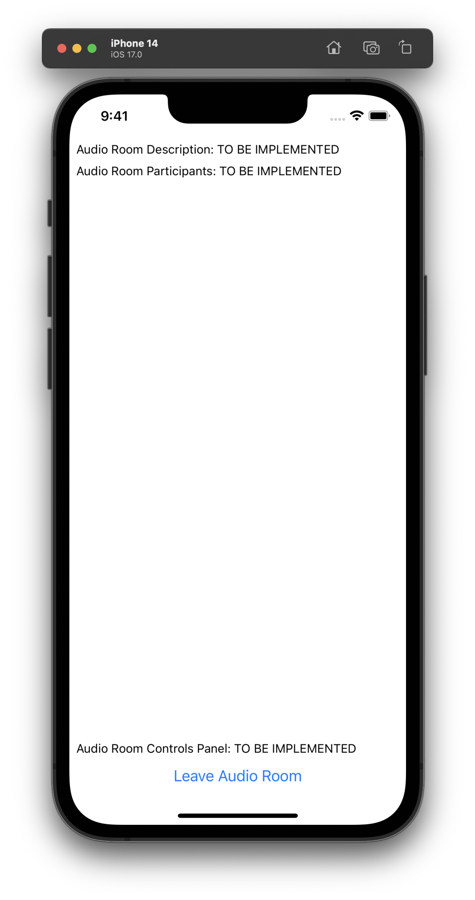

import Tabs from '@theme/Tabs';
import TabItem from '@theme/TabItem';

import { TokenSnippet } from '../../../shared/_tokenSnippet.jsx';
import homeScreenImg from '../assets/02-tutorials/02-audio-room/home-screen.png'
import audioRoomEmptyImg from '../assets/02-tutorials/02-audio-room/active-room-empty.png'

This tutorial aims to guide you through the process of creating an audio room experience reminiscent of platforms such as Twitter Spaces or Clubhouse. The outcome, as depicted in the image below, will encompass the following functionalities:

- Backstage Mode: Initiate the call with your co-hosts, allowing for pre-live discussions.
- Global Edge Network: Calls operate on Stream's worldwide edge network, ensuring low latency and scalability.
- No Listener Limit: Rooms can accommodate an unlimited number of listeners.
- Raised Hand Feature: Listeners can indicate their desire to speak by raising their hand and subsequently being invited by the host.
- Enhanced Audio Reliability: Audio tracks are transmitted multiple times to enhance overall reliability.


## Step 1 - Setup a new React Native app

Create a new React Native app using the official template,

```bash title=Terminal
npx react-native@latest init AudioRoomExample
cd AudioRoomExample
```

## Step 2 - Install the SDK and declare permissions

In order to install the Stream Video React Native SDK, run the following command in your terminal of choice:

```bash title=Terminal
yarn add @stream-io/video-react-native-sdk @stream-io/react-native-webrtc
```

The SDK requires installing some peer dependencies. You can run the following command to install them:

```bash title=Terminal
yarn add react-native-incall-manager@4.1.0
yarn add react-native-svg
yarn add @react-native-community/netinfo@9.3.9
yarn add @notifee/react-native@7.7.1

# Install pods for iOS
npx pod-install
```

#### Add Stream Video SDK's setup method

<Tabs>
<TabItem value="android" label="Android" default>

Add the following in your `MainApplication.java` file:

<!-- vale off -->
```java
// highlight-next-line
import com.streamvideo.reactnative.StreamVideoReactNative;

public class MainApplication extends Application implements ReactApplication {

  @Override
  public void onCreate() {
    super.onCreate();
    // highlight-next-line
    StreamVideoReactNative.setup();
    // the rest..
  }
}
```

</TabItem>
<TabItem value="ios" label="iOS">

Add the following in your `AppDelegate.m` or `AppDelegate.mm` file:

```c
// highlight-next-line
#import "StreamVideoReactNative.h"

@implementation AppDelegate

- (BOOL)application:(UIApplication *)application didFinishLaunchingWithOptions:(NSDictionary *)launchOptions
{
  // highlight-next-line
  [StreamVideoReactNative setup];

  // the rest..
}
```

</TabItem>
</Tabs>

#### Declare permissions

<Tabs>
<TabItem value="android" label="Android" default>

In `AndroidManifest.xml` add the following permissions before the `application` section.

```xml
<manifest xmlns:android="http://schemas.android.com/apk/res/android">
  // highlight-start
  <uses-feature android:name="android.hardware.audio.output" />
  <uses-feature android:name="android.hardware.microphone" />
  <uses-permission android:name="android.permission.RECORD_AUDIO" />
  <uses-permission android:name="android.permission.ACCESS_NETWORK_STATE" />
  <uses-permission android:name="android.permission.CHANGE_NETWORK_STATE" />
  <uses-permission android:name="android.permission.MODIFY_AUDIO_SETTINGS" />
  // highlight-end
  <uses-permission android:name="android.permission.INTERNET" />
  ...
  <application
    ...
  />
  </application>
</manifest>
```
If you plan to also support Bluetooth devices then also add the following.

```xml
<uses-permission android:name="android.permission.BLUETOOTH" android:maxSdkVersion="30" />
<uses-permission android:name="android.permission.BLUETOOTH_ADMIN" android:maxSdkVersion="30" />
<uses-permission android:name="android.permission.BLUETOOTH_CONNECT" />
```

</TabItem>
<TabItem value="ios" label="iOS">

Add the following keys and values to `Info.plist` file, under `dict` tag.

```plist title="Info.plist"
<plist version="1.0">
<dict>
  ...
  <key>CFBundleName</key>
  <string>$(PRODUCT_NAME)</string>
  // highlight-start
  <key>NSMicrophoneUsageDescription</key>
  <string>$(PRODUCT_NAME) would like to use your microphone</string>
  // highlight-end
  ...
</dict>
</plist>

```

</TabItem>
</Tabs>

#### Android Specific installation

In `android/app/build.gradle` add the following inside the `android` section:

```java
android {
  ...
  // highlight-start
  compileOptions {
    sourceCompatibility JavaVersion.VERSION_1_8
    targetCompatibility JavaVersion.VERSION_11
  }
  // highlight-end
}
```

<!-- vale on -->
In `android/gradle.properties` add the following:

```groovy
android.enableDexingArtifactTransform.desugaring=false
```

#### Run the app

To ensure the best possible experience, we highly recommend running the app on a physical device.
This is due to the limitations in audio and video device support on emulators.
You can refer to the React Native documentation for guidance on [running the app on a physical device](https://reactnative.dev/docs/running-on-device).

However, if you still prefer to use an emulator, execute the following command:

```bash
# run iOS app
yarn ios

# run Android app
yarn android
```

## Step 3 - Understand the basics

Before we dive deep into writing code, there are two concepts you should be familiar with - `StreamVideoClient` and `Call`.

`StreamVideoClient` is the low level JavaScript client used by the SDK to communicate with the Stream service.
It provides all the necessary methods to connect user Stream service, query calls, create call etc.
And a `call` refers to an instance of the [`Call` class](https://github.com/GetStream/stream-video-js/blob/main/packages/client/src/Call.ts#L125) and is utilized for performing call-specific actions, such as joining a call, muting participants, leaving a call, and more.

```tsx
// create client instance
const client = new StreamVideoClient({ apiKey, user, token });

// Alternatively you can also choose to separate client creation and user connection:
// const client = new StreamVideoClient({ apiKey });
// await client.connectUser(user, token);

// create a call instance
const call = client.call('audio_room', callId);
call.join({
  create: true, // create the call if it doesn't exist
  data: {
    members: [{ user_id: 'john_smith' }, { user_id: 'jane_doe', role: 'speaker' }],
    custom: {  // custom data set on call
      title: 'React Native test',
      description: 'Conducting a test of React Native Audio Rooms',
    },
  },
});

// Host makes the call live
call.goLive();
```

In this example

- `apiKey` is the API key of your Stream Video application available on [dashboard](https://dashboard.getstream.io/organization/5380/apps)
- `user` is the user object `{ id: "john_smith", "name": "John Smith" }`
- and `token` is the user token generated by your server-side API. For development purpose, you can use the token generated by the [Token Generator](https://getstream.io/chat/docs/react/token_generator/).
  You can read more information about client authentication on the [Client & Authentication](../../core/client-auth) guide.

A call of type audio_room can exist in either of two states: backstage and live.

- During the backstage mode, only the host and designated speakers have permission to join the call.
- In the live mode, anyone can join the call.

From the dashboard you can disable backstage mode or fine tune the permissions for backstage mode.

Client instance and call instance are made accessible to all the video components from SDK via `StreamVideo` component and `StreamCall` component respectively.
In your app you need to wrap your component tree with `StreamVideo` component and provide the `client` instance to it as a prop.
client creation would normally take place during sign-in stage of the application.
And similarly you need to wrap your call specific UI components with `StreamCall` component and provide the `call` instance to it as a prop.

`StreamVideo` and `StreamCall` components are basically context providers, and they enable you to consume hooks provided by the SDK.
These hooks do all the heavy lifting around call management and provide you with the necessary state and methods to build your UI.

```tsx
<StreamVideo client={client}>
  ...
  <StreamCall call={call}>
    <View>
      <Text>Video Call UI</Text>
    </View>
  </StreamCall>
  ...
</StreamVideo>
```

## Step 4 - Setup Starter UI

Lets begin by creating a basic UI for our audio room. Normally you would use a navigation library like [React Navigation](https://reactnavigation.org/) to navigate between screens.
But for this tutorial we'll keep it simple and mock the navigation using a state variable - `activeScreen`.

Within your tutorial app, create a folder named `src` and create the following files within it:

- `src/HomeScreen.tsx`
- `src/CallScreen.tsx`
- `src/AudioRoomUI.tsx`

Now copy the following content into the respective files (as mentioned in header):

<Tabs>
<TabItem value="app-root" label="App.tsx" default>

```tsx title="App.tsx"
import React, {useState} from 'react';
import {SafeAreaView, StyleSheet} from 'react-native';
import {HomeScreen} from './src/HomeScreen';
import {CallScreen} from './src/CallScreen';

// highlight-start
const apiKey = 'REPLACE_WITH_API_KEY'; // the API key can be found in the "Credentials" section
const token = 'REPLACE_WITH_TOKEN'; // the token can be found in the "Credentials" section
const userId = 'REPLACE_WITH_USER_ID'; // the user id can be found in the "Credentials" section
const callId = 'REPLACE_WITH_CALL_ID'; // the call id can be found in the "Credentials" section
// highlight-end

export default function App() {
  const [activeScreen, setActiveScreen] = useState('home');
  const goToCallScreen = () => setActiveScreen('call-screen');
  const goToHomeScreen = () => setActiveScreen('home');

  return (
    <SafeAreaView style={styles.container}>
      {activeScreen === 'call-screen' ? (
        <CallScreen goToHomeScreen={goToHomeScreen} callId={callId} />
      ) : (
        <HomeScreen goToCallScreen={goToCallScreen} />
      )}
    </SafeAreaView>
  );
}

const styles = StyleSheet.create({
  container: {
    flex: 1,
    justifyContent: 'center',
    textAlign: 'center',
  },
});
```

</TabItem>
<TabItem value="audio-room" label="src/AudioRoomUI.tsx">

```tsx title="src/AudioRoomUI.tsx"
import React from 'react';
import {Button, StyleSheet, Text, View} from 'react-native';

type Props = {goToHomeScreen: () => void};

export const AudioRoomUI = ({goToHomeScreen}: Props) => {
  return (
    <View style={styles.container}>
      <Text style={styles.text}>Here we will add Audio Room UI</Text>
      <Button title="Leave Audio Room" onPress={goToHomeScreen} />
    </View>
  );
};

const styles = StyleSheet.create({
  container: {
    flex: 1,
    padding: 4,
    justifyContent: 'center',
  },
  text: {
    fontSize: 20,
    fontWeight: 'bold',
    marginBottom: 20,
    textAlign: 'center',
  },
});
```

</TabItem>
<TabItem value="call-screen" label="src/CallScreen.tsx">

```tsx title="src/CallScreen.tsx"
import React from 'react';

import {AudioRoomUI} from './AudioRoomUI';

type Props = {goToHomeScreen: () => void; callId: string;};

export const CallScreen = ({goToHomeScreen, callId}: Props) => {
  return <AudioRoomUI goToHomeScreen={goToHomeScreen} />;
};
```

</TabItem>
<TabItem value="home-screen" label="src/HomeScreen.tsx">

```tsx title="src/HomeScreen.tsx"
import React from 'react';
import {View, Text, Button, StyleSheet} from 'react-native';

type Props = {
  goToCallScreen: () => void;
};

export const HomeScreen = ({goToCallScreen}: Props) => {
  return (
    <View>
      <Text style={styles.text}>Welcome to Audio Room Tutorial</Text>
      <Button title="Join Audio Room 🎧" onPress={goToCallScreen} />
    </View>
  );
};

const styles = StyleSheet.create({
  text: {
    fontSize: 20,
    fontWeight: 'bold',
    marginBottom: 20,
    textAlign: 'center',
  },
});
```

</TabItem>
</Tabs>

In `App.tsx` we have hardcoded the placeholders of `apiKey`, `userId`, `token` and `callId` for simplicity of tutorial.
To actually run this sample we need a valid user token.
The user token is typically generated by your server side API.
When a user logs in to your app you return the user token that gives them access to the call.
To make this tutorial easier to follow we'll generate a user token for you:

Please update **REPLACE_WITH_API_KEY**, **REPLACE_WITH_USER_ID**, **REPLACE_WITH_TOKEN** and **REPLACE_WITH_CALL_ID** with the actual values shown below:

:::note
In actual application you will want to store apiKey in a secure storage or in environment file.
:::

<TokenSnippet sampleApp="audio-rooms" displayStyle="credentials" />

Hit save and you should see on your emulator or device the following UI.

<div style={{ display: 'flex', flexDirection: 'row', justifyContent: 'center' }}>
  
  
</div>

## Step 5 - Setup Video Client

Within this configuration, we will establish a `StreamVideoClient` instance and facilitate the user's connection to the Stream service.
In real application, client creation should be encapsulated within a `useEffect` hook and during unmount you should call `client.disconnectUser()`
to avoid creating multiple websockets.

Client instance needs to be provided to `StreamVideo` component and it will provide the client instance to all the child components using React Context.
It needs to go at the top of the component tree.

```tsx title="App.tsx"
...
import {
  StreamVideo,
  StreamVideoClient,
} from '@stream-io/video-react-native-sdk';
...
// highlight-start
const user = {
  id: userId,
  name: 'John Malkovich',
  image: `https://getstream.io/random_png/?id=${userId}&name=John+Malkovich`,
};
const client = new StreamVideoClient({ apiKey, user, token });
// highlight-end

export default function App() {
  ...
  return (
    // highlight-next-line
    <StreamVideo client={client}>
      <SafeAreaView style={styles.container}>
        ...
      </SafeAreaView>
    // highlight-next-line
    </StreamVideo>
  );
}
```

You wouldn't see any change in the UI at this point, since we haven't joined the call yet.

## Step 6 - Create & Join a call​

In this step we will create and join a call. Call will be stored in a state variable `call` and it needs to be
provided to `StreamCall` component. As explained earlier, `StreamCall` component is provided by the SDK and it provides all the necessary hooks for configuring UI around audio room.
We will explore these hooks later in the tutorial.

Open up `src/CallScreen.tsx` and replace it with this code:

```tsx title="src/CallScreen.tsx"
...
// highlight-start
import {Call, StreamCall} from '@stream-io/video-react-native-sdk';
// highlight-end
...
export const CallScreen = ({goToHomeScreen, callId}: Props) => {
  // highlight-start
  const [call, setCall] = React.useState<Call | null>(null);

  if (!call) {
    return <Text>Joining call...</Text>;
  }
  // highlight-end

  return (
    // highlight-next-line
    <StreamCall call={call}>
      <View style={styles.container}>
        <AudioRoomUI goToHomeScreen={goToHomeScreen} />
      </View>
    // highlight-next-line
    </StreamCall>
  );
};
```

Also as explained earlier in [Understand the Basics](#step-3---understand-the-basics) section, call can be created or accessed using `client.call(...)` method.
Thus we need access to `client` inside `CallScreen` component. We will use the `useStreamVideoContext` hook to get access to the client instance.

We will put the joining logic inside useEffect hook, so we automatically join the call when user goes to `CallScreen`.

```tsx title="src/CallScreen.tsx"
// highlight-next-line
import React, {useEffect} from 'react';
import {
  ...
  // highlight-next-line
  useStreamVideoClient,
} from '@stream-io/video-react-native-sdk';

export const CallScreen = ({goToHomeScreen, callId}: Props) => {
  const [call, setCall] = React.useState<Call | null>(null);
  // highlight-next-line
  const client = useStreamVideoClient();

  // highlight-start
    const call = client.call('audio_room', callId);
    call
      .join({
        create: true,
        data: {
          members: [{user_id: 'john_smith'}, {user_id: 'jane_doe'}],
          custom: {
            title: 'React Native test',
            description: 'We are doing a test of react native audio rooms',
          },
        },
      })
      .then(() => call.goLive())
      .then(() => setCall(call));
  // highlight-end
  ...
};

```

Please note the difference between `call.join` and `call.goLive` methods.
When a call is created, it is in backstage mode by default, where only the host and speakers are allowed to join.
User needs to have permission to join the backstage mode, which we will explore later in the tutorial.
Normal user or audience of the audio room will be able to join the call when host calls `call.goLive()`.
This makes it easy to try out your room and talk to your co-hosts before going live. You can enable or disable backstage mode in the dashboard.

For now we will call `call.goLive()` immediately after joining the call, so that we can test the audio room.

To enhance the interactivity of this tutorial moving forward, kindly follow these steps:

- Give the app a refresh, then tap the "Join Audio Room" button within your mobile tutorial app.
- Access the web version of the audio room on your browser by clicking the "Join Call" link provided below, and subsequently, hit the "Join" button.

<TokenSnippet sampleApp="audio-rooms" displayStyle="join" />

Currently, you won't have the ability to speak, as we haven't set up the user interface for the audio room.
However, you will be able to view the current user listed among the participants on the web application.

## Step 7 - Configure UI for Audio Room

Up until now, we've effectively established and entered the call.
Moving forward, our focus will be on setting up the audio room's user interface.
This involves presenting a participant list, indicating their speaking status, offering controls to enable or disable both live mode and audio transmission, and more.

As previously mentioned, all essential call information can be accessed through the SDK's provided hooks, facilitated by the `StreamCall` component.
You can conveniently access a range of hooks related to the call's state by utilizing the `useCallStateHooks` hook as demonstrated below.
By utilizing these hooks, you can confidently depend on the most up-to-date state information.

```tsx
const { useCallCustomData, useParticipants } = useCallStateHooks();

// Custom data is the `data.custom` property you set in `client.call()` method
const custom = useCallCustomData();
const participants = useParticipants();
// .. and many more
```

For a comprehensive list of all the available hooks, kindly consult the [Call and Participant State](../../core/call-and-participant-state) guide.

Now, we'll establish a basic structure for the UI by crafting the subsequent components within the `AudioRoomUI` component:

- `AudioRoomDescription`: This component will display the call's title and participant count.
- `AudioRoomParticipants`: Here, you'll showcase the list of participants along with their speaking status.
- `AudioRoomControlsPanel`: This component will house controls to activate or deactivate both live mode and audio transmission.

So please go ahead and create the following files:

<Tabs>
<TabItem value="audio-room-description" label="AudioRoomDescription" default>

```tsx title="src/AudioRoomDescription.tsx"
import React from 'react';
import {StyleSheet, Text, View} from 'react-native';

export const AudioRoomDescription = () => {
  return (
    <View style={styles.container}>
      <Text>Audio Room Description: TO BE IMPLEMENTED</Text>
    </View>
  );
};

const styles = StyleSheet.create({
  container: {
    padding: 4,
  },
});
```

</TabItem>

<TabItem value="audio-room-participants" label="AudioRoomParticipants">

```tsx title="src/AudioRoomParticipants.tsx"
import React from 'react';
import {StyleSheet, Text, View} from 'react-native';

export const AudioRoomParticipants = () => {
  return (
    <View style={styles.container}>
      <Text>Audio Room Participants: TO BE IMPLEMENTED</Text>
    </View>
  );
};

const styles = StyleSheet.create({
  container: {
    flex: 1,
    padding: 4,
  },
});
```
</TabItem>

<TabItem value="audio-room-controls-panel" label="AudioRoomControlsPanel">

```tsx title="src/AudioRoomControlsPanel.tsx"
import React from 'react';
import {StyleSheet, Text, View} from 'react-native';

export const AudioRoomControlsPanel = () => {
  return (
    <View style={styles.container}>
      <Text>Audio Room Controls Panel: TO BE IMPLEMENTED</Text>
    </View>
  );
};

const styles = StyleSheet.create({
  container: {
    padding: 4,
  },
});

```

</TabItem>
</Tabs>

And lets add these components to `AudioRoomUI`:

```tsx title="src/AudioRoomUI.tsx"
...
// highlight-start
import {AudioRoomControlsPanel} from './AudioRoomControlsPanel';
import {AudioRoomDescription} from './AudioRoomDescription';
import {AudioRoomParticipants} from './AudioRoomParticipants';
// highlight-end
...

return (
  <View style={styles.container}>
    // removed-line
    <Text style={styles.text}>Here we will add Audio Room UI</Text> // <-- remove this
    // added-block-start
    <AudioRoomDescription />
    <AudioRoomParticipants />
    <AudioRoomControlsPanel />
    // added-block-end
    <Button title="Leave Audio Room" onPress={goToHomeScreen} />
  </View>
);
```

If you refresh the app, you should see following UI:



#### Audio Room Description

We will use the `useCallCustomData` to access custom data which we set as `data.custom` property in `client.call(..)` method which [creating the call](#step-3---create--join-a-call).
And participant count can be accessed using `useParticipants` hook.

```tsx title="src/AudioRoomDescription.tsx"
import React from 'react';
import {StyleSheet, Text, View} from 'react-native';
// highlight-next-line
import {useCallStateHooks} from '@stream-io/video-react-native-sdk';

export const AudioRoomDescription = () => {
  // highlight-start
  const {useCallCustomData, useParticipants, useIsCallLive} =
    useCallStateHooks();
  const custom = useCallCustomData();
  const participants = useParticipants();
  const isLive = useIsCallLive();
  // highlight-end

  return (
    <View style={styles.container}>
      // removed-line
      <Text>Audio Room Description: TO BE IMPLEMENTED</Text>
      // added-block-start
      <Text style={styles.title}>
        {custom?.title} {!isLive ? '(Live)' : '(Not Live)'}
      </Text>
      <Text style={styles.subtitle}>{custom?.description}</Text>
      <Text style={styles.count}>{`${participants.length} Participants`}</Text>
      // added-block-end
    </View>
  );
};

const styles = StyleSheet.create({
  container: {
    padding: 4,
    // highlight-start
    alignContent: 'center',
    alignItems: 'center',
    // highlight-end
  },
  // highlight-start
  title: {
    fontSize: 16,
    fontWeight: 'bold',
  },
  subtitle: {
    paddingVertical: 4,
    fontSize: 14,
  },
  count: {
    fontSize: 12,
  },
  // highlight-end
});
```

Upon refreshing the application, you will notice the title and participant count displayed in the UI.
You can also experiment by joining and leaving the audio room using the web app,
observing how the participant count dynamically changes on the mobile interface.

<TokenSnippet sampleApp="audio-rooms" displayStyle="join" />


#### Audio Room Participants

We will use the `useParticipants` hook to access list of participants and their speaking status.

```tsx title="src/AudioRoomParticipants.tsx"
// highlight-start
import {StyleSheet, Text, View, FlatList, Image} from 'react-native';
import {useCallStateHooks} from '@stream-io/video-react-native-sdk';

export const AudioRoomParticipants = () => {
  // highlight-start
  const {useParticipants} = useCallStateHooks();
  const participants = useParticipants();
  // highlight-end

  return (
    <View style={styles.container}>
      // removed-line
      <Text>Audio Room Participants: TO BE IMPLEMENTED</Text>
      // added-block-start
      <FlatList
        numColumns={3}
        data={participants}
        renderItem={({item}) => (
          <View style={styles.avatar}>
            <Image style={[styles.image]} source={{uri: item.image}} />
            <Text style={styles.name}>{item.name}</Text>
          </View>
        )}
        keyExtractor={item => item.sessionId}
      />
      // added-block-end
    </View>
  );
};

const styles = StyleSheet.create({
  ...
  // highlight-start
  name: {
    marginTop: 4,
    color: 'black',
    fontSize: 12,
    fontWeight: 'bold',
  },
  avatar: {
    flex: 1,
    alignItems: 'center',
    borderWidth: 4,
    borderColor: 'transparent',
  },
  image: {
    width: 80,
    height: 80,
    borderRadius: 40,
  },
  // highlight-end
});

```

:::info
In practical applications, depending on business requirements you may want to dynamically sort the participants list based on certain criteria for example dominant speaker first or alfabetical etc.
You can pass comparator function to `useParticipants` hook to sort the participants list.

```tsx
import { speaking, useParticipants } from '@stream-io/video-react-native-sdk';

const participants = useParticipants({ sortBy: speaking });
```
Please take a look at [Participants Sorting](../../core/sorting-api) guide for the details and various sorting options.
:::

Typically, audio room applications incorporate an indicator to denote whether a participant is currently speaking.
We can achieve this effect by utilizing the `isSpeaking` boolean property associated with each `participant`.
This property can be used to dynamically apply a border around the user avatar.

```tsx title="src/AudioRoomParticipants.tsx"
...
<Image
  // highlight-next-line
  style={[styles.image, item.isSpeaking && styles.highlight]}
  source={{uri: item.image}}
/>
...

const styles = StyleSheet.create({
  ...
  // highlight-start
  activeSpeakerIndicator: {
    borderWidth: 4,
    borderColor: 'green',
  },
  // highlight-end
});

```

If you refresh the app, you should see the participant list as following


#### Audio Room Controls Panel

Let's expand the ControlPanel and add a button that controls the backstage of the room.
In [Create and Join Call](#step-3---create--join-a-call) step, we made the call live right after creating/joining it.
We will move that logic to a toggle button where host or speakers can toggle live mode of the call.

Please create a file named `ToggleLiveButton.tsx` in `src` directory and add the following code.
Also make the following changes to `src/AudioRoomControlsPanel.tsx` and `src/CallScreen.tsx` file.

<Tabs>
<TabItem value="toggle-live-buttons" label="ToggleLiveButton" default>

```tsx title="src/ToggleLiveButton.tsx"
import {useCall, useCallStateHooks} from '@stream-io/video-react-native-sdk';
import React from 'react';
import {Button} from 'react-native';

export const ToggleLiveButton = () => {
  // this utility hook returns the call object from the <StreamCall /> context
  const call = useCall();
  // will emit a new value whenever the call goes live or stops being live.
  // we can use it to update the button text or adjust any other UI elements
  const {useIsCallLive} = useCallStateHooks();
  const isLive = useIsCallLive();
  return (
    <Button
      title={`${isLive ? 'Stop' : 'Go'} Live`}
      onPress={() => {
        if (isLive) {
          call?.stopLive();
        } else {
          call?.goLive();
        }
      }}
    />
  );
};
```

</TabItem>
<TabItem value="audio-room-controls-panel" label="AudioRoomControlsPanel">

```tsx title="src/AudioRoomControlsPanel.tsx"
...
// highlight-next-line
import {ToggleLiveButton} from './ToggleLiveButton';

export const AudioRoomControlsPanel = () => {
  return (
    <View style={styles.container}>
      // removed-line
      <Text>Audio Room Controls Panel: TO BE IMPLEMENTED</Text>
      // added-line
      <ToggleLiveButton />
    </View>
  );
};
...
```

</TabItem>
<TabItem value="audio-room-screen" label="CallScreen">

```tsx title="src/CallScreen.tsx"
useEffect(() => {
    // After this step the call is live and you can start sending and receiving audio.
    call.join(...)
    // removed-line
    .then(() => call.goLive())
    .then(() => setCall(call));
}, [client]);

```

</TabItem>

</Tabs>

Next we will add a button to mute or unmute the microphone button.
Handling audio and video devices in a your application means working with MediaStream, MediaDeviceInfo and other WebRTC API objects.
To make this simpler, we hide all the complexity inside the SDK and export utility functions and states.
You can toggle the state of microphone using `call.microphone.toggle()` function and you can access the state of microphone using `useMicrophoneState` hook.
Please check [Camera and Microphone](../../core/camera-and-microphone) guide for more details.

Please create a file named `ToggleMicButton.tsx` in `src` directory as following and add it to `AudioRoomControlsPanel` component.

<Tabs>
<TabItem value="toggle-mic-button" label="ToggleMicButton" default>

```tsx title="src/ToggleMicButton.tsx"
import {useCall, useCallStateHooks} from '@stream-io/video-react-native-sdk';
import React from 'react';
import {Button} from 'react-native';

export const ToggleMicButton = () => {
  const call = useCall();
  const {useMicrophoneState} = useCallStateHooks();
  const {status} = useMicrophoneState();

  const onPress = () => {
    call?.microphone.toggle();
  }

  return (
    <Button
      title={`${status === 'enabled' ? 'Mute' : 'Unmute'}`}
      onPress={onPress}
    />
  );
};
```

</TabItem>
<TabItem value="audio-room-controls-panel" label="AudioRoomControlsPanel">

```tsx title="src/AudioRoomControlsPanel.tsx"
...
import {ToggleLiveButton} from './ToggleLiveButton';
// highlight-next-line
import {ToggleMicButton} from './ToggleMicButton';

export const AudioRoomControlsPanel = () => {
  return (
    <View style={styles.container}>
      <ToggleLiveButton />
      // highlight-next-line
      <ToggleMicButton />
    </View>
  );
};

const styles = StyleSheet.create({
  container: {
    padding: 4,
    // highlight-start
    flexDirection: 'row',
    justifyContent: 'center',
    // highlight-end
  },
});

```

</TabItem>

</Tabs>

:::info
By default, the audio source is set to the device's speaker.
However, if you wish for the app to seamlessly switch between the earphone and speaker,
you can make use of the `useIncallManager` hook provided by the SDK. This hook internally utilizes
[react-native-incall-manager](https://github.com/react-native-webrtc/react-native-incall-manager#usage) library for this purpose.

```tsx title="src/ToggleMicButton.tsx"

import {
  ...
  // highlight-next-line
  useIncallManager,
} from '@stream-io/video-react-native-sdk';

export const ToggleMicButton = () => {
  // start incall manager
  // Please read more about `media` and `auto` options in the documentation of react-native-incall-manager
  // https://github.com/react-native-webrtc/react-native-incall-manager#usage
  // highlight-next-line
  useIncallManager({media: 'video', auto: true});
  ...
}
```
:::

If you refresh the app, you should be able to toggle live mode and mute/unmute the microphone.


## Step 8 - Requesting permission to speak

In real audio room applications, a participant may need to request permission to speak from the host or speakers.
And host or speakers can grant or deny the request using `call.grantPermissions` or `call.revokePermissions` methods.
They can subscribe to an event `call.permission_requested` to get notified when a participant requests permission to speak.

Let's first have a quick look at how the SDK call object exposes this:

<Tabs>
<TabItem value="request-permissions" label="Request Permission" default>

```tsx
import { OwnCapability, PermissionRequestEvent } from '@stream-io/video-react-native-sdk';

// On user side who is requesting permission to speak
await call.requestPermissions({
  permissions: [OwnCapability.SEND_AUDIO],
});

// Once the host grants or rejects permission, user will be notified using `call.permissions_updated` event
const unsubscribe = call.on('call.permissions_updated', (event) => {
  if (connectedUser.id !== event.user.id) {
    return;
  }
  // automatically publish/unpublish audio stream based on the new permissions
  if (event.own_capabilities.includes(OwnCapability.SEND_AUDIO)) {
    // enable microphone
  } else {
    // disable microphone
  }
});

```

</TabItem>
<TabItem value="grant-or-reject-permissions" label="Grant or Reject Permission">

```tsx
import type { PermissionRequestEvent } from '@stream-io/video-react-native-sdk';

const unsubscribe = call.on(
  'call.permission_requested',
  async (request: PermissionRequestEvent) => {
    // get the permission request data
    const { user, permissions } = request;

    // reject it
    await call.revokePermissions(user.id, permissions);

    // grant it
    await call.grantPermissions(user.id, permissions);
  },
);

// don't forget to unsubscribe during unmount
unsubscribe();
```

</TabItem>
</Tabs>

Now, let's begin by first developing the logic to initiate a permission request for speaking when the user taps on the microphone button.


```tsx title="src/ToggleMicButton.tsx"
import {
  useCall,
  useCallStateHooks,
  // highlight-start
  useHasPermissions,
  OwnCapability,
  // highlight-end
} from '@stream-io/video-react-native-sdk';
// highlight-next-line
import React, {useState} from 'react';
import {Button} from 'react-native';

export const ToggleMicButton = () => {
  const call = useCall();
  const {useMicrophoneState} = useCallStateHooks();
  const {status} = useMicrophoneState();
  // highlight-start
  const hasPermission = useHasPermissions(OwnCapability.SEND_AUDIO);
  const canRequestSpeakingPermissions = call?.permissionsContext.canRequest(
    OwnCapability.SEND_AUDIO,
  );
  // State to track if the user has requested speaking permissions.
  // If they have, we'll disable the toggle microphone button.
  const [isAwaitingAudioApproval, setIsAwaitingAudioApproval] = useState(false);
  // highlight-end

  const onPress = async () => {
    // highlight-start
    if (!hasPermission) {
      setIsAwaitingAudioApproval(true);
      return call?.requestPermissions({
        permissions: [OwnCapability.SEND_AUDIO],
      });
    }
    // highlight-end

    call?.microphone.toggle();
  };

  return (
    <Button
      title={`${status === 'enabled' ? 'Mute' : 'Unmute'}`}
      onPress={onPress}
      // highlight-start
      disabled={
        !hasPermission ||
        !canRequestSpeakingPermissions ||
        isAwaitingAudioApproval
      }
      // highlight-end
    />
  );
};
```

Let's proceed to add an event listener for the event `call.permissions_updated`.
This will keep the current user informed about any changes in permissions, whether they are granted or rejected by hosts or speakers.
It's worth noting that the current user in the app will already possess permission to speak, as the default permission configuration allows the call creator to transmit audio.

```tsx title="src/ToggleMicButton.tsx" {3,9,13-34}
import {
  ...
  useConnectedUser,
} from '@stream-io/video-react-native-sdk';

export const ToggleMicButton = () => {
  ...
  
  const connectedUser = useConnectedUser();
  // State to track if the user has requested speaking permissions. If they have, we'll disable the toggle microphone button.
  const [isAwaitingAudioApproval, setIsAwaitingAudioApproval] = useState(false);

  useEffect(() => {
    if (!(call && connectedUser)) {
      return;
    }
    const unsubscribe = call.on('call.permissions_updated', event => {
      if (event.type !== 'call.permissions_updated') {
        return;
      }
      if (connectedUser.id !== event.user.id) {
        return;
      }
      setIsAwaitingAudioApproval(false);
      // automatically publish/unpublish audio stream based on the new permissions
      if (event.own_capabilities.includes(OwnCapability.SEND_AUDIO)) {
        call.microphone.enable();
      } else {
        call.microphone.disable();
      }
    });

    return () => unsubscribe();
  }, [call, connectedUser]);

  ...
}
```

To handle the things host side, let's add another component that shows the last incoming request as well as the buttons to grant / reject it

Please create a file `PermissionsRequestsPanel.tsx` inside `src` directory and make the following changes. The code is pretty much self explanatory.

```tsx title="src/PermissionsRequestsPanel.tsx"
import {
  OwnCapability,
  PermissionRequestEvent,
  useCall,
  useHasPermissions,
} from '@stream-io/video-react-native-sdk';
import React, {useEffect, useState} from 'react';
import {Text, Button, ScrollView, StyleSheet, View} from 'react-native';

export const PermissionRequestsPanel = () => {
  const call = useCall();
  const canUpdatePermissions = useHasPermissions(
    OwnCapability.UPDATE_CALL_PERMISSIONS,
  );
  const [speakingRequests, setSpeakingRequests] = useState<
    PermissionRequestEvent[]
  >([]);

  const handlePermissionRequest = async (
    request: PermissionRequestEvent,
    approve: boolean,
  ) => {
    const {user, permissions} = request;
    try {
      if (approve) {
        await call?.grantPermissions(user.id, permissions);
      } else {
        await call?.revokePermissions(user.id, permissions);
      }
      setSpeakingRequests(reqs => reqs.filter(req => req !== request));
    } catch (err) {
      console.error('Error granting or revoking permissions', err);
    }
  };

  useEffect(() => {
    if (!(call && canUpdatePermissions)) {
      return;
    }
    return call.on('call.permission_request', event => {
      if (event.type !== 'call.permission_request') {
        return;
      }
      setSpeakingRequests(prevSpeakingRequests => [
        ...prevSpeakingRequests,
        event,
      ]);
    });
  }, [call, canUpdatePermissions]);

  if (!canUpdatePermissions || !speakingRequests.length) {
    return null;
  }

  return (
    <ScrollView style={styles.scrollContainer}>
      {speakingRequests.map(request => (
        <View style={styles.itemContainer} key={request.user.id}>
          <Text style={styles.text} numberOfLines={2} ellipsizeMode="tail">
            {`${request.user.name} requested to ${request.permissions.join(
              ',',
            )}`}
          </Text>
          <Button
            title="Approve"
            onPress={() => handlePermissionRequest(request, true)}
          />
          <Button
            title="Deny"
            onPress={() => handlePermissionRequest(request, false)}
          />
        </View>
      ))}
    </ScrollView>
  );
};

const styles = StyleSheet.create({
  scrollContainer: {
    width: '100%',
    maxHeight: 60,
  },
  text: {
    flexShrink: 1,
  },
  itemContainer: {
    flexDirection: 'row',
    justifyContent: 'space-between',
    alignItems: 'center',
    paddingHorizontal: 16,
    width: '100%',
  },
});

```

And now we will add this component to `AudioRoomUI` component.

```tsx title="src/AudioRoomUI.tsx"
...
import {AudioRoomParticipants} from './AudioRoomParticipants';
// highlight-next-line
import {PermissionRequestsPanel} from './PermissionsRequestsPanel';

export const AudioRoom = ({goToHomeScreen}: Props) => {
  return (
    <View style={styles.container}>
      <AudioRoomDescription />
      <AudioRoomParticipants />
      // highlight-next-line
      <PermissionRequestsPanel />
      <AudioRoomControlsPanel />
      <Button title="Leave Audio Room" onPress={goToHomeScreen} />
    </View>
  );
};
...
```

Now, for the purpose of testing:

- Navigate to the web app.
- Join the audio room.
- Click on the raised hand (✋) button located in the top-right corner to request permission to speak.
- You should observe the request being displayed in the mobile app as illustrated below:

<TokenSnippet sampleApp="audio-rooms" displayStyle="join" />


## Step 9 - Leave the call

User can leave the call by calling `call.leave()` method.
Lets add this functionality to "Leave Audio Room" button.

```tsx title="src/AudioRoomUI.tsx" {3,7-12,19}
...
import {AudioRoomParticipants} from './AudioRoomParticipants';
import {useCall} from '@stream-io/video-react-native-sdk';

...
export const AudioRoom = ({goToHomeScreen}: Props) => {
  const call = useCall();
  const leaveCall = async () => {
    // This will leave the call and stop sending and receiving audio.
    await call?.leave();
    goToHomeScreen();
  };

  return (
    <View style={styles.container}>
      <AudioRoomDescription />
      <AudioRoomParticipants />
      <AudioRoomControlsPanel />
      <Button title="Leave Audio Room" onPress={leaveCall} />
    </View>
  );
};

```
## Other built-in features

There are a few more exciting features that you can use to build audio rooms

- [**Query Calls::**](../../core/querying-calls/) You can query calls to easily show upcoming calls, calls that recently finished as well as call previews.
- [**Reactions & Custom events:**](../../core/reactions-and-custom-events/) Reactions and custom events are supported.
- **Chat:** Stream's chat SDKs are fully featured and you can integrate them in the call
- **Moderation:** Moderation capabilities are built-in to the product
- **Transcriptions:** Transcriptions aren't available yet, but they are due to launch soon

## Recap

It was fun to see just how quickly you can build an audio-room for your app.
Please do let us know if you ran into any issues.
Our team is also happy to review your UI designs and offer recommendations on how to achieve it with Stream.

To recap what we've learned:

- You set up a call with `const call = client.call('audio_room', '123')`
- The call type `audio_room` controls which features are enabled and how permissions are set up
- The `audio_room` by default enables `backstage` mode, and only allows admins and the creator of the call to join before the call goes live
- When you join a call, real-time communication is set up for audio & video calling: `await call.join()`
- Call state `call.state` and helper state access hooks make it easy to build your own UI
- Calls run on Stream's global edge network of video servers. Being closer to your users improves the latency and reliability of calls. For audio rooms we use Opus RED and Opus DTX for optimal audio quality.

The SDKs enable you to build audio rooms, video calling and live-streaming in days.

We hope you've enjoyed this tutorial and please do feel free to reach out if you have any suggestions or questions.
