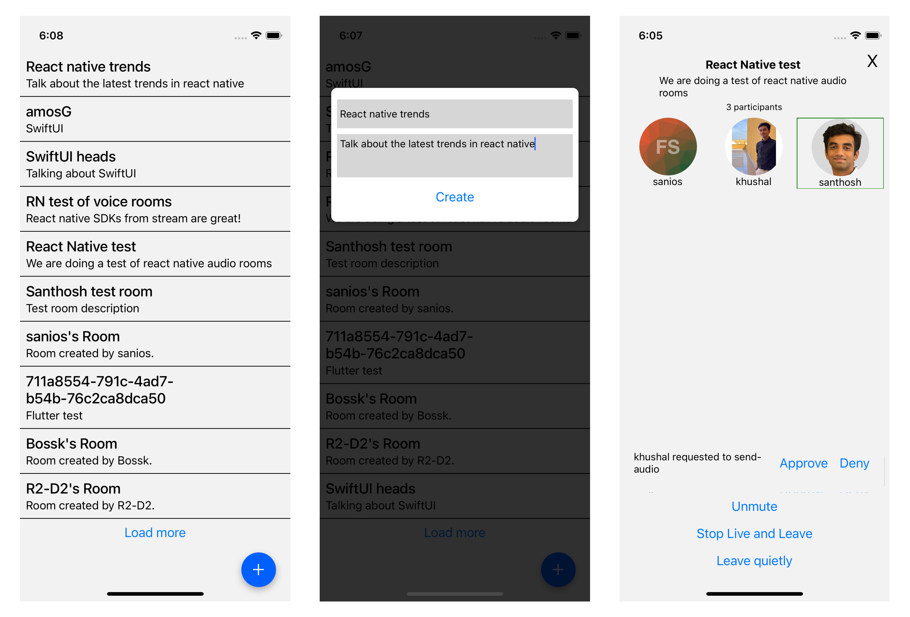
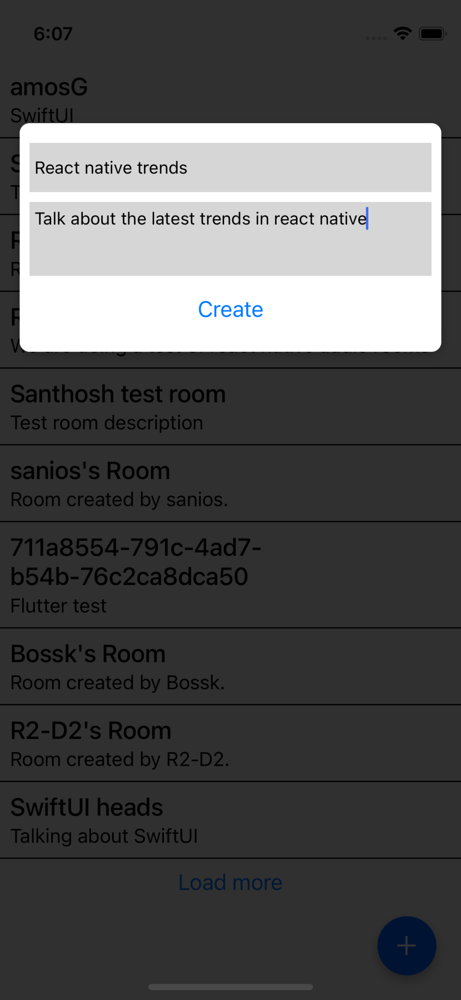
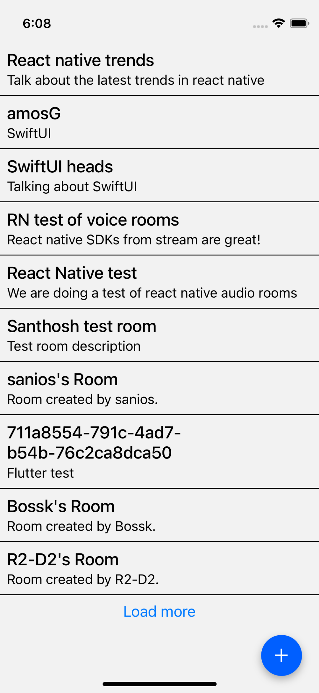
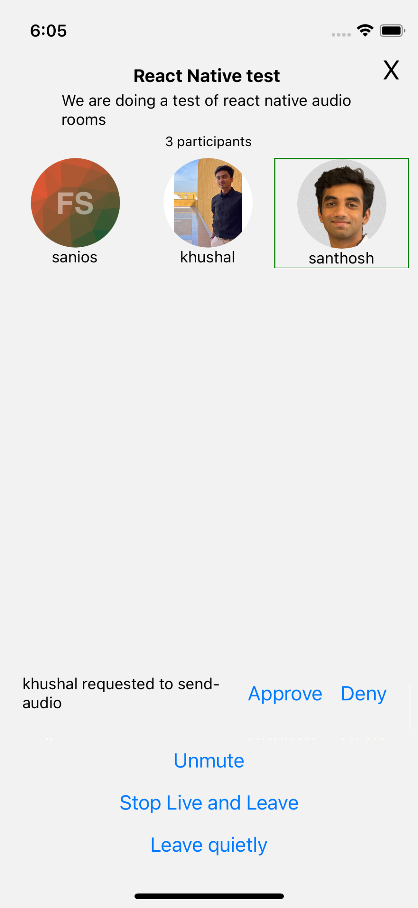

import { TokenSnippet } from '../../../shared/_tokenSnippet.jsx';

This tutorial will teach you how to build an audio room experience like Twitter Spaces or Clubhouse.
The end result will look like the image below and will support the following features:

- Backstage mode. You can start the call with your co-hosts and chat a bit before going live
- Calls run on Stream's global edge network for optimal latency and scalability
- There is no cap to how many listeners you can have in a room
- Listeners can raise their hand, and be invited to speak by the host
- Audio tracks are sent multiple times for optimal reliability



Time to get started building an audio room for your app.

### Step 1 - Setup a new React Native app

Create a new React Native app using the official template,

```bash title=Terminal
npx react-native@latest init StreamAudioRoomExample
cd StreamAudioRoomExample
```

Please follow through the __[SDK installation](../../setup/installation)__ steps to properly setup the SDK and its prerequisites. 
### Step 2 - Create the root component

Let us first add our constants that will be reused in multiple files later. Create a new file `src/constants.ts` and add the following code:

```tsx title="src/constants.ts"
export const apiKey = 'REPLACE_WITH_API_KEY'; // the API key can be found in the "Credentials" section
export const token = 'REPLACE_WITH_TOKEN'; // the token can be found in the "Credentials" section
export const userId = 'REPLACE_WITH_USER_ID'; // the user_id can be found in the "Credentials" section

// initialize the user object
export const user: User = {
  id: userId,
  name: 'Santhosh',
  image: 'https://getstream.io/random_svg/?id=santhosh&name=santhosh',
};
```

Let us create our root component. Open up `src/App.tsx`, and replace it with this code:

```tsx title="src/App.tsx"
import { StreamVideo, StreamVideoClient } from '@stream-io/video-react-native-sdk';
import { apiKey, user, token } from "./constants"
import AudioRoom from './AudioRoom'; // We will introduce the <AudioRoom /> component shortly later

// initialize the StreamVideoClient
const client = new StreamVideoClient({ apiKey, user, token });

export default function App() {
  return (
    <StreamVideo client={client}>
      <AudioRoom />
    </StreamVideo>
  );
}
```

Let's review the code above and go over the details.

#### User setup

First, we create a user object. You typically sync your users via a server-side integration from your own backend.
Alternatively, you can also use guest or anonymous users.

```ts
import type { User } from 'video-react-native-sdk';

const user: User = {
  id: userId,
  name: 'Santhosh',
  image: 'https://getstream.io/random_svg/?id=santhosh&name=santhosh',
};
```

#### Client setup

Next, we initialize the client by passing the API Key, user and user token.

```ts
import { StreamVideoClient } from '@stream-io/video-react-native-sdk';

const client = new StreamVideoClient({ apiKey, user, token });
```

:::note
The `StreamVideoClient` instance establishes the necessary web socket connection and the instance can be accessed by all the children of the `<StreamVideo />` component.
:::
#### Credentials

To actually run this sample we need a valid user token. The user token is typically generated by your server-side API.
When a user logs in to your app you return the user token that gives them access to the call.
To make this tutorial easier to follow we'll generate a user token for you:

Please update **REPLACE_WITH_API_KEY**, ***REPLACE_WITH_USER_ID**, and **REPLACE_WITH_TOKEN** with the actual values shown below:

<TokenSnippet sampleApp='audio-rooms' displayStyle='credentials' />

With valid credentials in place, we can create or join an audio room call.

#### AudioRoom component

The `AudioRoom` component will be our entry point component that shows a list of audio room calls and after a call is selected it shows the audio room. Create a new file `src/AudioRoom.tsx` and replace it with this code:

```ts title="src/AudioRoom.tsx"
import { useState } from 'react';
import Room from './Room'; // We will introduce the <Room /> component later
import RoomList from './RoomList'; // We will introduce the <RoomList /> component later

function AudioRoom() {
  const [call, setCall] = React.useState<Call>();

  if (call) {
    return (
      <StreamCall call={call}>
        <Room onClose={() => setCall(undefined)} />
      </StreamCall>
    );
  }
  return <RoomList setCall={setCall} />;
}

```
:::note
The `<StreamCall />` component is a declarative component wrapper around Call objects. It utilizes the `StreamCallProvider` to make the call and its state available to all child components.
:::

### Step 3 - Add a modal view to create a new audio room call

Let us create a [Modal](https://reactnative.dev/docs/modal) that allows a user to create a new audio room call. Create a new file `src/CreateRoomModal.tsx` and replace it with this code:

```tsx title="src/CreateRoomModal.tsx"
import {
  Call,
  GetOrCreateCallRequest,
  useStreamVideoClient,
} from '@stream-io/video-react-native-sdk';
import React, { useState } from 'react';
import {
  Modal,
  Pressable,
  StyleSheet,
  View,
  Button,
  TextInput,
} from 'react-native';
import { user } from "./constants"

// generate a random id
const generateRoomId = () => Math.random().toString(36).substring(2, 12);

// create payload for creating a new call
const generateRoomPayload = ({
  title,
  description,
}: {
  title?: string;
  description?: string;
}): GetOrCreateCallRequest => {
  return {
    data: {
      members: [{ user_id: user.id, role: 'admin' }],
      custom: {
        title: title || `${user.name}'s Room`,
        description: description || `Room created by ${user.name}.`,
        hosts: [user],
      },
    },
  };
};

type Props = {
  modalVisible: boolean;
  setCall: (call: Call) => void;
  onClose: () => void;
};

export default function CreateRoomModal(props: Props) {
  const client = useStreamVideoClient();

  const [title, setTitle] = useState<string>();
  const [description, setDescription] = useState<string>();

  const createRoom = () => {
    if (!client) {
      return;
    }
    const call = client.call('audio_room', generateRoomId());
    call.getOrCreate(generateRoomPayload({ user, title, description }));
    props.setCall(call);
  };

  return (
    <Modal
      animationType="fade"
      transparent={true}
      visible={props.modalVisible}
      onRequestClose={props.onClose}
    >
      <Pressable style={styles.centeredView} onPress={props.onClose}>
        <View style={styles.modalView}>
          <TextInput
            placeholder={'Type the title of the room'}
            value={title}
            style={styles.textInputTitle}
            autoCorrect={false}
            placeholderTextColor="#808080"
            underlineColorAndroid="transparent"
            onChangeText={setTitle}
          />
          <TextInput
            placeholder={'Type the description of the room'}
            value={description}
            multiline={true}
            autoCorrect={false}
            placeholderTextColor="#808080"
            underlineColorAndroid="transparent"
            style={styles.textInputDescription}
            onChangeText={setDescription}
          />
          <Button onPress={createRoom} title="Create" />
        </View>
      </Pressable>
    </Modal>
  );
}

const styles = StyleSheet.create({
  centeredView: {
    flex: 1,
    paddingTop: 100,
    backgroundColor: '#000000cc',
  },
  modalView: {
    marginHorizontal: 16,
    backgroundColor: 'white',
    borderRadius: 8,
    paddingHorizontal: 8,
    paddingVertical: 16,
    shadowColor: '#000',
    shadowOffset: {
      width: 0,
      height: 2,
    },
    shadowOpacity: 0.25,
    shadowRadius: 4,
    elevation: 5,
  },
  container: {
    padding: 16,
    backgroundColor: 'white',
  },
  textInputTitle: {
    color: 'black',
    padding: 4,
    backgroundColor: '#d6d6d6',
    height: 40,
  },
  textInputDescription: {
    color: 'black',
    marginVertical: 8,
    padding: 4,
    backgroundColor: '#d6d6d6',
    height: 60,
  },
});

```

This is how the modal should look like:



Let's review the code above and go over the details.

#### Create an audio room call

Let us see a simplified example of creating an audio room call to explain further:

```ts
const call = client.call('audio_room', "<random-id>");
call.getOrCreate({
  data: {
    members: [{ user_id: user.id, role: 'admin' }],
    custom: {
      title: "React Native Trends",
      description: "Talk about the latest trends in React Native",
      hosts: [user],
    },
  }
});
```

- This creates a call with the type: `audio_room` with a random id.
- The call is created with the user as the admin and the host.
- Also, we set the `title` and `description` custom field on the call object.

### Step 4 - Add an Audio rooms list

In this step, we show a list of audio rooms. By clicking on a room, the user can join when the room is live and listen to the ongoing conversation. The list also contains a floating action button to open the `CreateRoomModal` component that was added in the previous section.

Create a new file `src/RoomList.tsx` and replace it with this code:

```tsx title="src/RoomList.tsx"
import React, { useCallback, useEffect, useRef, useState } from 'react';
import {
  SafeAreaView,
  Button,
  FlatList,
  FlatListProps,
  Pressable,
  StyleSheet,
  Text,
  View,
} from 'react-native';
import CreateRoomModal from './CreateRoomModal';
  import { Call, useStreamVideoClient } from '@stream-io/video-react-native-sdk';

type RoomFlatList = FlatListProps<Call>;

type Props = {
  setCall: (call: Call) => void;
};

export default function RoomList(props: Props) {
  const { setCall } = props;
  const client = useStreamVideoClient();
  const [showCreateRoomModal, setShowCreateRoomModal] = useState(false);
  const [calls, setCalls] = useState<Call[]>([]);
  // holds the cursor to the next page of calls
  const nextPage = useRef<string>();

  const queryLiveCalls = useCallback(async () => {
    if (!client) {
      return;
    }
    // get all the audio room calls that are not ended and has a title and description set
    try {
      const filterForLiveCalls = {
        type: 'audio_room',
        ended_at: null,
        'custom.title': { $exists: true },
        'custom.description': { $exists: true },
      };
      const result = await client.queryCalls({
        filter_conditions: filterForJoinableCalls,
        sort: [{ field: 'created_at', direction: -1 }], // sort by created order 
        limit: 10,
        watch: true,
        next: nextPage.current,
      });
      nextPage.current = result.next;
      setCalls((prev) => [
        ...prev,
        ...result.calls,
      ]);
    } catch (e) {
      console.log("Error while querying calls", e)
    }
  }, [client]);

  // query live calls on initial render
  const initialRunDoneRef = useRef(false);
  useEffect(() => {
    if (!initialRunDoneRef.current) {
      initialRunDoneRef.current = true;
      queryLiveCalls();
      return;
    }
  }, [queryLiveCalls]);

  const renderItem: NonNullable<RoomFlatList['renderItem']> = useCallback(
    ({ item: callItem }) => {
      return (
        <Pressable
          style={(state) =>
            state.pressed
              ? [styles.callItem, { opacity: 0.2 }]
              : styles.callItem
          }
          key={callItem.id}
          onPress={() => {
            setCall(callItem);
          }}
        >
          <Text style={styles.title}>
            {callItem.data?.custom.title}
          </Text>
          <Text style={styles.subTitle}>
            {callItem.data?.custom.description}
          </Text>
        </Pressable>
      );
    },
    [setCall],
  );

  const renderFooter: RoomFlatList['ListFooterComponent'] = useCallback(
    () =>
      nextPage.current ? (
        <Button
          onPress={queryLiveCalls}
          title="Load more"
        />
      ) : null,
    [queryLiveCalls],
  );

  return (
    <SafeAreaView
      style={styles.container}
    >
      <CreateRoomModal
        modalVisible={showCreateRoomModal}
        onClose={() => setShowCreateRoomModal(false)}
        setCall={setCall}
      />
      <FlatList
        data={calls}
        bounces={false}
        renderItem={renderItem}
        ListFooterComponent={renderFooter}
      />
      <Pressable
        style={styles.fab}
        onPress={() => setShowCreateRoomModal(true)}
      >
        <Text style={styles.fabText}>＋</Text>
      </Pressable>
    </SafeAreaView>
  );
};

const styles = StyleSheet.create({
  container: {
    flex: 1,
  },
  fabText: {
    fontSize: 24,
    color: 'white',
  },
  fab: {
    position: 'absolute',
    width: 48,
    height: 48,
    alignItems: 'center',
    justifyContent: 'center',
    right: 20,
    bottom: 20,
    backgroundColor: appTheme.colors.primary,
    borderRadius: 24,
    shadowColor: '#000',
    shadowOffset: {
      width: 0,
      height: 4,
    },
    shadowOpacity: 0.3,
    shadowRadius: 4.65,
    elevation: 8,
  },
  title: {
    color: "black",
    fontSize: 20,
    fontWeight: '500',
  },
  subTitle: {
    color: "black",
    fontSize: 16,
    marginTop: 2,
  },
  callItem: {
    padding: 8,
    borderBottomWidth: 1,
    borderBottomColor: 'black',
  },
});
```

In this component, we show a list of the audio room calls. We show a button to open the `CreateRoomModal` component that was added in the previous section to be able to create a new audio room. We also show a button to load more calls at the bottom of the list.

This is how the list should look like:



Let's review the component above and go over the details.

#### Querying for live calls

Let us focus on the code above for querying calls that are not in backstage mode:

```ts
const filterForLiveCalls = {
  type: 'audio_room',
  ended_at: null,
  backstage: false,
};
const result = await client.queryCalls({
  filter_conditions: filterForJoinableCalls,
  sort: [{ field: 'created_at', direction: -1 }],
  limit: 10,
  next: nextPage.current,
});
nextPage.current = result.next;
setCalls((prev) => [
  ...prev,
  ...result.calls,
]);
```

- This fetches ten audio room calls that are not in backstage mode and are not ended.
- The calls are sorted in the chronological order of their creation time.
- Also, we support pagination, the next 10 calls can be fetched by calling this again.
- There are more possibilities with querying calls, for example, you can have a list of calls that are in backstage mode for which you are a member of. For more about querying calls head over to __[Querying Calls](../../core/querying-calls)__ page.

### Step 5 - Adding audio room UI elements

In this next step we'll add:

- Room title and description
- A list of participants with their speaking status
- Controls to toggle the live mode on/off and audio on/off
- A list of permission requests​ for the admin

Let's create the components we need to render this and add them to the app

#### Room Title & Description

```tsx title=src/DescriptionPanel.tsx
import { useCallMetadata } from '@stream-io/video-react-native-sdk';
import React from 'react';
import { StyleSheet, Text, View } from 'react-native';

export const DescriptionPanel = () => {
  const metadata = useCallMetadata();
  const custom = metadata?.custom;
  const participantsCount = metadata?.session?.participants?.length ?? 0;

  return (
    <View style={styles.container}>
      <Text style={styles.title}>{custom?.title ?? '<Title>'}</Text>
      <Text style={styles.subtitle}>
        {custom?.description ?? '<Description>'}
      </Text>
      <Text style={styles.participantsCount}>
        {participantsCount} joined participants
      </Text>
    </View>
  );
};

const styles = StyleSheet.create({
  container: {
    paddingVertical: 4,
    marginHorizontal: 32,
    alignItems: 'center',
  },
  title: {
    fontSize: 16,
    color: 'black',
    fontWeight: 'bold',
  },
  subtitle: {
    color: 'black',
    paddingVertical: 4,
    fontSize: 14,
  },
  participantsCount: {
    color: 'black',
    fontSize: 12,
  },
});
```

In this component, we showed the title, description and the number of participants by using the metadata inside the call object.

#### A list of participants with their speaking status

```tsx title=ParticipantsPanel.tsx
import React, { useCallback } from 'react';
import {
  StreamVideoParticipant,
  useParticipants,
} from '@stream-io/video-react-native-sdk';
import { FlatList, FlatListProps, StyleSheet, Text, View } from 'react-native';
import { Avatar } from 'stream-chat-react-native';

type ParticipantFlatList = FlatListProps<StreamVideoParticipant>;

export default function ParticipantsPanel() {
  const participants = useParticipants();
  const renderItem: NonNullable<ParticipantFlatList['renderItem']> =
    useCallback(({ item: participantItem }) => {
      const { isSpeaking } = participantItem;
      return (
        <View
          key={participantItem.sessionId}
          style={[styles.avatar, isSpeaking ? styles.speakingAvatar : null]}
        >
          <Avatar size={80} image={participantItem.image} />
          <Text style={styles.text}>{participantItem.name}</Text>
        </View>
      );
    }, []);

  return (
    <FlatList
      bounces={false}
      style={styles.speakerListContainer}
      numColumns={3}
      data={participants}
      renderItem={renderItem}
    />
  );
}

const styles = StyleSheet.create({
  text: {
    color: 'black',
  },
  speakerListContainer: {
    flex: 1,
    padding: 4,
  },
  avatar: {
    flex: 1,
    alignItems: 'center',
  },
  speakingAvatar: {
    borderWidth: 1,
    borderColor: 'green',
  },
});
```

In this component, we showed a list of participants in three columns. We also show a green border over them if they are speaking.

#### Controls to toggle the live mode on/off and audio on/off

```tsx title=src/ControlsPanel.tsx
import React from 'react';
import { StyleSheet, View } from 'react-native';
import LiveButtons from './LiveButtons'; // we will add this later in the Backstage & Live mode control section
import ToggleAudioButton from './ToggleAudioButton'; // we will add this later in the Muting and Unmuting the audio track section

export default function ControlsPanel() {
  const [callJoined, setCallJoined] = React.useState(false);
  return (
    <View style={styles.container}>
      {callJoined && <ToggleAudioButton />}
      <LiveButtons onJoined={() => setCallJoined(true)} />
    </View>
  );
};

const styles = StyleSheet.create({
  container: {
    alignSelf: 'center',
  },
});
```

That's it for the basics, lets construct the `Room` component like below:

```tsx title=src/Room.tsx
import React, { useEffect } from 'react';
import {
  CallingState,
  useCallCallingState,
} from '@stream-io/video-react-native-sdk';
import { SafeAreaView, Pressable, StyleSheet, Text } from 'react-native';
import ControlsPanel from './ControlsPanel';
import PermissionRequestsPanel from './PermissionRequestsPanel';
import ParticipantsPanel from './ParticipantsPanel';
import DescriptionPanel from './DescriptionPanel';

export default function Room({ onClose }: { onClose: () => void }) {
  const callingState = useCallCallingState();

  // when the component unmounts, leave the call if necessary
  useEffect(() => {
    return () => {
      if (call?.state.callingState !== CallingState.LEFT) {
        call?.leave();
      }
    };
  }, [call]);

  // when the call is left, close the room component
  useEffect(() => {
    if (callingState === CallingState.LEFT) {
      onClose();
    }
  }, [callingState, onClose]);

  // when the call has stopped being live, we need to exit
  useEffect(() => {
    if (!call) {
      return;
    }

    return call.on('error', (e) => {
      if (e.eventPayload.oneofKind !== 'error') {
        return;
      }
      if (e.eventPayload.error.error?.code !== SfuModels.ErrorCode.LIVE_ENDED) {
        return;
      }
      if (
        !call.permissionsContext.hasPermission(OwnCapability.JOIN_BACKSTAGE)
      ) {
        onClose();
      }
    });
  }, [call, onClose]);

  return (
    <SafeAreaView
      style={styles.container}
    >
      <DescriptionPanel />
      <ParticipantsPanel />
      <ControlsPanel />
      <PermissionRequestsPanel />
      <Pressable
        onPress={onClose}
        style={(state) =>
          state.pressed
            ? [styles.closeButton, { opacity: 0.2 }]
            : styles.closeButton
        }
      >
        <Text style={styles.closeText}>X</Text>
      </Pressable>
    </SafeAreaView>
  );
}

const styles = StyleSheet.create({
  container: {
    flex: 1,
    padding: 4,
  },
  closeButton: {
    position: 'absolute',
    top: 48,
    right: 16,
  },
  closeText: {
    fontSize: 24,
    color: 'black',
  },
});
```

The approach is the same for all components.
We take the states of the call by observing `call.state` updates through the SDK provided hooks,
such as `useParticipants()` or `useCallMetadata()` and use it to power our UI.

:::note
In React, all `call.state` properties can be accessed via a set of utility hooks.
This makes it easier to build UI components that react to changes in the call state.

Read more about it at [Call & Participant State](../../core/call-and-participant-state).
:::

#### Backstage & Live mode control

As you probably noticed by opening a room from the app, audio rooms by default are not live.
Regular users can only join an audio room when it is in live mode.
Let's expand the `ControlPanel` and add a button that controls the backstage of the room.

```tsx title=src/LiveButtons.tsx
import {
  CallingState,
  OwnCapability,
  Restricted,
  useCall,
  useCallCallingState,
  useIsCallLive,
} from '@stream-io/video-react-native-sdk';
import React from 'react';
import { Button } from 'react-native';

export default function LiveButtons({ onJoined }: { onJoined: () => void }) {
  // this utility hook returns the call object from the <StreamCall /> context
  const call = useCall();
  // this utility hook is a wrapper around the `call.state.metadata$` observable,
  // and it will emit a new value whenever the call goes live or stops being live.
  // we can use it to update the button text or adjust any other UI elements
  const isLive = useIsCallLive();

  const callingState = useCallCallingState();

  const canJoin = ![
    CallingState.JOINING,
    CallingState.JOINED,
    CallingState.LEFT,
  ].includes(callingState);

  const hasJoined = callingState === CallingState.JOINED;

  if (!call) {
    return null;
  }

  return (
    <>
      {isLive && (
        <>
          <Restricted
            hasPermissionsOnly
            requiredGrants={[OwnCapability.END_CALL]}
          >
            <Button
              title={'Stop Live and Leave'}
              onPress={async () => {
                try {
                  await call.stopLive();
                  await call.leave();
                } catch (error) {
                  console.log('Error Stop Live:', error);
                }
              }}
            />
          </Restricted>
          {canJoin && (
            <Button
              title={'Join the live call'}
              onPress={async () => {
                try {
                  await call.join();
                  onJoined();
                } catch (error) {
                  console.log('Error joining call:', error);
                }
              }}
            />
          )}
        </>
      )}
      {!isLive && (
        <Restricted
          hasPermissionsOnly
          requiredGrants={[OwnCapability.JOIN_BACKSTAGE]}
        >
          <Button
            title={'Start Live and Join'}
            onPress={async () => {
              try {
                await call.goLive();
                await call.join();
                onJoined();
              } catch (error) {
                console.log('Error Start Live and Join:', error);
              }
            }}
          />
        </Restricted>
      )}
      {hasJoined && (
        <Button
          title={'Leave quietly'}
          onPress={async () => {
            try {
              await call.leave();
            } catch (error) {
              console.log('Error leaving call:', error);
            }
          }}
        />
      )}
    </>
  );
}
```

In this component we do the following:

- If the user has the permission to end call or go live we show the buttons to go live or stop being live accordingly.
- If the user doesn't have the above permissions he is showed the join button if the call is live.
- If the call was joined, the user is also shown a button to leave quietly.

#### Muting and Un-muting the audio track

While we're at it, let's also add a button that allows to mute/un-mute the local audio track:

```tsx title=src/ToggleAudioButton.tsx
import {
  OwnCapability,
  SfuModels,
  useCall,
  useConnectedUser,
  useHasPermissions,
  useIncallManager,
  useLocalParticipant,
  useMediaStreamManagement,
} from '@stream-io/video-react-native-sdk';
import React, { useEffect, useState } from 'react';
import { Button } from 'react-native';

export default function ToggleAudioButton() {
  // start incall manager in audio only mode
  useIncallManager({ media: 'audio', auto: true });

  const { publishAudioStream, stopPublishingAudio } =
    useMediaStreamManagement();
  const call = useCall();
  const connectedUser = useConnectedUser();

  const localParticipant = useLocalParticipant();
  const isMuted = !localParticipant?.publishedTracks.includes(
    SfuModels.TrackType.AUDIO,
  );
  const hasPermission = useHasPermissions(OwnCapability.SEND_AUDIO);
  const canRequestSpeakingPermissions = call?.permissionsContext.canRequest(
    OwnCapability.SEND_AUDIO,
  );
  const [isAwaitingAudioApproval, setIsAwaitingAudioApproval] = useState(false);

  let title = 'Mute';
  if (!hasPermission) {
    title = 'Ask permission to send audio';
  } else if (isMuted) {
    title = 'Unmute';
  }

  useEffect(() => {
    if (!(call && connectedUser)) {
      return;
    }
    return call.on('call.permissions_updated', (event) => {
      if (event.type !== 'call.permissions_updated') {
        return;
      }
      if (connectedUser.id !== event.user.id) {
        return;
      }
      setIsAwaitingAudioApproval(false);
      // automatically publish/unpublish audio stream based on the new permissions
      if (event.own_capabilities.includes(OwnCapability.SEND_AUDIO)) {
        publishAudioStream();
      } else {
        stopPublishingAudio();
      }
    });
  }, [call, connectedUser, publishAudioStream, stopPublishingAudio]);

  if (
    isAwaitingAudioApproval ||
    (!canRequestSpeakingPermissions && !hasPermission)
  ) {
    return null;
  }

  const onPress = () => {
    if (!hasPermission) {
      setIsAwaitingAudioApproval(true);
      call
        ?.requestPermissions({
          permissions: [OwnCapability.SEND_AUDIO],
        })
        .catch((err) => {
          setIsAwaitingAudioApproval(false);
          console.log('RequestPermissions failed', err);
        });
    } else if (isMuted) {
      publishAudioStream().catch((err) => {
        console.error('Error publishing audio stream', err);
      });
    } else {
      stopPublishingAudio();
    }
  };
  return <Button title={title} onPress={onPress} />;
}
```

In this component, if the user taps on the button, we ask the permission to send audio to the admin if it is not present. If the permission was present, we allow the user to mute or unmute their audio.

#### A list of permission requests​ for the admin

Let us add a component to that shows the incoming permission requests as well as the buttons to grant / reject it.

```tsx title=src/PermissionRequestsPanel.tsx
import {
  OwnCapability,
  PermissionRequestEvent,
  useCall,
  useHasPermissions,
} from '@stream-io/video-react-native-sdk';
import React, { useEffect, useState } from 'react';
import { Text, Button, ScrollView, StyleSheet, View } from 'react-native';

export const PermissionRequestsPanel = () => {
  const call = useCall();
  const canUpdatePermissions = useHasPermissions(
    OwnCapability.UPDATE_CALL_PERMISSIONS,
  );
  const [speakingRequests, setSpeakingRequests] = useState<
    PermissionRequestEvent[]
  >([]);

  const handlePermissionRequest = async (
    request: PermissionRequestEvent,
    approve: boolean,
  ) => {
    const { user, permissions } = request;
    try {
      if (approve) {
        await call?.grantPermissions(user.id, permissions);
      } else {
        await call?.revokePermissions(user.id, permissions);
      }
      setSpeakingRequests((reqs) => reqs.filter((req) => req !== request));
    } catch (err) {
      console.error('Error granting or revoking permissions', err);
    }
  };

  useEffect(() => {
    if (!(call && canUpdatePermissions)) {
      return;
    }
    return call.on('call.permission_request', (event) => {
      if (event.type !== 'call.permission_request') {
        return;
      }
      setSpeakingRequests((prevSpeakingRequests) => [
        ...prevSpeakingRequests,
        event,
      ]);
    });
  }, [call, canUpdatePermissions]);

  if (!canUpdatePermissions || !speakingRequests.length) {
    return null;
  }

  return (
    <ScrollView style={styles.scrollContainer}>
      {speakingRequests.map((request) => (
        <View style={styles.itemContainer} key={request.user.id}>
          <Text style={styles.text} numberOfLines={2} ellipsizeMode="tail">
            {`${request.user.name} requested to ${request.permissions.join(
              ',',
            )}`}
          </Text>
          <Button
            title="Approve"
            onPress={() => handlePermissionRequest(request, true)}
          />
          <Button
            title="Deny"
            onPress={() => handlePermissionRequest(request, false)}
          />
        </View>
      ))}
    </ScrollView>
  );
};

const styles = StyleSheet.create({
  scrollContainer: {
    width: '100%',
    maxHeight: 60,
  },
  text: {
    flexShrink: 1,
  },
  itemContainer: {
    flexDirection: 'row',
    justifyContent: 'space-between',
    alignItems: 'center',
    paddingHorizontal: 16,
    width: '100%',
  },
});
```

In the above component, we show a list of permission requests along with button to approve or deny if the user has the permission to update permissions of other users in the call.

Finally once all the dependent components for the `Room` component are added. This is how the `Room` component would look like:


## Other built-in features

There are a few more exciting features that you can use to build audio rooms

- [**Reactions & Custom events:**](../../core/reactions-and-custom-events/) Reactions and custom events are supported.
- **Call Previews:** Before you join the call you can observe the participants and show a preview
- **Chat:** Stream's chat SDKs are fully featured and you can integrate them in the call
- **Moderation:** Moderation capabilities are built-in to the product
- **Transcriptions:** Transcriptions aren't available yet, but they are due to launch soon

## Recap

It was fun to see just how quickly you can build an audio-room for your app.
Please do let us know if you ran into any issues.
Our team is also happy to review your UI designs and offer recommendations on how to achieve it with Stream.

To recap what we've learned:

- You set up a call with `const call = client.call('audio_room', '123')`
- The call type `audio_room` controls which features are enabled and how permissions are set up
- The `audio_room` by default enables `backstage` mode, and only allows admins and the creator of the call to join before the call goes live
- When you join a call, real-time communication is set up for audio & video calling: `await call.join()`
- Call state `call.state` and helper state access hooks make it easy to build your own UI
- Calls run on Stream's global edge network of video servers. Being closer to your users improves the latency and reliability of calls. For audio rooms we use Opus RED and Opus DTX for optimal audio quality.

The SDKs enable you to build audio rooms, video calling and live-streaming in days.

We hope you've enjoyed this tutorial and please do feel free to reach out if you have any suggestions or questions.
