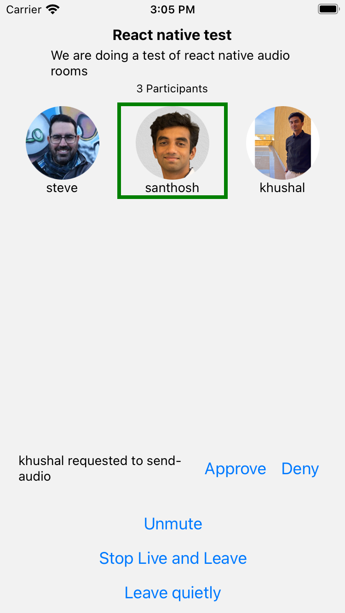
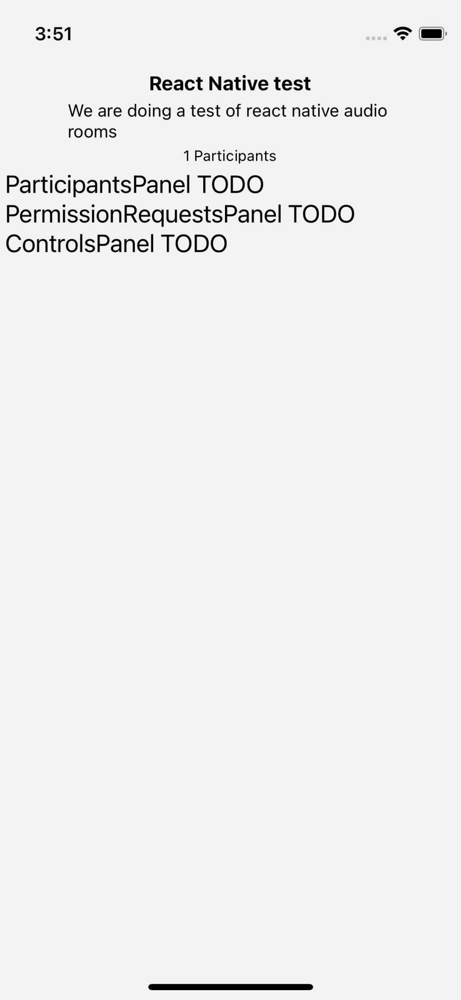
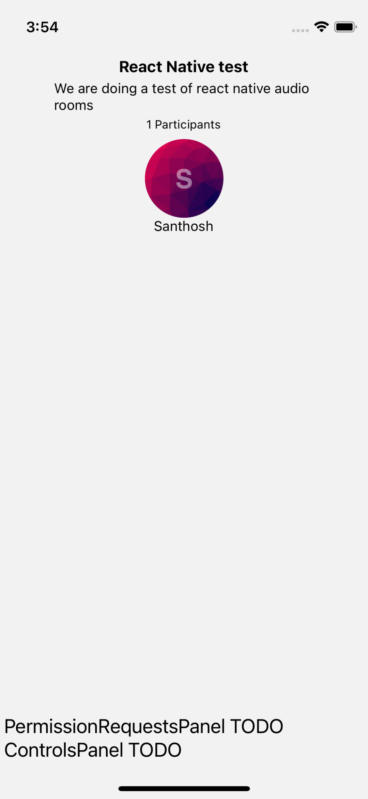
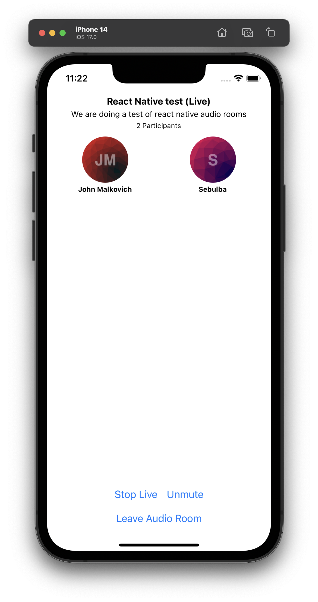
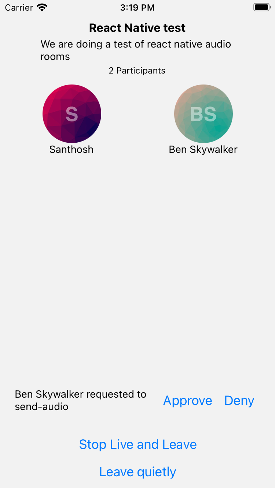

import { TokenSnippet } from '../../../shared/_tokenSnippet.jsx';

This tutorial will teach you how to build an audio room experience like Twitter Spaces or Clubhouse.
The end result will look like the image below and will support the following features:

- Backstage mode. You can start the call with your co-hosts and chat a bit before going live
- Calls run on Stream's global edge network for optimal latency and scalability
- There is no cap to how many listeners you can have in a room
- Listeners can raise their hand, and be invited to speak by the host
- Audio tracks are sent multiple times for optimal reliability



Time to get started building an audio room for your app.

### Step 1 - Setup a new React Native app

Create a new React Native app using the official template,

```bash title=Terminal
npx react-native@latest init AudioRoomExample
cd AudioRoomExample
```

### Step 2 - Install the SDK and declare permissions

In order to install the Stream Video React Native SDK, run the following command in your terminal of choice:

```bash title=Terminal
yarn add @stream-io/video-react-native-sdk
```

The SDK requires installing some peer dependencies. You can run the following command to install them:

```bash title=Terminal
yarn add react-native-webrtc react-native-device-info \
   react-native-incall-manager react-native-svg \
   @react-native-community/netinfo @notifee/react-native
npx pod-install
```

#### Declare permissions

#### iOS

Add the following keys and values to `Info.plist` file:

- `Privacy - Microphone Usage Description` - "`AudioRoomExample` requires microphone access to capture and transmit audio"

#### Android

In `AndroidManifest.xml` add the following permissions before the `<application>` section.

```xml
<uses-feature android:name="android.hardware.audio.output" />
<uses-feature android:name="android.hardware.microphone" />

<uses-permission android:name="android.permission.RECORD_AUDIO" />
<uses-permission android:name="android.permission.ACCESS_NETWORK_STATE" />
<uses-permission android:name="android.permission.CHANGE_NETWORK_STATE" />
<uses-permission android:name="android.permission.MODIFY_AUDIO_SETTINGS" />
<uses-permission android:name="android.permission.INTERNET" />
```

If you plan to also support Bluetooth devices then also add the following.

```xml
<uses-permission android:name="android.permission.BLUETOOTH" android:maxSdkVersion="30" />
<uses-permission android:name="android.permission.BLUETOOTH_ADMIN" android:maxSdkVersion="30" />
<uses-permission android:name="android.permission.BLUETOOTH_CONNECT" />
```

:::note
For simplicity, in this tutorial, we do not cover about managing native runtime permissions. Before starting the next step, ensure that microphone permissions are given for this app by granting them in the native settings app. We have discussed a detailed solution to manage native runtime permissions in the [Manage Native Permissions](../../core/native-permissions) guide.
:::

#### Android Specific installation

In `android/app/build.gradle` add the following inside the `android` section:

```
compileOptions {
	sourceCompatibility JavaVersion.VERSION_1_8
	targetCompatibility JavaVersion.VERSION_1_8
}
```

In `android/gradle.properties` add the following:

```
android.enableDexingArtifactTransform.desugaring=false
```
### Step 3 - Create & Join a call​

Open up `src/App.tsx` and replace it with this code:

```tsx title="src/App.tsx"
import {
  StreamVideoClient,
  Call,
  CallingState,
  StreamVideo,
  StreamCall,
  User,
} from '@stream-io/video-react-native-sdk';
import React, { useState, useEffect } from 'react';
import { SafeAreaView, Text } from 'react-native';

StreamVideoRN.setPermissions({
  isMicPermissionGranted: true, // for simplicity, we assume that permission was granted through the native settings app
});

const apiKey = 'REPLACE_WITH_API_KEY'; // the API key can be found in the "Credentials" section
const token = 'REPLACE_WITH_TOKEN'; // the token can be found in the "Credentials" section
const userId = 'REPLACE_WITH_USER_ID'; // the user_id can be found in the "Credentials" section
const callId = 'REPLACE_WITH_CALL_ID'; // the call_id can be found in the "Credentials" section

// initialize the user object
const user: User = {
  id: userId,
  name: 'Santhosh',
  image: `https://getstream.io/random_png/?id=${userId}&name=Santhosh`,
};

export default function App() {
  const [client, setClient] = useState<StreamVideoClient>();
  const [call, setCall] = useState<Call>();
  useEffect(() => {
    const _client = new StreamVideoClient({
      apiKey,
      token,
      user,
    });
    setClient(_client);

    return () => {
      _client.disconnectUser();
      setClient(undefined);
    };
  }, []);

  useEffect(() => {
    if (!client) {
      return;
    }
    const _call = client.call('audio_room', callId);
    _call
      .join({
        create: true,
        data: {
          members: [{ user_id: 'john_smith' }, { user_id: 'jane_doe' }],
          custom: {
            title: 'React Native test',
            description: 'We are doing a test of react native audio rooms',
          },
        },
      })
      .catch((err) => {
        console.error('Error joining the call', err);
        setCall(undefined);
      })
      .then(() => {
        console.log('Successfully joined the call');
      });
    setCall(_call);

    return () => {
      if (_call.state.callingState !== CallingState.LEFT) {
        _call.leave();
      }
      setCall(undefined);
    };
  }, [client]);

  if (!client || !call) {
    return null;
  }

  return (
    <StreamVideo client={client} language="en">
      <StreamCall call={call}>
        <SafeAreaView>
          <Text style={{ fontSize: 30, color: 'black' }}>Ready to render Audio room</Text>
        </SafeAreaView>
      </StreamCall>
    </StreamVideo>
  );
}
```

Let's review the code above and go over the details.

#### User setup

First, we create a user object. You typically sync your users via a server-side integration from your own backend.
Alternatively, you can also use guest or anonymous users.

```ts
import type { User } from '@stream-io/video-react-native-sdk';

const user: User = {
  id: userId,
  name: 'Santhosh',
  image: `https://getstream.io/random_png/?id=${userId}&name=Santhosh`,
};
```

#### Client setup

Next, we initialize the client by passing the API Key, user and user token.

```ts
import { StreamVideoClient } from '@stream-io/video-react-native-sdk';

const [client, setClient] = useState<StreamVideoClient>();

useEffect(() => {
  const _client = new StreamVideoClient({
    apiKey,
    token,
    user,
  });
  setClient(_client);

  return () => {
    client.disconnectUser();
    setClient(undefined);
  };
}, []);
```
#### Create and join call​

After the user and client are created, we create a call like this:

```ts
const [call, setCall] = useState<Call>();
useEffect(() => {
  if (!client) {
    return;
  }
  const _call = client.call('audio_room', callId);
  _call
    .join({
      create: true,
      data: {
        members: [{ user_id: 'john_smith' }, { user_id: 'jane_doe' }],
        custom: {
          title: 'React Native test',
          description: 'We are doing a test of react native audio rooms',
        },
      },
    })
    .catch((err) => {
      console.error(`Error joining the call`, err);
      setCall(undefined);
    })
    .then(() => {
      console.log(`Successfully joined the call`);
    });
  setCall(_call);

  return () => {
    if (_call.state.callingState !== CallingState.LEFT) {
      _call.leave();
    }
    setCall(undefined);
  };
}, [client]);
```

- This joins and creates a call with the type: `audio_room` and the specified `callId`
- The users with id `john_smith` and `jane_doe` are added as members to the call
- And we set the `title` and `description` custom field on the call object

#### Credentials

To actually run this sample we need a valid user token. The user token is typically generated by your server-side API.
When a user logs in to your app you return the user token that gives them access to the call.
To make this tutorial easier to follow we'll generate a user token for you:

Please update **REPLACE_WITH_API_KEY**, **REPLACE_WITH_TOKEN**, **REPLACE_WITH_USER_ID** and **REPLACE_WITH_CALL_ID** with the actual values shown below:

<TokenSnippet sampleApp="audio-rooms" displayStyle="credentials" />

With valid credentials in place, we can join the audio room call. When you run the app you'll see the following:


### Step 4 - Adding Audio Room and Description

Now that we've successfully connected to the audio room. Let's setup a basic UI and description. Add a `AudioRoom` component to the main app component:

```ts title="src/App.tsx"
// ... omitted imports
import AudioRoom from './AudioRoom';

export default function App() {
  // ... omitted code
  return (
    <StreamVideo client={client}>
      <StreamCall call={call}>
        // highlight-next-line
        <AudioRoom />
      </StreamCall>
    </StreamVideo>
  );
}
```

You would have noticed that we haven't created the `AudioRoom` component. Let us do that now:

```tsx title=src/AudioRoom.tsx
import React, { useEffect } from 'react';
import { SafeAreaView, StyleSheet, Text } from 'react-native';
import DescriptionPanel from './DescriptionPanel';

export default function AudioRoom() {
  return (
    <SafeAreaView style={styles.container}>
      <DescriptionPanel />
      <ParticipantsPanel />
      <ControlsPanel />
      <PermissionRequestsPanel />
    </SafeAreaView>
  );

  const styles = StyleSheet.create({
    container: {
      flex: 1,
      padding: 4,
    },
  });

  // except for DescriptionPanel component we will put every other panels in TODO for now
  const ParticipantsPanel = () => (
    <Text style={{ fontSize: 20, color: 'black' }}>ParticipantsPanel TODO</Text>
  );

  const ControlsPanel = () => (
    <Text style={{ fontSize: 20, color: 'black' }}>ControlsPanel TODO</Text>
  );
  const PermissionRequestsPanel = () => (
    <Text style={{ fontSize: 20, color: 'black' }}>PermissionRequestsPanel TODO</Text>
  );
}
```

Let us add the component to show the call descriptions:

```tsx title=src/DescriptionPanel.tsx
import { useCallMetadata } from '@stream-io/video-react-native-sdk';
import React from 'react';
import { StyleSheet, Text, View, Pressable } from 'react-native';

export const DescriptionPanel = () => {
  const metadata = useCallMetadata();
  const custom = metadata?.custom;
  const participantsCount = metadata?.session?.participants?.length ?? 0;

  return (
    <View style={styles.container}>
      <Text style={styles.title}>{custom?.title ?? '<Title>'}</Text>
      <Text style={styles.subtitle}>
        {custom?.description ?? '<Description>'}
      </Text>
      <Text style={styles.participantsCount}>
        {`${participantsCount} Participants`}
      </Text>
    </View>
  );
};

const styles = StyleSheet.create({
  container: {
    paddingVertical: 4,
    paddingHorizontal: 32,
    alignItems: 'center',
  },
  title: {
    fontSize: 16,
    color: 'black',
    fontWeight: 'bold',
  },
  subtitle: {
    color: 'black',
    paddingVertical: 4,
    fontSize: 14,
  },
  participantsCount: {
    color: 'black',
    fontSize: 12,
  },
});
```

In this component, we showed the title, description and the number of participants by using the metadata inside the call object.

That's it for the basics. Now when you run your app, you'll see the following UI:



### Step 5 - Adding a list of participants with their speaking status

Let's add the `ParticipantsPanel` component:

```tsx title=ParticipantsPanel.tsx
import React, { useCallback } from 'react';
import {
  StreamVideoParticipant,
  useParticipants,
} from '@stream-io/video-react-native-sdk';
import {
  FlatList,
  FlatListProps,
  StyleSheet,
  Text,
  View,
  Image,
} from 'react-native';

type ParticipantFlatList = FlatListProps<StreamVideoParticipant>;

export function ParticipantsPanel() {
  const participants = useParticipants();
  const renderItem: NonNullable<ParticipantFlatList['renderItem']> =
    useCallback(({ item: participantItem }) => {
      const { isSpeaking } = participantItem;
      return (
        <View
          key={participantItem.sessionId}
          style={[styles.avatar, isSpeaking ? styles.speakingAvatar : null]}
        >
          <Image style={styles.image} source={{ uri: participantItem.image }} />
          <Text style={styles.text}>{participantItem.name}</Text>
        </View>
      );
    }, []);

  return (
    <FlatList
      bounces={false}
      style={styles.speakerListContainer}
      numColumns={3}
      data={participants}
      renderItem={renderItem}
    />
  );
}

const styles = StyleSheet.create({
  text: {
    color: 'black',
  },
  speakerListContainer: {
    flex: 1,
    padding: 4,
  },
  avatar: {
    flex: 1,
    alignItems: 'center',
    borderWidth: 4,
    borderColor: 'transparent',
  },
  image: {
    width: 80,
    height: 80,
    borderRadius: 40,
  },
  speakingAvatar: {
    borderColor: 'green',
  },
});
```

In this component, we showed a list of participants in three columns. We also show a green border over them if they are speaking.

After importing and using this component in `AudioRoom`, when you run your app, you'll see the following UI:



### Step 6 - Adding controls to toggle the live mode on/off and audio on/off
#### Backstage & Live mode control

Let's add buttons to control the backstage of the room.

```tsx title=src/LiveButtons.tsx
import {
  OwnCapability,
  Restricted,
  useCall,
  useIsCallLive,
} from '@stream-io/video-react-native-sdk';
import React from 'react';
import { Button } from 'react-native';

export default function LiveButtons() {
  // this utility hook returns the call object from the <StreamCall /> context
  const call = useCall();
  // this utility hook is a wrapper around the `call.state.metadata$` observable,
  // and it will emit a new value whenever the call goes live or stops being live.
  // we can use it to update the button text or adjust any other UI elements
  const isLive = useIsCallLive();

  return (
    <>
      {isLive && (
        <Restricted
          hasPermissionsOnly
          requiredGrants={[OwnCapability.END_CALL]}
        >
          <Button
            title={'Stop Live and Leave'}
            onPress={async () => {
              try {
                await call.stopLive();
                await call.leave();
              } catch (error) {
                console.log('Error Stop Live:', error);
              }
            }}
          />
        </Restricted>
      )}
      {!isLive && (
        <Restricted
          hasPermissionsOnly
          requiredGrants={[OwnCapability.JOIN_BACKSTAGE]}
        >
          <Button
            title={'Start Live'}
            onPress={async () => {
              try {
                await call.goLive();
              } catch (error) {
                console.log('Error Start Live:', error);
              }
            }}
          />
        </Restricted>
      )}
      <Button
        title={'Leave quietly'}
        onPress={async () => {
          try {
            await call.leave();
          } catch (error) {
            console.log('Error leaving call:', error);
          }
        }}
      />
    </>
  );
}
```

In this component we do the following:

- If the user has the permission to end call or go live we show the buttons to go live or stop being live accordingly.
- The user is also shown a button to leave quietly without stopping the call being live.

#### Muting, Un-muting the audio track and requesting permission to send audio

Requesting permission to send audio is easy. Let's first have a quick look at how the SDK call object exposes this:

```ts
import { OwnCapability } from '@stream-io/video-react-sdk';

await call.requestPermissions({
  permissions: [OwnCapability.SEND_AUDIO],
});
```

Let's add a button to mute or un-mute the local audio track and ask permission to send audio if necessary:

```tsx title=src/ToggleAudioButton.tsx
import {
  OwnCapability,
  SfuModels,
  useCall,
  useConnectedUser,
  useHasPermissions,
  useIncallManager,
  useLocalParticipant,
  useMediaStreamManagement,
} from '@stream-io/video-react-native-sdk';
import React, { useEffect, useState } from 'react';
import { Button } from 'react-native';

export default function ToggleAudioButton() {
  // start incall manager in audio only mode
  useIncallManager({ media: 'audio', auto: true });

  const { publishAudioStream, stopPublishingAudio } =
    useMediaStreamManagement();
  const call = useCall();
  const connectedUser = useConnectedUser();

  const localParticipant = useLocalParticipant();
  const isMuted = !localParticipant?.publishedTracks.includes(
    SfuModels.TrackType.AUDIO,
  );
  const hasPermission = useHasPermissions(OwnCapability.SEND_AUDIO);
  const canRequestSpeakingPermissions = call?.permissionsContext.canRequest(
    OwnCapability.SEND_AUDIO,
  );
  const [isAwaitingAudioApproval, setIsAwaitingAudioApproval] = useState(false);

  let title = 'Mute';
  if (!hasPermission) {
    title = 'Ask permission to send audio';
  } else if (isMuted) {
    title = 'Unmute';
  }

  useEffect(() => {
    if (!(call && connectedUser)) {
      return;
    }
    return call.on('call.permissions_updated', (event) => {
      if (event.type !== 'call.permissions_updated') {
        return;
      }
      if (connectedUser.id !== event.user.id) {
        return;
      }
      setIsAwaitingAudioApproval(false);
      // automatically publish/unpublish audio stream based on the new permissions
      if (event.own_capabilities.includes(OwnCapability.SEND_AUDIO)) {
        publishAudioStream();
      } else {
        stopPublishingAudio();
      }
    });
  }, [call, connectedUser, publishAudioStream, stopPublishingAudio]);

  if (
    isAwaitingAudioApproval ||
    (!canRequestSpeakingPermissions && !hasPermission)
  ) {
    return null;
  }

  const onPress = () => {
    if (!hasPermission) {
      setIsAwaitingAudioApproval(true);
      call
        ?.requestPermissions({
          permissions: [OwnCapability.SEND_AUDIO],
        })
        .catch((err) => {
          setIsAwaitingAudioApproval(false);
          console.log('RequestPermissions failed', err);
        });
    } else if (isMuted) {
      publishAudioStream().catch((err) => {
        console.error('Error publishing audio stream', err);
      });
    } else {
      stopPublishingAudio();
    }
  };
  return <Button title={title} onPress={onPress} />;
}
```

In this component, if the user taps on the button, we ask the permission to send audio to the admin if it is not present. If the permission was present, we allow the user to mute or un-mute their audio.

#### The enclosing panel component

Finally, we use both the buttons in the `ControlsPanel` component:

```tsx title=src/ControlsPanel.tsx
import React from 'react';
import { StyleSheet, View } from 'react-native';
import LiveButtons from './LiveButtons';
import ToggleAudioButton from './ToggleAudioButton';

export default function ControlsPanel() {
  return (
    <View style={styles.container}>
      <ToggleAudioButton />
      <LiveButtons />
    </View>
  );
}

const styles = StyleSheet.create({
  container: {
    alignSelf: 'center',
  },
});
```

After importing and using this component in `AudioRoom`, when you run your app, you'll see the following UI:



To make this a little more interactive. And then, join the audio room from your browser.

<TokenSnippet sampleApp="audio-rooms" displayStyle="join" />

At first you won't be allowed to join the room since it's not live yet. By default the `audio_room` call type has backstage mode enabled. This makes it easy to try out your room and talk to your co-hosts before going live. You can enable or disable the usage of backstage mode in the dashboard.

Let's go live and join the call:

1. Press the start live button on your app
2. On web join the room
3. You'll see the participant count increase to 2


### Step 7 - A list of permission requests​ for the admin

Handling permission requests​ is easy. Let's first have a quick look at how the SDK call object exposes this:

```ts
import type { PermissionRequestEvent } from '@stream-io/video-react-sdk';

call.on(
  'call.permission_requested',
  async (request: PermissionRequestEvent) => {
    // get the permission request data
    const { user, permissions } = request;

    // reject it
    await call.revokePermissions(user.id, permissions);

    // grant it
    await call.grantPermissions(user.id, permissions);
  },
);
```

Let us add a component to that shows the incoming permission requests as well as the buttons to grant / reject it.

```tsx title=src/PermissionRequestsPanel.tsx
import {
  OwnCapability,
  PermissionRequestEvent,
  useCall,
  useHasPermissions,
} from '@stream-io/video-react-native-sdk';
import React, { useEffect, useState } from 'react';
import { Text, Button, ScrollView, StyleSheet, View } from 'react-native';

export const PermissionRequestsPanel = () => {
  const call = useCall();
  const canUpdatePermissions = useHasPermissions(
    OwnCapability.UPDATE_CALL_PERMISSIONS,
  );
  const [speakingRequests, setSpeakingRequests] = useState<
    PermissionRequestEvent[]
  >([]);

  const handlePermissionRequest = async (
    request: PermissionRequestEvent,
    approve: boolean,
  ) => {
    const { user, permissions } = request;
    try {
      if (approve) {
        await call?.grantPermissions(user.id, permissions);
      } else {
        await call?.revokePermissions(user.id, permissions);
      }
      setSpeakingRequests((reqs) => reqs.filter((req) => req !== request));
    } catch (err) {
      console.error('Error granting or revoking permissions', err);
    }
  };

  useEffect(() => {
    if (!(call && canUpdatePermissions)) {
      return;
    }
    return call.on('call.permission_request', (event) => {
      if (event.type !== 'call.permission_request') {
        return;
      }
      setSpeakingRequests((prevSpeakingRequests) => [
        ...prevSpeakingRequests,
        event,
      ]);
    });
  }, [call, canUpdatePermissions]);

  if (!canUpdatePermissions || !speakingRequests.length) {
    return null;
  }

  return (
    <ScrollView style={styles.scrollContainer}>
      {speakingRequests.map((request) => (
        <View style={styles.itemContainer} key={request.user.id}>
          <Text style={styles.text} numberOfLines={2} ellipsizeMode="tail">
            {`${request.user.name} requested to ${request.permissions.join(
              ',',
            )}`}
          </Text>
          <Button
            title="Approve"
            onPress={() => handlePermissionRequest(request, true)}
          />
          <Button
            title="Deny"
            onPress={() => handlePermissionRequest(request, false)}
          />
        </View>
      ))}
    </ScrollView>
  );
};

const styles = StyleSheet.create({
  scrollContainer: {
    width: '100%',
    maxHeight: 60,
  },
  text: {
    flexShrink: 1,
  },
  itemContainer: {
    flexDirection: 'row',
    justifyContent: 'space-between',
    alignItems: 'center',
    paddingHorizontal: 16,
    width: '100%',
  },
});
```

In the above component, we show a list of permission requests along with button to approve or deny if the user has the permission to update permissions of other users in the call.

Now, from web ask for permission to send audio. After importing and using this component in `AudioRoom`, when you run your app, you'll see the following UI:



## Other built-in features

There are a few more exciting features that you can use to build audio rooms

- [**Query Calls::**](../../core/querying-calls/) You can query calls to easily show upcoming calls, calls that recently finished as well as call previews.
- [**Reactions & Custom events:**](../../core/reactions-and-custom-events/) Reactions and custom events are supported.
- **Chat:** Stream's chat SDKs are fully featured and you can integrate them in the call
- **Moderation:** Moderation capabilities are built-in to the product
- **Transcriptions:** Transcriptions aren't available yet, but they are due to launch soon

## Recap

It was fun to see just how quickly you can build an audio-room for your app.
Please do let us know if you ran into any issues.
Our team is also happy to review your UI designs and offer recommendations on how to achieve it with Stream.

To recap what we've learned:

- You set up a call with `const call = client.call('audio_room', '123')`
- The call type `audio_room` controls which features are enabled and how permissions are set up
- The `audio_room` by default enables `backstage` mode, and only allows admins and the creator of the call to join before the call goes live
- When you join a call, real-time communication is set up for audio & video calling: `await call.join()`
- Call state `call.state` and helper state access hooks make it easy to build your own UI
- Calls run on Stream's global edge network of video servers. Being closer to your users improves the latency and reliability of calls. For audio rooms we use Opus RED and Opus DTX for optimal audio quality.

The SDKs enable you to build audio rooms, video calling and live-streaming in days.

We hope you've enjoyed this tutorial and please do feel free to reach out if you have any suggestions or questions.
