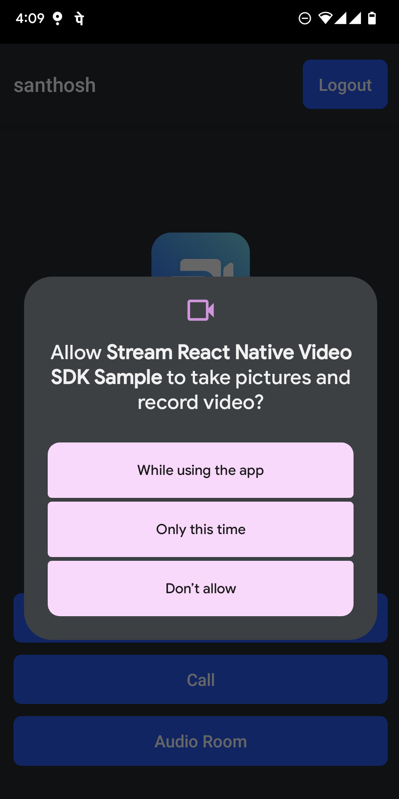

Rendering a video call or audio call requires native platform permissions, which is mandatory to access a camera and microphone respectively. The SDK needs to know to the state of camera and microphone permissions to get video and audio streams. We can inform the states to the SDK through the following:

```ts
import { StreamVideoRN } from '@stream-io/video-react-native-sdk';

StreamVideoRN.setPermissions({
  isCameraPermissionGranted: true,
  isMicPermissionGranted: true,
});
```

In this guide, we will create a hook named `useSyncPermissions` to manage the native permissions required for the app. This hook will be used to request the app's permissions and inform them to the SDK.

The hook will request for the relevant permissions when the screen is mounted and also informs the permission state to the SDK when the app state changes to the foreground. This ensures the latest permissions are synced with the SDK, that way the SDK can get video and audio streams for a call.

Once the component using this hook is mounted, we should see permissions being requested like below:



## Setup

Ensure that relevant permissions are declared in your `AndroidManifest.xml` and `Info.plist` as mentioned in the [installation](../setup/installation/) guide. 

Additionally, to request permissions in both platforms easily we will use the [`react-native-permissions`](https://github.com/zoontek/react-native-permissions) library. You can run the following command to install it:

```bash title=Terminal
yarn add react-native-permissions
```

#### iOS

Additionally, for iOS, you need update your `package.json` by adding the permissions used in your app.

```js title=package.json
{
  "reactNativePermissionsIOS": [
    "Camera",
    "Microphone",
  ],
}
```

After that, we need to run the following commands:

```bash title=Terminal
npx react-native setup-ios-permissions
npx pod-install
```

## Step 1 - Add functions to update permissions to the SDK

In this step, we create two functions called `androidProcessPermissions` and `iOSProcessPermissions`. These functions are responsible for informing the status of the permission grants to the SDK. 

```ts title=src/utils/updatePermissions.ts
import { PERMISSIONS, RESULTS, PermissionStatus } from 'react-native-permissions';
import { StreamVideoRN } from '@stream-io/video-react-native-sdk';


// The extracted type of the return value of `requestMultiple`
type Results = Awaited<ReturnType<typeof requestMultiple>>;

export const androidProcessPermissions = (
  results: Record<
    'android.permission.CAMERA' | 'android.permission.RECORD_AUDIO',
    PermissionStatus
  >,
) =>
  StreamVideoRN.setPermissions({
    isCameraPermissionGranted:
      results[PERMISSIONS.ANDROID.CAMERA] === RESULTS.GRANTED,
    isMicPermissionGranted:
      results[PERMISSIONS.ANDROID.RECORD_AUDIO] === RESULTS.GRANTED,
  });

export const iosProcessPermissions = (
  results: Record<
    'ios.permission.CAMERA' | 'ios.permission.MICROPHONE',
    PermissionStatus
  >,
) =>
  StreamVideoRN.setPermissions({
    isCameraPermissionGranted:
      results[PERMISSIONS.IOS.CAMERA] === RESULTS.GRANTED,
    isMicPermissionGranted:
      results[PERMISSIONS.IOS.MICROPHONE] === RESULTS.GRANTED,
  });
```

## Step 2 - Add a function to request permissions in the app and update the SDK

In this step, we create a function called `requestAndUpdatePermissions`. This function will be responsible for requesting permissions and also updating the status to the SDK using the functions created in step-1.

```ts title=src/utils/requestAndUpdatePermissions.ts
import { Platform } from 'react-native';
import { PERMISSIONS, requestMultiple } from 'react-native-permissions';
import { androidProcessPermissions, iosProcessPermissions } from 'src/utils/updatePermissions';

export const requestAndUpdatePermissions = async () => {
  if (Platform.OS === 'ios') {
    // Request camera and mic permissions on iOS
    const results = await requestMultiple([
      PERMISSIONS.IOS.CAMERA,
      PERMISSIONS.IOS.MICROPHONE,
    ]);
    // Sync the permissions with the Stream Video SDK
    iosProcessPermissions(results);
  } else if (Platform.OS === 'android') {
    // Request camera and mic permissions on Android
    const results = await requestMultiple([
      PERMISSIONS.ANDROID.CAMERA,
      PERMISSIONS.ANDROID.RECORD_AUDIO,
    ]);
    // Sync the permissions with the Stream Video SDK
    androidProcessPermissions(results);
  }
};
```

## Step 3 - Add a function to check permissions in the app and update the SDK

In this step, we create a function called `checkAndUpdatePermissions`. This function will be responsible for checking permissions and also updating the status to the SDK using the functions created in step-1. This function will be used later to check permissions when the app moves to foreground from the background.

```ts title=src/utils/checkAndUpdatePermissions.ts
import { Platform } from 'react-native';
import { PERMISSIONS, checkMultiple } from 'react-native-permissions';
import { androidProcessPermissions, iosProcessPermissions } from 'src/utils/updatePermissions';

export const checkAndUpdatePermissions = async () => {
  if (Platform.OS === 'ios') {
    // Check, update and sync permissions on iOS
    const results = await checkMultiple([
      PERMISSIONS.IOS.CAMERA,
      PERMISSIONS.IOS.MICROPHONE,
    ]);
    // Sync the permissions with the Stream Video SDK
    iosProcessPermissions(results);
  } else if (Platform.OS === 'android') {
    // Check, update and sync permissions on Android
    const results = await checkMultiple([
      PERMISSIONS.ANDROID.CAMERA,
      PERMISSIONS.ANDROID.RECORD_AUDIO,
    ]);
    // Sync the permissions with the Stream Video SDK
    androidProcessPermissions(results);
  }
};
```

## Step 4 - Create the hook to manage permissions

In the step, we create the `useSyncPermissions` hook. As mentioned earlier, this hook will be used to request the app's permissions and inform them to the SDK. 

Additional to updating permissions after requesting them, it is also necessary to check the status of permissions when app comes to foreground. This will ensure that the permissions are updated when the user comes back to the app from the background after changing the permissions in the native settings screen. In order to do this, we will also add a listener to the app state change event in this hook.

```tsx
import { useEffect, useRef } from 'react';
import { AppState } from 'react-native';
import { requestAndUpdatePermissions } from 'src/utils/requestAndUpdatePermissions';
import { checkAndUpdatePermissions } from 'src/utils/checkAndUpdatePermissions';

export const useSyncPermissions = () => {
  // request permissions on mount
  useEffect(() => {
    requestAndUpdatePermissions();
  }, []);

  // check permissions on foreground
  const appStateRef = useRef(AppState.currentState);
  useEffect(() => {
    const subscription = AppState.addEventListener('change', nextAppState => {
      if (
        appState.current.match(/inactive|background/) &&
        nextAppState === 'active'
      ) {
        checkAndUpdatePermissions();;
      }

      appState.current = nextAppState;
    });

    return () => {
      subscription.remove();
    };
  }, []);
};
```

## Step 5 - Use the Hook

In this final step, we use the `useSyncPermissions` hook in the screen of our choice. As an example below, we use it in the screen where we pass the `call` object to the SDK.

```tsx
import { StreamVideo, StreamCall } from '@stream-io/video-react-native-sdk';

const MyApp = () => {
  //..
  useSyncPermissions();
  return (
    <StreamVideo client={client}>
      <StreamCall call={call}>
        {/*  You UI */}
      </StreamCall>
    </StreamVideo>
  );
};
```