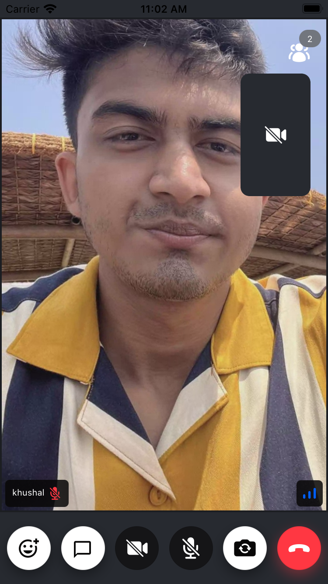

import ImageShowcase from '@site/src/components/ImageShowcase';
import ParticipantViewCameraOn from '../assets/04-ui-components/participant-view-camera-on.png';
import ParticipantViewCameraOff from '../assets/04-ui-components/participant-view-camera-off.png';
import IncomingCallView from '../assets/04-ui-components/incoming-call-view.png';
import OutgoingCallView from '../assets/04-ui-components/outgoing-call-view.png';

Stream SDK aims to make it as easy as possible to build your own video calling, audio rooms, and live streams. We support a low-level client, guides on building your own UI, and several pre-built UI components. If you quickly want to add calling to your app, you can do that just in an hour with these UI components.

## Participant Video

If you want to render a participant's video together with:

- A label/name for the participant
- Network quality indicator
- Mute/unmute indicator
- Fallback for when video is muted
- Reactions

We can use [ParticipantView](../participants/participant-view):

```tsx
<ParticipantView participant={participant} />
```

You will see the result as below:

<ImageShowcase
  items={[
    {
      image: ParticipantViewCameraOn,
      caption: 'Participant View Camera On',
      alt: 'Participant View Camera On',
    },
    {
      image: ParticipantViewCameraOff,
      caption: 'Participant View Camera Off',
      alt: 'Participant View Camera Off',
    },
  ]}
/>

## Video Call UI

You can use the [`CallContentView`](../call/call-content-view), [`CallControlsView`](../call/call-controls-view), [`ParticipantInfoBadge`](../participants/participant-info-badge) to get the full Video Call UI, which consists of:

- Header: Content is shown that calls information or additional actions.
- Video Grids: A call video that renders the full participants of the call.
- Controls: Content is shown that allows users to trigger different actions to control a joined call.

```tsx
const App = () => {
  return <View style={styles.container}>
      <View style={styles.icons}>
        <ParticipantsInfoBadge />
      </View>
      <CallContentView />
      <CallControlsView />
  </View>
}

const styles = StyleSheet.create({
  container: {
    flex: 1,
  },
  icons: {
    position: 'absolute',
    right: 16,
    marginTop: 8,
    flexDirection: 'row',
    alignItems: 'center',
    zIndex: 2,
  }
})
```



## Ringing (Incoming/Outgoing calls)

You can implement incoming/outgoing screens using our [`IncomingCallView`](../call/incoming-call-view)/[`OutgoingCallView`](../call/outgoing-call) components:

<ImageShowcase
  items={[
    {
      image: IncomingCallView,
      caption: 'Incoming Call View',
      alt: 'Incoming Call View',
    },
    {
      image: OutgoingCallView,
      caption: 'Outgoing Call View',
      alt: 'Outgoing Call View',
    },
  ]}
/>

## UI Component Customization

Stream SDK provides highly customizable UI components. Therefore, you can adjust each style or implement your own UI for each part of the components. This list describes what you can do with Stream SDK's UI components:

- You can also build your UI components from scratch with our low-level UI component using our [UI Cookbook](../../ui-cookbook/overview).
- Use our library of built-in components.
- Mix & Match between your own and built-in components.
