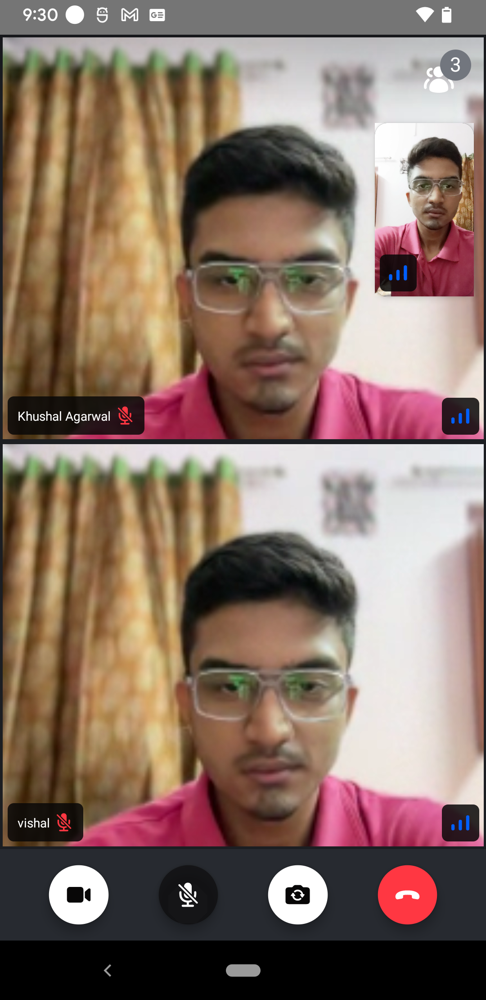

import ImageShowcase from '@site/src/components/ImageShowcase';
import ParticipantCameraOn from '../assets/04-ui-components/participants/participant-view/participant-camera-on.png';
import ParticipantCameraOff from '../assets/04-ui-components/participants/participant-view/participant-camera-off.png';
import IncomingCall from '../assets/04-ui-components/call/incoming-call/incoming-call.png';
import OutgoingCall from '../assets/04-ui-components/call/outgoing-call/outgoing-call-camera-enabled.png';

Stream SDK aims to make it as easy as possible to build your own video calling, audio rooms, and live streams. We support a low-level client, guides on building your own UI, and several pre-built UI components. If you quickly want to add calling to your app, you can do that just in an hour with these UI components.

### Rendering Participant

If you want to render a participant's video together with:

- A label/name for the participant
- Network quality indicator
- Mute/unmute indicator
- Fallback for when video is muted
- Reactions

We can use [ParticipantView](../participants/participant-view):

```tsx
<ParticipantView participant={participant} />
```

You will see the result as below:

<ImageShowcase
  items={[
    {
      image: ParticipantCameraOn,
      caption: 'Participant Camera On',
      alt: 'Participant Camera On',
    },
    {
      image: ParticipantCameraOff,
      caption: 'Participant Camera Off',
      alt: 'Participant Camera Off',
    },
  ]}
/>

### Video Call UI

You can use the [`CallContent`](../call/call-content):

- Header: Content is shown that calls information or additional actions like back button, participant info.
- Call Participants Layout: A call video that renders the full participants of the call.
- Controls: Content is shown that allows users to trigger different actions to control a joined call.

```tsx
const App = () => {
  return (
    <View style={styles.container}>
      <CallContent />
    </View>
  );
};

const styles = StyleSheet.create({
  container: {
    flex: 1,
  },
});
```



### Ringing (Incoming/Outgoing calls)

You can implement incoming/outgoing screens using our [`RingingCallContent`](../call/ringing-call-content) component:

- It displays the [`IncomingCall`](../call/incoming-call)/[`OutgoingCall`](../call/outgoing-call) components depending upon the call states.
- After the call is accepted its displays the [`CallContent`](../call/call-content) component.
- While the call is in joining state it shows `JoiningCallIndicator` component.

<ImageShowcase
  items={[
    {
      image: IncomingCall,
      caption: 'Incoming Call',
      alt: 'Incoming Call',
    },
    {
      image: OutgoingCall,
      caption: 'Outgoing Call',
      alt: 'Outgoing Call',
    },
  ]}
/>

```tsx
const App = () => {
  return (
    <View style={styles.container}>
      <RingingCallContent />
    </View>
  );
};

const styles = StyleSheet.create({
  container: {
    flex: 1,
  },
});
```

### Theming

To accurately create a theme we suggest utilizing our exported types to create your own theme. This will allow you to ensure the keys you are using in your theme object are correct.

When you provide a theme as a prop a deep merge of the theme and default theme is performed so only styles designated in the custom theme overwrite the defaults. We provide a helper type DeepPartial that makes all of the keys at every depth optional, this is to account for the deep merge that is performed.

You can find the default theme object in [theme.ts](https://github.com/GetStream/stream-video-js/blob/main/packages/react-native-sdk/src/theme/theme.ts).

```tsx
import type { DeepPartial, Theme } from '@stream-io/video-react-native-sdk';

const theme: DeepPartial<Theme> = {
  callContent: {
    container: {
      backgroundColor: 'red',
    },
  },
};
```

Now you can provide these theme to the `style` prop of [`StreamVideo`](../core/stream-video/#style) component.

### UI Component Customization

Stream SDK provides highly customizable UI components. Therefore, you can adjust each style or implement your own UI for each part of the components. This list describes what you can do with Stream SDK's UI components:

- You can also build your UI components from scratch with our low-level UI component using our [UI Cookbook](../../ui-cookbook/overview).
- Use our library of built-in components.
- Mix & Match between your own and built-in components.
