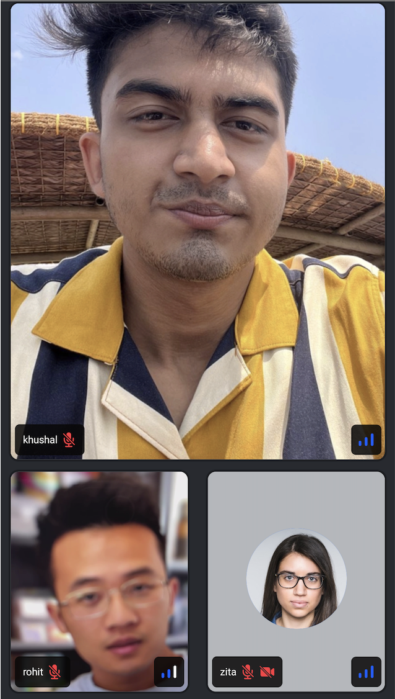

CallContentView is one of the main components for a Call. This is responsible for listing all the participant's video stream in a vertical/horizontal list and play the audio streams for those participants.


The CallContentView has two modes(`grid` or `spotlight`). The grid mode simply lists the participants vertically one after the other, while the spotlight mode is responsible to show the screen sharing view, a single dominant speaker, or a pinned participant in an elongated view, while other participants being in an horizontal view.



## General usage

The `CallContentView` can be used to display the video stream of all the participants and play their audio stream.

```tsx
import {
  Call,
  CallContentView,
  StreamCall,
} from '@stream-io/video-react-native-sdk';

const VideoCallUI = () => {
  let call: Call;

  return (
    <StreamCall call={call}>
      // highlight-next-line
      <CallContentView />
    </StreamCall>
  );
};
```

## Props

### `mode`

| Type                  | Default Value |
| --------------------- | ------------- |
| `grid` \| `spotlight` | `grid`        |

This is used to switch the list between the grid and the spotlight mode.

:::note
When a screen is shared, the layout automatically changes to `spotlight` mode.
:::
