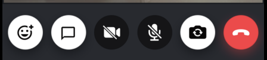

CallControls allows users to execute actions during the call(for example, mute/unmute audio/video, reactions, hang-up calls, etc.).
We provide a built-in component that displays all relevant call controls during a call.



## General Usage

The `CallControls` component displays the available controls based on the [available permissions](../../03-core/09-permissions-and-moderation.mdx).

```tsx
import {
  Call,
  CallContent,
  CallControls,
  StreamCall,
} from '@stream-io/video-react-native-sdk';

const VideoCallUI = () => {
  let call: Call;

  return (
    <StreamCall call={call}>
      <CallContent />
      // highlight-next-line
      <CallControls />
    </StreamCall>
  );
};
```

## Props

### `chatButton`

| Type                        |
| --------------------------- |
| [ChatButton](#chatbutton-1) |

Prop for the chat button that contains all the necessary elements to make it functional.

### `hangUpCallButton`

| Type                                    |
| --------------------------------------- |
| [HangUpCallButton](#hangupcallbutton-1) |

Prop for the hang-up call button that contains all the necessary props to make it functional.

## Button Prop

Each call controls button has separate props to customize it, handle the `onPress` event, etc.

### `ChatButton`

The chat button, which on press opens up the Chat UI if integrated in the application.

#### Props

| Name                        | Description                                           | Type                        |
| --------------------------- | ----------------------------------------------------- | --------------------------- |
| `onPressHandler`            | Callback to be called when the chat button is pressed | `() => void` \| `undefined` |
| `unreadBadgeCountIndicator` | Shows the number of unread messages over the button   | `number` \| `undefined`     |

### `HangUpCallButton`

The hang-up call button, which hangs up the call when pressed.

#### Props

| Name             | Description                                              | Type                                                       |
| ---------------- | -------------------------------------------------------- | ---------------------------------------------------------- |
| `onPressHandler` | Callback to be called when the hang-up button is pressed | `() => void` \| `undefined`                                |
| `style`          | Styles to be applied on the container of the button      | [ViewStyle](https://reactnative.dev/docs/view-style-props) |
