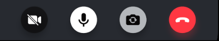

CallControls allows users to execute actions during the call(for example, mute/unmute audio/video, reactions, hang-up calls, etc.).
We provide a built-in `CallControls` component that displays all relevant call controls during a call.



## General Usage

The `CallControls` component displays the available controls for the call.

```tsx
import {
  Call,
  CallContent,
  CallControls,
  StreamCall,
} from '@stream-io/video-react-native-sdk';

const VideoCallUI = () => {
  let call: Call;

  return (
    <StreamCall call={call}>
      // highlight-next-line
      <CallControls />
    </StreamCall>
  );
};
```

## Props

### `onHangupCallHandler`

| Type                        |
| --------------------------- |
| `() => void` \| `undefined` |

Handler to be called when the call is left using the Hang up call button.

## Built-in call controls

Each call control is available as a separate UI component.

### [`AcceptCallButton`](https://github.com/GetStream/stream-video-js/blob/main/packages/react-native-sdk/src/components/Call/CallControls/AcceptCallButton.tsx)

This component is used in the [Incoming Call](../incoming-call) component to accept an incoming call.

| Type                  | Type                        | Description                                                                                          |
| --------------------- | --------------------------- | ---------------------------------------------------------------------------------------------------- |
| `onPressHandler`      | `() => void` \| `undefined` | Handler to be called when the accept call button is pressed. Used to override the default behaviour. |
| `onAcceptCallHandler` | `() => void` \| `undefined` | Handler to be called after the incoming call is accepted.                                            |

### [`HangupCallButton`](https://github.com/GetStream/stream-video-js/blob/main/packages/react-native-sdk/src/components/Call/CallControls/HangupCallButton.tsx)

This component is used to hangup/leave an active call/outgoing call.

| Type                  | Type                        | Description                                                                                           |
| --------------------- | --------------------------- | ----------------------------------------------------------------------------------------------------- |
| `onPressHandler`      | `() => void` \| `undefined` | Handler to be called when the hang up call button is pressed. Used to override the default behaviour. |
| `onHangupCallHandler` | `() => void` \| `undefined` | Handler to be called after the call is hanged up.                                                     |

### [`RejectCallButton`](https://github.com/GetStream/stream-video-js/blob/main/packages/react-native-sdk/src/components/Call/CallControls/RejectCallButton.tsx)

This component is used in the [Incoming Call](../incoming-call) component to reject an incoming call.

| Type                  | Type                        | Description                                                                                          |
| --------------------- | --------------------------- | ---------------------------------------------------------------------------------------------------- |
| `onPressHandler`      | `() => void` \| `undefined` | Handler to be called when the reject call button is pressed. Used to override the default behaviour. |
| `onRejectCallHandler` | `() => void` \| `undefined` | Handler to be called after the incoming call is rejected.                                            |

### [`ToggleAudioPreviewButton`](https://github.com/GetStream/stream-video-js/blob/main/packages/react-native-sdk/src/components/Call/CallControls/ToggleAudioPreviewButton.tsx)

This component is used to toggle audio mute/unmute status before joining the call.

| Type             | Type                        | Description                                                                                            |
| ---------------- | --------------------------- | ------------------------------------------------------------------------------------------------------ |
| `onPressHandler` | `() => void` \| `undefined` | Handler to be called when the audio preview button is pressed. Used to override the default behaviour. |

### [`ToggleVideoPreviewButton`](https://github.com/GetStream/stream-video-js/blob/main/packages/react-native-sdk/src/components/Call/CallControls/ToggleVideoPreviewButton.tsx)

This component is used to toggle video mute/unmute status before joining the call.

| Type             | Type                        | Description                                                                                            |
| ---------------- | --------------------------- | ------------------------------------------------------------------------------------------------------ |
| `onPressHandler` | `() => void` \| `undefined` | Handler to be called when the video preview button is pressed. Used to override the default behaviour. |

### [`ToggleAudioPublishingButton`](https://github.com/GetStream/stream-video-js/blob/main/packages/react-native-sdk/src/components/Call/CallControls/ToggleAudioPublishingButton.tsx)

This component is used to toggle audio mute/unmute status while in the call.

| Type             | Type                        | Description                                                                |
| ---------------- | --------------------------- | -------------------------------------------------------------------------- |
| `onPressHandler` | `() => void` \| `undefined` | Handler to override the default behaviour of the audio publishing button.. |

### [`ToggleVideoPublishingButton`](https://github.com/GetStream/stream-video-js/blob/main/packages/react-native-sdk/src/components/Call/CallControls/ToggleVideoPublishingButton.tsx)

This component is used to toggle video mute/unmute status while in the call.

| Type             | Type                        | Description                                                               |
| ---------------- | --------------------------- | ------------------------------------------------------------------------- |
| `onPressHandler` | `() => void` \| `undefined` | Handler to override the default behaviour of the video publishing button. |

### [`ToggleCameraFaceButton`](https://github.com/GetStream/stream-video-js/blob/main/packages/react-native-sdk/src/components/Call/CallControls/ToggleCameraFaceButton.tsx)

This component is used to toggle camera face(front/back) when in the call.

| Type             | Type                        | Description                                                                 |
| ---------------- | --------------------------- | --------------------------------------------------------------------------- |
| `onPressHandler` | `() => void` \| `undefined` | Handler to override the default behaviour of the toggle camera face button. |

### [`ReactionButton`](https://github.com/GetStream/stream-video-js/blob/main/packages/react-native-sdk/src/components/Call/CallControls/ReactionButton.tsx)

This component is used to display the list of Reactions supported in the call. It can also be used to send reactions.

The following reactions are supported by default:

- like 👍
- raise hand ✋
- fireworks 🎉

| Type             | Type                        | Description                                                                     |
| ---------------- | --------------------------- | ------------------------------------------------------------------------------- |
| `onPressHandler` | `() => void` \| `undefined` | Handler to override the default behaviour when the reactions button is pressed. |

### [`ChatButton`](https://github.com/GetStream/stream-video-js/blob/main/packages/react-native-sdk/src/components/Call/CallControls/ChatButton.tsx)

This component is used to display/open the chat window while in the call.

| Type             | Type                        | Description                                                                |
| ---------------- | --------------------------- | -------------------------------------------------------------------------- |
| `onPressHandler` | `() => void` \| `undefined` | Handler to override the default behaviour when the chat button is pressed. |

## Customization

You can create your own custom component using the [built-in call controls](#built-in-call-controls) as building blocks.

If you want to create custom call controls, follow the [Call Controls UI Cookbook guide](../../../ui-cookbook/replacing-call-controls/) for more information.
