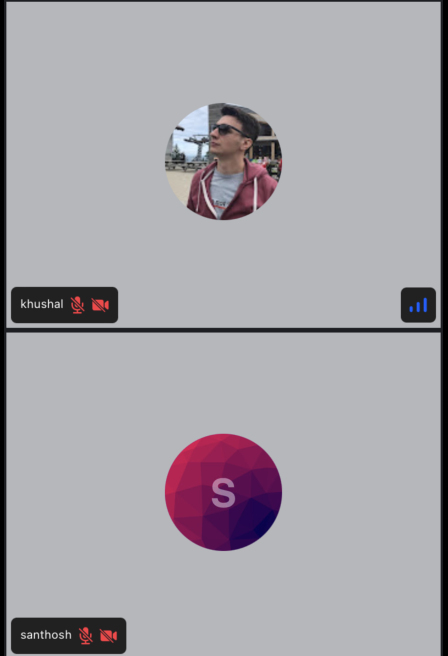

This component displays a list of participants in a [FlatList](https://reactnative.dev/docs/flatlist). You can use this component to display participants either in a vertical or horizontal scrolling mode.

:::note
This component depends on a flex container to calculate the width and height of the participant view, hence it should be used only in a flex parent container
:::

Our [CallContent](./call-content.mdx) component internally uses CallParticipantsList.



## General Usage

The `CallParticipantsList` can be used to display the all the participants in the form of FlatList. By default it shows the participants vertically with 2 participants in each row. This is customizable using the props.

```tsx
import {
  Call,
  CallParticipantsList,
  StreamCall,
  useParticipants,
} from '@stream-io/video-react-native-sdk';

const VideoCallUI = () => {
  let call: Call;
  const allParticipants = useParticipants();

  return (
    <StreamCall call={call}>
      // highlight-next-line
      <CallParticipantsList participants={allParticipants} />
    </StreamCall>
  );
};
```

## Props

### `participants`

| Type                                                                                                              |
| ----------------------------------------------------------------------------------------------------------------- |
| [`StreamVideoParticipant`](https://github.com/GetStream/stream-video-js/blob/main/packages/client/src/types.ts)[] |

The list of participants to list in the view.

### numberOfColumns

| Type                    | Default Value |
| ----------------------- | ------------- |
| `number` \| `undefined` | 2             |

The number of participants to be displayed in a single row. This property is only used when there are more than 2 participants.

### horizontal

| Type                     | Default Value |
| ------------------------ | ------------- |
| `boolean` \| `undefined` | false         |

This decides whether the participants should be listed vertically or horizontally.
