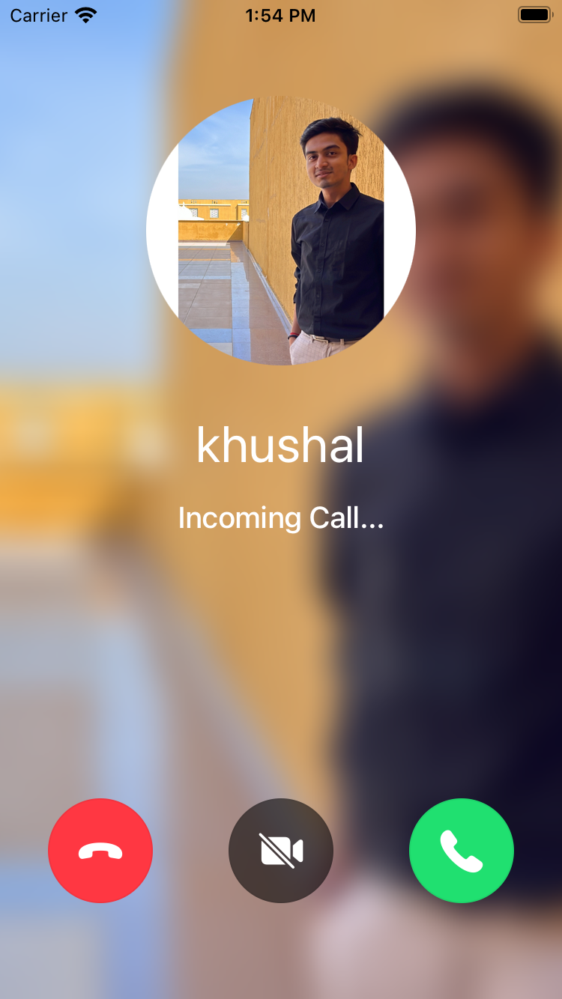

IncomingCall represents the incoming call state and the UI when a user receives a call from someone else.

It represents the details of the user calling you, allows accepting or rejecting the call, etc.

It is customizable using our UI cookbook guide on [Custom Incoming/Outgoing Call components](../../05-ui-cookbook/05-incoming-and-outcoming-call.mdx).



## General Usage

```tsx
import {
  CallingState,
  IncomingCall,
  useCall,
  useCalls,
  useCallCallingState,
} from '@stream-io/video-react-native-sdk';

const CallPanel = () => {
  const call = useCall();
  const isCallCreatedByMe = call?.data?.created_by.id === call?.currentUserId;

  const callingState = useCallCallingState();

  // Display the incoming call if the call state is RINGING and the call is not created by me, i.e., recieved from others.
  if (callingState === CallingState.RINGING && !isCallCreatedByMe) {
    return <IncomingCall />;
  }
};

const Call = () => {
  const calls = useCalls();

  return (
    <StreamCall call={call[0]}>
      <CallPanel />
    </StreamCall>
  );
};
```

## Props

### `acceptCallButton`

Prop for the accept call button that contains all the necessary elements to make it functional.

| Type                                    |
| --------------------------------------- |
| [AcceptCallButton](#acceptcallbutton-1) |

### `rejectCallButton`

| Type                                    |
| --------------------------------------- |
| [RejectCallButton](#rejectcallbutton-1) |

Prop for the reject call button that contains all the necessary elements to make it functional.

## Button Prop

### `AcceptCallButton`

| Name             | Description                                             | Type                        |
| ---------------- | ------------------------------------------------------- | --------------------------- |
| `onPressHandler` | Callback to be called when the accept button is pressed | `() => void` \| `undefined` |

This overrides the default `onPress` event of the accept button.

### `RejectCallButton`

| Name             | Description                                             | Type                        |
| ---------------- | ------------------------------------------------------- | --------------------------- |
| `onPressHandler` | Callback to be called when the reject button is pressed | `() => void` \| `undefined` |

This overrides the default `onPress` event of the reject button.
