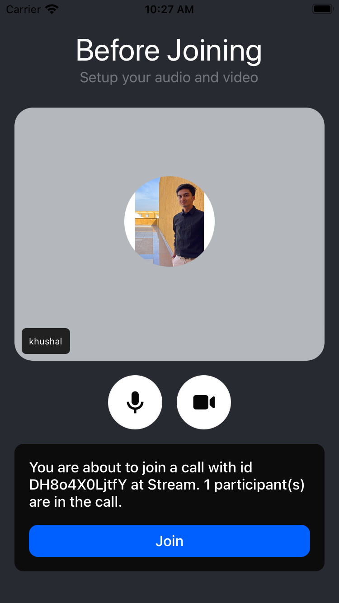

LobbyView is a component that is designed to make your entrance and invite experience to a meeting call user-friendly. The purpose is to allow users to test their setup before entering the meeting call. This component mainly contains all the necessary information about the meeting, including:

- The call details such as its id, etc.
- Participants who are already in the meeting.
- Controlling the audio/video mute status before joining the meeting.
- Exposes a handler for the join meeting button.



## General usage

```tsx
import { useCallback } from 'react';
import {
  LobbyView,
  useCall,
} from '@stream-io/video-react-native-sdk';

const LobbyViewComponent = () => {
  let call = useCall();

  const onCallJoinHandler = useCallback(async () => {
    try {
      // Handle what should happen before joining the call. Eg: showing loader, etc.
      await call?.join({ create: true });
      // Handle what should happen after the call is joined. Eg: navigation, etc.
    } catch (error) {
      // Handle the case when there is an error while joining the call
    }
  }, [call]);

  // highlight-next-line
  return <LobbyView joinCallButton={{ onPressHandler: onCallJoinHandler }} />;
};
```

## Props

### `joinCallButton`

| Type                                |
| ----------------------------------- |
| [JoinCallButton](#joincallbutton-1) |

Prop for the join call button that contains all the necessary elements to make it functional.

## Button Prop

### `JoinCallButton`

This handles the joining of the call from the app. It can be also used to show user feedback before/after joining or handling errors, as in the example of [General usage](#general-usage) above.

| Name             | Description                                           | Type         |
| ---------------- | ----------------------------------------------------- | ------------ |
| `onPressHandler` | Callback to be called when the join button is pressed | `() => void` |
