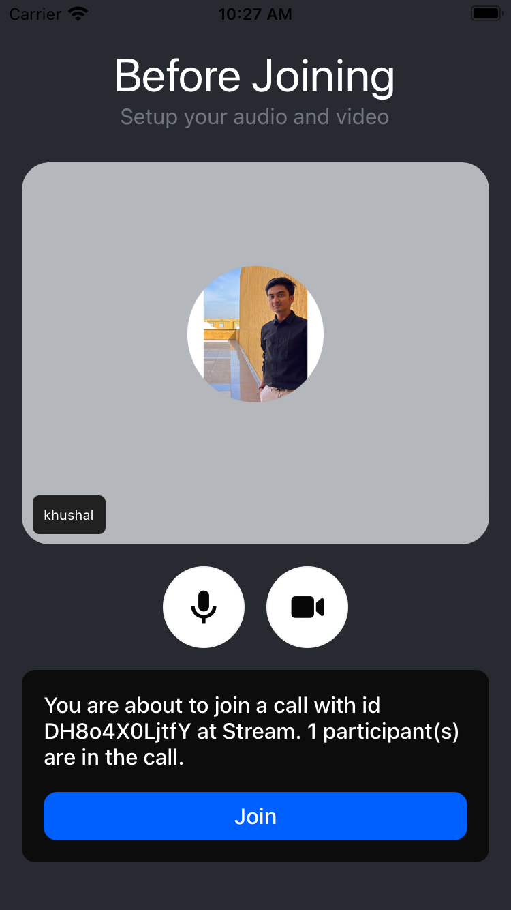

Lobby is a component that is designed to make your entrance and invite experience to a meeting call user-friendly. The purpose is to allow users to test their setup before entering the meeting call. This component mainly contains all the necessary information about the meeting, including:

- The call details such as its id, etc.
- Participants who are already in the meeting.
- Controlling the audio/video mute status before joining the meeting.
- Exposes a handler for the join meeting button.



## General usage

```tsx {9}
import { useCallback } from 'react';
import { Lobby, useCall } from '@stream-io/video-react-native-sdk';

const LobbyComponent = () => {
  const onJoinCallHandler = () => {
    // Handle what should happen after the call is joined. Eg: navigation, etc.
  };

  return <Lobby onJoinCallHandler={onJoinCallHandler} />;
};
```

## Props

### `onJoinCallHandler`

Handler to be called when the call is joined using the join button in the Lobby.

| Type                        |
| --------------------------- |
| `() => void` \| `undefined` |

### `LobbyControls`

Prop to customize the media controls in the Lobby component entirely.

| Type                          | Default Value                                                                                                                                          |
| ----------------------------- | ------------------------------------------------------------------------------------------------------------------------------------------------------ |
| `ComponentType`\| `undefined` | [`LobbyControls`](https://github.com/GetStream/stream-video-js/blob/main/packages/react-native-sdk/src/components/Call/CallControls/LobbyControls.tsx) |

### `JoinCallButton`

Prop to customize the Join call button in the Lobby component.

| Type                          | Default Value                                                                                                                                     |
| ----------------------------- | ------------------------------------------------------------------------------------------------------------------------------------------------- |
| `ComponentType`\| `undefined` | [`JoinCallButton`](https://github.com/GetStream/stream-video-js/blob/main/packages/react-native-sdk/src/components/Call/Lobby/JoinCallButton.tsx) |
