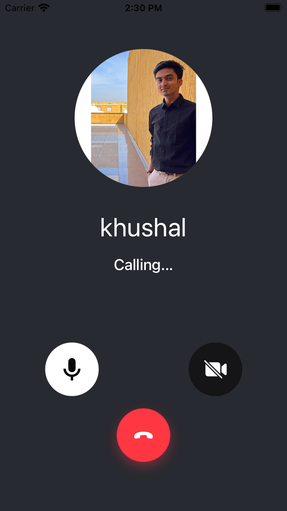

OutgoingCallView represents the outgoing call state and the UI when a user calls someone else. The view is displayed until someone accepts the call.

It represents the details of the user who is being called. It also allows controlling the pre-join audio/video mute status of the call etc.

It is customizable using our UI cookbook guide on [Custom Incoming/Outgoing Call Views](../../05-ui-cookbook/05-custom-in-outcoming-call-views.mdx).



## General Usage

```tsx
import {
  CallingState,
  OutgoingCallView,
  useCall,
  useCalls,
  useCallCallingState,
} from '@stream-io/video-react-native-sdk';

const CallPanel = () => {
  const call = useCall();
  const isCallCreatedByMe = call?.data?.created_by.id === call?.currentUserId;

  const callingState = useCallCallingState();

  // Display the outgoing call view if the call state is RINGING and the call is created by me.
  if (callingState === CallingState.RINGING && isCallCreatedByMe) {
    return <OutgoingCallView />;
  }
};

const Call = () => {
  const calls = useCalls();

  return (
    <StreamCall call={call[0]}>
      <CallPanel />
    </StreamCall>
  );
};
```

## Props

### `hangUpCallButton`

| Type                                    |
| --------------------------------------- |
| [HangUpCallButton](#hangupcallbutton-1) |

Prop for the hang-up call button that contains all the necessary props to make it functional.

## Button Prop

### `HangUpCallButton`

The hang-up call button, which hangs up/cancels the call when pressed.

The callee will stop getting the incoming call when its pressed.

#### Props

| Name             | Description                                              | Type                                                       |
| ---------------- | -------------------------------------------------------- | ---------------------------------------------------------- |
| `onPressHandler` | Callback to be called when the hang-up button is pressed | `() => void` \| `undefined`                                |
| `style`          | Styles to be applied on the container of the button      | [ViewStyle](https://reactnative.dev/docs/view-style-props) |
