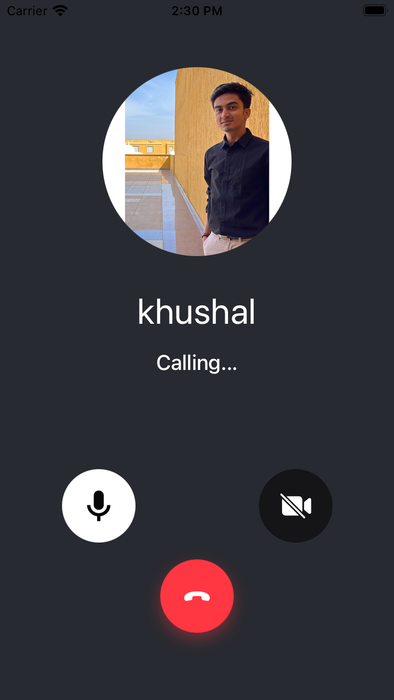

import CallTopView from '../../common-content/ui-components/call/call-content/call-top-view.mdx';

OutgoingCall represents the outgoing call state and the UI when a user calls someone else. The view is displayed until someone accepts the call.

It represents the details of the user who is being called. It also allows controlling the pre-join audio/video mute status of the call etc.

It is customizable using our UI cookbook guide on [Custom Incoming/Outgoing Call components](../../05-ui-cookbook/05-incoming-and-outcoming-call.mdx).



## General Usage

```tsx
import {
  CallingState,
  OutgoingCall,
  useCall,
  useCalls,
  useCallCallingState,
} from '@stream-io/video-react-native-sdk';

const CallPanel = () => {
  const call = useCall();
  const isCallCreatedByMe = call?.data?.created_by.id === call?.currentUserId;

  const callingState = useCallCallingState();

  // Display the outgoing call if the call state is RINGING and the call is created by me.
  if (callingState === CallingState.RINGING && isCallCreatedByMe) {
    return <OutgoingCall />;
  }
};

const Call = () => {
  const calls = useCalls();

  return (
    <StreamCall call={call[0]}>
      <CallPanel />
    </StreamCall>
  );
};
```

## Props

### `onHangupCallHandler`

| Type                        |
| --------------------------- |
| `() => void` \| `undefined` |

Handler to be executed when the outgoing call is cancelled or hanged up.

### `CallTopView`

<CallTopView />

### `OutgoingCallControls`

Prop to customize the Outgoing call controls in the `OutgoingCall` component.

| Type                          | Default Value                                                                                                                                                        |
| ----------------------------- | -------------------------------------------------------------------------------------------------------------------------------------------------------------------- |
| `ComponentType`\| `undefined` | [`OutgoingCallControls`](https://github.com/GetStream/stream-video-js/blob/main/packages/react-native-sdk/src/components/Call/CallControls/OutgoingCallControls.tsx) |
