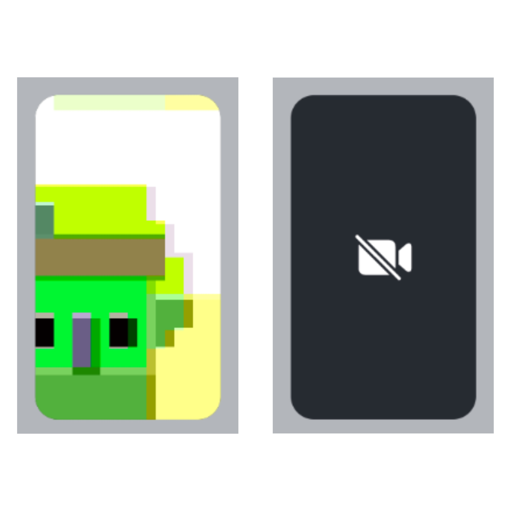

import ParticipantLabel from '../../common-content/ui-components/call/call-content/participant-label.mdx';
import ParticipantReaction from '../../common-content/ui-components/call/call-content/participant-reaction.mdx';
import ParticipantNetworkQualityIndicator from '../../common-content/ui-components/call/call-content/participant-network-quality-indicator.mdx';
import ParticipantVideoFallback from '../../common-content/ui-components/call/call-content/participant-video-fallback.mdx';
import VideoRenderer from '../../common-content/ui-components/call/call-content/video-renderer.mdx';
import ParticipantView from '../../common-content/ui-components/call/call-content/participant-view.mdx';

FloatingParticipantView displays the local video stream of the local participant. It is a floating view that can be dragged in the call area.

When the video is muted, the video muted icon is shown in a disabled background.



## General Usage

In order to use the `FloatingParticipantView` as a standalone component, you should use the following code:

```tsx {4}
import {
  FloatingParticipantView,
  useCallStateHooks,
} from '@stream-io/video-react-native-sdk';

const App = () => {
  const { useLocalParticipant } = useCallStateHooks();
  const localParticipant = useLocalParticipant();
  return (
    localParticipant && (
      <FloatingParticipantView participant={localParticipant} />
    )
  );
};
```

## Props

### `alignment`

Determines where the floating participant video will be placed initially.

| Type                                                    | Default value |
| ------------------------------------------------------- | ------------- |
| `top-left` \|`top-right`\|`bottom-left`\|`bottom-right` | `top-right`   |

### `participant`

The participant to be rendered in the `FloatingParticipantView`.

| Type                                                                                                                         |
| ---------------------------------------------------------------------------------------------------------------------------- |
| [`StreamVideoParticipant`](https://github.com/GetStream/stream-video-js/blob/main/packages/client/src/types.ts)\|`undefined` |

### `style`

This prop is used to override the root container style of the component.

| Type                                                       |
| ---------------------------------------------------------- |
| [ViewStyle](https://reactnative.dev/docs/view-style-props) |

### `ParticipantLabel`

<ParticipantLabel />

### `ParticipantReaction`

<ParticipantReaction />

### `ParticipantNetworkQualityIndicator`

<ParticipantNetworkQualityIndicator />

### `ParticipantVideoFallback`

<ParticipantVideoFallback />

### `ParticipantView`

<ParticipantView />

### `VideoRenderer`

<VideoRenderer />
