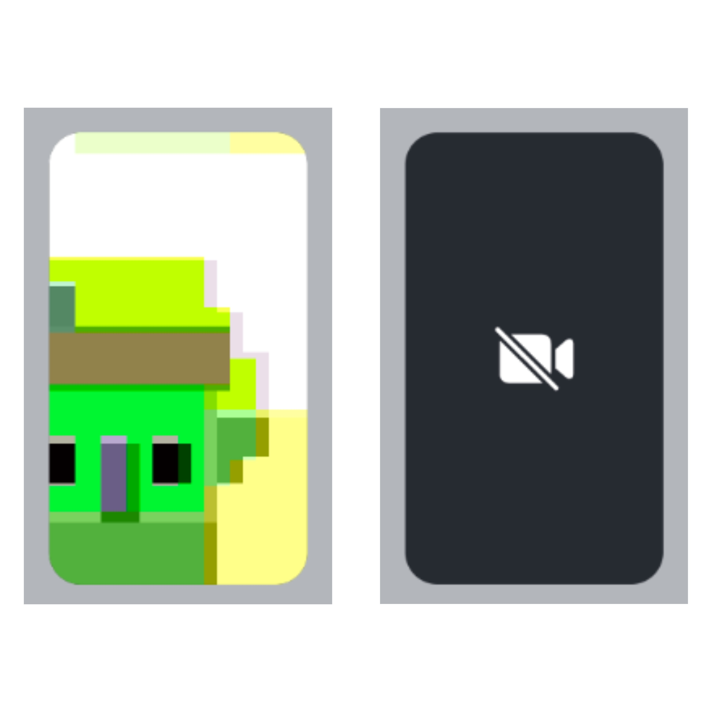

import ParticipantLabel from '../../common-content/ui-components/call/call-content/participant-label.mdx';
import ParticipantReaction from '../../common-content/ui-components/call/call-content/participant-reaction.mdx';
import ParticipantNetworkQualityIndicator from '../../common-content/ui-components/call/call-content/participant-network-quality-indicator.mdx';
import ParticipantVideoFallback from '../../common-content/ui-components/call/call-content/participant-video-fallback.mdx';
import VideoRenderer from '../../common-content/ui-components/call/call-content/video-renderer.mdx';
import ParticipantView from '../../common-content/ui-components/call/call-content/participant-view.mdx';

LocalParticipantView displays the local video stream of the local participant. It is a floating view by default that can be dragged in the call area.

When the video is muted, the video muted icon is shown in a disabled background.

:::note
By default, the `LocalParticipantView` renders in a floating mode.
:::



## General Usage

In order to use the `LocalParticipantView` as a standalone component, you should use the following code:

```tsx {4}
import { LocalParticipantView } from '@stream-io/video-react-native-sdk';

const App = () => {
  return <LocalParticipantView />;
};
```

## Props

### `alignment`

Determines where the floating participant video will be placed initially.

| Type                                                    | Default value |
| ------------------------------------------------------- | ------------- |
| `top-left` \|`top-right`\|`bottom-left`\|`bottom-right` | `top-right`   |

### `style`

This prop is used to override the root container style of the component.

| Type                                                       |
| ---------------------------------------------------------- |
| [ViewStyle](https://reactnative.dev/docs/view-style-props) |

### `topInset`

The `topInset` prop allows you to precisely control the vertical(top) positioning of the Local Participant View's floating video display.

By default, it takes the value of the `CallTopView` height.

| Type                    |
| ----------------------- |
| `number` \| `undefined` |

### `ParticipantLabel`

<ParticipantLabel />

### `ParticipantReaction`

<ParticipantReaction />

### `ParticipantNetworkQualityIndicator`

<ParticipantNetworkQualityIndicator />

### `ParticipantVideoFallback`

<ParticipantVideoFallback />

### `ParticipantView`

<ParticipantView />

### `VideoRenderer`

<VideoRenderer />
