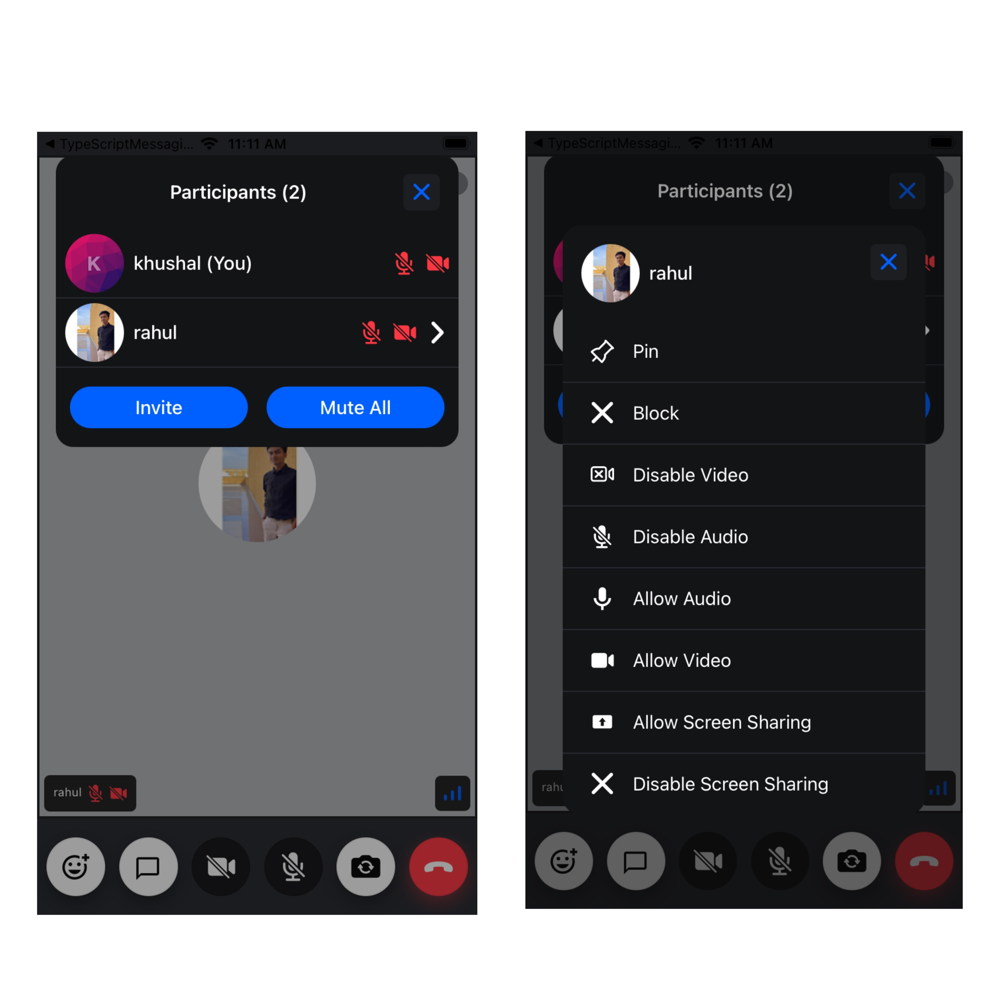

ParticipantsInfoListView shows the list of participants in the call and their information such as:

- Name
- Participant's Audio/Video mute/unmute status.
- Whether screen is been shared by the participants or not.

It also has an options menu, which opens up on tapping an individual participant and lists all the options for the participant, such as:

- Disable/Enable audio/video/screen sharing.
- Pin a participant.
- Block a participant.

:::note
Some of the options are only visible to the creator of the call.
:::

The `ParticipantsInfoListView` also allows muting all participants and inviting participants in the call.



## General Usage

In order to use the `ParticipantsInfoListView` as a standalone component, you should use the following code:

```tsx
import { useState, useCallback } from 'react';
import { ParticipantsInfoListView } from '@stream-io/video-react-native-sdk';

const App = () => {
  const [
    isCallParticipantsInfoViewVisible,
    setIsCallParticipantsInfoViewVisible,
  ] = useState<boolean>(false);

  return (
    <ParticipantsInfoListView
      isCallParticipantsInfoViewVisible={isCallParticipantsInfoViewVisible}
      setIsCallParticipantsInfoViewVisible={
        setIsCallParticipantsInfoViewVisible
      }
    />
  );
};
```

### Props

### `isCallParticipantsInfoViewVisible`

| Type      |
| --------- |
| `boolean` |

Boolean that decides whether the CallParticipantsInfoView modal should be open or not.

### `setIsCallParticipantsInfoViewVisible`

| Type                    |
| ----------------------- |
| React SetState function |

SetState function to set the value of the boolean field [`isCallParticipantsViewVisible`](#iscallparticipantsinfoviewvisible) depending upon whether the `CallParticipantsInfoView` modal should be open or not.
