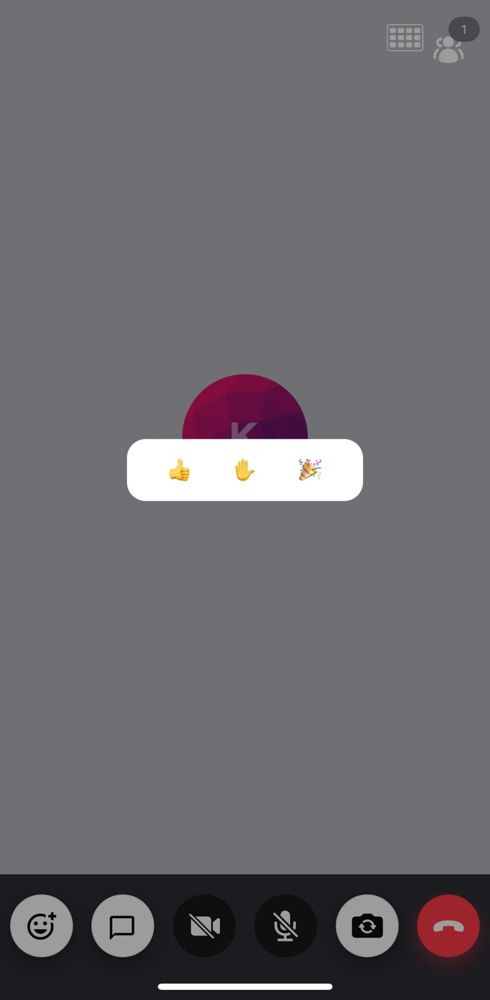

The `ReactionModal` is a [modal](https://reactnative.dev/docs/modal) designed to show all the available reactions in the application and allows sending the reaction when tapped.

The `ReactionModal` component internally lists all the reactions that are supported through the `StreamVideoRN` config. By default, we support '👍', '✋', and '🎉' reactions on our SDK. But this is fully customizable from the app. To do that, you can call the following from your application:

```tsx
StreamVideoRN.updateConfig({
  supportedReactions: [
    { type: 'reaction', emoji_code: ':smart:', custom: {}, icon: '😎' },
  ],
});
```

:::note
Make sure you follow the adhere to the types of the [`StreamReaction`](https://github.com/GetStream/stream-video-js/blob/main/packages/react-native-sdk/src/utils/StreamVideoRN/types.ts#L4) type to create a new reaction.
:::



## General Usage

In order to use the `ReactionModal` as a standalone component, you should use the following code:

```tsx
import { useState } from 'react';
import { ReactionModal } from '@stream-io/video-react-native-sdk';

const App = () => {
  const [isReactionModalActive, setIsReactionModalActive] =
    useState<boolean>(false);

  return (
    <ReactionModal
      isReactionModalActive={isReactionModalActive}
      setIsReactionModalActive={setIsReactionModalActive}
    />
  );
};
```

### Props

### `isReactionModalActive`

| Type      |
| --------- |
| `boolean` |

Boolean that decides whether the ReactionModal modal should be open or not.

### `setIsReactionModalActive`

| Type                    |
| ----------------------- |
| React SetState function |

SetState function to set the value of the boolean field [`isReactionModalActive`](#isreactionmodalactive) depending upon whether the `ReactionModal` modal should be open or not.
