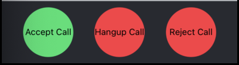

import ImageShowcase from '@site/src/components/ImageShowcase';
import CallControlsMediaButtonOn from '../assets/05-ui-cookbook/02-replacing-call-controls/call-controls-button-media-on.png';
import CallControlsMediaButtonOff from '../assets/05-ui-cookbook/02-replacing-call-controls/call-controls-button-media-off.png';

The Stream Video React Native SDK allows building your own Call controls view/layout. Call Controls View generally comprises several buttons that control the call. Each button controls its area of responsibility. Our task, as integrators, is to create a component that puts these buttons together as we wish. In this example, we intend to show how to do just that.

:::note
The React Native SDK exports a lot of [Built-in Call Controls](../../ui-components/call/call-controls/#built-in-call-controls) components that we encourage to use if you don't want to entirely override the functionality.
:::

## Building Custom Controls Buttons

It is very easy to build custom buttons making use of the hooks provided by the SDK. In the next few sections, we will demonstrate how custom call controls buttons can be built.

:::note
Implementing call controls buttons will often be in reality associated with handling permissions to perform the given action. To learn about permission handling, take a look at our [permissions and moderation guide](../../core/permissions-and-moderation).
:::

### Button to accept a call

We will need a call accept button when building an app that makes use of [ring call workflow](../../core/joining-and-creating-calls/#ring-call). To accept a call we just invoke `call.join()`. So the minimal call accept button could look like this:

```tsx
import { Pressable, Text, StyleSheet } from 'react-native';
import { useCall } from '@stream-io/video-react-native-sdk';

export const CustomAcceptCallButton = () => {
  const call = useCall();

  const onCallAcceptHandler = async () => {
    await call?.join();
  };

  return (
    <Pressable
      onPress={onCallAcceptHandler}
      style={[styles.button, styles.acceptButton]}
    >
      <Text style={styles.buttonText}>Accept Call</Text>
    </Pressable>
  );
};

const styles = StyleSheet.create({
  button: {
    height: 80,
    width: 80,
    borderRadius: 40,
    justifyContent: 'center',
  },
  buttonText: {
    textAlign: 'center',
  },
  acceptButton: {
    backgroundColor: '#20E070',
  },
});
```

### Button to hangup a call

We will need a call hangup button when hanging up a call or to leave the ongoing call. To accept a call we just invoke `call.leave()`. So the minimal call hang up button could look like this:

```tsx
import { Pressable, Text, StyleSheet } from 'react-native';
import { useCall } from '@stream-io/video-react-native-sdk';

export const CustomHangupCallButton = () => {
  const call = useCall();

  const onCallHangupHandler = async () => {
    await call?.leave();
  };

  return (
    <Pressable
      onPress={onCallHangupHandler}
      style={[styles.button, styles.hangupButton]}
    >
      <Text style={styles.buttonText}>Hangup Call</Text>
    </Pressable>
  );
};

const styles = StyleSheet.create({
  button: {
    height: 80,
    width: 80,
    borderRadius: 40,
    justifyContent: 'center',
  },
  buttonText: {
    textAlign: 'center',
  },
  hangupButton: {
    backgroundColor: '#FF3742',
  },
});
```

### Button to reject a call

We will need a call reject button when building an app that makes use of [ring call workflow](../../core/joining-and-creating-calls/#ring-call). To reject a call we just invoke `call.leave()` function with an object parameter having key as `reject` and value of it being `true`. So the minimal call reject button could look like this:

```tsx
import { Pressable, Text, StyleSheet } from 'react-native';
import { useCall } from '@stream-io/video-react-native-sdk';

export const CustomRejectCallButton = () => {
  const call = useCall();

  const onCallRejectHandler = async () => {
    await call?.leave({ reject: true });
  };

  return (
    <Pressable
      onPress={onCallRejectHandler}
      style={[styles.button, styles.rejectButton]}
    >
      <Text style={styles.buttonText}>Reject Call</Text>
    </Pressable>
  );
};

const styles = StyleSheet.create({
  button: {
    height: 80,
    width: 80,
    borderRadius: 40,
    justifyContent: 'center',
  },
  buttonText: {
    textAlign: 'center',
  },
  rejectButton: {
    backgroundColor: '#FF3742',
  },
});
```

### Button to toggle audio

Toggling microphone in an active call turns around publishing audio input streams and enabling the audio state. The bare-bones button to toggle audio in an active call could look like the following:

```tsx
import { useCall, useCallStateHooks } from '@stream-io/video-react-native-sdk';

export const ToggleAudioButton = () => {
  const call = useCall();
  const { useMicrophoneState } = useCallStateHooks();
  const { status } = useMicrophoneState();

  const toggleAudioMuted = async () => {
    await call?.microphone.toggle();
  };

  const audioButtonStyles = [
    styles.button,
    {
      backgroundColor: status === 'disabled' ? '#080707dd' : 'white',
    },
  ];

  const audioButtonTextStyles = [
    styles.mediaButtonText,
    {
      color: status === 'disabled' ? 'white' : '#080707dd',
    },
  ];

  return (
    <Pressable onPress={toggleAudioMuted} style={audioButtonStyles}>
      {status === 'disabled' ? (
        <Text style={audioButtonTextStyles}>Audio On</Text>
      ) : (
        <Text style={audioButtonTextStyles}>Audio Off</Text>
      )}
    </Pressable>
  );
};

const styles = StyleSheet.create({
  button: {
    height: 80,
    width: 80,
    borderRadius: 40,
    justifyContent: 'center',
  },
  buttonText: {
    textAlign: 'center',
  },
  mediaButtonText: {
    textAlign: 'center',
  },
});
```

### Button to toggle video

Toggling video in an active call turns around publishing video input streams and enabling the video state. The bare-bones button to toggle video in an active call could look like the following:

```tsx
import { useCall, useCallStateHooks } from '@stream-io/video-react-native-sdk';

export const ToggleVideoButton = () => {
  const call = useCall();
  const { useCameraState } = useCallStateHooks();
  const { status } = useCameraState();

  const toggleVideoMuted = async () => {
    await call?.camera.toggle();
  };

  const videoButtonStyles = [
    styles.button,
    {
      backgroundColor: status === 'disabled' ? '#080707dd' : 'white',
    },
  ];

  const videoButtonTextStyles = [
    styles.mediaButtonText,
    {
      color: status === 'disabled' ? 'white' : '#080707dd',
    },
  ];

  return (
    <Pressable onPress={toggleVideoMuted} style={videoButtonStyles}>
      {status === 'disabled' ? (
        <Text style={videoButtonTextStyles}>Video On</Text>
      ) : (
        <Text style={videoButtonTextStyles}>Video Off</Text>
      )}
    </Pressable>
  );
};

const styles = StyleSheet.create({
  button: {
    height: 80,
    width: 80,
    borderRadius: 40,
    justifyContent: 'center',
  },
  buttonText: {
    textAlign: 'center',
  },
  mediaButtonText: {
    textAlign: 'center',
  },
});
```

### Button to toggle Camera Face

Toggling camera face for mobile devices is an important feature. So, to built it from scratch you can use `isCameraOnFrontFacingMode` and `toggleCameraFacingMode` from `useMediaStreamManagement`.

The `isCameraOnFrontFacingMode` is a boolean that tracks if the camera is `front` facing. The `toggleCameraFacingMode` is used to toggle camera between `front` and `back`/`environment` facing modes.

```tsx
import { useCall, useCallStateHooks } from '@stream-io/video-react-native-sdk';

export const ToggleCameraFaceButton = () => {
  const call = useCall();
  const { useCameraState } = useCallStateHooks();
  const { status, direction } = useCameraState();

  const toggleCameraFacingMode = async () => {
    onPressHandler?.();
    await call?.camera.flip();
  };

  const videoFaceButtonStyles = [
    styles.button,
    {
      backgroundColor: direction === 'back' ? '#080707dd' : 'white',
    },
  ];

  const videoFaceButtonTextStyles = [
    styles.mediaButtonText,
    {
      color: direction === 'back' ? 'white' : '#080707dd',
    },
  ];

  return (
    <Pressable onPress={toggleCameraFacingMode} style={videoFaceButtonStyles}>
      {direction === 'front' ? (
        <Text style={videoFaceButtonTextStyles}>Back</Text>
      ) : (
        <Text style={videoFaceButtonTextStyles}>Front</Text>
      )}
    </Pressable>
  );
};

const styles = StyleSheet.create({
  button: {
    height: 80,
    width: 80,
    borderRadius: 40,
    justifyContent: 'center',
  },
  buttonText: {
    textAlign: 'center',
  },
  mediaButtonText: {
    textAlign: 'center',
  },
});
```

### Assembling it all together



#### Call Buttons

```tsx
import { View, StyleSheet } from 'react-native';
import { CallContent } from '@stream-io/video-react-native-sdk';

export const CustomCallControls = () => {
  return (
    <View style={styles.buttonGroup}>
      <ToggleAudioButton />
      <ToggleVideoButton />
      <ToggleCameraFaceButton />
    </View>
  );
};

export const App = () => {
  return (
    <View style={styles.container}>
      <CallContent CallControls={CustomCallControls} />
    </View>
  );
};

const styles = StyleSheet.create({
  container: {
    flex: 1,
  },
  buttonGroup: {
    flexDirection: 'row',
    justifyContent: 'space-evenly',
    paddingVertical: 10,
  },
});
```

#### Media Button

<ImageShowcase
  items={[
    {
      image: CallControlsMediaButtonOff,
      caption: 'Call Controls Media Button Off',
      alt: 'Call Controls Media Button Off',
    },
    {
      image: CallControlsMediaButtonOn,
      caption: 'Call Controls Media Button On',
      alt: 'Call Controls Media Button On',
    },
  ]}
/>

```tsx
import { View, StyleSheet } from 'react-native';

export const CustomCallControls = () => {
  return (
    <View style={styles.buttonGroup}>
      <CustomAcceptCallButton />
      <CustomHangupCallButton />
      <CustomRejectCallButton />
    </View>
  );
};

const styles = StyleSheet.create({
  buttonGroup: {
    flexDirection: 'row',
    justifyContent: 'space-evenly',
    paddingVertical: 10,
  },
});
```
