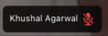

There may be a lot of designs for participant's label that can be displayed above the participant video. The SDK's default label shows:

- The participant's name
- The microphone and camera mute status
- The dominant speaker label
- The connection quality indicator



It is expected that the default component may not meet all the requirements of your design/app. Therefore, we will look into ways, how to customize/create a participant label in this tutorial.

## Custom Participant Label

To customize the Participant Label, you can use the following hooks:

- `useParticipants` hook that provides all the necessary details of all the participants.
- `useRemoteParticipants` hook that provides all the details of the participants other than the local participant.
- `useConnectedUser` or `useLocalParticipant` provides the details of the local or connected participant.

An example is shown below using `useParticipants`:

```tsx
import { Text, View } from 'react-native';
import {
  StreamVideoParticipant,
  StreamVideoLocalParticipant,
  useParticipants,
} from '@stream-io/video-react-native-sdk';

// A custom ParticipantLabel component that shows participant's name and if its a dominant speaker
const ParticipantLabel = ({
  participant,
}: {
  participant: StreamVideoParticipant | StreamVideoLocalParticipant;
}) => {
  const participantLabel = participant?.name ?? participant?.id;

  return (
    <View>
      <Text numberOfLines={1}>{participantLabel}</Text>
      {participant.isDominantSpeaker &&
        {
          /* Show relevant component */
        }}
    </View>
  );
};

const ParticipantView = () => {
  const participants = useParticipants();

  return (
    <View>
      {participants.map((participant) => {
        // Code for your custom participant view
        return (
          <View>
            {/* ParticipantLabel is rendered as a sub component here */}
            <ParticipantLabel participant={participant} />
          </View>
        );
      })}
    </View>
  );
};
```

An example using the `useConnectedUser` hook is shown below. This can be useful while designing the Participant label component for the Lobby View:

```tsx
import { Text, View } from 'react-native';
import { useConnectedUser } from '@stream-io/video-react-native-sdk';

const ParticipantLabel = () => {
  const connectedUser = useConnectedUser();
  const participantLabel = connectedUser?.name ?? connectedUser?.id;

  return (
    <View>
      <Text numberOfLines={1}>
        {participantLabel}
      </Text>
      {/* Add your custom component here */}
    </View>
  );
};
```
