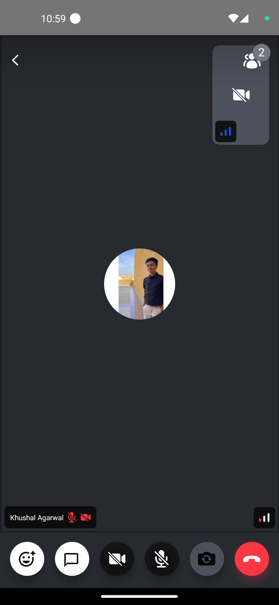
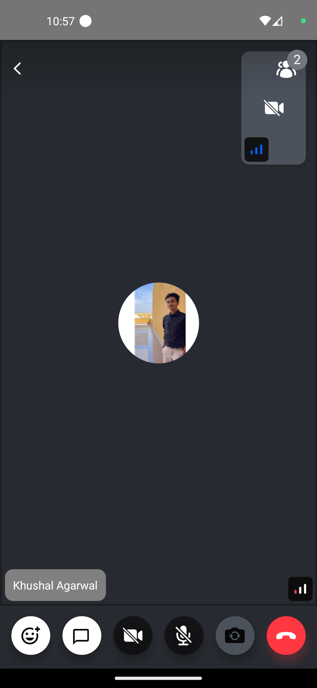

Stream's UI components provide a participant label, which displays participant's basic information, such as name, and the status of the microphone by default like the image below:



It is expected that the default component may not meet all the requirements of your design/app. Therefore, we will look into ways, how to customize/create a participant label in this tutorial.

## Custom Participant Label

You can customize the participant label by implementing your own label component and passing it to the [`CallContent`](../../ui-components/call/call-content) component.



```tsx
import { Text, StyleSheet } from 'react-native';
import {
  StreamVideoParticipant,
  ParticipantLabelProps,
} from '@stream-io/video-react-native-sdk';

// A custom ParticipantLabel component that shows participant's name and if its a dominant speaker
const CustomParticipantLabel = ({ participant }: ParticipantLabelProps) => {
  const participantLabel = participant?.name ?? participant?.id;

  return <Text style={styles.label}>{participantLabel}</Text>;
};

const styles = StyleSheet.create({
  label: {
    backgroundColor: 'gray',
    padding: 10,
    borderRadius: 10,
    color: 'white',
  },
});
```

## Final Steps

Now this can be passed to the [`ParticipantLabel`](../../ui-components/call/call-content/#participantlabel) prop of the [`CallContent`](../../ui-components/call/call-content) component, as follows:

```tsx {13}
import {
  Call,
  CallContent,
  StreamCall,
} from '@stream-io/video-react-native-sdk';

const VideoCallUI = () => {
  let call: Call;
  // your logic to create a new call or get an existing call

  return (
    <StreamCall call={call}>
      <CallContent ParticipantLabel={CustomParticipantLabel} />
    </StreamCall>
  );
};
```

:::note
To get the participant data, you can use the following hooks from the `useCallStateHooks`:

- `useParticipants` hook that provides all the necessary details of all the participants.
- `useRemoteParticipants` hook that provides all the details of the participants other than the local participant.
- `useConnectedUser` or `useLocalParticipant` provides the details of the local or connected participant.

:::
