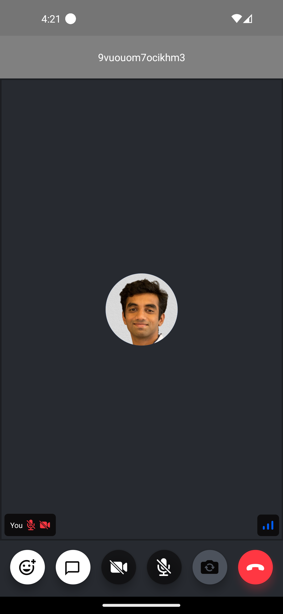

The `CallTopView` is the header component that gives the user more information when in a call, while adding a few actions they can trigger while the call is active.


You are free to customize the `CallTopView` as you want to add new buttons or change the background as per your design requirements.

## Custom Call Top View

We will create a custom call top view which will only display the id of the call. This can then be passed to the [`CallContent`](../../ui-components/call/call-content) component.



```tsx
import { StyleSheet, Text, View } from 'react-native';

const CustomCallTopView = () => {
  const call = useCall();
  return (
    <View style={styles.topView}>
      <Text style={styles.title}>{call?.id}</Text>
    </View>
  );
};

const styles = StyleSheet.create({
  topView: {
    width: '100%',
    backgroundColor: 'gray',
  },
  title: {
    paddingVertical: 20,
    color: 'white',
    textAlign: 'center',
  },
});
```

## Final steps

Now this can be passed to the [`CallTopView`](../../ui-components/call/call-content/#calltopview) prop of the [`CallContent`](../../ui-components/call/call-content) component, as follows:

```tsx {13}
import {
  Call,
  CallContent,
  StreamCall,
} from '@stream-io/video-react-native-sdk';

const VideoCallUI = () => {
  let call: Call;
  // your logic to create a new call or get an existing call

  return (
    <StreamCall call={call}>
      <CallContent CallTopView={CustomCallTopView} />
    </StreamCall>
  );
};
```
