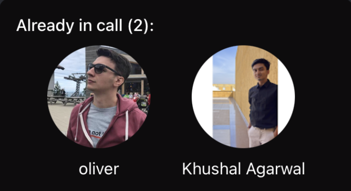

import ImageShowcase from '@site/src/components/ImageShowcase';
import LocalParticipantPreviewOn from '../assets/05-ui-cookbook/06-lobby-preview/local-participant-preview-on.png';
import LocalParticipantPreviewOff from '../assets/05-ui-cookbook/06-lobby-preview/local-participant-preview-off.png';
import MediaStreamManagementButtonOn from '../assets/05-ui-cookbook/06-lobby-preview/media-stream-management-button-on.png';
import MediaStreamManagementButtonOff from '../assets/05-ui-cookbook/06-lobby-preview/media-stream-management-button-off.png';
import LobbyCompletedOn from '../assets/05-ui-cookbook/06-lobby-preview/lobby-completed-on.png';
import LobbyCompletedOff from '../assets/05-ui-cookbook/06-lobby-preview/lobby-completed-off.png';

In this article, we will discuss key considerations for creating a user-friendly entrance to your call. We will delve into the various elements that can enhance the user experience and ensure a smooth transition from the lobby to the video call itself. By implementing effective lobby page design principles, you can elevate the overall user satisfaction.

We consider lobby to be place, where:

- The user can see their own video preview before joining the call.
- The user acquires information about the call to be joined.
- The user can set their video/audio mute preferences before joining the call.
- The user can use the Lobby component to show the participants who are already in the call.

:::note
The approach to visualise the components will differ from application to application. Therefore, in this guide, we will focus only on the principles of building components and plugging them with right data sources
:::

### The Call data

We would like to show some basic information about the call, when users arrive to the lobby. For example:

- The call id, type, etc.
- Who already joined the call.

To retrieve the basic details such as call id and type you can use the `useCall` hook.

Then we can use the following hooks:

- useCallMetadata

:::note
The initial call information can be retrieved by the `get` or `getOrCreate` method of a Call instance.

You can register an effect at the same place for the same, where you create the call(`client.call`).

```tsx
const call =
  /* Created call */

  useEffect(() => {
    const getOrCreateCall = async () => {
      try {
        await call?.getOrCreate();
      } catch (error) {
        console.error('Failed to get or create call', error);
      }
    };

    getOrCreateCall();
  }, [call]);
```

:::

These hooks make sure, that the information about call metadata or call members is updated in real time. The updates are made automatically in response to [Stream's WebSocket events](../../advanced/events) arriving from the backend.

### Video Input Preview

We can show the local video preview in the Lobby view, before joining the call to check if everything is fine with your video. We can get the video stream from the camera using the media stream from the `call.camera` object and show it using the `RTCView` component from `@stream-io/react-native-webrtc` library. And by using the `useConnectedUser` hook we can get the user info.

To show the Video preview, we can use the [`RTCView`](https://github.com/GetStream/react-native-webrtc/blob/master/src/RTCView.ts) component from [`@stream-io/react-native-webrtc`](https://github.com/GetStream/react-native-webrtc).

<ImageShowcase
  items={[
    {
      image: LocalParticipantPreviewOff,
      caption: 'Local Participant Preview Off',
      alt: 'Local Participant Preview Off',
    },
    {
      image: LocalParticipantPreviewOn,
      caption: 'Local Participant Preview On',
      alt: 'Local Participant Preview On',
    },
  ]}
/>

We can go through the usage through the following example:

```tsx
import {
  Avatar,
  StreamVideoParticipant,
  useConnectedUser,
  useCall,
  useCallStateHooks,
} from '@stream-io/video-react-native-sdk';
import React from 'react';
import { StyleSheet, View, Text } from 'react-native';
import { RTCView } from '@stream-io/react-native-webrtc';

export const LocalVideoRenderer = () => {
  const call = useCall();
  const localVideoStream = call?.camera.state.mediaStream;
  const connectedUser = useConnectedUser();
  const { useCameraState } = useCallStateHooks();
  const { status: cameraStatus } = useCameraState();

  const connectedUserAsParticipant = {
    userId: connectedUser?.id,
    image: connectedUser?.image,
    name: connectedUser?.name,
  } as StreamVideoParticipant;

  return (
    <View style={styles.videoView}>
      <View style={styles.topView} />
      {cameraStatus === 'enabled ? (
        <RTCView
          streamURL={localVideoStream?.toURL()}
          objectFit="cover"
          style={StyleSheet.absoluteFillObject}
        />
      ) : (
        <Avatar participant={connectedUserAsParticipant} />
      )}
      <ParticipantStatus />
    </View>
  );
};

const ParticipantStatus = () => {
  const connectedUser = useConnectedUser();
  const participantLabel = connectedUser?.name ?? connectedUser?.id;
  const { useMicrophoneState } = useCallStateHooks();
  const { status: microphoneStatus } = useMicrophoneState();

  return (
    <View style={styles.status}>
      <Text style={styles.userNameLabel} numberOfLines={1}>
        {participantLabel}
      </Text>
      {microphoneStatus === 'disabled' && (
        <View style={styles.svgContainerStyle}>
          <Text>(Mic off)</Text>
        </View>
      )}
    </View>
  );
};

const styles = StyleSheet.create({
  videoView: {
    backgroundColor: 'gray',
    height: 280,
    width: '100%',
    justifyContent: 'space-between',
    alignItems: 'center',
    overflow: 'hidden',
    marginVertical: 8,
  },
  topView: {},
  status: {
    alignSelf: 'flex-start',
    flexDirection: 'row',
    alignItems: 'center',
    padding: 8,
    borderRadius: 4,
    backgroundColor: '#dddddd',
  },
  userNameLabel: {
    flexShrink: 1,
    color: 'white',
  },
  svgContainerStyle: {
    marginLeft: 8,
  },
});
```

### Media Stream Management

To control audio or video mute status in the Lobby, you can use the `useCameraState` and `useMicrophoneState` hooks from the `useCallStateHooks`, that orchestrates the local state of the device within the SDK and handles streaming of the media effectively.

<ImageShowcase
  items={[
    {
      image: MediaStreamManagementButtonOn,
      caption: 'Toggle Audio/Video Button On',
      alt: 'Toggle Audio/Video Button On',
    },
    {
      image: MediaStreamManagementButtonOff,
      caption: 'Toggle Audio/Video Button Off',
      alt: 'Toggle Audio/Video Button Off',
    },
  ]}
/>

:::note
The button's created will orchestrate the video preview in the [Video Input Preview](#video-input-preview) guide above.

You can add this in the code above:

```tsx
const { useMicrophoneState, useCameraState } = useCallStateHooks();
const { status: cameraStatus } = useCameraState();
const isVideoAvailable = !!localVideoStream && cameraStatus === 'enabled';
```

:::

We can go through the usage through the following example:

```tsx title="MediaStreamButtonGroup.tsx"
import React from 'react';
import { Pressable, View, Text, StyleSheet } from 'react-native';
import {
  useCallStateHooks,
  useMediaStreamManagement,
} from '@stream-io/video-react-native-sdk';

export const MediaStreamButtonGroup = () => {
  const { toggleInitialAudioMuteState, toggleInitialVideoMuteState } =
    useMediaStreamManagement();
  const { useMicrophoneState, useCameraState } = useCallStateHooks();
  const { status: microphoneStatus } = useMicrophoneState();
  const { status: cameraStatus } = useCameraState();

  const audioButtonStyles = [
    styles.button,
    {
      backgroundColor: microphoneStatus === 'disabled' ? '#080707dd' : 'white',
    },
  ];

  const videoButtonStyles = [
    styles.button,
    {
      backgroundColor: cameraStatus === 'disabled' ? '#080707dd' : 'white',
    },
  ];

  const audioButtonTextStyles = [
    styles.mediaButtonText,
    {
      color: microphoneStatus === 'disabled' ? 'white' : '#080707dd',
    },
  ];

  const videoButtonTextStyles = [
    styles.mediaButtonText,
    {
      color: cameraStatus === 'disabled' ? 'white' : '#080707dd',
    },
  ];

  return (
    <View style={styles.buttonGroup}>
      <Pressable
        onPress={toggleInitialAudioMuteState}
        style={audioButtonStyles}
      >
        {microphoneStatus === 'enabled' ? (
          <Text style={audioButtonTextStyles}>Audio on</Text>
        ) : (
          <Text style={audioButtonTextStyles}>Audio off</Text>
        )}
      </Pressable>
      <Pressable
        onPress={toggleInitialVideoMuteState}
        style={videoButtonStyles}
      >
        {cameraStatus === 'enabled' ? (
          <Text style={videoButtonTextStyles}>Video on</Text>
        ) : (
          <Text style={videoButtonTextStyles}>Video off</Text>
        )}
      </Pressable>
    </View>
  );
};

const styles = StyleSheet.create({
  buttonGroup: {
    flexDirection: 'row',
    justifyContent: 'space-evenly',
  },
  button: {
    height: 80,
    width: 80,
    borderRadius: 40,
    justifyContent: 'center',
  },
  mediaButtonText: {
    textAlign: 'center',
  },
});
```

### Participants in a call

We can retrieve the list of members, that already joined the call (participants), by inspecting the call metadata object (`callMetadata.session.participants`). The object is provided and maintained up-to-date by `useCallMetadata` hook.



```tsx title="LobbyParticipantsPreview.tsx"
import { Image, StyleSheet, Text, View } from 'react-native';
import { useCallStateHooks } from '@stream-io/video-react-native-sdk';

export const LobbyParticipantsPreview = () => {
  const { useCallSession } = useCallStateHooks();
  const session = useCallSession();

  if (!(session?.participants && session?.participants.length)) {
    return null;
  }

  return (
    <View>
      <Text style={styles.infoText}>
        Already in call ({session.participants.length}):
      </Text>
      <View style={styles.userInfo}>
        {session.participants.map((participant) => (
          <View key={participant.user.id}>
            <Image
              source={{ uri: participant.user.image }}
              style={styles.avatar}
            />
            {participant.user.name && (
              <Text style={styles.title}>{participant.user.name}</Text>
            )}
          </View>
        ))}
      </View>
    </View>
  );
};

const styles = StyleSheet.create({
  infoText: {
    color: 'white',
    textAlign: 'center',
  },
  userInfo: {
    flexDirection: 'row',
    justifyContent: 'space-evenly',
    marginTop: 10,
  },
  avatar: {
    height: 100,
    width: 100,
    borderRadius: 50,
  },
  title: {
    fontSize: 16,
    color: 'white',
    marginVertical: 10,
    textAlign: 'center',
  },
});
```

### Joining the call button

Lastly, to join a call we simply invoke call.join(). Learn more about the topic in the dedicated [Joining & Creating Calls guide](../../core/joining-and-creating-calls/).

```tsx title="JoinCallButton.tsx"
import React, { useCallback } from 'react';
import { Pressable, StyleSheet, Text } from 'react-native';
import { useCall } from '@stream-io/video-react-native-sdk';

export const JoinCallButton = () => {
  const call = useCall();

  const onCallJoinHandler = useCallback(async () => {
    try {
      await call?.join({ create: true });
    } catch (error) {
      if (error instanceof Error) {
        console.log('Error joining call:', error);
      }
    }
  }, [call]);

  return (
    <Pressable onPress={onCallJoinHandler} style={styles.joinButton}>
      <Text style={styles.joinButtonText}>Join Call</Text>
    </Pressable>
  );
};

const styles = StyleSheet.create({
  joinButton: {
    backgroundColor: 'blue',
    paddingVertical: 10,
  },
  joinButtonText: {
    textAlign: 'center',
    fontSize: 25,
    color: 'white',
  },
});
```

### Assembling it all together

<ImageShowcase
  items={[
    {
      image: LobbyCompletedOff,
      caption: 'Lobby Completed Camera and Mic off',
      alt: 'Lobby Completed Camera and Mic off',
    },
    {
      image: LobbyCompletedOn,
      caption: 'Lobby Completed Camera and Mic on',
      alt: 'Lobby Completed Camera and Mic on',
    },
  ]}
/>

```tsx
import { StyleSheet, View } from 'react-native';

export const Lobby = () => {
  return (
    <View style={styles.container}>
      <LocalVideoRenderer />
      <MediaStreamButtonGroup />
      <LobbyParticipantsPreview />
      <JoinCallButton />
    </View>
  );
};

const styles = StyleSheet.create({
  container: {
    flex: 1,
    backgroundColor: '#272A30',
    justifyContent: 'space-evenly',
  },
});
```
