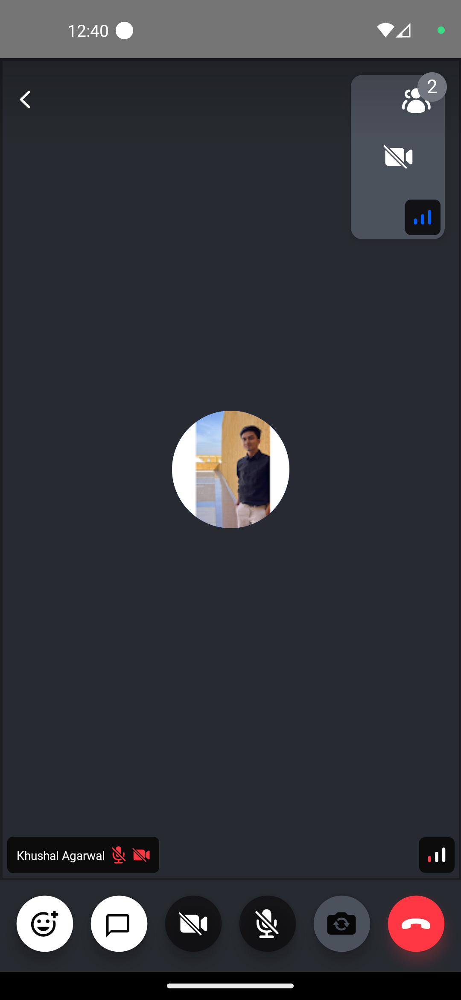
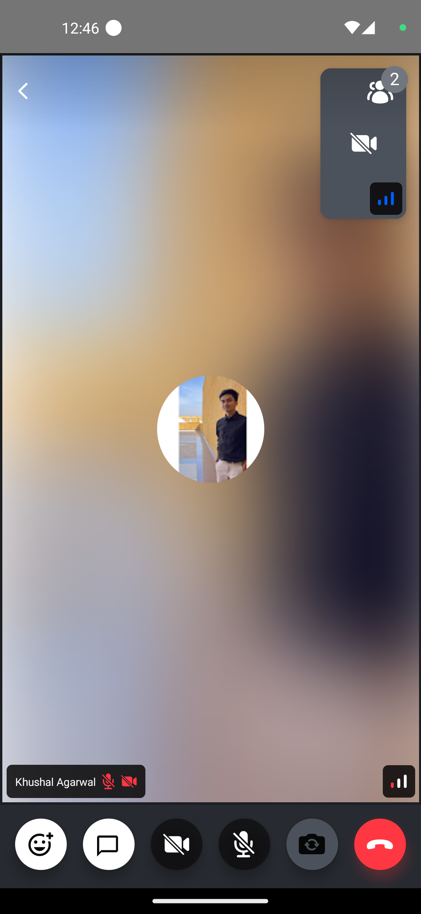

In terms of design the video fallback can be quite creative. How do you indicate that someone is speaking or their video track is unavailable? How does the background look.



It is expected that the default component may not meet all the requirements of your design/app. Therefore, we will look into ways, how to customize/create a participant video fallback in this tutorial.

## Custom Participant Video Fallback

You can customize the participant video fallback by implementing your own video fallback component and passing it to the [`CallContent`](../../ui-components/call/call-content) component.



```tsx
import { Text, StyleSheet } from 'react-native';
import {
  StreamVideoParticipant,
  ParticipantVideoFallbackProps,
} from '@stream-io/video-react-native-sdk';

const CustomParticipantVideoFallback = ({
  participant,
}: ParticipantVideoFallbackProps) => {
  return (
    <ImageBackground
      blurRadius={5}
      source={{ uri: participant.image }}
      style={styles.background}
    >
      <Image source={{ uri: participant.image }} style={styles.avatar} />
    </ImageBackground>
  );
};

const styles = StyleSheet.create({
  background: {
    ...StyleSheet.absoluteFillObject,
    alignItems: 'center',
    justifyContent: 'center',
  },
  avatar: {
    borderRadius: 50,
    height: 100,
    width: 100,
  },
});
```

## Final Steps

Now this can be passed to the [`ParticipantVideoFallback`](../../ui-components/call/call-content/#participantvideofallback) prop of the [`CallContent`](../../ui-components/call/call-content) component, as follows:

```tsx {13}
import {
  Call,
  CallContent,
  StreamCall,
} from '@stream-io/video-react-native-sdk';

const VideoCallUI = () => {
  let call: Call;
  // your logic to create a new call or get an existing call

  return (
    <StreamCall call={call}>
      <CallContent ParticipantVideoFallback={CustomParticipantVideoFallback} />
    </StreamCall>
  );
};
```

:::note
To get the participant data, you can use the following hooks from the `useCallStateHooks`:

- `useParticipants` hook that provides all the necessary details of all the participants.
- `useRemoteParticipants` hook that provides all the details of the participants other than the local participant.
- `useConnectedUser` or `useLocalParticipant` provides the details of the local or connected participant.

:::
