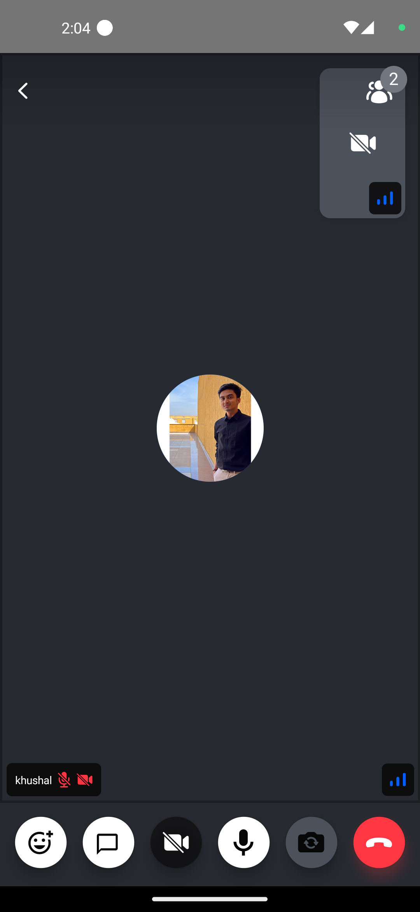
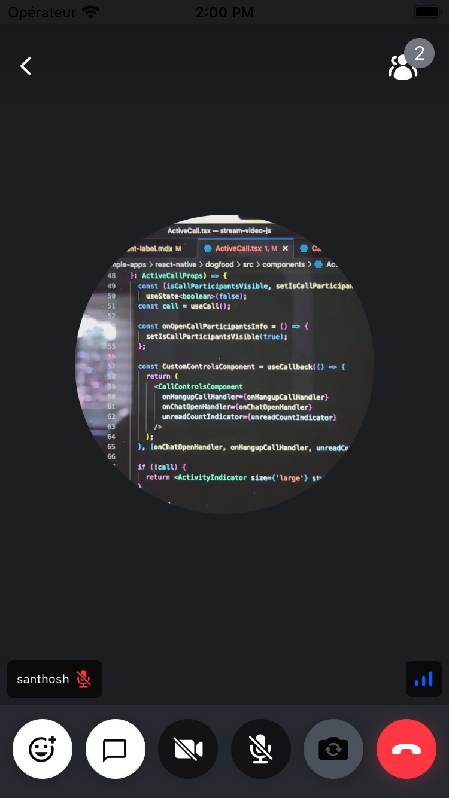

The video renderer is the most essential UI component in a video call screen, which renders participant's video in real-time.



It is expected that the default component may not meet all the requirements of your design/app. Therefore, we will look into ways, how to customize/create a participant label in this tutorial.

## Custom Video Renderer

You can customize the video renderer by implementing your own video renderer component and passing it to the [`CallContent`](../../ui-components/call/call-content) component.



```tsx
import { View, StyleSheet } from 'react-native';
import { RTCView } from 'react-native-webrtc';

const CustomVideoRenderer = ({ participant }: VideoRendererProps) => {
  const { videoStream } = participant;
  return (
    <View style={styles.background}>
      <RTCView
        streamURL={videoStream?.toURL()}
        style={styles.stream}
        objectFit="cover"
      />
    </View>
  );
};

const styles = StyleSheet.create({
  background: {
    ...StyleSheet.absoluteFillObject,
    alignItems: 'center',
    justifyContent: 'center',
  },
  stream: {
    height: 250,
    width: 250,
    borderRadius: 125,
  },
});
```

## Final Steps

Now this can be passed to the [`VideoRenderer`](../../ui-components/call/call-content/#videorenderer) prop of the [`CallContent`](../../ui-components/call/call-content) component, as follows:

```tsx {13}
import {
  Call,
  CallContent,
  StreamCall,
} from '@stream-io/video-react-native-sdk';

const VideoCallUI = () => {
  let call: Call;
  // your logic to create a new call or get an existing call

  return (
    <StreamCall call={call}>
      <CallContent VideoRenderer={CustomVideoRenderer} />
    </StreamCall>
  );
};
```

:::note
To get the participant data, you can use the following hooks from the `useCallStateHooks`:

- `useParticipants` hook that provides all the necessary details of all the participants.
- `useRemoteParticipants` hook that provides all the details of the participants other than the local participant.
- `useConnectedUser` or `useLocalParticipant` provides the details of the local or connected participant.

:::
