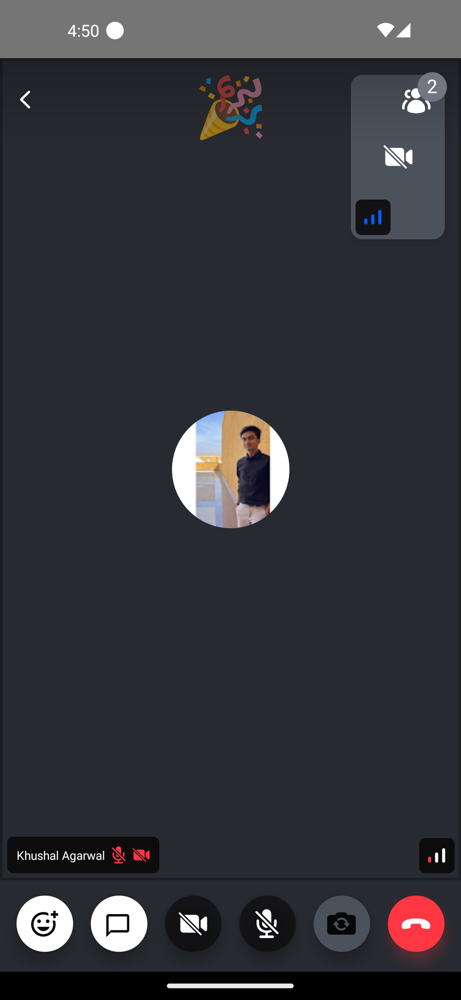

Reactions are a great way to communicate between users when you have limited speakers or even if the users are in mute mode.

You can send an emoji to the call with the code below:

```tsx
const reaction = {
  type: 'reaction',
  emoji_code: ':like:',
  custom: {},
};
const call = useCall();
call?.sendReaction(reaction);
```

## Reaction Mapper

Stream Video React Native SDK provides the default reaction mapper to display proper emojis. It basically handles a couple of default emojis, but you can customize those emoji maps by building your own mapper and passing it to [`supportedReactions`](../../ui-components/call/call-content/#supportedreactions) prop of `CallContent`.

Once you pass the reaction map here, it is automatically handled in the [`ParticipantReaction`](https://github.com/GetStream/stream-video-js/blob/main/packages/react-native-sdk/src/components/Participant/ParticipantView/ParticipantReaction.tsx) component.

```tsx
import {
  StreamReactionType,
  Call,
  CallContent,
  StreamCall,
} from '@stream-io/video-react-native-sdk';

const reactions: StreamReactionType[] = [
  {
    type: 'reaction',
    emoji_code: ':smile:',
    custom: {},
    icon: '😊',
  },
  {
    type: 'raised-hand',
    emoji_code: ':raise-hand:',
    custom: {},
    icon: '✋',
  },
  {
    type: 'reaction',
    emoji_code: ':fireworks:',
    custom: {},
    icon: '🎉',
  },
];

const VideoCallUI = () => {
  let call: Call;
  // your logic to create a new call or get an existing call

  return (
    <StreamCall call={call}>
      <CallContent supportedReactions={reactions} />
    </StreamCall>
  );
};
```

You can also use it in the [ReactionsControls](https://github.com/GetStream/stream-video-js/blob/main/packages/react-native-sdk/src/components/Call/CallControls/ReactionsButton.tsx) so as to list the supported reactions in the call controls and use them to send it.

```tsx
import {
  StreamReactionType,
  Call,
  CallContent,
  StreamCall,
  ReactionsButton,
} from '@stream-io/video-react-native-sdk';
import { View, StyleSheet } from 'react-native';

const reactions: StreamReactionType[] = [
  {
    type: 'reaction',
    emoji_code: ':smile:',
    custom: {},
    icon: '😊',
  },
  {
    type: 'raised-hand',
    emoji_code: ':raise-hand:',
    custom: {},
    icon: '✋',
  },
  {
    type: 'reaction',
    emoji_code: ':fireworks:',
    custom: {},
    icon: '🎉',
  },
];

const CustomCallControls = () => {
  return (
    <View style={styles.buttonGroup}>
      <ReactionsButton supportedReactions={supportedReactions} />
      {/* Other Call Controls */}
    </View>
  );
};

const VideoCallUI = () => {
  let call: Call;
  // your logic to create a new call or get an existing call

  return (
    <StreamCall call={call}>
      <CallContent CallControls={CustomCallControls} />
    </StreamCall>
  );
};

const styles = StyleSheet.create({
  buttonGroup: {
    flexDirection: 'row',
    justifyContent: 'space-evenly',
    paddingVertical: 10,
  },
});
```

## Custom Participant Reaction



You can customize the participant reaction by implementing your own reaction component and passing it to the [`CallContent`](../../ui-components/call/call-content) component.

```tsx
import { ParticipantReactionProps } from '@stream-io/video-react-native-sdk';
import { StyleSheet, Text, View } from 'react-native';

const CustomParticipantReaction = ({
  participant,
  supportedReactions,
}: ParticipantReactionProps) => {
  const { reaction } = participant;

  const currentReaction =
    reaction &&
    supportedReactions.find(
      (supportedReaction) =>
        supportedReaction.emoji_code === reaction.emoji_code,
    );

  return (
    <View style={styles.background}>
      <Text style={styles.reaction}>{currentReaction?.icon}</Text>
    </View>
  );
};

const styles = StyleSheet.create({
  background: {
    alignItems: 'center',
    justifyContent: 'center',
    zIndex: Z_INDEX.IN_FRONT,
  },
  reaction: {
    fontSize: 50,
  },
});
```

## Final Steps

Now this can be passed to the [`ParticipantReaction`](../../ui-components/call/call-content/#participantreaction) prop of the [`CallContent`](../../ui-components/call/call-content) component, as follows:

```tsx
import {
  Call,
  CallContent,
  StreamCall,
} from '@stream-io/video-react-native-sdk';

const VideoCallUI = () => {
  let call: Call;
  // your logic to create a new call or get an existing call

  const reactions: StreamReactionType[] = [
    {
      type: 'reaction',
      emoji_code: ':smile:',
      custom: {},
      icon: '😊',
    },
    {
      type: 'raised-hand',
      emoji_code: ':raise-hand:',
      custom: {},
      icon: '✋',
    },
    {
      type: 'reaction',
      emoji_code: ':fireworks:',
      custom: {},
      icon: '🎉',
    },
  ];

  return (
    <StreamCall call={call}>
      <CallContent
        // highlight-start
        supportedReactions={reactions}
        ParticipantReaction={CustomParticipantReaction}
        // highlight-end
      />
    </StreamCall>
  );
};
```

:::note
To get the participant data, you can use the following hooks from the `useCallStateHooks`:

- `useParticipants` hook that provides all the necessary details of all the participants.
- `useRemoteParticipants` hook that provides all the details of the participants other than the local participant.
- `useConnectedUser` or `useLocalParticipant` provides the details of the local or connected participant.

:::
