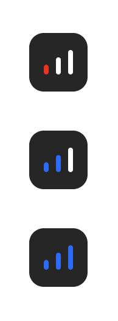
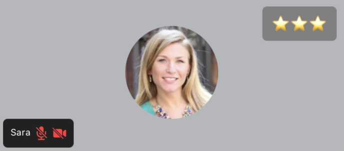

Network conditions are not always perfect so instead of playing guessing games as to why is someone's video so blurry our default [`ParticipantView`](../../ui-components/participants/participant-view/) component comes equipped with connection quality indicator which provides general information about that participants network conditions in four states:

- UNSPECIFIED
- POOR
- GOOD
- EXCELLENT

This is the preview of the Default Connection Quality Indicator:



In this guide we'll learn how to build and implement our own primitive connection quality indicator.

## How to reach the state

Each [`StreamVideoParticipant`](https://github.com/GetStream/stream-video-js/blob/main/packages/client/src/types.ts) has a `connectionQuality` property which by itself is just a numeric representation of values in a `SfuModels.ConnectionQuality` enumerator. To get a readable format out of it you can just pass the `connectionQuality` variable as a key to said enumerator:

```tsx
import { SfuModels } from '@stream-io/video-react-native-sdk';

const readableConnectionQuality =
  SfuModels.ConnectionQuality[participant.connectionQuality];

console.log(readableConnectionQuality); // -> EXCELLENT
```

## Custom Connection quality indicator component

You'll most likely be displaying this indicator component inside each participant view ([ParticipantView](../../ui-components/core/participant-view)) within a call layout. To achieve the customization you can follow the snippet below:



```tsx
import { Text, View } from 'react-native';
import {
  StreamVideoParticipant,
  StreamVideoLocalParticipant,
  useParticipants,
} from '@stream-io/video-react-native-sdk';
import participant from '@stream-io/video-react-native-sdk/dist/__tests__/mocks/participant';

const ConnectionQualityIndicator = ({
  participant,
}: {
  participant: StreamVideoParticipant | StreamVideoLocalParticipant;
}) => {
  return (
    <View style={styles.container}>
      <Text>{'⭐️'.repeat(participant.connectionQuality)}</Text>
    </View>
  );
};

const CustomParticipantViewUI = ({
  participant,
}: {
  participant: StreamVideoParticipant | StreamVideoLocalParticipant;
}) => {
  return (
    <>
      <ConnectionQualityIndicator participant={participant} />
      {/* your other custom UI elements */}
    </>
  );
};

const ParticipantView = () => {
  const participants = useParticipants();

  return (
    <View>
      {participants.map((participant) => {
        // Code for your custom participant view
        return (
          <View>
            {/* ParticipantLabel is rendered as a sub-component here */}
            <CustomParticipantViewUI participant={participant} />
          </View>
        );
      })}
    </View>
  );
};

const styles = StyleSheet.create({
  container: {
    backgroundColor: 'gray',
    padding: 10,
    margin: 20,
    borderRadius: 5,
    alignSelf: 'center',
  },
});
```
