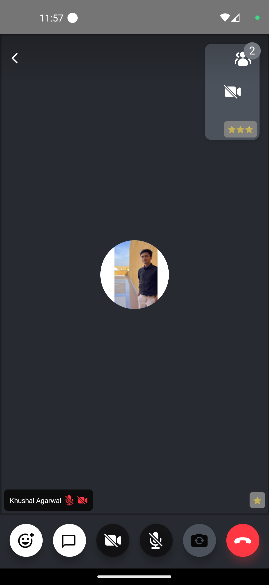

Network conditions are not always perfect so instead of playing guessing games as to why is someone's video so blurry our default [`ParticipantView`](../../ui-components/participants/participant-view/) component comes equipped with network quality indicator which provides general information about that participants network conditions in four states:

- UNSPECIFIED
- POOR
- GOOD
- EXCELLENT

This is the preview of the Default Network Quality Indicator:


In this guide we'll learn how to build and implement our own primitive network quality indicator:

## Custom Network Quality Indicator

You'll most likely be displaying this indicator component inside each participant view ([Participant](../../ui-components/participants/participant-view)) within a call layout. To achieve the customization you can follow the snippet below:



```tsx
import { Text, View } from 'react-native';
import {
  useParticipants,
  ParticipantNetworkQualityIndicatorProps,
} from '@stream-io/video-react-native-sdk';

const CustomNetworkQualityIndicator = ({
  participant,
}: ParticipantNetworkQualityIndicatorProps) => {
  return (
    <View style={styles.container}>
      <Text style={styles.connection}>
        {'⭐️'.repeat(participant.connectionQuality)}
      </Text>
    </View>
  );
};

const styles = StyleSheet.create({
  container: {
    backgroundColor: 'gray',
    borderRadius: 5,
    alignSelf: 'center',
    padding: 5,
  },
  connection: {
    fontSize: 10,
  },
});
```

## Final Steps

Now this can be passed to the [`ParticipantNetworkQualityIndicator`](../../ui-components/call/call-content/#participantnetworkqualityindicator) prop of the [`CallContent`](../../ui-components/call/call-content) component, as follows:

```tsx {13-15}
import {
  Call,
  CallContent,
  StreamCall,
} from '@stream-io/video-react-native-sdk';

const VideoCallUI = () => {
  let call: Call;
  // your logic to create a new call or get an existing call

  return (
    <StreamCall call={call}>
      <CallContent
        ParticipantNetworkQualityIndicator={CustomNetworkQualityIndicator}
      />
    </StreamCall>
  );
};
```

:::note
To get the participant data, you can use the following hooks from the `useCallStateHooks`:

- `useParticipants` hook that provides all the necessary details of all the participants.
- `useRemoteParticipants` hook that provides all the details of the participants other than the local participant.
- `useConnectedUser` or `useLocalParticipant` provides the details of the local or connected participant.

:::
