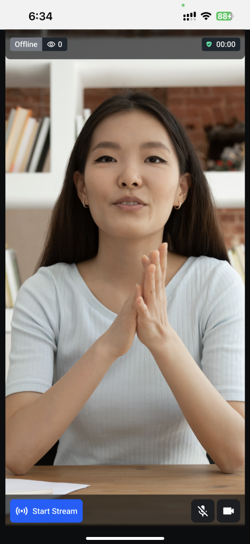
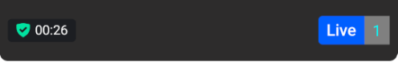

The Video API allows you to assign specific roles for users in a livestream, such as hosts and viewers. Our SDK provides dedicated livestreaming components for both of these roles.

For the host role, our React Native SDK includes the specialized `HostLivestream` component.

### Default component

For the host role, our React Native SDK includes the specialized [`HostLivestream`](../../ui-components/livestream/host-livestream) component.

Here is a preview of the above component in video mode:



```tsx
import {
  HostLivestream,
  StreamVideo,
  StreamCall,
} from '@stream-io/video-react-native-sdk';

export const MyLivestreamApp = () => {
  // init client and call here...
  return (
    <StreamVideo client={client}>
      <StreamCall call={call}>
        <HostLivestream />
      </StreamCall>
    </StreamVideo>
  );
};
```

### Adding customization

The `HostLivestream` provides a lot of customization options that can be passed as props:

- `HostLivestreamTopView` allows customizing the top view or the header of the `HostLivestream`. It contains the `LiveIndicator`, `FollowerCount`, and the `DurationBadge` component by default.
- `LivestreamLayout` allows customizing the main video layout component of the `HostLivestream`.
- `HostLivestreamControls` allows customizing the bottom livestream controls component of the `HostLivestream`. It contains the `HostStartStreamButton` and the `LivestreamMediaControls` component by default.
- `LiveIndicator` allows customizing the live indicator component that is present in the top view of the `HostLivestream`.
- `FollowerCount` allows customizing the follower count component that is present in the top view of the `HostLivestream`.
- `DurationBadge` allows customizing the duration badge that shows the duration of the livestream in the top view of the `HostLivestream`.
- `HostStartStreamButton` allows customizing the start/end button of the livestream on the controls of the `HostLivestream`.
- `LivestreamMediaControls` allows customizing the media controls button of the livestream on the controls of the `HostLivestream`.
- `onEndStreamHandler` allows full override of the default functionality on what should happen when host ends the streaming using `HostStartStreamButton`.
- `onStartStreamHandler` allows full override of the default functionality on what should happen when host starts the streaming using `HostStartStreamButton`.

An example to customize the `FollowerCount` component is shown below:

```tsx
import {
  HostLivestream,
  StreamVideo,
  StreamCall,
  useCallStateHooks,
} from '@stream-io/video-react-native-sdk';
import { View, Text, StyleSheet } from 'react-native';

const FollowerCountComponent = () => {
  const { useParticipantCount } = useCallStateHooks();
  const totalParticipants = useParticipantCount();

  return (
    <View style={styles.container}>
      <Text style={styles.label}>{totalParticipants}</Text>
    </View>
  );
};

export const MyLivestreamApp = () => {
  // init client and call here...
  return (
    <StreamVideo client={client}>
      <StreamCall call={call}>
        <HostLivestream FollowerCount={FollowerCountComponent} />
      </StreamCall>
    </StreamVideo>
  );
};

const styles = StyleSheet.create({
  container: {
    paddingHorizontal: 8,
    paddingVertical: 4,
    backgroundColor: 'gray',
  },
  label: {
    color: 'cyan',
    fontSize: 15,
  },
});
```

Result:


