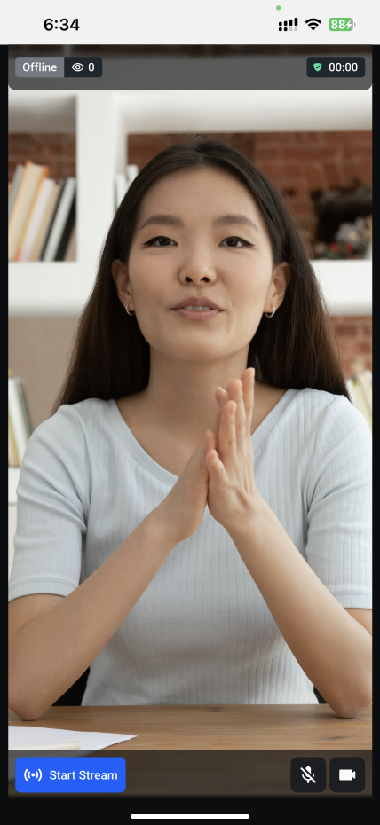

import ImageShowcase from '@site/src/components/ImageShowcase';
import ViewerLivestream from '../assets/05-ui-cookbook/13-livestream/viewer-livestream.png';
import ViewerLivestreamScreenShare from '../assets/05-ui-cookbook/13-livestream/viewer-livestream-screenshare.png';

As you might be aware that there are two types of livestream users: a host or a viewer. Our SDK exports component for both the modes.

In our [livestream tutorial](../../tutorials/livestream), there are two ways how a livestream can be watched: either via HLS or via WebRTC.

This guide describes how to customize the host or viewer livestream on our SDK.

### Default components

Our React Native SDK provides two specialized components for it: the [`HostLivestream`](../../ui-components/livestream/host-livestream) and the [`ViewerLivestream`](../../ui-components/livestream/viewer-livestream).

Here is a preview of the above components in video mode:

#### HostLivestream



```tsx
import {
  HostLivestream,
  StreamVideo,
  StreamCall,
} from '@stream-io/video-react-native-sdk';

export const MyLivestreamApp = () => {
  // init client and call here...
  return (
    <StreamVideo client={client}>
      <StreamCall call={call}>
        <HostLivestream />
      </StreamCall>
    </StreamVideo>
  );
};
```

#### ViewerLivestream

<ImageShowcase
  items={[
    {
      image: ViewerLivestream,
      caption: 'Viewer Livestream',
      alt: 'Viewer Livestream',
    },
    {
      image: ViewerLivestreamScreenShare,
      caption: 'Viewer Livestream Screen Share',
      alt: 'Viewer Livestream Screen Share',
    },
  ]}
/>

```tsx
import {
  ViewerLivestream,
  StreamVideo,
  StreamCall,
} from '@stream-io/video-react-native-sdk';

export const MyLivestreamApp = () => {
  // init client and call here...
  return (
    <StreamVideo client={client}>
      <StreamCall call={call}>
        <ViewerLivestream />
      </StreamCall>
    </StreamVideo>
  );
};
```

### Adding customization

The `HostLivestream` provides a lot of customization options that can be passed as props:

- `HostLivestreamTopView` allows customizing the top view or the header of the `HostLivestream`. It contains the `LiveIndicator`, `FollowerCount`, and the `DurationBadge` component by default.
- `LivestreamLayout` allows customizing the main video layout component of the `HostLivestream`.
- `HostLivestreamControls` allows customization of the bottom livestream controls component of the `HostLivestream`. It contains the `HostStartStreamButton` and the `LivestreamMediaControls` component by default.
- `LiveIndicator` allows customizing the live indicator component that is present in the top view of the `HostLivestream`.
- `FollowerCount` allows customization of the follower count component that is present in the top view of the `HostLivestream`.
- `DurationBadge` allows customizing the duration badge that shows the duration of the livestream in the top view of the `HostLivestream`.
- `HostStartStreamButton` allows customization of the start/end button of the livestream on the controls of the `HostLivestream`.
- `LivestreamMediaControls` allows customization of the media controls button of the livestream on the controls of the `HostLivestream`.
- `onEndStreamHandler` allows full override of the default functionality on what should happen when host ends the streaming using `HostStartStreamButton`.
- `onStartStreamHandler` allows full override of the default functionality on what should happen when host starts the streaming using `HostStartStreamButton`.

Example:

```tsx
import {
  HostLivestream,
  StreamVideo,
  StreamCall,
  useCallStateHooks,
} from '@stream-io/video-react-native-sdk';
import { View, Text, StyleSheet } from 'react-native';

const FollowerCountComponent = () => {
  const { useParticipantCount } = useCallStateHooks();
  const totalParticipants = useParticipantCount();

  return (
    <View style={styles.container}>
      <Text style={styles.label}>{totalParticipants}</Text>
    </View>
  );
};

export const MyLivestreamApp = () => {
  // init client and call here...
  return (
    <StreamVideo client={client}>
      <StreamCall call={call}>
        <HostLivestream FollowerCount={FollowerCountComponent} />
      </StreamCall>
    </StreamVideo>
  );
};

const styles = StyleSheet.create({
  container: {
    paddingHorizontal: 8,
    paddingVertical: 4,
    backgroundColor: 'gray',
  },
  label: {
    color: 'cyan',
    fontSize: 15,
  },
});
```

Result:


#### ViewerLivestream

The `HostLivestream` provides a lot of customization options that can be passed as props:

- `ViewerLivestreamTopView` allows customizing the top view or the header of the `ViewerLivestream`. It contains the `LiveIndicator`, `FollowerCount`, and the `DurationBadge` component by default.
- `LivestreamLayout` allows customizing the main video layout component of the `ViewerLivestream`.
- `ViewerLivestreamControls` allows customization of the bottom livestream controls component of the `ViewerLivestream`. It contains the `HostStartStreamButton` and the `LivestreamMediaControls` component by default.
- `LiveIndicator` allows customizing the live indicator component that is present in the top view of the `ViewerLivestream`.
- `FollowerCount` allows customization of the follower count component that is present in the top view of the `ViewerLivestream`.
- `DurationBadge` allows customizing the duration badge that shows the duration of the livestream in the top view of the `ViewerLivestream`.
- `ViewerLeaveStreamButton` allows customization of the leave button of the livestream on the controls of the `ViewerLivestream`.
- `FloatingParticipantView` allows customization of the Floating Participant View that renders the video of the participant when screen is shared.
- `onLeaveStreamHandler` allows full override of the default functionality on what should happen when host ends the streaming using `ViewerLeaveStreamButton`.

```tsx
import {
  ViewerLivestream,
  StreamVideo,
  StreamCall,
  useCall,
} from '@stream-io/video-react-native-sdk';
import { Button } from 'react-native';

const ViewerLeaveStreamButtonComponent = () => {
  const call = useCall();

  const onPressHandler = async () => {
    await call.leave();
  };

  return <Button title="Leave Stream" onPress={onPressHandler} />;
};

export const MyLivestreamApp = () => {
  // init client and call here...
  return (
    <StreamVideo client={client}>
      <StreamCall call={call}>
        <ViewerLivestream
          ViewerLeaveStreamButton={ViewerLeaveStreamButtonComponent}
        />
      </StreamCall>
    </StreamVideo>
  );
};
```

Result:


