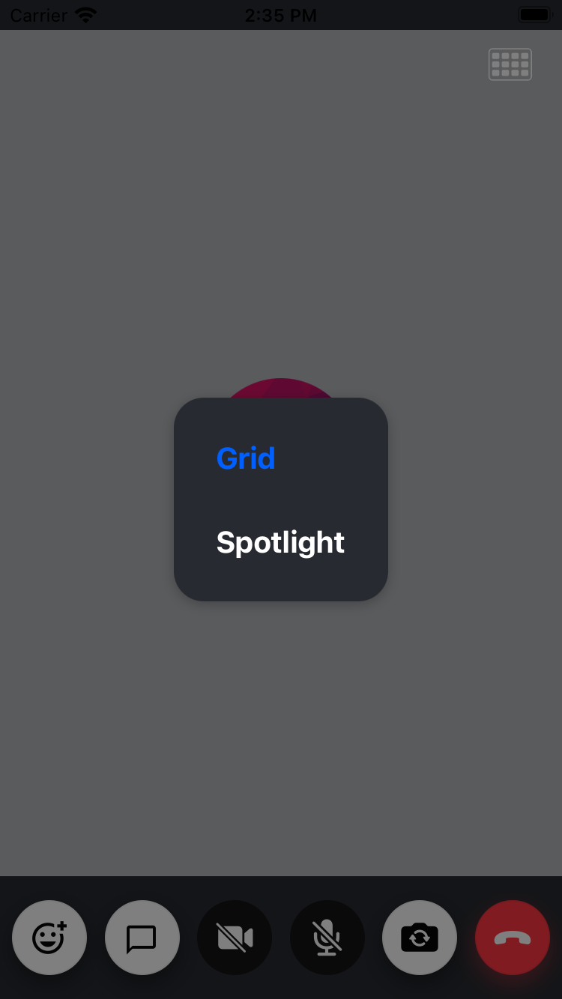

Runtime Layout Switching is basically switching the participant's layout from the app. We currently support switching between grid and spotlight layout modes through our SDK.

### Switching the layout from the App

To switch the layout from the app we can take the help of the [`mode`](../../ui-components/call/call-content/#mode) prop of the [CallContent](../../ui-components/call/call-content) component.

We will create a state variable in the app to track the state of the current layout and pass the state to the [`mode`](../../ui-components/call/call-content/#mode) prop of the [CallContent](../../ui-components/call/call-content) component.. This is done below:

```tsx
import React from 'react';
import {
  CallContent,
  CallControls,
  ParticipantsInfoBadge,
} from '@stream-io/video-react-native-sdk';
import { SafeAreaView, StyleSheet, View } from 'react-native';

export const VideoCallUI = () => {
  // highlight-next-line
  const [selectedLayout, setSelectedLayout] = useState<Layout>('grid');
  return (
    <SafeAreaView style={styles.container}>
      <View style={styles.icons}>
        <ParticipantsInfoBadge />
        // highlight-start
        <ParticipantsLayoutSwitchButton
          selectedLayout={selectedLayout}
          setSelectedLayout={setSelectedLayout}
        />
        // highlight-end
      </View>
      <CallContent mode={selectedLayout} />
      <CallControls />
    </SafeAreaView>
  );
};

const styles = StyleSheet.create({
  container: {
    flex: 1,
    backgroundColor: '#272A30',
  },
  icons: {
    position: 'absolute',
    right: 16,
    marginTop: 16,
    flexDirection: 'row',
    alignItems: 'center',
    zIndex: 2,
  },
});
```

### Creating the Layout switching Modal/Component

We will create a component that renders the Button which on press opens up a Modal to switch the Layout. Clicking on the layout item will switch the layout and set the state for the `selectedLayout` state in the `VideoCallUI` component that we created above.



```tsx
import React, { useState } from 'react';
import { Pressable, Text, Modal, StyleSheet, View } from 'react-native';
import GridIconSvg from '../assets/GridIconSvg';
import { CallContentProps } from '@stream-io/video-react-native-sdk';

type Layout = CallContentProps['mode'];

// Component for Individual Layout Item
const LayoutSelectionItem = ({
  layout,
  selectedLayout,
  setSelectedLayout,
  closeModal,
}: {
  layout: Layout;
  selectedLayout: Layout;
  setSelectedLayout: (mode: Layout) => void;
  closeModal: () => void;
}) => {
  if (!layout) {
    return null;
  }

  return (
    <Pressable
      onPress={() => {
        setSelectedLayout(layout);
        closeModal();
      }}
      style={styles.modalButton}
    >
      <Text
        style={[
          styles.modalText,
          {
            color: selectedLayout === layout ? '#005FFF' : '#ffffff',
          },
        ]}
      >
        {layout[0].toUpperCase() + layout.substring(1)}
      </Text>
    </Pressable>
  );
};

// The Component that renders a Button which on click opens up the Modal with options to choose the Layout
export const ParticipantsLayoutSwitchButton = ({
  selectedLayout,
  setSelectedLayout,
}: {
  selectedLayout: Layout;
  setSelectedLayout: (m: Layout) => void;
}) => {
  const [modalVisible, setModalVisible] = useState(false);
  const closeModal = () => setModalVisible(false);

  return (
    <>
      <Modal
        animationType="fade"
        transparent
        visible={modalVisible}
        onRequestClose={closeModal}
      >
        <Pressable
          style={styles.centeredView}
          onPress={() => setModalVisible(false)}
        >
          <View style={styles.modalView} onStartShouldSetResponder={() => true}>
            <LayoutSelectionItem
              layout="grid"
              selectedLayout={selectedLayout}
              setSelectedLayout={setSelectedLayout}
              closeModal={closeModal}
            />
            <LayoutSelectionItem
              layout="spotlight"
              selectedLayout={selectedLayout}
              setSelectedLayout={setSelectedLayout}
              closeModal={closeModal}
            />
          </View>
        </Pressable>
      </Modal>

      <View style={styles.buttonsContainer}>
        <Pressable
          onPress={() => setModalVisible(true)}
          style={styles.gridButton}
        >
          <GridIconSvg />
        </Pressable>
      </View>
    </>
  );
};

const styles = StyleSheet.create({
  centeredView: {
    flex: 1,
    justifyContent: 'center',
    alignItems: 'center',
    backgroundColor: 'rgba(0, 0, 0, 0.5)',
  },
  modalView: {
    backgroundColor: '#272A30',
    borderRadius: 20,
    padding: 12,
    alignItems: 'flex-start',
    shadowColor: '#000000',
    shadowOffset: {
      width: 0,
      height: 2,
    },
    shadowOpacity: 0.25,
    shadowRadius: 4,
    elevation: 5,
  },
  gridButton: {
    height: 30,
    width: 30,
  },
  modalButton: {
    padding: 16,
  },
  modalText: {
    fontSize: 20,
    fontWeight: 'bold',
  },
  buttonsContainer: {
    paddingHorizontal: 8,
  },
});
```
