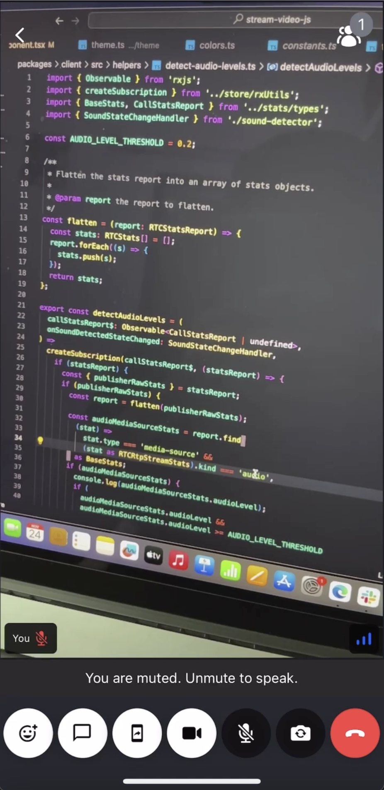

It's a UI best practice to show some visual feedback when the user is speaking while muted. You can observe the state for this in call.state.speakingWhileMuted.

### Custom Speaking while muted Component

Our speaking-while-muted notification component will be based on simple principle of reading the `isSpeakingWhileMuted` state of the currently selected mic. The UI will be rendered only, when `isSpeakingWhileMuted` is set to true.

This can be derived from `useMicrophoneState` hook available in `useCallStateHooks`.



```tsx
import { useCallStateHooks } from '@stream-io/video-react-sdk';

export const SpeakingWhileMutedNotification = () => {
  const { useMicrophoneState } = useCallStateHooks();
  const { isSpeakingWhileMuted } = useMicrophoneState();

  if (!isSpeakingWhileMuted) return null;
  return <Text>You are muted. Unmute to speak.</Text>;
};
```
