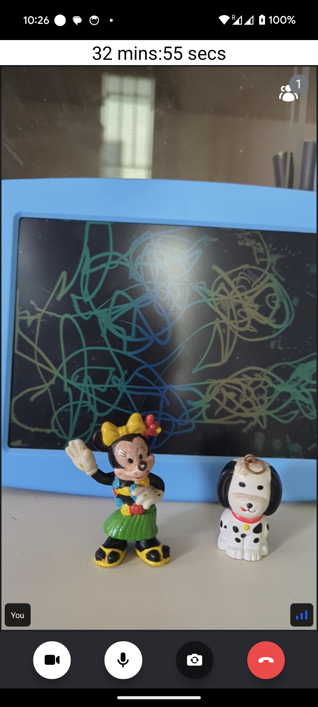
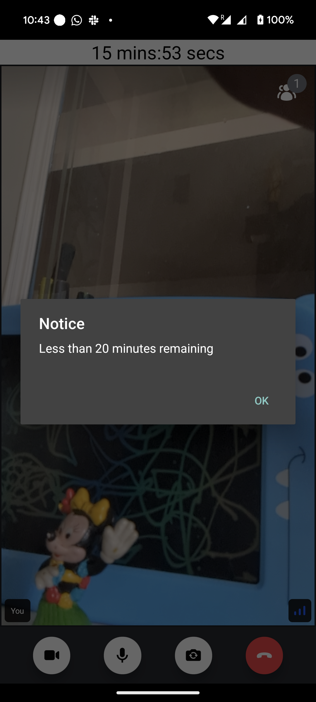
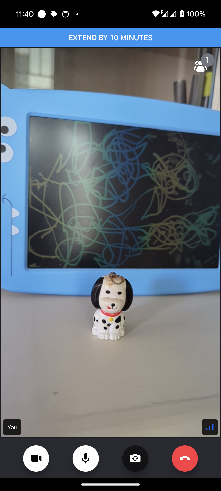

import Tabs from '@theme/Tabs';
import TabItem from '@theme/TabItem';

A session timer allows you to **limit the maximum duration** of a call. It's
possible to
[configure a session timer](https://getstream.io/video/docs/api/calls/#session-timers)
for a single call, or every call of a certain type. When a session timer
reaches zero, the call automatically ends, making it a great tool for managing
paid appointments.

## Low-level client capabilities
​
First, let's see how we can create a single call that has a limited duration.

```ts
const client = useStreamVideoClient();
const callType = "default";
const callId = "12345";

const newCall = client.call(callType, callId);
await newCall.create({
  data: {
    settings_override: {
      limits: {
        max_duration_seconds: 3600,
      },
    },
  },
});
```

This code will create a call, which will have a duration of 3600 seconds (1 hour), as soon as the session is started (a participant joined the call).

You can check the start date of a call with the following code:

```ts
const { useCallSession } = useCallStateHooks();
const session = useCallSession();

const started_at = session?.started_at;
```

When the `max_duration_seconds` of a call is specified, the call session also provides the `timer_ends_at` value, which provides the date when the call will end. When a call is ended, all the participants are removed from the call.

```ts
const { useCallSession } = useCallStateHooks();
const session = useCallSession();

const timer_ends_at = session?.timer_ends_at;
```

### Extending the call duration
​
You can also extend the duration of a call, both before or during the call. To do that, you should use the `call.update` method:

```ts
  const { useCallSettings } = useCallStateHooks();
  const settings = useCallSettings();

  // extend by 1 minute
  const new_max_duration_seconds = settings.limits.max_duration_seconds + 60;

  await call.update({
    settings_override: {
      limits: {
        max_duration_seconds: new_max_duration_seconds,
      },
    },
  });
```


When the call duration is extended, the `timer_ends_at`  will be updated to reflect that change.

## Example implementation

In this article, we'll integrate a session timer into a sample telemedicine
application. We assume that two users are joining a call: a medical specialist 
and a patient. Each appointment lasts 30 minutes, but the specialist can extend the appointment if necessary.

### Prerequisites

Let's start by setting up an application. Here's what we need:

1. Separate user roles for a medical specialist (`specialist`) and a patient
   (`patient`)
2. An `appointment` call type with a maximum duration of 30 minutes
3. Two test users, one for each call (we'll call them `dr-lecter` and `bill`)
4. One test call of an `appointment` type

The quickest way to set up these requirements is to use the **server-side Node.js
SDK**. Let us create a one-off Node.js script. So let's install it in a project:

<Tabs>
  <TabItem value="yarn" label="yarn" default>

```bash
yarn add @stream-io/node-sdk
```

  </TabItem>
  <TabItem value="npm" label="npm">

```bash
npm install @stream-io/node-sdk
```

  </TabItem>
</Tabs>

Then create a one-off Node.js script with the following:

```ts title="script.ts"
import { StreamClient, VideoOwnCapability } from "@stream-io/node-sdk";

const apiKey = "REPLACE_WITH_API_KEY";
const secret = "REPLACE_WITH_SECRET";
const client = new StreamClient(apiKey, secret);

async function main() {
  // 1. Roles for a medical specialist (`specialist`) and a patient:
  await client.createRole({ name: "specialist" });
  await client.createRole({ name: "patient" });

  // 2. Call type with the maximum duration of 30 minutes:
  await client.video.createCallType({
    name: "appointment",
    grants: {
      specialist: [
        VideoOwnCapability.JOIN_CALL,
        VideoOwnCapability.SEND_AUDIO,
        VideoOwnCapability.SEND_VIDEO,
        // These capabilities are required to change session duration:
        VideoOwnCapability.UPDATE_CALL,
        VideoOwnCapability.UPDATE_CALL_SETTINGS,
      ],
      patient: [
        VideoOwnCapability.JOIN_CALL,
        VideoOwnCapability.SEND_AUDIO,
        VideoOwnCapability.SEND_VIDEO,
      ],
    },
    settings: {
      limits: {
        // 3600 seconds = 1 hour
        max_duration_seconds: 3600,
      },
    },
  });

  // 3. Two test users:
  await client.upsertUsers({
    users: {
      "dr-lecter": {
        id: "dr-lecter",
        name: "Dr. Hannibal Lecter",
        role: "specialist",
      },
      bill: {
        id: "bill",
        name: "Buffalo Bill",
        role: "patient",
      },
    },
  });

  // 4. Test call:
  await client.video.call("appointment", "test-call").create({
    data: {
      members: [{ user_id: "dr-lecter" }, { user_id: "bill" }],
      created_by_id: "dr-lecter",
    },
  });
}

main();
```

Now, run the script with the following:

```bash
 npx ts-node script.ts
```

We can verify that the script ran successfully by checking the `Call Types` and
the `Roles & Permissions` sections in the application [dashboard](https://dashboard.getstream.io/).

Now we're ready to add a session timer to our application. If you haven't
already bootstrapped a video calling application (our
[Video Calling Tutorial](https://getstream.io/video/sdk/react-native/tutorial/video-calling/)
is a great place to start!), here's a very simple application that we'll use as
a starting point:

```tsx
import {
  Call,
  CallContent,
  StreamCall,
  StreamVideo,
  StreamVideoClient,
} from '@stream-io/video-react-native-sdk';
import React, { useState, useEffect } from 'react';
import { ActivityIndicator, SafeAreaView, StyleSheet } from 'react-native';

const client = new StreamVideoClient({
  apiKey: 'REPLACE_WITH_API_KEY',
  user: {
    /* one of the test users */
    id: 'bill',
    name: 'Buffalo Bill',
  },
  token: 'REPLACE_WITH_USER_TOKEN',
});

const RootContainer = (props: React.PropsWithChildren<{}>) => {
  return <SafeAreaView style={styles.container}>{props.children}</SafeAreaView>;
};

const callId = 'test-call';

const App = () => {
  const [call, setCall] = useState<Call>();

  useEffect(() => {
    const newCall = client.call('appointment', callId);
    newCall
      .join()
      .then(() => setCall(newCall))
      .catch(() => console.error('Failed to join the call'));

    return () => {
      newCall.leave().catch(() => console.error('Failed to leave the call'));
    };
  }, []);

  if (!call) {
    return (
      <RootContainer>
        <ActivityIndicator size={'large'} />
      </RootContainer>
    );
  }

  return (
    <RootContainer>
      <StreamVideo client={client}>
        <StreamCall call={call}>
          <CallContent />
        </StreamCall>
      </StreamVideo>
    </RootContainer>
  );
};

const styles = StyleSheet.create({
  container: {
    backgroundColor: 'black',
    flex: 1,
    justifyContent: 'center',
  },
});

export default App;
```

### Session Timer Component

After joining the call, we can examine the `session.timer_ends_at` property: if
the session timer has been set up, it contains the timestamp at which point the
call automatically ends.

Let's implement a component that displays a countdown to the end of the session:

```tsx
import { useCallStateHooks } from '@stream-io/video-react-native-sdk';
import { StyleSheet, Text, View } from 'react-native';


const useSessionTimer = () => {
  const { useCallSession } = useCallStateHooks();
  const session = useCallSession();
  const [remainingMs, setRemainingMs] = useState(Number.NaN);

  useEffect(() => {
    if (!session?.timer_ends_at) {
      return;
    }
    const timeEndAtMillis = new Date(session.timer_ends_at).getTime();
    const handle = setInterval(() => {
      setRemainingMs(timeEndAtMillis - Date.now());
    }, 500);
    return () => clearInterval(handle);
  }, [session?.timer_ends_at]);

  return remainingMs;
};

function convertMillis(milliseconds: number) {
  // Calculate the number of minutes and seconds
  const minutes = Math.floor(milliseconds / 60000);
  const seconds = ((milliseconds % 60000) / 1000).toFixed(0);

  // Format the output
  return `${minutes} mins:${seconds.padStart(2, '0')} secs`;
}

const SessionTimer = () => {
  const remainingMs = useSessionTimer();
  return (
    <View style={styles.sessionTimer}>
      <Text style={styles.sessionTimerText}>{convertMillis(remainingMs)}</Text>
    </View>
  );
};

const styles = StyleSheet.create({
  sessionTimer: {
    top: 0,
    left: 0,
    right: 0,
    backgroundColor: 'white',
  },
  sessionTimerText: {
    color: 'black',
    fontSize: 24,
    textAlign: 'center',
  },
});
```

And now by adding this component inside of the `StreamCall`, we get a ticking
countdown in the call UI:

```tsx
<StreamVideo client={client}>
  <StreamCall call={call}>
    // highlight-next-line
    <SessionTimer />
    <CallContent />
  </StreamCall>
</StreamVideo>
```



### Adding Alerts

It's easy to lose track of time during a meeting and then be surprised when time
runs out. Let's add an alert that pops up on the page twenty minutes before the
session timer reaches zero:

```tsx
import { Alert } from 'react-native';

const useSessionTimerAlert = (remainingMs: number, thresholdMs: number) => {
  const didAlert = useRef(false);

  useEffect(() => {
    if (!didAlert.current && remainingMs < thresholdMs) {
      Alert.alert(
        'Notice',
        `Less than ${thresholdMs / 60000} minutes remaining`,
      );
      didAlert.current = true;
    }
  }, [remainingMs, thresholdMs]);
};

const SessionTimer = () => {
  const remainingMs = useSessionTimer();
  // highlight-next-line
  useSessionTimerAlert(remainingMs, 20 * 60 * 1000);
  return (
    <View style={styles.sessionTimer}>
      <Text style={styles.sessionTimerText}>{convertMillis(remainingMs)}</Text>
    </View>
  );
};
```



Similarly, we can show an alert when the call session is over (when time has elapsed): 

```tsx
const useSessionEndedAlert = (remainingMs: number) => {
  const didAlert = useRef(false);

  useEffect(() => {
    if (!didAlert.current && remainingMs <= 0) {
      Alert.alert(
        'Call ended'
      );
      didAlert.current = true;
    }
  }, [remainingMs]);
};
```

### Extending a Session

The `specialist` user role that we created has the permission to update call
settings, granting it the `change-max-duration` capability, which allows a user
to change the duration of a call. Let's add a component that updates the call
settings and extends a session by the specified number of seconds:

```jsx
import {
  OwnCapability,
  useCall,
  useCallStateHooks,
} from '@stream-io/video-react-native-sdk';
import { Button } from 'react-native';

const ExtendSessionButton = ({
  durationSecsToExtend,
}: {
  durationSecsToExtend: number;
}) => {
  const call = useCall();
  const { useCallSettings, useHasPermissions } = useCallStateHooks();
  const settings = useCallSettings();
  const canExtend = useHasPermissions(OwnCapability.CHANGE_MAX_DURATION);

  if (!canExtend) {
    return null;
  }

  const onPress = () => {
    call?.update({
      settings_override: {
        limits: {
          max_duration_seconds:
            (settings?.limits?.max_duration_seconds ?? 0) +
            durationSecsToExtend,
        },
      },
    });
  };

  return (
    <Button
      onPress={onPress}
      title={`Extend by ${Math.round(((durationSecsToExtend / 60) * 10) / 10)} minutes`}
    />
  );
};

// Somewhere inside <StreamCall>:
<ExtendSessionButton durationSecsToExtend={10 * 60} />;
```

:::infoINFO
The button is only visible to the user with `specialist` role.
:::



When the call settings are updated, all the states from the SDK are updated automatically, so
our `SessionTimer` component always reflects the current settings.

<!-- Similar to other permissions, the `CHANGE_MAX_DURATION` capability can be
[requested](../../guides/permissions-and-moderation/#request-permissions) by the
user. The default `PermissionRequests` component is well suited for handling
incoming permission requests. We also have a handy article on
[how to implement your own UI](../permission-requests). -->
