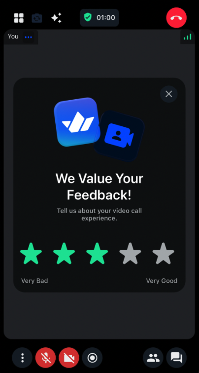

## Introduction

In this guide, we are going to show how one can build a call quality rating form on top of our React Native Video SDK.
It is a good practice to ask your end users about their overall experience after the end of the call or, while being in a call.

Here is a preview of the component we are going to build:


## Submit Feedback API

Our React Native Video SDK provides an API for collecting this feedback which later can be seen in the call stats section of our dashboard.

```ts
await call.submitFeedback(
  rating, // a rating grade from 1 - 5,
  {
    reason: '<no-message-provided>', // optional reason message
    custom: {
      // ... any extra properties that you wish to collect
    },
  }
);
```

## Implementation

```tsx
import React, { useState } from 'react';
import {
  View,
  Text,
  TouchableOpacity,
  StyleSheet,
  Modal,
  Image,
} from 'react-native';
import { useCall } from '@stream-io/video-react-native-sdk';
import Star from '../assets/Star';
import Close from '../assets/Close';

const FeedbackModal: = () => {
  const call = useCall();
  const [selectedRating, setSelectedRating] = useState<number | null>(null);

  const handleRatingPress = (rating: number) => {
    setSelectedRating(rating);
    await call
      ?.submitFeedback(Math.min(Math.max(1, rating), 5), {
        reason: '<no-message-provided>',
      })
      .catch((err) => console.warn('Failed to submit call feedback', err));
  };

  return (
    <Modal
      transparent
      visible={visible}
      onRequestClose={onClose}
    >
      <TouchableOpacity style={styles.overlay} onPress={onClose}>
        <View style={[styles.modal]}>
          <View style={styles.top}>
            <View style={styles.topRight}>
              <TouchableOpacity onPress={onClose} style={[styles.closeButton]}>
                <IconWrapper>
                  <Close
                    color={colors.typeSecondary}
                    size={variants.roundButtonSizes.sm}
                  />
                </IconWrapper>
              </TouchableOpacity>
            </View>
          </View>
          <Image source={require('../assets/feedbackLogo.png')} />
          <View style={styles.textContainer}>
            <Text style={styles.title}>We Value Your Feedback!</Text>
            <Text style={styles.subtitle}>
              Tell us about your video call experience.
            </Text>
          </View>
          <View style={styles.ratingContainer}>
            {[1, 2, 3, 4, 5].map((rating) => (
              <TouchableOpacity
                key={rating}
                onPress={() => handleRatingPress(rating)}
                style={[styles.ratingButton]}
              >
                <Star
                  color={
                    selectedRating && selectedRating >= rating
                      ? colors.iconAlertSuccess
                      : colors.typeSecondary
                  }
                />
              </TouchableOpacity>
            ))}
          </View>
          <View style={styles.bottom}>
            <View style={styles.left}>
              <Text style={styles.text}>Very Bad</Text>
            </View>
            <View style={styles.right}>
              <Text style={styles.text}>Very Good</Text>
            </View>
          </View>
        </View>
      </TouchableOpacity>
    </Modal>
  );
};
```

:::note
For simplicity, the StyleSheet is not included in this guide.
:::
