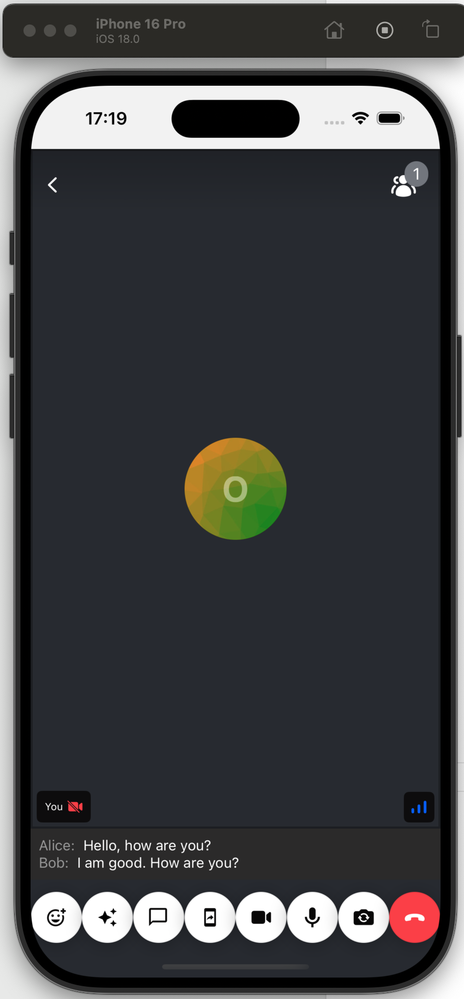

The Stream API supports adding real-time closed captions (subtitles for participants) to your calls.
This guide shows you how you can build it on top of our React Native SDK.



## Prerequisites

Make sure that the closed caption feature is enabled in your app's dashboard.
The closed caption feature can be set on the call type level, and the available options are:

- `available`: the feature is available for your call and can be enabled.
- `disabled`: the feature is not available for your call. In this case, it's a good idea to "hide" any UI element you have related to closed captions.
- `auto-on`: the feature is available and will be enabled automatically once the user is connected to the call.

It's also possible to override the call type's default when creating a call:

```ts
await call.getOrCreate({
  data: {
    settings_override: {
      transcription: {
        mode: 'available',
        closed_caption_mode: 'available',
      },
    },
  },
});
```

For the purposes of this article, make sure that closed captions are either `available` or `auto-on`.

## Enabling, disabling and tweaking closed captions

```tsx
await call.startClosedCaptions(); // enable closed captions
await call.stopClosedCaptions(); // disable closed captions

call.updateClosedCaptionSettings({
  retentionTimeInMs: 2700, // the duration a caption can stay in the queue
  queueSize: 2, // number of captions that can be stored in the queue
});
```

## Check if closed captions are enabled

```tsx
import { useCallStateHooks } from '@stream-io/video-react-native-sdk';

const { useIsCallCaptioningInProgress } = useCallStateHooks();
const isCaptioningInProgress = useIsCallCaptioningInProgress();

console.log(
  `Closed captions are ${isCaptioningInProgress ? 'enabled' : 'disabled'}`
);
```

## Rendering closed captions

In the next two sections, we will show you how to render closed captions in your call UI and
how to toggle the closed captions on and off.

### Closed Captions UI

Once enabled, the SDK will expose the closed caption events to your application via a special `useCallClosedCaptions` hook.
This is how it can be used:

```tsx
import { StyleSheet, Text, View } from 'react-native';
import { useCallStateHooks } from '@stream-io/video-react-native-sdk';

export const ClosedCaptions = () => {
  const { useCallClosedCaptions } = useCallStateHooks();
  const closedCaptions = useCallClosedCaptions();
  return (
    <View style={styles.rootContainer}>
      {closedCaptions.map(({ user, start_time, text }) => (
        <View style={styles.closedCaptionItem} key={`${user.id}/${start_time}`}>
          <Text style={styles.speakerName}>{user.name}:</Text>
          <Text style={styles.closedCaption}>{text}</Text>
        </View>
      ))}
    </View>
  );
};

const styles = StyleSheet.create({}); // omitted for brevity
```

### Toggling closed captions

Only users with the permission to start or stop closed captions can toggle closed captions on and off.
This can be set up in the Stream Dashboard, under the Permissions section.

Here is how you can create a button that toggles closed captions depending on user permissions:

```tsx
import {
  useCall,
  useCallStateHooks,
  OwnCapability,
} from '@stream-io/video-react-native-sdk';
import { Pressable, Text } from 'react-native';

export const ToggleClosedCaptionsButton = () => {
  const call = useCall();
  const { useIsCallCaptioningInProgress, useHasPermissions } =
    useCallStateHooks();

  const isCaptioningInProgress = useIsCallCaptioningInProgress();
  const canToggle = useHasPermissions(
    OwnCapability.START_CLOSED_CAPTIONS_CALL,
    OwnCapability.STOP_CLOSED_CAPTIONS_CALL
  );

  return (
    <Pressable
      disabled={!canToggle}
      onPress={() => {
        if (isCaptioningInProgress) {
          call.stopClosedCaptions();
        } else {
          call.startClosedCaptions();
        }
      }}
    >
      <Text>
        {isCaptioningInProgress ? 'Disable' : 'Enable'} closed captions
      </Text>
    </Pressable>
  );
};
```

And now we can add these newly created components somewhere in our call UI.

## Advanced usage

When the SDK provided behavior isn't enough, you can always subscribe to the closed caption events and build your own logic.
This is how you can do it:

```tsx
import { type CallClosedCaption } from '@stream-io/video-react-native-sdk';

const call = client.call(type, id);
const unsubscribe = call.on('call.closed_caption', (e: CallClosedCaption) => {
  console.log('Closed caption event:', e);
});

unsubscribe(); // remember to unsubscribe
```
