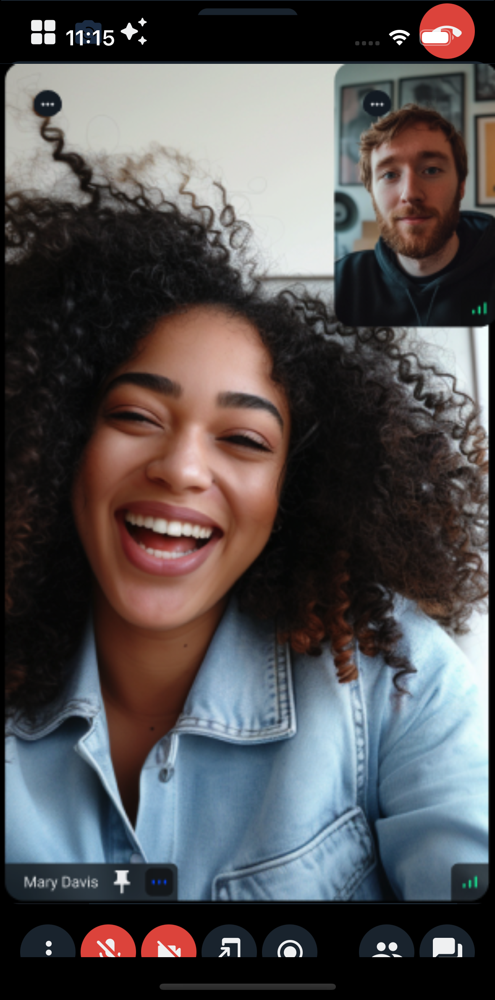
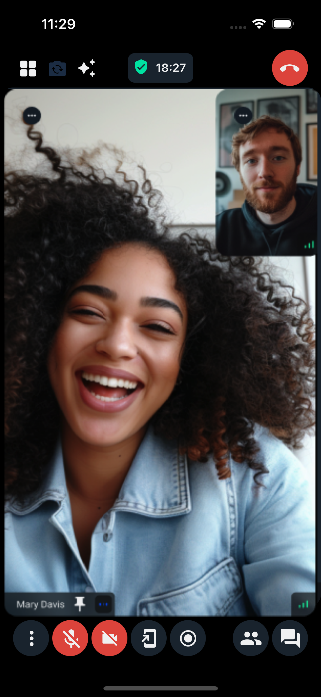

## Introduction

When building mobile applications, it's crucial to ensure that your UI elements don't overlap with system UI elements like notches, home indicators, or status bars.
This is particularly important for video calling applications where you want to maximize screen real estate while maintaining usability.

If we don't handle safe areas, and we'll end up with a messy and unusable interface like this:



After applying the safe area handling, the interface will look like this:



## Implementation

In this guide, we'll show you how to properly handle safe areas in your React Native Video SDK implementation using the `react-native-safe-area-context` package.
We'll demonstrate how to create a video call interface that respects device safe areas while maintaining a clean, professional appearance.

Here's an example implementation that shows how to properly handle safe areas in a video call screen:

```tsx
import React from 'react';
import { CallContent } from '@stream-io/video-react-native-sdk';
import { StatusBar, StyleSheet, View } from 'react-native';
import { SafeAreaView } from 'react-native-safe-area-context';
import { useTheme } from '@stream-io/video-react-native-sdk';
import { Z_INDEX } from '../constants';

export const ActiveCall = () => {
  // other code omitted for brevity
  const { theme } = useTheme();

  return (
    <View style={styles.container}>
      <StatusBar
        barStyle={'light-content'}
        backgroundColor={theme.colors.sheetPrimary}
      />
      <View style={styles.topUnsafeArea} />
      <SafeAreaView style={styles.safeArea} edges={['top', 'left', 'right']}>
        <CallContent
          onHangupCallHandler={onHangupCallHandler}
          CallTopView={CustomTopControls}
          CallControls={CustomBottomControls}
          landscape={currentOrientation === 'landscape'}
          layout={selectedLayout}
        />
      </SafeAreaView>
    </View>
  );
};

const styles = StyleSheet.create({
  container: { flex: 1 },
  callContent: { flex: 1 },
  safeArea: { flex: 1 },
  topUnsafeArea: {
    position: 'absolute',
    top: 0,
    left: 0,
    right: 0,
    height: theme.variants.insets.top,
    backgroundColor: theme.colors.sheetPrimary,
    zIndex: Z_INDEX.IN_FRONT,
  },
});
```

For this to work we need to properly configure our theme with overrides for the `insets` variants.

```tsx
import { DeepPartial, Theme } from '@stream-io/video-react-native-sdk';
import { useSafeAreaInsets } from 'react-native-safe-area-context';

export const useCustomTheme = (): DeepPartial<Theme> => {
  const { top, right, bottom, left } = useSafeAreaInsets();

  const baseTheme: DeepPartial<Theme> = {
    variants: {
      insets: {
        top,
        right,
        bottom,
        left,
      },
    },
  } as DeepPartial<Theme['variants']>;

  return baseTheme;
};
```
