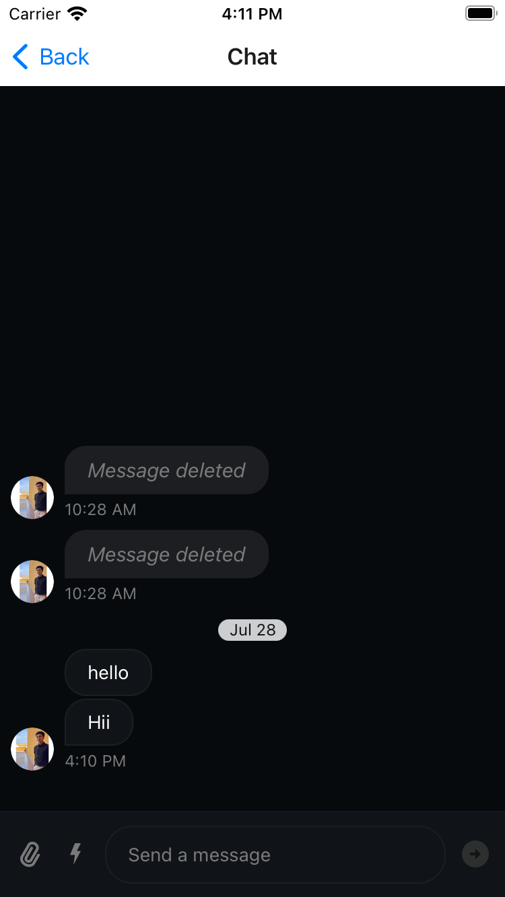
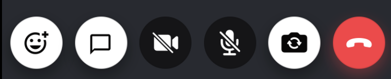
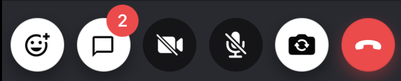
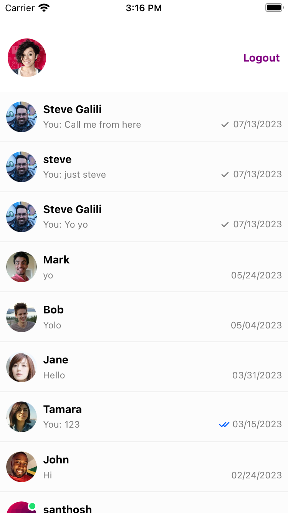
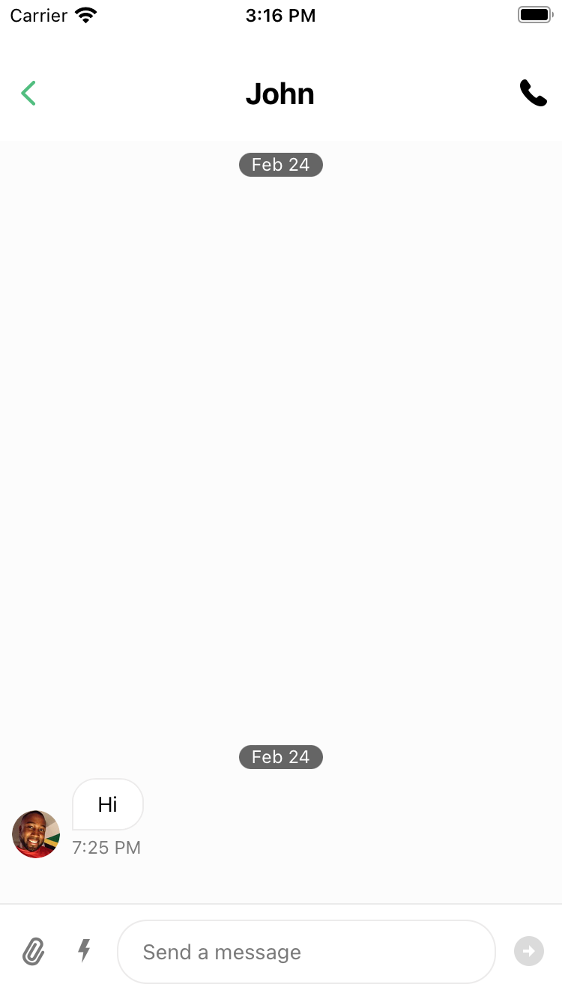
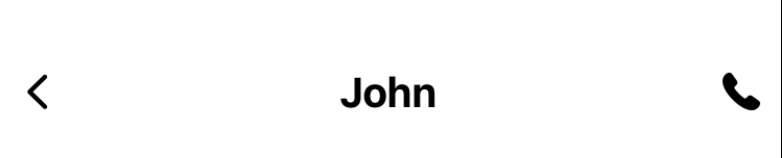

import ImageShowcase from '@site/src/components/ImageShowcase';
import ChannelListScreen from '../assets/06-advanced/02-chat-integration/channel-list-screen.png';
import ChannelScreen from '../assets/06-advanced/02-chat-integration/channel-screen.png';
import IncomingCall from '../assets/06-advanced/02-chat-integration/incoming-call.png';
import OutgoingCall from '../assets/06-advanced/02-chat-integration/outgoing-call.png';
import ActiveCall from '../assets/06-advanced/02-chat-integration/active-call.png';

It's common for calling apps to have chat, as well as the opposite - chat apps to have a calling functionality. Stream's Chat and Video SDKs are perfectly compatible between each other, and can easily be integrated into an app.

Before starting with this guide on how to integrate chat and video together, we will initially focus on installation of the Chat SDK.

## Installation

To install Stream Chat SDK, you can go through our [Getting Started](https://getstream.io/chat/docs/sdk/reactnative/) guide and follow the installation steps and install all the relevant dependencies as well as optional dependencies according to your application's needs.

:::note
Do not forget through the [Additional Steps](https://getstream.io/chat/docs/sdk/reactnative/#additional-steps) guide while installing the dependencies.
:::

## Creating and Passing Chat Client

To create the Chat Client we will mainly follow [this tutorial](https://getstream.io/chat/react-native-chat/tutorial/#add-stream-chat-to-the-application).

### Wrapping the chat client

To wrap our Chat initiation and client logic we will create a `ChatWrapper` component that can be wrapped at the root of the application, so that the client will be available to all the child components.

```tsx title="src/components/ChatWrapper.tsx"
import React, { PropsWithChildren, useCallback, useMemo } from 'react';
import { Chat, OverlayProvider, Streami18n } from 'stream-chat-react-native';
import { useChatClient } from '../hooks/useChatClient';
import { SafeAreaView, ActivityIndicator } from 'react-native';

const streami18n = new Streami18n({
  language: 'en',
});

export const ChatWrapper = ({ children }: PropsWithChildren<{}>) => {
  const user = {
    id: 'your-user-id',
    name: 'your-user-name',
  };
  const token = 'your-user-token';

  const chatClient = useChatClient({
    apiKey: STREAM_API_KEY,
    userData: user,
    tokenProvider: token,
  });

  if (!chatClient) {
    // Show a loader until the Chat client loads
    return (
      <SafeAreaView style={styles.container}>
        <ActivityIndicator size={'large'} style={StyleSheet.absoluteFill} />
      </SafeAreaView>
    );
  }

  return (
    <OverlayProvider i18nInstance={streami18n}>
      <Chat client={chatClient} i18nInstance={streami18n}>
        {children}
      </Chat>
    </OverlayProvider>
  );
};
```

:::note
It is essential for you to wrap the [`GestureHandlerRootView`](https://getstream.io/chat/docs/sdk/reactnative/basics/troubleshooting/#touchables-not-working), [`OverlayProvider`](https://getstream.io/chat/docs/sdk/reactnative/core-components/overlay-provider/) and [`Chat`](https://getstream.io/chat/docs/sdk/reactnative/core-components/chat/) component on the root of your chat integration hierarchy.

`GestureHandlerRootView` should be wrapped into the root of your application as follows:

```tsx title="App.tsx" {16,22}
import React, { useEffect, useState } from 'react';
import { StyleSheet } from 'react-native';
import {
  Call,
  StreamCall,
  StreamVideo,
  StreamVideoClient,
} from '@stream-io/video-react-native-sdk';
import { VideoCallUI } from 'src/components/VideoCallUI';
import { GestureHandlerRootView } from 'react-native-gesture-handler';

export default function App() {
  // ...

  return (
    <GestureHandlerRootView style={styles.container}>
      <StreamVideo client={client}>
        <StreamCall call={call}>
          <VideoCallUI />
        </StreamCall>
      </StreamVideo>
    </GestureHandlerRootView>
  );
}

const styles = StyleSheet.create({
  container: {
    flex: 1,
  },
});
```

:::

### Creating the Chat Client

Firstly, we will create types for the Chat Client as our setup is focused on Typescript. This can be done as follows:

```ts title="src/types.ts"
export type LocalAttachmentType = Record<string, unknown>;
export type LocalChannelType = Record<string, unknown>;
export type LocalCommandType = string;
export type LocalEventType = Record<string, unknown>;
export type LocalMessageType = Record<string, unknown>;
export type LocalReactionType = Record<string, unknown>;
export type LocalUserType = Record<string, unknown>;

export type StreamChatGenerics = {
  attachmentType: LocalAttachmentType;
  channelType: LocalChannelType;
  commandType: LocalCommandType;
  eventType: LocalEventType;
  messageType: LocalMessageType;
  reactionType: LocalReactionType;
  userType: LocalUserType;
};
```

Now, we will focus on creating the `useChatClient` hook that is responsible for creating the Chat client. This is fairly simple:

```tsx title="src/hooks/useChatClient.tsx"
import { useEffect, useRef, useState } from 'react';
import {
  StreamChat,
  OwnUserResponse,
  UserResponse,
  TokenOrProvider,
} from 'stream-chat';
import { StreamChatGenerics } from '../../types';

export const useChatClient = <
  SCG extends StreamChatGenerics = StreamChatGenerics,
>({
  apiKey,
  userData,
  tokenProvider,
}: {
  apiKey: string;
  userData?: OwnUserResponse<SCG> | UserResponse<SCG>;
  tokenProvider?: TokenOrProvider;
}) => {
  const [chatClient, setChatClient] = useState<StreamChat<SCG> | null>(null);
  const disconnectRef = useRef(Promise.resolve());

  useEffect(() => {
    if (!userData) {
      return;
    }

    const client = new StreamChat<SCG>(apiKey);
    const connectUser = async () => {
      await disconnectRef.current;
      try {
        await client.connectUser(userData, tokenProvider);
        console.log(`[Chat client]: Connected user: ${userData.id}`);
      } catch (e) {
        console.error('[Chat client]: Failed to establish connection', e);
      }
      if (!didUserConnectInterrupt) {
        setChatClient(client);
      }
    };

    let didUserConnectInterrupt = false;
    const connectPromise = connectUser();

    const cleanUp = async () => {
      didUserConnectInterrupt = true;
      await connectPromise;
      try {
        await client.disconnectUser();
        console.log(`[Chat client]: Disconnected user: ${userData.id}`);
      } catch (e) {
        console.error('[Chat client]: Failed to disconnect', e);
      }
      setChatClient(null);
    };

    return () => {
      disconnectRef.current = cleanUp();
    };
  }, [apiKey, userData, tokenProvider]);

  return chatClient;
};
```

:::note
The `apiKey`, `userData` and the `tokenProvider` comes up from the `ChatWrapper` created above.
:::

## Adding Chat into Video

### Step 1: Wrapping the `ChatWrapper`

If we extend our [Video Calling Tutorial](https://getstream.io/video/sdk/reactnative/tutorial/video-calling/), our `ChatWrapper` component can we wrapped as a parent/child of the `StreamVideo` as:

```tsx title="App.tsx" {16,24}
import React, { useEffect, useState } from 'react';
import {
  Call,
  StreamCall,
  StreamVideo,
  StreamVideoClient,
} from '@stream-io/video-react-native-sdk';
import { VideoCallUI } from './components/VideoCallUI';
import { ChatWrapper } from './src/components/ChatWrapper';
import { GestureHandlerRootView } from 'react-native-gesture-handler';

export default function App() {
  // ...

  return (
    <ChatWrapper>
      <GestureHandlerRootView style={styles.container}>
        <StreamVideo client={client}>
          <StreamCall call={call}>
            <VideoCallUI />
          </StreamCall>
        </StreamVideo>
      </GestureHandlerRootView>
    </ChatWrapper>
  );
}
```

### Step 2: Creating the Chat window/screen

After the chat client is wrapped to the application, we can focus on creating the chat window/screen. We will take the help of the [`Channel`](https://getstream.io/chat/docs/sdk/reactnative/core-components/channel/), [`MessageList`](https://getstream.io/chat/docs/sdk/reactnative/ui-components/message-list/) and the [`MessageInput`](https://getstream.io/chat/docs/sdk/reactnative/ui-components/message-input/) component to do so.

We will also create a channel with the same id as the call id to make it distinct.



:::note
While creating a channel, please make sure the channel type is `videocall`. This will add the appropriate permissions/capabilities to the channel for video call by default.
:::

An example of the same is shown below:

```tsx title="src/ChatScreen.tsx"
import React, { useEffect, useState } from 'react';
import { SafeAreaView, ActivityIndicator, StyleSheet } from 'react-native';
import {
  Channel,
  MessageInput,
  MessageList,
  useChatContext,
} from 'stream-chat-react-native';
import { Channel as ChannelType } from 'stream-chat';
import { StreamChatGenerics } from '../../../types';

export const ChatScreen = () => {
  const [channel, setChannel] = useState<
    ChannelType<StreamChatGenerics> | undefined
  >(undefined);
  const { client } = useChatContext();

  const CHANNEL_TYPE = 'videocall';
  const CHANNEL_ID = 'your-call-id'; // You can get the call id through sharing params while routing through navigation.

  useEffect(() => {
    const createChannel = async () => {
      const newChannel = await client.channel(CHANNEL_TYPE, CHANNEL_ID);
      setChannel(newChannel);
    };
    createChannel();
  }, [client]);

  if (!channel) {
    return (
      <SafeAreaView style={styles.container}>
        <ActivityIndicator size={'large'} style={StyleSheet.absoluteFill} />
      </SafeAreaView>
    );
  }

  return (
    <SafeAreaView>
      <Channel channel={channel}>
        <MessageList />
        <MessageInput />
      </Channel>
    </SafeAreaView>
  );
};

const styles = StyleSheet.create({
  container: {
    flex: 1,
  },
});
```

### Step 3: Open the chat window

To do this, we will create a custom CallControls using the [`ChatButton`](../../ui-components/call/call-controls/#chatbutton) component.

The `ChatButton` component takes up an `onPressHandler`, which is responsible to perform an action when the button is pressed. In our case, it's the opening of the `ChatScreen`.

.

In the VideoCallUI component of our [Video Calling Tutorial](https://getstream.io/video/sdk/reactnative/tutorial/video-calling/), we will add the above:

```tsx title="src/components/VideoCallUI.tsx" {13-16,25,35-38,40-42,46}
import React from 'react';
import { SafeAreaView, StyleSheet, View } from 'react-native';
import {
  CallContent,
  ChatButton,
  HangUpCallButton,
  ToggleAudioPublishingButton,
  ToggleCameraFaceButton,
  ToggleVideoPublishingButton,
} from '@stream-io/video-react-native-sdk';

export type CallControlsComponentProps = {
  onChatOpenHandler?: () => void;
  onHangupCallHandler?: () => void;
};

export const CallControlsComponent = ({
  onChatOpenHandler,
  onHangupCallHandler,
}: CallControlsComponentProps) => {
  return (
    <View style={styles.callControlsWrapper}>
      <ChatButton onPressHandler={onChatOpenHandler} />
      <ToggleVideoPublishingButton />
      <ToggleAudioPublishingButton />
      <ToggleCameraFaceButton />
      <HangUpCallButton onPressHandler={onHangupCallHandler} />
    </View>
  );
};

export const VideoCallUI = () => {
  const onChatOpenHandler = () => {
    // handle how to open the Chat window/screen. You can use this to navigate to the chat screen, open a modal, etc.
    // highlight-next-line
  };

  const CustomControlsComponent = useCallback(() => {
    return <CallControlsComponent onChatOpenHandler={onChatOpenHandler} />;
  }, [onChatOpenHandler]);

  return (
    <SafeAreaView style={styles.container}>
      <CallContent CallControls={CustomControlsComponent} />
    </SafeAreaView>
  );
};

const styles = StyleSheet.create({
  container: {
    flex: 1,
    backgroundColor: '#272A30',
  },
  callControlsWrapper: {
    flexDirection: 'row',
    justifyContent: 'space-evenly',
    paddingVertical: 12,
    zIndex: 2,
    backgroundColor: '#272A30',
  },
});
```

### Step 4: Showing unread count indicator for new chats

To get the unread count of the Channel we need to focus primarily on watching the channel and then listen to relevant events such as `message.new` to update the unread count state variable. The unread count is set to 0 when the message is marked as read, this is done by listening to the `notification.mark_read` event.



This is demonstrated and can be done in a hook as created below:

```tsx title="src/hooks/useUnreadCount.tsx"
import { useEffect, useState } from 'react';
import { useChatContext } from 'stream-chat-react-native';
import { Event, Channel as ChannelType } from 'stream-chat';
import { useCall } from '@stream-io/video-react-native-sdk';
import { StreamChatGenerics } from 'src/types';

/**
 * This hook is responsible for returning the unread count of the channel.
 * This is done through listening to multiple events.
 * @returns number
 */
export const useUnreadCount = () => {
  const [unreadCount, setUnreadCount] = useState(0);
  const CHANNEL_TYPE = 'videocall';
  const { client } = useChatContext();
  const call = useCall();

  const cid = `${CHANNEL_TYPE}:${call?.id}`;

  // Effect to watch the channel
  useEffect(() => {
    let channel: ChannelType<StreamChatGenerics>;
    const watchChannel = async () => {
      channel = client.channel(CHANNEL_TYPE, call?.id);
      await channel.watch();
    };

    watchChannel();

    return () => {
      channel.stopWatching();
    };
  }, [call?.id, client]);

  // Effect to set the unreadCount to 0 when the `notification.mark_read` event is received
  useEffect(() => {
    if (!client) {
      return;
    }

    const handleEvent = (event: Event) => {
      if (event?.cid === cid) {
        setUnreadCount(0);
      }
    };

    client.on('notification.mark_read', handleEvent);
    return () => client.off('notification.mark_read', handleEvent);
  }, [client, cid]);

  // Effect to update the unread count when the 'message.new' is received
  useEffect(() => {
    if (!client) {
      return;
    }

    const handleEvent = () => {
      const channel = client.activeChannels[cid];

      setUnreadCount(channel?.countUnread() ?? 0);
    };

    handleEvent();

    client.on('message.new', handleEvent);

    return () => {
      client.off('message.new', handleEvent);
    };
  }, [client, cid]);

  return unreadCount;
};
```

:::note
Make sure to clean up/unsubscribe to all the events when the hook un-mounts.
:::

Finally, we will pass the unread count to our component by using the `unreadBadgeCountIndicator` key of the [`chatButton`](../../ui-components/call/call-controls/#chatbutton) prop of [`CallControls`](../../ui-components/call/call-controls) component.

```tsx title="src/components/VideoCallUI.tsx" {8,14,21,29-30,40}
import React from 'react';
import { SafeAreaView, StyleSheet, View } from 'react-native';
import { CallContent, ChatButton } from '@stream-io/video-react-native-sdk';

export type CallControlsComponentProps = {
  onChatOpenHandler?: () => void;
  onHangupCallHandler?: () => void;
  unreadBadgeCount?: number;
};

export const CallControlsComponent = ({
  onChatOpenHandler,
  onHangupCallHandler,
  unreadBadgeCount,
}: CallControlsComponentProps) => {
  return (
    <View style={styles.callControlsWrapper}>
      // ...
      <ChatButton
        onPressHandler={onChatOpenHandler}
        unreadBadgeCount={unreadBadgeCount}
      />
      // ...
    </View>
  );
};

export const VideoCallUI = () => {
  const channelWatched = useChannelWatch();
  const unreadBadgeCount = useUnreadCount({ channelWatched });
  const onChatOpenHandler = () => {
    // handle how to open the Chat window/screen. You can use this to navigate to the chat screen, open a modal, etc.
    // highlight-next-line
  };

  const CustomControlsComponent = useCallback(() => {
    return (
      <CallControlsComponent
        onChatOpenHandler={onChatOpenHandler}
        unreadBadgeCount={unreadBadgeCount}
      />
    );
  }, [onChatOpenHandler]);

  return (
    <SafeAreaView style={styles.container}>
      <CallContent CallControls={CustomControlsComponent} />
    </SafeAreaView>
  );
};
```

## Adding Video into Chat

By adding Video calling in chat we achieve a messenger like application, that allows calling an individual from the chat screen.

<ImageShowcase
  items={[
    {
      image: ChannelListScreen,
      caption: 'Channel list screen',
      alt: 'Channel list screen',
    },
    {
      image: ChannelScreen,
      caption: 'Channel screen',
      alt: 'Channel screen',
    },
    {
      image: IncomingCall,
      caption: 'Incoming Call Component',
      alt: 'Incoming Call',
    },
    {
      image: OutgoingCall,
      caption: 'Outgoing Call Component',
      alt: 'Outgoing Call',
    },
    {
      image: ActiveCall,
      caption: 'Active Call Component',
      alt: 'Active Call',
    },
  ]}
/>

To do so we have the [`useChatClient`](#creating-the-chat-client) and the [`ChatWrapper`](#wrapping-the-chat-client) ready from the [Creating and passing Chat Client](#creating-and-passing-chat-client) steps.

To achieve a messenger like application we need to have a basic navigation setup so that we can navigate among Channel list screen to particular channel screen, etc.

### Step 1: Setting up navigation

We will use [React Navigation](https://reactnavigation.org/) to achieve navigation on our application.

#### Installing the dependencies

Let us start with installing the relevant packages:

As a part of our navigation setup, we plan only to have native stack navigator as a part of our app, therefore we install the following packages:

```bash
yarn add @react-navigation/native @react-navigation/elements @react-navigation/native-stack react-native-screens react-native-safe-area-context
```

After installing the packages, we need to install the pods:

```bash
npx pod-install
```

:::info
You can also follow the [Getting started](https://reactnavigation.org/docs/getting-started/) guide to install the [React Navigation](https://reactnavigation.org/) dependencies effectively.
:::

#### Wrapping the App in `NavigationContainer`

You need to wrap the [`NavigationContainer`](https://reactnavigation.org/docs/navigation-container/) in order to automatically manage app state and linking your top-level navigator to the app environment.

```tsx title="App.tsx"
import React from 'react';
import { GestureHandlerRootView } from 'react-native-gesture-handler';
import { NavigationContainer } from '@react-navigation/native';

export default function App() {
  // ...

  return (
    <GestureHandlerRootView style={styles.container}>
      // highlight-next-line
      <NavigationContainer>
        {/* Rest of the code */}
        // highlight-next-line
      </NavigationContainer>
    </GestureHandlerRootView>
  );
}

const styles = StyleSheet.create({
  container: {
    flex: 1,
  },
});
```

#### Creating the screens

We will create two screens primarily, that is:

- Channel list screen - Here we list all the channels
- Channel screen - Here we list the messages, message input and add the call button to call someone.

Before that we set up the types for the screen. To do so, we add the following:

```ts title="src/types.ts"
export type NavigationStackParamsList = {
  ChannelListScreen: undefined;
  ChannelScreen: undefined;
};
```

Now we add the Channel List Screen:



```tsx title="src/screens/ChannelListScreen.tsx"
import React from 'react';
import { StyleSheet, View } from 'react-native';
import { ChannelList } from 'stream-chat-react-native';
import type { ChannelSort } from 'stream-chat';
import type { NativeStackScreenProps } from '@react-navigation/native-stack';
import type { NavigationStackParamsList, StreamChatGenerics } from 'src/types';
import { useAppContext } from 'src/context/AppContext';

const sort: ChannelSort<StreamChatGenerics> = {
  last_message_at: -1,
  // Your sort options
};
const options = {
  // Your options
};

type ChannelListScreenProps = NativeStackScreenProps<
  NavigationStackParamsList,
  'ChannelListScreen'
>;

export function ChannelListScreen({ navigation }: ChannelListScreenProps) {
  const { setChannel } = useAppContext();
  // Logged in user details
  const user = {
    id: 'your-user-id',
    name: 'your-user-name',
  };

  const filters = {
    type: 'messaging',
    members: { $in: [user.id] },
    // Your filters
  };

  return (
    <View style={styles.container}>
      <ChannelList<StreamChatGenerics>
        filters={filters}
        onSelect={(channel) => {
          setChannel(channel);
          navigation.navigate('ChannelScreen');
        }}
        options={options}
        sort={sort}
      />
    </View>
  );
}

const styles = StyleSheet.create({
  container: {
    flex: 1,
  },
});
```

We primarily use the [`ChannelList`](https://getstream.io/chat/docs/sdk/reactnative/core-components/channel-list/) component to create this screen.

Next up, we create the Channel Screen:



```tsx title="src/screens/ChannelScreen.tsx"
import React, { useEffect } from 'react';
import { useAppContext } from 'src/context/AppContext';
import { useHeaderHeight } from '@react-navigation/elements';
import {
  Channel,
  MessageInput,
  MessageList,
  useAttachmentPickerContext,
  useOverlayContext,
} from 'stream-chat-react-native';
import { NativeStackScreenProps } from '@react-navigation/native-stack';
import { NavigationStackParamsList, StreamChatGenerics } from 'src/types';
import { Platform, StyleSheet, View } from 'react-native';

type ChannelScreenProps = NativeStackScreenProps<
  NavigationStackParamsList,
  'ChannelScreen'
>;

export function ChannelScreen({ navigation }: ChannelScreenProps) {
  const { channel } = useAppContext();
  const headerHeight = useHeaderHeight();
  const { setTopInset } = useAttachmentPickerContext();
  const { overlay } = useOverlayContext();

  useEffect(() => {
    navigation.setOptions({
      gestureEnabled: Platform.OS === 'ios' && overlay === 'none',
    });
  }, [navigation, overlay]);

  useEffect(() => {
    setTopInset(headerHeight);
  }, [headerHeight, setTopInset]);

  if (channel === undefined) {
    return null;
  }

  return (
    <Channel channel={channel} keyboardVerticalOffset={headerHeight}>
      <View style={styles.container}>
        <MessageList />
        <MessageInput />
      </View>
    </Channel>
  );
}

const styles = StyleSheet.create({
  container: {
    flex: 1,
  },
});
```

We use the [`Channel`](https://getstream.io/chat/docs/sdk/reactnative/core-components/channel/), [`MessageList`](https://getstream.io/chat/docs/sdk/reactnative/ui-components/message-list/), and the [`MessageInput`](https://getstream.io/chat/docs/sdk/reactnative/ui-components/message-input/) components to build this screen.

Since we navigate from one screen to other, we need to persist the state of the channel data to use it between different screens. To do this we will create a context. This can be created as follows:

```tsx title="src/context/AppContext.tsx"
import React, { PropsWithChildren, useState } from 'react';
import { Channel as ChannelType } from 'stream-chat';
import { StreamChatGenerics } from '../types';

type AppContextType = {
  channel: ChannelType<StreamChatGenerics> | undefined;
  setChannel: React.Dispatch<
    React.SetStateAction<ChannelType<StreamChatGenerics> | undefined>
  >;
};

export const AppContext = React.createContext({} as AppContextType);

export const AppProvider = ({ children }: PropsWithChildren<{}>) => {
  const [channel, setChannel] = useState<ChannelType<StreamChatGenerics>>();

  return (
    <AppContext.Provider
      value={{
        channel,
        setChannel,
      }}
    >
      {children}
    </AppContext.Provider>
  );
};

export const useAppContext = () => React.useContext(AppContext);
```

Wrapping the `AppProvider` created above in the app:

```tsx title="App.tsx"
import React from 'react';
import { StyleSheet } from 'react-native';
import { GestureHandlerRootView } from 'react-native-gesture-handler';
import { NavigationContainer } from '@react-navigation/native';
import { AppProvider } from './src/context/AppContext';

export default function App() {
  // ...

  return (
    <GestureHandlerRootView style={styles.container}>
      <NavigationContainer>
        // highlight-next-line
        <AppProvider>
          {/* Rest of the code */}
          // highlight-next-line
        </AppProvider>
      </NavigationContainer>
    </GestureHandlerRootView>
  );
}

const styles = StyleSheet.create({
  container: {
    flex: 1,
  },
});
```

Now we set up the [Native Stack Navigator](https://reactnavigation.org/docs/native-stack-navigator/) by adding the following:

```tsx title="App.tsx"
import React from 'react';
import { StyleSheet } from 'react-native';
import { NavigationStackParamsList } from './src/types';
import { createNativeStackNavigator } from '@react-navigation/native-stack';
import { GestureHandlerRootView } from 'react-native-gesture-handler';
import { NavigationContainer } from '@react-navigation/native';
import { ChannelListScreen } from './src/screens/ChannelListScreen';
import { ChannelScreen } from './src/screens/ChannelScreen';
import { AppProvider } from './src/context/AppContext';

const Stack = createNativeStackNavigator<NavigationStackParamsList>();

const Messenger = () => {
  return (
    <Stack.Navigator>
      <Stack.Screen name="ChannelListScreen" component={ChannelListScreen} />
      <Stack.Screen name="ChannelScreen" component={ChannelScreen} />
    </Stack.Navigator>
  );
};

export default function App() {
  // ...

  return (
    <GestureHandlerRootView style={styles.container}>
      <NavigationContainer>
        <AppProvider>
          // highlight-next-line
          <Messenger />
        </AppProvider>
      </NavigationContainer>
    </GestureHandlerRootView>
  );
}

const styles = StyleSheet.create({
  container: {
    flex: 1,
  },
});
```

### Step 2: Wrapping the `ChatWrapper`

Now, We will wrap the [`ChatWrapper`](#wrapping-the-chat-client) that provides the chat client to the rest of the application created initially in this tutorial.

```tsx title="App.tsx"
import React from 'react';
import { StyleSheet } from 'react-native';
import { GestureHandlerRootView } from 'react-native-gesture-handler';
import { NavigationContainer } from '@react-navigation/native';
import { AppProvider } from './src/context/AppContext';
import { ChatWrapper } from './src/components/ChatWrapper';
// ...

export default function App() {
  // ...

  return (
    <GestureHandlerRootView style={styles.container}>
      <NavigationContainer>
        <AppProvider>
          // highlight-next-line
          <ChatWrapper>
            <Messenger />
            // highlight-next-line
          </ChatWrapper>
        </AppProvider>
      </NavigationContainer>
    </GestureHandlerRootView>
  );
}

const styles = StyleSheet.create({
  container: {
    flex: 1,
  },
});
```

### Step 3: Creating and passing the Video Wrapper

Adhering to the [Getting and Setting the credentials](https://getstream.io/video/sdk/reactnative/tutorial/video-calling/#step-3---getting-and-setting-the-credentials) step of the [Video Call Tutorial](https://getstream.io/video/sdk/reactnative/tutorial/video-calling/), we will create a video wrapper that wraps and provides the Stream's Video client to the rest of the app.

```tsx title="src/components/VideoWrapper.tsx"
import React, { PropsWithChildren, useEffect, useState } from 'react';
import {
  StreamVideo,
  StreamVideoClient,
} from '@stream-io/video-react-native-sdk';

export const VideoWrapper = ({ children }: PropsWithChildren<{}>) => {
  const [videoClient, setVideoClient] = useState<StreamVideoClient | undefined>(
    undefined,
  );

  const user = {
    id: 'your-user-id',
    name: 'your-user-name',
  };
  const token = 'your-user-token';

  useEffect(() => {
    if (!user) {
      return;
    }
    const user = {
      id: user.id,
      name: user.name,
    };

    const _videoClient = new StreamVideoClient({
      apiKey: STREAM_API_KEY,
      user,
      tokenProvider: token,
    });

    setVideoClient(_videoClient);

    return () => {
      _videoClient.disconnectUser();
      setVideoClient(undefined);
    };
  }, [user]);

  if (!videoClient) {
    return null;
  }

  return (
    <StreamVideo client={videoClient} language={'en'}>
      {children}
    </StreamVideo>
  );
};
```

Now we wrap the `VideoWrapper` created above to the app, as follows:

```tsx title="App.tsx"
import React from 'react';
import { StyleSheet } from 'react-native';
import { GestureHandlerRootView } from 'react-native-gesture-handler';
import { NavigationContainer } from '@react-navigation/native';
import { AppProvider } from './src/context/AppContext';
import { ChatWrapper } from './src/components/ChatWrapper';
import { VideoWrapper } from './src/components/VideoWrapper';
// ...

export default function App() {
  // ...

  return (
    <GestureHandlerRootView style={styles.container}>
      <NavigationContainer>
        <AppProvider>
          <ChatWrapper>
            // highlight-next-line
            <VideoWrapper>
              <Messenger />
              // highlight-next-line
            </VideoWrapper>
          </ChatWrapper>
        </AppProvider>
      </NavigationContainer>
    </GestureHandlerRootView>
  );
}

const styles = StyleSheet.create({
  container: {
    flex: 1,
  },
});
```

### Step 4: Passing the call to `StreamCall`

To listen to the pending calls(both incoming and outgoing), we can use the `useCalls` hook that gives us the list of all the pending calls for a user.

To pass the call and provide it to the components within the hierarchy we use the [`StreamCall`](../../ui-components/core/stream-call/) component that has a prop [`call`](../../ui-components/core/stream-call/#call).

We can use the following to create a `Calls` component that can later be passed down the hierarchy in the app.

```tsx src="src/components/Calls.tsx" {31,39}
import React, { useCallback, useEffect } from 'react';
import { StreamCall, useCalls } from '@stream-io/video-react-native-sdk';
import { Alert } from 'react-native';

export const Calls = () => {
  const calls = useCalls();

  const handleMoreCalls = useCallback(async () => {
    const lastCallCreatedBy = calls[1].data?.created_by;
    Alert.alert(
      `Incoming call from ${
        lastCallCreatedBy?.name ?? lastCallCreatedBy?.id
      }, only 1 call at a time is supported`,
    );
  }, [calls]);

  // Reset the state of the show variable when there are no calls.
  useEffect(() => {
    if (calls.length > 1) {
      handleMoreCalls();
    }
  }, [calls.length, handleMoreCalls]);

  const firstCall = calls[0];

  if (!firstCall) {
    return null;
  }

  return (
    <StreamCall
      call={firstCall}
      mediaDeviceInitialState={{
        initialAudioEnabled: false,
        initialVideoEnabled: false,
      }}
    >
      {/* Rest of the code */}
    </StreamCall>
  );
};
```

:::note
We currently support one call at a time, and therefore we show an alert, if a user gets multiple calls while they are in the call already. You can handle it in a different way.

This is the reason why we pass `calls[0]` to the `StreamCall` component, for now.
:::

### Step 5: Using the `RingingCallContent`

We can use the [`RingingCallContent`](../../ui-components/call/ringing-call-content) component to intercept the calling states and show the appropriate(Incoming, Outgoing, JoiningCallIndicator and CallContent) components.

```tsx title="src/components/Calls.tsx" {28}
import {
  StreamCall,
  useCalls,
  RingingCallContent,
} from '@stream-io/video-react-native-sdk';
import { CallPanel } from 'src/components/CallPanel';

export const Calls = () => {
  const calls = useCalls();

  // ...

  const firstCall = calls[0];

  if (!firstCall) {
    return null;
  }

  return (
    <StreamCall
      call={firstCall}
      mediaDeviceInitialState={{
        initialAudioEnabled: false,
        initialVideoEnabled: false,
      }}
    >
      <View style={styles.container}>
        <RingingCallContent />
      </View>
    </StreamCall>
  );
};

const styles = StyleSheet.create({
  container: {
    flex: 1,
  },
});
```

### Step 6: Creating the Channel Header with ability to Create Call

Creating a Channel Header is fairly simple, you can create a component and pass it to the `options` prop of `StackScreen` to the `header` key as follows:



```tsx
<Stack.Screen
  name="ChannelScreen"
  component={ChannelScreen}
  options={{
    header: ChannelHeaderComponent,
  }}
/>
```

The `ChannelHeader` can be created as follows:

```tsx title="src/components/ChannelHeader.tsx"
import React, { useCallback } from 'react';
import { Pressable, StyleSheet, Text, View } from 'react-native';
import { useAppContext } from 'src/context/AppContext';
import { NativeStackHeaderProps } from '@react-navigation/native-stack';
import {
  MemberRequest,
  useStreamVideoClient,
} from '@stream-io/video-react-native-sdk';

type ChannelHeaderProps = NativeStackHeaderProps;

const ChannelHeader = (props: ChannelHeaderProps) => {
  const { navigation } = props;
  const { channel } = useAppContext();
  const videoClient = useStreamVideoClient();
  const members = Object.values(
    channel?.state?.members ?? {},
  ).map<MemberRequest>((member) => ({
    user_id: member.user_id!,
  }));

  const joinCallHandler = useCallback(async () => {
    try {
      const call = videoClient?.call('default', 'random-call-id');
      await call?.getOrCreate({
        ring: true,
        data: {
          // more timeout to cancel the call automatically so that it works when callee's app is in quit state
          settings_override: { ring: { auto_cancel_timeout_ms: 60000 } },
          custom: { channelCid: channel?.cid },
          members: members,
        },
      });
    } catch (error) {
      console.log('Failed to createCall', error);
    }
  }, [videoClient, members, channel?.cid]);

  const goBackHandler = useCallback(() => {
    navigation.goBack();
  }, [navigation]);

  return (
    <View style={styles.header}>
      <Pressable onPress={goBackHandler} style={styles.icon}>
        {/* Back icon component */}
      </Pressable>
      <Text style={styles.name}>{/* Your custom Header Title */}</Text>
      <Pressable onPress={joinCallHandler} style={styles.icon}>
        {/* Call icon component */}
      </Pressable>
    </View>
  );
};

export const ChannelHeaderComponent = (props: NativeStackHeaderProps) => {
  return <ChannelHeader {...props} />;
};

const styles = StyleSheet.create({
  header: {
    backgroundColor: 'white',
    flexDirection: 'row',
    justifyContent: 'space-between',
    alignItems: 'center',
    paddingHorizontal: 10,
    paddingTop: 50,
    paddingBottom: 20,
  },
  name: {
    fontSize: 20,
    fontWeight: 'bold',
  },
  icon: {
    height: 18,
    width: 18,
  },
});
```

Finally, when you press on the call button, an outgoing call be sent to the participant, which can be accepted or rejected using the Incoming call component screen. On accepting, the call is joined the participants and the call controls are available.

## Further Steps

Now that you have the final project for the **Chat in Video** and **Video in Chat** app, you can use it as a template for any kind of apps that feature Chat primarily, with the option to use Video.

If you're looking to explore more Stream Video based topics, we suggest the following to further customize and improve your Video experience:

- [Deep Linking Guide](../deeplinking/) - Easily integrate deep linking in your app using the guide.
- [Push Notifications Guide](../push-notifications/overview) - Every Chat and/or Video app needs Push Notifications to notify users for incoming calls. This guide will teach you how to set up different providers and seamlessly integrate push into your app.
