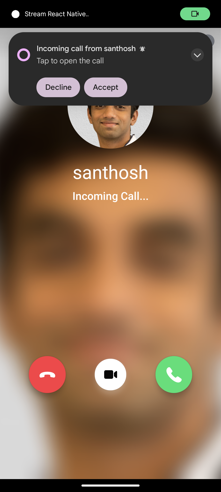
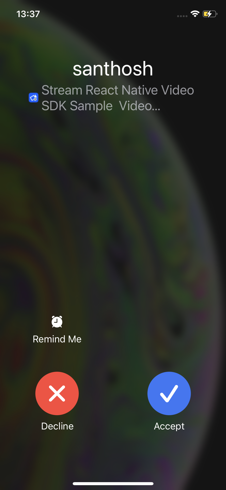
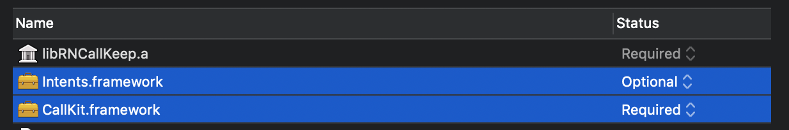
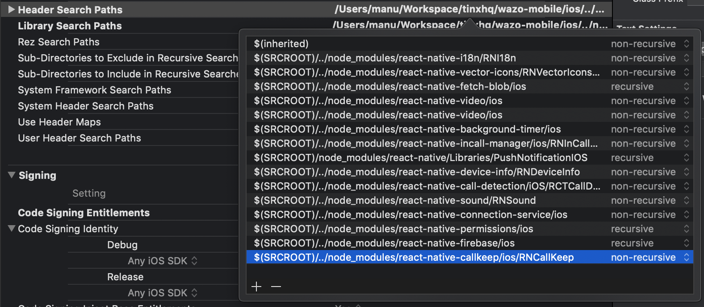

import Tabs from '@theme/Tabs';
import TabItem from '@theme/TabItem';

This guide discusses how to add push notifications for ringing calls to your project. It will discuss both Android and iOS and go through all the necessary steps.

The normal user experience in a ringing app, when a user receives a call, is to show a push notification. The user can then interact with the notification to accept or reject the call. In this guide, you will learn how to set up your React Native app to get push notifications from Stream for the incoming calls that your user will receive.  

| Android preview | iOS preview |
|---|---|
|  | 

## Add push provider credentials to Stream

Please follow the below guides for adding appropriate push providers to Stream:

- Android - [Firebase Cloud Messaging](../../push-providers/firebase/)
- iOS - [Apple Push Notification Service (APNs)](../../push-providers/apn-voip/)

## Install Dependencies

```bash title=Terminal
yarn add @react-native-firebase/app
yarn add @react-native-firebase/messaging
yarn add react-native-callkeep
yarn add react-native-voip-push-notification
npx pod-install
```

So what did we install precisely?

- `@react-native-firebase/app` and `@react-native-firebase/messaging` for handling incoming [Firebase Cloud Messaging](https://firebase.google.com/docs/cloud-messaging) notifications on Android.
- `react-native-voip-push-notification` for handling incoming [PushKit](https://developer.apple.com/documentation/pushkit) notifications on iOS.
- `react-native-callkeep` for reporting incoming calls to iOS [CallKit](https://developer.apple.com/documentation/callkit).

## Android-specific setup

1. To create a Firebase project, go to the [Firebase console](https://console.firebase.google.com/) and click on **Add project**.

2. In the console, click the setting icon next to **Project overview** and open **Project settings**. Then, under **Your apps**, click the Android icon to open **Add Firebase to your Android app** and follow the steps. **Make sure that the Android package name you enter is the same as the value of** `android.package` **from your app.json.**

3. After registering the app, download the **google-services.json** file and place it inside of your project at the following location: `/android/app/google-services.json.`

4. To allow Firebase on Android to use the credentials, the `google-services` plugin must be enabled on the project. This requires modification to two files in the Android directory. Add the highlighted lines in the relevant files:

```groovy title="/android/build.gradle"
buildscript {
  dependencies {
    // ... other dependencies
    // highlight-next-line
    classpath 'com.google.gms:google-services:4.3.15'
  }
}
```

```groovy title="/android/build.gradle"
apply plugin: 'com.android.application'
// highlight-next-line
apply plugin: 'com.google.gms.google-services'
```

:::note

The **google-services.json** file contains unique and non-secret identifiers of your Firebase project. For more information, see [Understand Firebase Projects](https://firebase.google.com/docs/projects/learn-more#config-files-objects).

:::

### Request for notification permissions

At an appropriate place in your app, request for notification permissions from the user. Below is a small example of how to request permissions using [`react-native-permissions`](https://github.com/zoontek/react-native-permissions) library:
<!-- vale off -->

```js
import { requestNotifications } from 'react-native-permissions';

await requestNotifications(['alert', 'sound']);
```
<!-- vale on -->
## iOS-specific setup

### Disable Firebase installation

We don't use Firebase cloud messaging for iOS in the SDK. Unless Firebase is used for other purposes in your app, you can safely remove it from being installed by iOS and avoid the auto-linking. To do that create a file named `react-native.config.js` in the root of your project and add the following contents:

```js title="react-native.config.js"
module.exports = {
  dependencies: {
    '@react-native-firebase/app': {
      platforms: {
        ios: null,
      },
    },
    '@react-native-firebase/messaging': {
      platforms: {
        ios: null,
      },
    },
  },
};
```

Once this is done, `pod install` must be run again to remove the installed pods. 

### Link required libraries for react native callkeep library

1. In Xcode: Click on `Build Phases` tab, then open `Link Binary With Libraries`.
2. Add `CallKit.framework`
3. Add `Intents.framework` (and mark it Optional).



### Add header search path for react native callkeep library

1. In Xcode: Click on `Build Settings` tab, then search for `Header Search Paths`.
2. Add `$(SRCROOT)/../node_modules/react-native-callkeep/ios/RNCallKeep`.



### Add background modes

In Xcode: Open `Info.plist` file and add the following in `UIBackgroundModes`. By editing this file with the text editor, you should see:

```xml
<key>UIBackgroundModes</key>
<array>
  <string>voip</string>
</array>
```

### Enable push notifications

To receive push notifications, enable the Push Notifications capability in the Xcode `Project` > `Signing & Capabilities` pane.

### Update AppDelegate

Update `AppDelegate.m` or `AppDelegate.mm` in Xcode with the following parts for iOS support.

#### Add headers

At the top of the file, right after '#import "AppDelegate.h"', add the following headers to import and invoke the methods for the required libraries.

```objectivec
// highlight-start
#import "RNCallKeep.h"
#import <PushKit/PushKit.h>
#import "RNVoipPushNotificationManager.h"
// highlight-end
```

#### Initialize on app launch

We need to configure the Firebase library, set up the callkeep library and register VoIP at the app launch. To do this, add the following methods to your existing `didFinishLaunchingWithOptions` method,

```objectivec
- (BOOL)application:(UIApplication *)application didFinishLaunchingWithOptions:(NSDictionary *)launchOptions
{
  // highlight-start
  NSString *localizedAppName = [[[NSBundle mainBundle] localizedInfoDictionary] objectForKey:@"CFBundleDisplayName"];
  NSString *appName = [[[NSBundle mainBundle] infoDictionary]objectForKey :@"CFBundleDisplayName"];
  [RNCallKeep setup:@{
    @"appName": localizedAppName != nil ? localizedAppName : appName,
    @"supportsVideo": @YES,
    // pass @YES here if you want the call to be shown in calls history in the built-in dialer app
    @"includesCallsInRecents": @NO,
  }];
  // highlight-end

  // highlight-next-line
  [RNVoipPushNotificationManager voipRegistration];

  // the rest
}
```

#### Add PushKit methods

Add the following method to process the VoIP token from iOS and send it to the `react-native-voip-push-notification` library.

```objectivec
// handle updated push credentials
- (void)pushRegistry:(PKPushRegistry *)registry didUpdatePushCredentials:(PKPushCredentials *)credentials forType:(PKPushType)type {
  [RNVoipPushNotificationManager didUpdatePushCredentials:credentials forType:(NSString *)type];
}
```

The final method to add is the one that gets invoked when there is a VoIP push notification from Stream. When there is a push notification and if the app is in the background, we want to display an incoming call notification. Add the following method to achieve this,

```objectivec
// handle incoming pushes
- (void)pushRegistry:(PKPushRegistry *)registry didReceiveIncomingPushWithPayload:(PKPushPayload *)payload forType:(PKPushType)type withCompletionHandler:(void (^)(void))completion {
  // send event to JS
  [RNVoipPushNotificationManager didReceiveIncomingPushWithPayload:payload forType:(NSString *)type];

  // process the payload
  NSDictionary *stream = payload.dictionaryPayload[@"stream"];
  NSString *uuid = [[NSUUID UUID] UUIDString];
  NSString *createdCallerName = stream[@"created_by_display_name"];

  // display the incoming call notification
  [RNCallKeep reportNewIncomingCall: uuid
                             handle: createdCallerName
                         handleType: @"generic"
                           hasVideo: YES
                localizedCallerName: createdCallerName
                    supportsHolding: YES
                       supportsDTMF: YES
                   supportsGrouping: YES
                 supportsUngrouping: YES
                        fromPushKit: YES
                            payload: stream
              withCompletionHandler: completion];
}
```

## Setup the push config for the SDK

The SDK automatically processes the incoming push notifications once the setup above is done if the push config has been set using `StreamVideoRN.setPushConfig`. To do this follow the steps below,

### Add the ability to statically navigate to screens in your app

When a user taps on the push notification and the JS engine is not ready, they should still be able to navigate to the screen that shows the active call. You can achieve this by adding the ability to [navigate without the navigation property in the react-navigation library](https://reactnavigation.org/docs/navigating-without-navigation-prop/).

The following is an example implementation of a utility file that has helpers to statically navigate in the app:

```ts title="src/utils/staticNavigation.ts"
import { createNavigationContainerRef } from '@react-navigation/native';

import { RootStackParamList } from '../navigation/types';

export const navigationRef = createNavigationContainerRef<RootStackParamList>();

/**
 * This is used to run the navigation logic from root level even before the navigation is ready
 */
export const staticNavigate = (
  ...navigationArgs: Parameters<typeof navigationRef.navigate>
) => {
  // note the use of setInterval, it is responsible for constantly checking if requirements are met and then navigating
  // highlight-start
  const intervalId = setInterval(async () => {
    // run only when the navigation is ready and add any other requirements (like authentication)
    if (navigationRef.isReady() && GlobalState.hasAuthentication) {
      clearInterval(intervalId);
      navigationRef.navigate(...navigationArgs);
    }
  }, 300);
  // highlight-end
};
```

When doing this it is _very important_ to set the `navigationRef` in your navigation container as shown below:

```ts
import { navigationRef } from './src/utils/staticNavigationUtils';

// highlight-next-line
<NavigationContainer ref={navigationRef}>
  <MyAppNavigator />
</NavigationContainer>;
```

### Setup the push config

Once we have set up the methods to navigate the app from a static method we are ready to call the `StreamVideoRN.setPushConfig` method. Below is an example of how this method can be called,

```ts title="src/utils/setPushConfig.ts"
import {
  StreamVideoClient,
  StreamVideoRN,
} from '@stream-io/video-react-native-sdk';
import { AndroidImportance } from '@notifee/react-native';
import AsyncStorage from '@react-native-async-storage/async-storage';
import { STREAM_API_KEY } from '../../constants';
import { staticNavigate } from './staticNavigationUtils';

export function setPushConfig() {
  StreamVideoRN.setPushConfig({
    ios: {
      // add your push_provider_name for iOS that you have setup in Stream dashboard
      pushProviderName: __DEV__ ? 'apn-video-staging' : 'apn-video-production',
    },
    android: {
      // add your push_provider_name for Android that you have setup in Stream dashboard
      pushProviderName: __DEV__
        ? 'firebase-video-staging'
        : 'firebase-video-production',
      // configure the notification channel to be used for incoming calls for Android.
      incomingCallChannel: {
        id: 'stream_incoming_call',
        name: 'Incoming call notifications',
        // This is the advised importance of receiving incoming call notifications.
        // This will ensure that the notification will appear on-top-of applications.
        importance: AndroidImportance.HIGH,
        sound: "default",
      },
      // configure the functions to create the texts shown in the notification
      // for incoming calls in Android.
      incomingCallNotificationTextGetters: {
        getTitle: (createdUserName: string) =>
          `Incoming call from ${createdUserName}`,
        getBody: (_createdUserName: string) => 'Tap to answer the call',
      },
    },
    // add the callback to be executed a call is accepted, used for navigation
    navigateAcceptCall: () => {
      staticNavigate({ name: 'ActiveCallScreen', params: undefined });
    },
    // add the callback to be executed when a notification is tapped,
    // but the user did not press accept or decline, used for navigation
    navigateToIncomingCall: () => {
      staticNavigate({ name: 'IncomingCallScreen', params: undefined });
    },
    // add the async callback to create a video client
    // for incoming calls in the background on a push notification
    createStreamVideoClient: async () => {
      // note that since the method is async,
      // you can call your server to get the user data or token or retrieve from offline storage.
      const userId = await AsyncStorage.getItem('@userId');
      const userName = await AsyncStorage.getItem('@userName');
      const token = await AsyncStorage.getItem('@userToken');
      if (!username || !userToken) return undefined;
      const user = { id: userId, name: userName, token };
      return new StreamVideoClient({
        apiKey: STREAM_API_KEY, // pass your stream api key
        user,
        token,
      });
    },
  });
}
```

Now, call the method outside of your application cycle. That is, alongside your `AppRegistry.registerComponent()` method call at the entry point of your application code. This is because the app can be opened from a dead state through a push notification and in that case, we need to use the config as soon as the JS bridge is initialized. Following is an example,

```js title="index.js"
import { AppRegistry } from 'react-native';
import { setPushConfig } from 'src/utils/setPushConfig';
import App from './App';

// Set push config
// highlight-next-line
setPushConfig();
AppRegistry.registerComponent('app', () => App);
```

## Disabling push - usually on logout

In some cases you would want to disable push from happening. For example, if user logs out of your app. Or if the user switches. You can disable push like below:

```js
import { StreamVideoRN } from '@stream-io/video-react-native-sdk';

StreamVideoRN.onPushLogout();
```

## Troubleshooting

- During development, you may be facing a situation where push notification is shown but its events like accepting or rejecting a call don't work. This is because, during hot module reloading the global event listeners may get de-registered. To properly test during development, make sure that you fully restart the app or test in release mode without the metro packager.
- You can check the "Webhook & Push Logs" section in the [Stream Dashboard](https://dashboard.getstream.io/) to see if Notifications were sent by Stream.
- If you are still having trouble with Push Notifications, please submit a ticket to us at [support](https://getstream.io/contact/support/).
