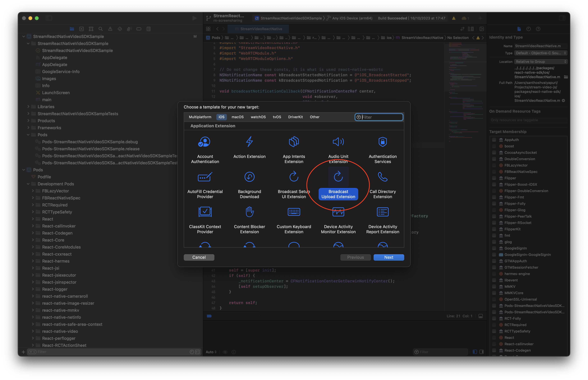
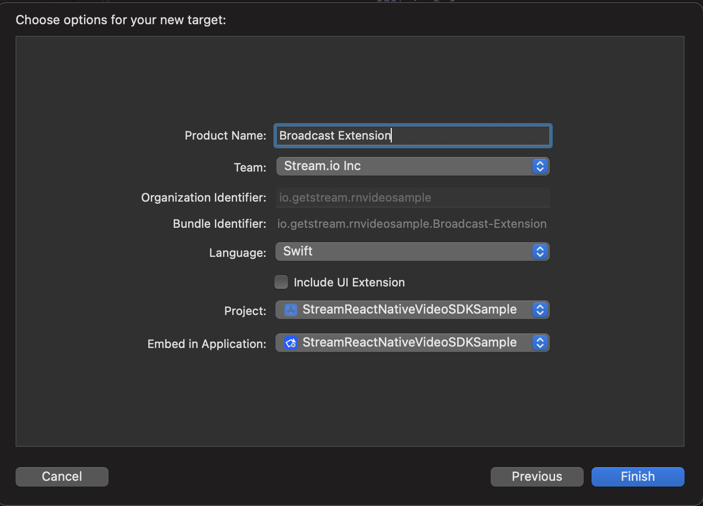
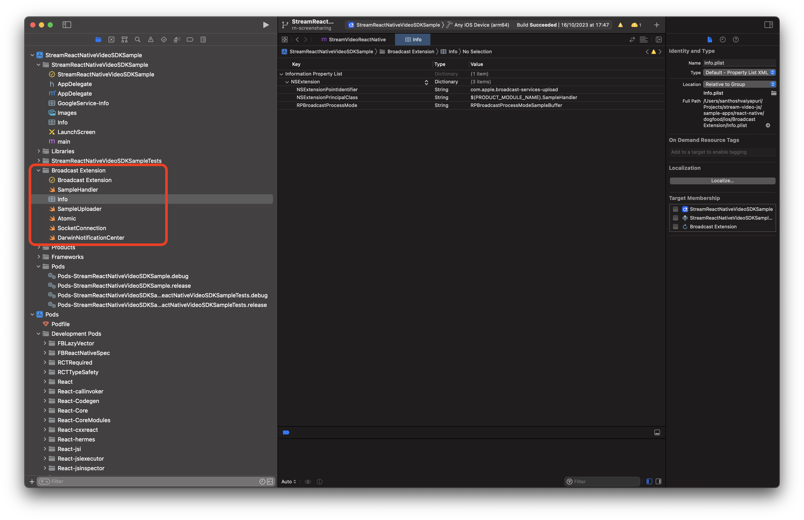
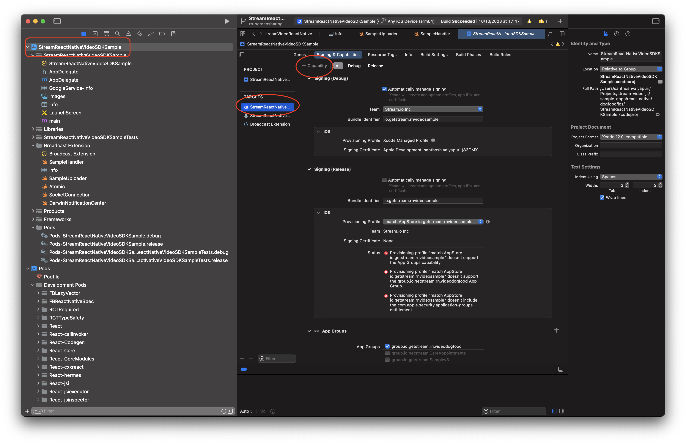
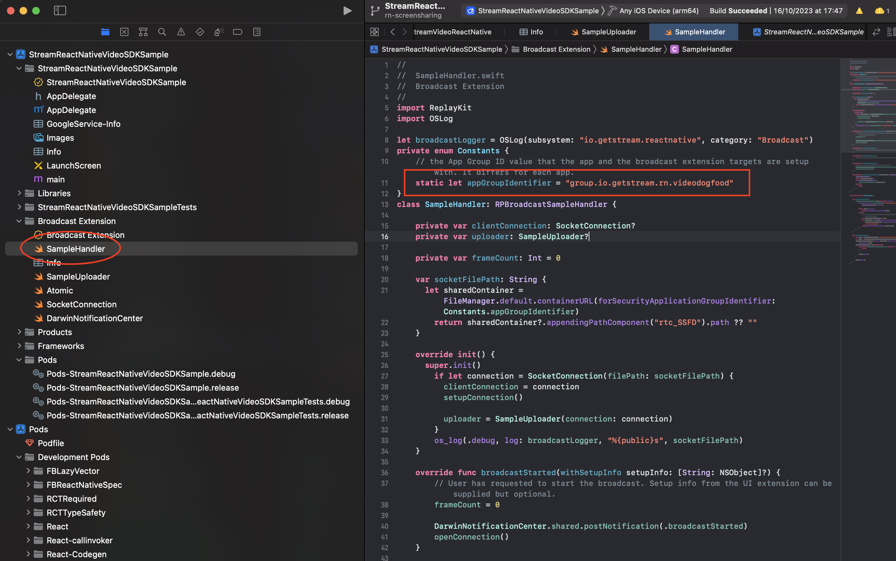
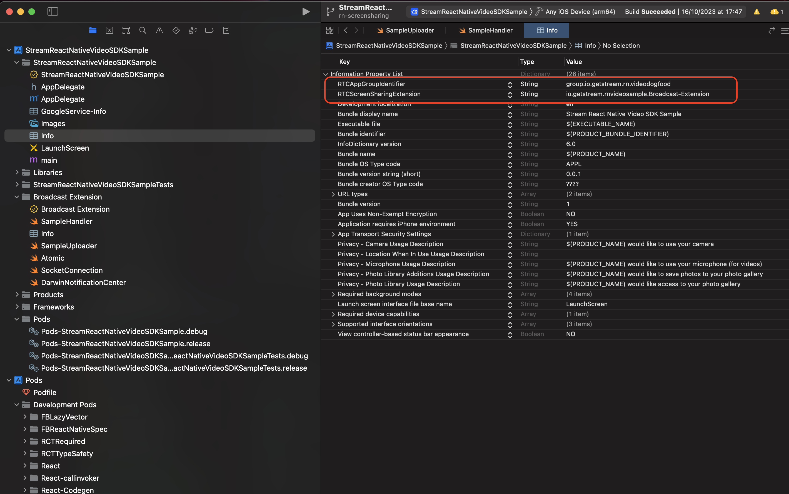
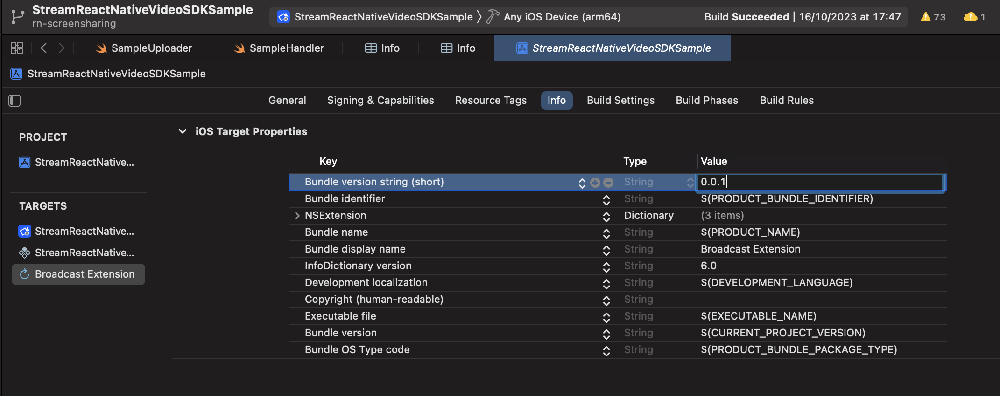
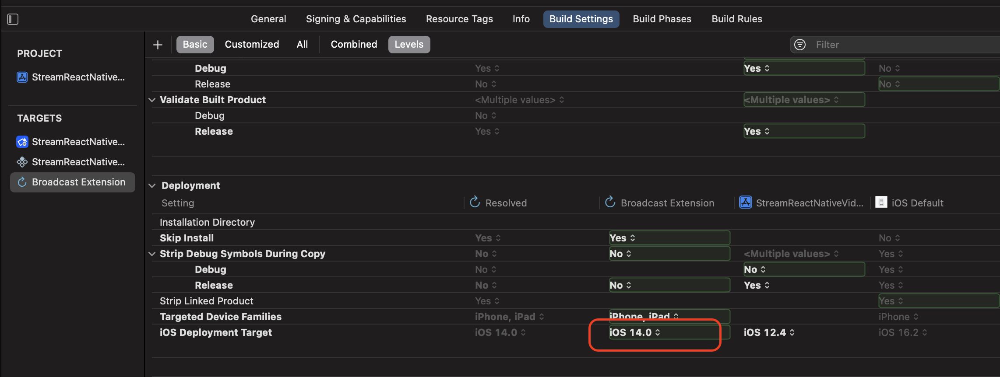

The Stream Video React Native SDK has support for displaying screen sharing tracks, as well as screen sharing from an iOS or Android device.

In order for a user to be able to share their screen, they must have the `screenshare` capability configured for the call they are in.

## Android Setup

In Android, we will use a foreground service to keep the call alive and also to do screen capturing . The SDK will manage the foreground service. But in order to be able to use the foreground service, some declarations need to be added in the `AndroidManifest.xml`:

```xml title="AndroidManifest.xml"
<uses-permission android:name="android.permission.POST_NOTIFICATIONS" />
<!-- We declare the permissions to for using foreground service -->
<uses-permission android:name="android.permission.FOREGROUND_SERVICE" />
<uses-permission android:name="android.permission.FOREGROUND_SERVICE_MICROPHONE" />
<uses-permission android:name="android.permission.FOREGROUND_SERVICE_MEDIA_PROJECTION" />

<!-- add the following inside the <application> section -->
<service
    android:name="app.notifee.core.ForegroundService"
    android:stopWithTask="true"
    android:foregroundServiceType="mediaProjection|microphone" />
```

Once the user wants to start screen sharing they will be prompted with asking the permission to screen share as below:


## iOS Setup

The screen sharing functionality is supported on iOS 14 or newer versions. To enable screen sharing, we need to create a `Broadcast Upload Extension` for capturing the contents of the user's screen.

Once the user wants to start screen sharing they will be prompted with asking the permission to screen share as below:


### Step 1: Create the Broadcast Upload Extension

Open your project with Xcode, select `File > New > Target` in menu bar. Select `Broadcast Upload Extension`, and click `Next`.



Enter a name in `Product Name` field, lets say "Broadcast Extension", choose the `Team` from dropdown, choose the `Language` to be `Swift` from dropdown, Uncheck `include UI extension` field and click `Finish`. You will then be prompted `Activate "Broadcast Extension" scheme?` pop-up, click `Activate`.



### Step 2: Copy over the files from Sample App

From [`@stream-io/video-react-native-dogfood` app](https://github.com/GetStream/stream-video-js/tree/main/sample-apps/react-native/dogfood/ios/Broadcast%20Extension/), copy the content of `SampleHandler.swift` file and paste it to the `SampleHandler.swift` file in your extension and also copy `Atomic.swift`, `SocketConnection.swift`, `SampleUploader.swift` and `DarwinNotificationCenter.swift` files to your extension's folder and ensure that they are added to the target.



### Step 3: Add App Group Id

Go to `App-Name > Signing & Capabilities` and add `App Groups` Capability. Also, go to `Broadcast Extension > Signing & Capabilities` and add `App Groups` Capability.



Then, select or add a new app-group-identifier to both the App and the Extension. **Ensure that the App Group for both the targets are the same**.


Then, head over to `SampleHandler.swift` file and paste the app-group-identifier in the `appGroupIdentifier` constant variable.



### Step 4: Update `Info`

Go to the `info.plist` of the App and add two new keys:

| Key                       |      Value                                      | 
|---------------------------|-------------------------------------------------|
| RTCScreenSharingExtension |  `The-bundle-identifier-of-broadcast-extension` | 
| RTCAppGroupIdentifier     |  `The-app-group-identifier`                     |



Head over to the `Info` of the broadcast extension target and ensure that the `Bundle version string (short)` is the same for both the App and the broadcast extension.



Finally, head over to the `Build Settings` of the broadcast extension target and ensure that the `iOS Deployment Target` is 14.0 or above. The deployment target is the minimum iOS version that the extension can run on. The minimum it can run on is 14.0. But if your app is set to a higher iOS deployment target then it is best to keep them both aligned.



## Use the ScreenShareButton component of the SDK

The SDK exports the component named `ScreenShareButton` to manage the start and stop of screen sharing. You can either use the button independently or add it to your own [custom call controls component](https://getstream.io/video/docs/reactnative/ui-cookbook/replacing-call-controls/). If you would like to build your own button component, you can look at the [source code](https://github.com/GetStream/stream-video-js/tree/main/packages/react-native-sdk/src/components/Call/CallControls/ScreenShareButton.tsx) of the `ScreenShareButton` button component and replicate that.