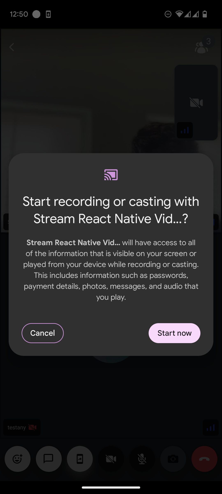
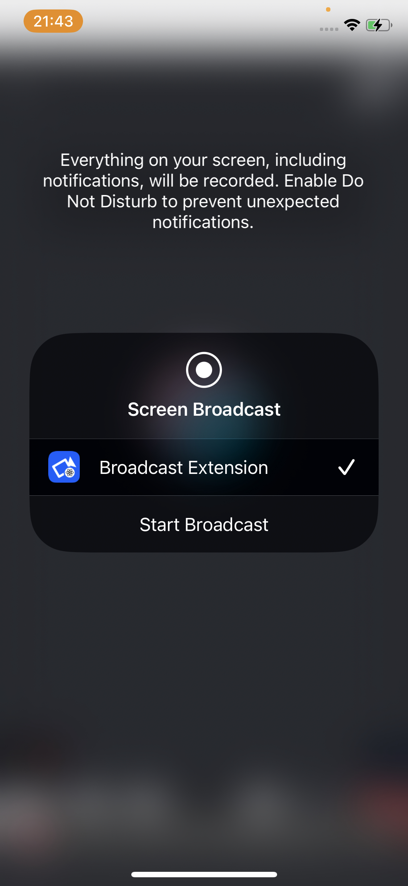

The Stream Video React Native SDK has support for displaying screen sharing tracks, as well as screen sharing from an iOS or Android device.

In order for a user to be able to share their screen, they must have the `screenshare` capability configured for the call they are in.

In this tutorial, we will explain how to start and stop screen share media tracks using a button exported from the SDK.

## Step 1 - Setup

Before we can access a screen sharing media track, we need to first do a bit of native setup. Please head over to the documentation of [React Native Screen Share Setup](../setup/react-native) or [Expo Screen Share Setup](../setup/expo) as per your use case and complete those steps.

## Step 2 - Use the screen sharing button component of the SDK

The SDK exports a component named `ScreenShareButton` to manage the start and stop of screen sharing. You can either use the button independently or add it to your own [custom call controls component](../../../ui-cookbook/replacing-call-controls/). If you would like to build your own button component, you can look at the [source code](https://github.com/GetStream/stream-video-js/tree/main/packages/react-native-sdk/src/components/Call/CallControls/ScreenShareButton.tsx) of the `ScreenShareButton` button component and replicate that.

Once the user wants to start screen sharing they will be prompted with asking the permission to screen share as below:

| Android preview | iOS preview |
|---|---|
|  | 