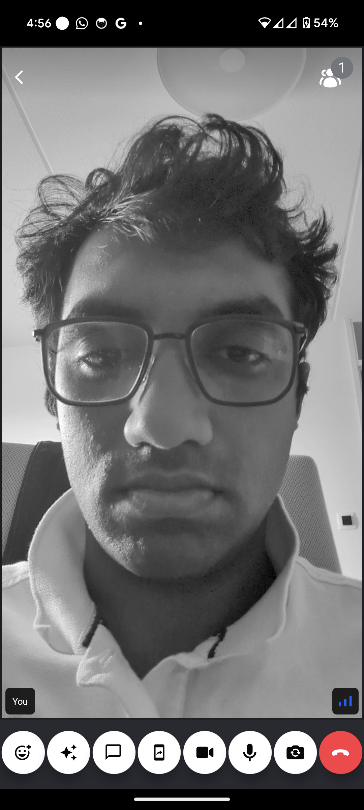

In this guide, we will show you how to apply video filters to a video stream. Our SDK offers background blurring and virtual backgrounds out of the box and also has support for injecting your custom filter into the calling experience.

:::note
Video filters are currently only supported in Android by the SDK.
:::

### Step 1 - Install the video filters library

To enable background filters in your app. You must first add the `@stream-io/video-filters-react-native` library.

```bash title=Terminal
yarn add @stream-io/video-filters-react-native
```

This library adds the required native module for processing the video stream and manipulating it with your desired video filter.

### Step 2 - Wrap under Provider component

Background filters are provided through the following APIs and components:

- `<BackgroundFiltersProvider />` - a React context provider that will allow you to use the filters API in your application. A 
- `useBackgroundFilters()` - a React hook that will allow you to access the filters API in your application

A basic integration looks like this:

```tsx
import {
  BackgroundFiltersProvider,
  Call,
  StreamCall,
  StreamVideo,
  StreamVideoClient,
} from '@stream-io/video-react-native-sdk';

export default function App() {
  let client: StreamVideoClient; /* = ... */
  let call: Call; /* = ... */
  return (
    <StreamVideo client={client}>
      <StreamCall call={call}>
        <BackgroundFiltersProvider>
          <MyCallContent />
          <MyBackgroundFilterUI /> {/* your UI to enable or disable filters, for example a modal dialog */}
        </BackgroundFiltersProvider>
      </StreamCall>
    </StreamVideo>
  );
}
```

The `BackgroundFiltersProvider` holds the state of the background filters in the app. It must be wrapped under the `StreamCall` component so that the media stream of the call can be accessed.

### Step 2 - Use the hook to control the filters

Once you have the `BackgroundFiltersProvider` rendered in your application,
you can use the `useBackgroundFilters()` hook to access the filters API and control the behavior of the filters.

```tsx
import { useBackgroundFilters } from '@stream-io/video-react-native-sdk';

export const MyBackgroundFilterUI = () => {
  const {
    isSupported, // checks if these filters can run on this device
    disableAllFilter // disables all the video filters
    applyBackgroundBlurFilter, // applies the blur filter
    applyBackgroundImageFilter, // applies the image filter
    currentBackgroundFilter, // the currently applied filter
  } = useBackgroundFilters();

  if (!isSupported) {
    return null;
  }

  return (
    <SafeAreaView>
      <Button onPress={disableBackgroundFilter} title="Disable"/>
      <Button onPress={() => applyBackgroundBlurFilter('heavy')} title="Blur Heavy"/>
      <Button onPress={() => applyBackgroundBlurFilter('medium')} title="Blur Medium">
      <Button onPress={() => applyBackgroundBlurFilter('light')} title="Blur Light"/>
      <Button onPress={() => applyBackgroundImageFilter(require('path/to/image/amsterdam.png'))} title="Image Background"/>
    </SafeAreaView>
  );
};
```

| Preview of background blur filter  | Preview of background image replacement filter  |
| ---------------------------------------------------------------------------------- | ----------------------------------------------------------------------------------------- |
|  |  |

## Advanced: Adding your own custom filters on Android

### Step 1 - Implement an Interface in Android to add your desired filter

To create a new video filter, you need to implement the `VideoFrameProcessorFactoryInterface` from `@stream-io/react-native-webrtc`. A simple example that applies rotation to the video filter would be like the following: 

```kt title="RotationFilterFactory.kt"
import com.oney.WebRTCModule.videoEffects.VideoFrameProcessor
import com.oney.WebRTCModule.videoEffects.VideoFrameProcessorFactoryInterface
import org.webrtc.VideoFrame

class RotationFilterFactory : VideoFrameProcessorFactoryInterface {
    override fun build(): VideoFrameProcessor {
        return VideoFrameProcessor { frame, textureHelper ->
            VideoFrame(
                frame.buffer.toI420(),
                180, // apply rotation to the video frame
                frame.timestampNs
            )
        }
    }
}
```

For the easiness of processing video frames in Bitmap. We export a `VideoFrameProcessorWithBitmapFilter` class from the `@stream-io/video-filters-react-native` library. The built-in background filters of the library have been implemented using this class. To implement a video filter with Bitmap, create a class by extending a filter that extends from `BitmapVideoFilter` abstract class. This `BitmapVideoFilter` abstract class gives you a bitmap for each video frame, which you can manipulate directly. By returning a new `VideoFrameProcessorWithBitmapFilter` instance with that filter we can implement a bitmap processing filter.

:::note
`BitmapVideoFilter` is less performant than a normal video filter that does not use bitmaps. It is due to the overhead of certain operations, like *YUV <-> ARGB* conversions.
:::

#### Example: Grayscale video filter
​
We can create and set a simple video filter that turns the video frame to grayscale by extending a filter that extends from `BitmapVideoFilter` abstract class like this:

```kt title="GrayScaleVideoFilterFactory.kt"
import android.graphics.Bitmap
import android.graphics.Canvas
import android.graphics.ColorMatrix
import android.graphics.ColorMatrixColorFilter
import android.graphics.Paint
import com.oney.WebRTCModule.videoEffects.VideoFrameProcessor
import com.oney.WebRTCModule.videoEffects.VideoFrameProcessorFactoryInterface
import com.streamio.videofiltersreactnative.common.BitmapVideoFilter
import com.streamio.videofiltersreactnative.common.VideoFrameProcessorWithBitmapFilter

class GrayScaleVideoFilterFactory : VideoFrameProcessorFactoryInterface {
  override fun build(): VideoFrameProcessor {
    return VideoFrameProcessorWithBitmapFilter {
      GrayScaleFilter()
    }
  }
}
private class GrayScaleFilter : BitmapVideoFilter() {
    override fun applyFilter(videoFrameBitmap: Bitmap) {
        val canvas = Canvas(videoFrameBitmap)
        val paint = Paint().apply {
            val colorMatrix = ColorMatrix().apply {
                // map the saturation of the color to grayscale
                setSaturation(0f)
            }
            colorFilter = ColorMatrixColorFilter(colorMatrix)
        }
        canvas.drawBitmap(videoFrameBitmap, 0f, 0f, paint)
    }
}
```

### Step 2 - Create a new Android native module

Now you have to add a method in your app to register this video filter to the `@stream-io/video-filters-react-native` library. For this, follow the official React Native documentation to create a new [Android native module](https://reactnative.dev/docs/native-modules-android). In that native module, add a new method to add the filter to the `ProcessorProvider`. For example:

```kt title="VideoEffectsModule.kt"
import com.facebook.react.bridge.ReactApplicationContext
import com.facebook.react.bridge.ReactContextBaseJavaModule
import com.facebook.react.bridge.ReactMethod
import com.oney.WebRTCModule.videoEffects.ProcessorProvider
import io.getstream.rnvideosample.videofilters.GrayScaleVideoFilterFactory

class VideoEffectsModule (reactContext: ReactApplicationContext) : ReactContextBaseJavaModule(reactContext) {
    override fun getName(): String {
        return NAME;
    }

    @ReactMethod
    fun registerVideoFilters() {
        ProcessorProvider.addProcessor("grayscale", GrayScaleVideoFilterFactory())
    }

    companion object {
        private const val NAME = "VideoEffectsModule"
    }
}
```

:::note
While calling the `addProcessor` method. We need to provide a name to the filter that we are registering. In the above example, it is `grayscale`. This name is to be later called in JavaScript.
:::

### Step 3 - Apply the video filter in JavaScript

To apply this video filter. You have to call the method `mediaStreamTrack._setVideoEffect(name)`. To disable the filters you have to call the method `mediaStreamTrack._setVideoEffect(null)` or you can call the `disableAllFilter` method from the `useBackgroundFilters()` hook. Below is a small example of a hook that can be used to apply the grayscale video filter that we created. Note that the media stream is present inside the `Call` instance returned from the `useCall` hook.

```ts
import {
  useBackgroundFilters,
  useCall,
} from '@stream-io/video-react-native-sdk';
import { useRef, useCallback, useState } from 'react';

import { MediaStream } from '@stream-io/react-native-webrtc';

import { NativeModules, Platform } from 'react-native';

const VideoEffectsModule = NativeModules.VideoEffectsModule;

const isSupported = Platform.OS === 'android';

type CustomFilters = 'GrayScale' | 'MyOtherCustomFilter';

export const useCustomVideoFilters = () => {
  const call = useCall();
  const isFiltersRegisteredRef = useRef(false);
  const { disableAllFilters } = useBackgroundFilters();
  const [currentCustomFilter, setCustomFilter] = useState<CustomFilters>();

  const applyGrayScaleFilter = useCallback(() => {
    if (!isSupported) {
      return;
    }
    if (!isFiltersRegisteredRef.current) {
      // registering is needed only once
      VideoEffectsModutle?.registerVideoFilters();
      isFiltersRegisteredRef.current = true;
    }
    disableAllFilters(); // disable any other filter
    (call?.camera.state.mediaStream as MediaStream | undefined)
      ?.getVideoTracks()
      .forEach((track) => {
        track._setVideoEffect('grayscale'); // set the grayscale filter
      });
    setCustomFilter('GrayScale');
  }, [call, disableAllFilters]);

  const disableCustomFilter = useCallback(() => {
    disableAllFilters();
    setCustomFilter(undefined);
  }, [disableAllFilters]);

  return {
    currentCustomFilter,
    applyGrayScaleFilter,
    disableCustomFilter,
  };
};
```

Below is a preview of the above grayscale video filter:


:::note
When using a custom filter along with the built-in filters, always call the `disableAllFilter` method from the `useBackgroundFilters()` hook so that the state inside the hook is informed if the built-in filters have been disabled.
:::